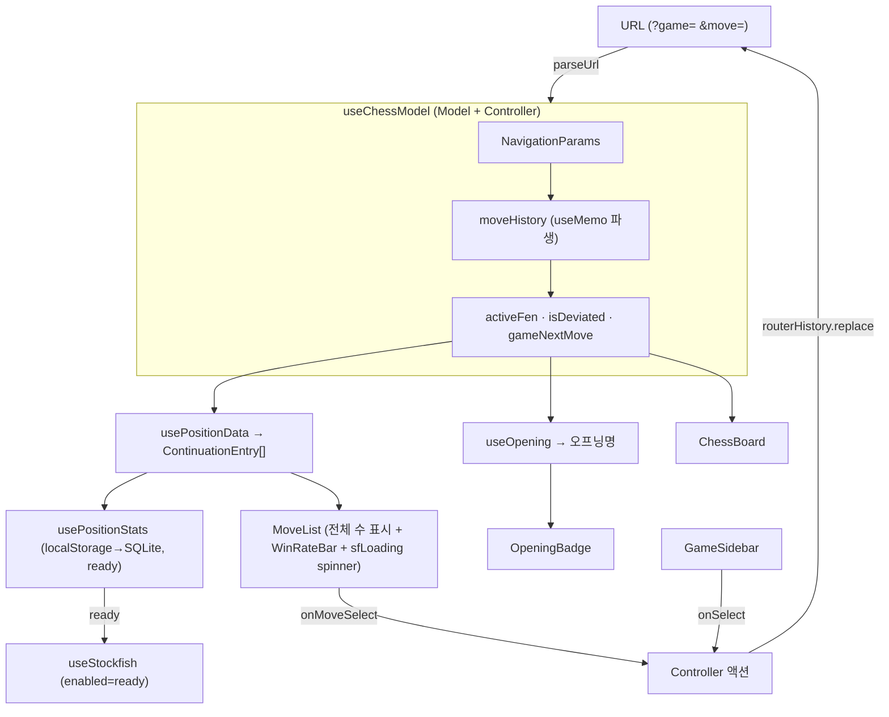

# Chess Explorer (`/art/chess`)

체스 기보·오프닝 탐색기. 현재 구현 상태와 설계 원칙을 기술한다 (과거 작업
이력이 아닌 **현재 아키텍처 + 앞으로의 방향**만 다룬다).

> 빌드: `npm run build` · 개발 서버: `npm run start` (포트 3000)

---

## 1. 아키텍처 — 단방향 데이터 흐름

**URL이 유일한 source of truth.** React state로 내비게이션을 소유하지 않는다.
URL이 바뀌면 `useMemo`로 상태를 재파생하므로, state와 URL이 동시에 진실을
주장하며 경쟁하던 race condition이 구조적으로 제거된다.

```
URL  ──parseUrl()──▶  NavigationParams
                          │  buildHistory() + PGN
                          ▼
                      MoveHistoryEntry[]
                          │  + DB / Stockfish
                          ▼
                      ContinuationEntry[] · PositionSnapshot
                          │
                          ▼
                      View (렌더링만, 상태 소유 없음)
                          │  user action
                          ▼
                      Controller (URL만 갱신) ──replace()──▶ URL (재시작)
```

**계약:**
- `moveHistory`는 `useState`가 아니다 — `useMemo` 파생값이다.
- Controller는 URL만 바꾼다. View는 URL을 직접 읽지 않는다.
- PGN 로딩 중에는 `moveHistory = []` → 잘못된 상태 flash 없음.

---

## 2. 파일 구조

```
src/
  types/chess.ts             ← 모든 타입 정의
  hooks/
    useChessModel.ts         ← Model + Controller (URL ↔ 상태 단일 진실점)
    usePositionData.ts       ← 포지션 수 목록 (DB + Stockfish 병합)
    usePgn.ts                ← PGN fetch + chess.js 파싱 → ParsedMove[]
    useOpening.ts            ← FEN → ECO 오프닝 매칭
    usePositionStats.ts      ← localStorage → SQLite 승률 조회 + ready 플래그
    useStockfish.ts          ← Stockfish 18 lite WASM, multipv 분석
  pages/art/chess/
    index.tsx                ← View 연결 허브 (useChessModel 사용)
    chess.module.scss        ← 3-column grid 레이아웃
  components/Chess/
    ChessBoard.tsx           ← skin prop 래퍼
    BoardSkin.ts / ClassicSkin.tsx (+.module.scss)  ← SVG 기물 + transition
    MoveList.tsx             ← 수 목록 + WinRateBar; 전체 수를 스크롤 없이 표시;
                                pending 수 섹션 중앙에 spinner 오버레이 (sfLoading 기반)
    GameSidebar.tsx          ← 기보 목록 사이드바
    OpeningBadge.tsx         ← 오프닝/게임 이름 뱃지
    WinRateBar.tsx           ← 승률 바 (loading → null 반환 / aiEstimate → primary border / DB 모드)
    IrisIcon.tsx (+.module.scss)  ← 붓꽃 6-petal SVG 로딩 아이콘 (보존, 현재 미사용)

static/chess/
  games/                     ← PGN 파일
  engine/                    ← stockfish-18-lite-single.{js,wasm}
  pieces/                    ← cburnett SVG {w,b}{K,Q,R,B,N,P}.svg
  positions.db               ← SQLite (sql.js-httpvfs, ~3.45MB)
  openings.json / eco_all.tsv
static/wasm/                 ← sqlite.worker.js, sql-wasm.wasm
scripts/
  build-position-stats.js    ← PGN → positions.db
  prefetch-lichess-stats.js  ← Lichess masters API 수집
  generate-eco-data.js       ← ECO TSV → JSON
```

---

## 3. URL 명세 (불변 계약)

| 상태 | URL |
|---|---|
| 자유 탐색 (초기) | `/art/chess` |
| 자유 탐색 중 | `/art/chess?game=free&move=e4+e5+Nf3` |
| 게임 선택 (시작) | `/art/chess?game=byrne-fischer-1956` |
| 게임 진행 | `/art/chess?game=byrne-fischer-1956&move=1.Nf3+1...Nf6+2.c4` |
| 게임 이탈 후 | `/art/chess?game=…&move=1.Nf3+1...Nf6+2.c4+2...e5` |

- `?game=free` 또는 `?game=<id>`. param 없음 = 자유 탐색.
- `?move=` 내 수: 주석(`+` 체크, `#` 메이트) 제거 후 인코딩.
  - 게임 모드: 이동번호 포함 (`1.e4+1...e5+2.Nf3`), 이탈 수도 포함.
  - 자유 모드: 이동번호 없음 (`e4+e5+Nf3`).
- `URLSearchParams.toString()`이 공백을 `+`로 인코딩.
- 구버전 `?moves=`는 `parseUrl`에서 하위 호환 인식.

---

## 4. 타입 시스템 (`src/types/chess.ts`)

```ts
// URL에서 파싱된 내비게이션 파라미터 (직렬화 가능)
interface NavigationParams {
  gameId: string | null;   // null = 자유 탐색
  moveSans: string[];      // 주석 제거된 SAN 배열, 이동번호 없음
}

// PGN + moveSans로 파생된 이동 이력 항목
interface MoveHistoryEntry {
  san: string;             // 표시용 SAN (체크/메이트 포함 가능)
  fenAfter: string;        // 이 수를 둔 후의 FEN
  move: Move;              // chess.js Move (보드 lastMove 하이라이트)
  fromGame: boolean;       // true = PGN 수열과 일치
}

// 현재 포지션에서 둘 수 있는 수 (DB + Stockfish 병합)
interface ContinuationEntry {
  san: string;
  source: 'db' | 'stockfish' | 'pending';
  // db=DB 수(totalGames순) · stockfish=SF 완료(winrate순) · pending=SF 계산중(spinner 오버레이)
  winrate: number | null;  // 0–1, 현재 플레이어 기준. pending이면 null.
  stats: MoveStats | null; // WinRateBar 렌더링용
}

// WinRateBar.tsx에 정의되는 공유 타입
interface MoveStats { white: number; draws: number; black: number; }
// DB: 실제 게임 수 / Stockfish: 1000 기준 확률값
```

`PositionSnapshot`(activeFen, deviationIndex, gameNextMove, turnPrefix,
checkmate 등)과 `CheckmateState`(isCheckmate, kingSquare, attackerSquares)도
같은 파일에 정의된다.

---

## 5. Hook 아키텍처

### `useChessModel` — Model + Controller

URL ↔ 상태 동기화의 단일 진실점. `useState` 없음.

```ts
const navParams = useMemo(() => parseUrl(location.search), [location.search]);
const game = CHESS_GAMES.find(g => g.id === navParams.gameId) ?? null;
const pgn = usePgn(game?.pgnPath);

// PGN 로딩 중에는 빈 배열 → 잘못된 상태 flash 없음
const moveHistory = useMemo(() =>
  (navParams.gameId && pgn.loading) ? [] : buildHistory(navParams.moveSans, pgn.moves),
  [navParams.moveSans, navParams.gameId, pgn.moves, pgn.loading]);

const activeFen = moveHistory.at(-1)?.fenAfter ?? START_FEN;
const deviationIndex = moveHistory.findIndex(h => !h.fromGame); // -1 = 이탈 없음
```

**Controller 액션은 URL만 바꾼다:**
- `selectGame(id)` → `replace(id, [])`
- `selectMove(san)` → `replace(gameId, [...moveSans, stripAnnotations(san)])`
- `back()` → `replace(gameId, moveSans.slice(0, -1))`
- `reset()` → 이탈 시 `slice(0, deviationIndex)`, 아니면 `[]`

**`buildHistory`(순수 함수):** `moveSans`를 PGN 수열과 비교해
`MoveHistoryEntry[]` 파생. 일치하면 `fromGame=true`, 불일치(이탈)부터는
`new Chess(fen).move(san)`으로 계산해 `fromGame=false`. 유효하지 않은 수를
만나면 이후를 버린다.

### `usePositionData` — 포지션 수 목록

현재 FEN에서 둘 수 있는 수를 DB + Stockfish로 병합해 `ContinuationEntry[]`
반환.

```ts
const posStats = usePositionStats(fen);              // localStorage → SQLite
const sfResult = useStockfish(fen, enabled && posStats.ready);
// posStats.ready = DB 쿼리 완료 신호. Stockfish의 false→true→false 재시작 방지.
```

반환: `{ entries, loading: posStats.loading, sfLoading: sfResult.loading }`.
`sfLoading`은 chess page → MoveList로 전달되어 pending 섹션 spinner 표시 조건으로 사용.

- **DB 항목**: 선택 빈도(totalGames) 내림차순.
- **SF 항목**: DB에 없는 legal move를 승률 내림차순으로 채움. 계산 전이면
  `source='pending'`.
- 반환 순서: DB 먼저, SF 뒤. MoveList는 전체를 스크롤 없이 표시(자연 높이).
  pending 수들은 별도 섹션으로 묶이고, `sfLoading` 중일 때 섹션 중앙에 spinner 오버레이.

### 기존 훅 (안정, 변경 드묾)

| 훅 | 역할 |
|---|---|
| `usePgn` | PGN fetch + 파싱 → `ParsedMove[]` (내비게이션 상태 없음) |
| `useOpening` | FEN → ECO 오프닝명 |
| `usePositionStats` | 캐시 계층(localStorage → SQLite) + `ready` 플래그 |
| `useStockfish` | UCI 분석, generation counter로 stale 응답 차단 |

---

## 6. 데이터 소스

### SQLite (`positions.db`)

```sql
CREATE TABLE position_moves (
  epd   TEXT,     -- FEN 앞 4부분 (board + turn + castling + en-passant)
  san   TEXT,     -- 수 표기 ("Nf3", "O-O", "dxe4")
  white INTEGER,  -- 백 승 게임 수
  draws INTEGER,
  black INTEGER,  -- 흑 승 게임 수
  PRIMARY KEY (epd, san)
);
-- EPD 키 = fen.split(' ').slice(0,4).join(' ')  (halfmove/fullmove 제거)
```

- 출처: Lichess masters API. **토큰(`LICHESS_TOKEN`)은 절대 파일에 기록 금지 —
  env var로만 사용.**
- 캐시 계층: localStorage(즉시) → SQLite(HTTP Range Request) → Stockfish(fallback).

### Stockfish (`useStockfish.ts`)

싱글톤 Worker. 상태 `'idle' | 'loading' | 'ready' | 'failed'`.

```
초기화: postMessage('uci') → 'uciok' → 'isready' → 'readyok'
분석:   position fen <fen>  →  go depth 14 multipv min(legalMoves, 30)
        info 파싱: /score cp|mate (-?\d+)/, /pv <uci>/  → bestmove 시 UCI→SAN
centipawn → 승률: winP = 1 / (1 + exp(-0.00368208 · clamp(cp, ±1000)))
        cp는 white-perspective (흑 차례 시 부호 반전 후 입력), mate N → cp = ±9999
```

**Race condition 방지:** module-level `analysisGeneration` 카운터로 stale
`bestmove` 필터링 + `stop` 후 날아오는 응답을 `goCommandSent` 플래그로 차단.
cleanup 시 `postMessage('stop')` + `removeEventListener`.

---

## 7. 게임 목록 (현재 11개)

| ID | 게임 | 연도 |
|---|---|---|
| `byrne-fischer-1956` | Game of the Century | 1956 |
| `kasparov-topalov-1999` | Kasparov's Immortal | 1999 |
| `kasparov-deep-blue-g6-1997` | Deep Blue vs Kasparov 1997 G6 | 1997 |
| `morphy-opera-1858` | The Opera Game | 1858 |
| `anderssen-kieseritzky-1851` | The Immortal Game | 1851 |
| `anderssen-dufresne-1852` | The Evergreen Game | 1852 |
| `steinitz-bardeleben-1895` | Steinitz vs Von Bardeleben | 1895 |
| `fischer-spassky-1972-g6` | Fischer vs Spassky 1972 G6 | 1972 |
| `rotlewi-rubinstein-1907` | Rubinstein's Immortal | 1907 |
| `deep-blue-kasparov-1996-g1` | Deep Blue vs Kasparov 1996 G1 | 1996 |
| `samisch-nimzowitsch-1923` | The Immortal Zugzwang Game | 1923 |

게임 추가: `src/data/chess-games.ts`에 메타데이터 + `static/chess/games/`에 PGN.

---

## 8. 데이터 흐름도



---

## 9. 알려진 이슈 / 남은 작업

**이슈:**
- Stockfish가 미들게임 이후 가끔 오류 (재현 방법 미확정). 현재는 generation
  counter + `goCommandSent`로 방어. 의심 원인: `stop` 후 stale `bestmove`
  타이밍 / legal move 과다(오프닝 전 최대 218개)로 multipv 파싱 과부하 /
  Worker crash 후 `sfState`가 'ready'에 stuck.

**남은 작업 (방향):**
| 기능 | 비고 |
|---|---|
| 체크메이트 시각 표시 | ClassicSkin.tsx — 공격 말·왕 하이라이트 + 경로 화살표 |
| positions.db 재빌드 | `LICHESS_TOKEN=<token> node scripts/prefetch-lichess-stats.js` |
| PGN 게임 추가 | Fischer-Karpov, Morphy 등 |
| `index.tsx` 잔여 정리 | URL sync 외 이벤트 핸들러 혼재 — 필요 시 훅으로 추출 |
| IrisIcon 재활용 | 현재 체스 페이지에서는 미사용; 다른 로딩 UI에 붙일 수 있음 |

**완료된 항목:**
- OG 썸네일: `static/img/art/chess-og.webp` (1200×630, CC BY-SA 4.0 Aatu Dorochenko via Wikimedia)
- Flip board 버튼: `↻` → `⇅`
- AI 예측 border: rainbow → `var(--ifm-color-primary)` 단색
- `--iris-fall: #632e85`, `--iris-std: #bf95da` 전역 CSS 변수 추가 (`_variables.scss`)

---

## 10. 빌드 & IDE 주의

```bash
npm run build           # 프로덕션 빌드 (성공 여부 확인)
npm run start           # 개발 서버 (포트 3000)
# DB 재빌드
LICHESS_TOKEN=<token> node scripts/prefetch-lichess-stats.js
node scripts/build-position-stats.js
```

**IDE false positive (무시 — 빌드는 정상):** `Cannot find module '@site/src/...'`,
`--jsx flag not provided`, `esModuleInterop` — 모두 Docusaurus tsconfig를
IDE가 인식하지 못해 생기는 경고.
