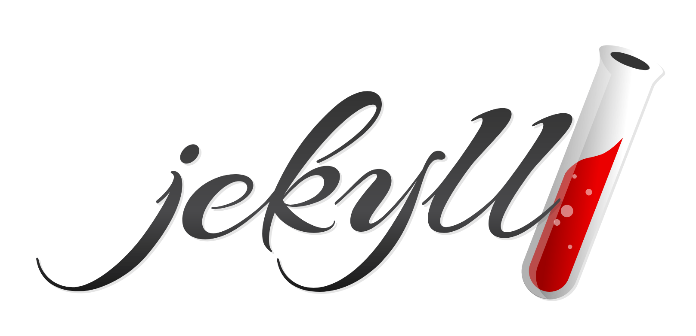

---
authors:
  - jwher
description: Jekyll로 시작하는 기술 블로그
slug: first-post
tags:
  - blog
  - jekyll
title: Jekyll로 시작하는 첫 포스트
image: jekyll.png
---

[](/blog/first-post)
*Jekyll로 시작하는 기술 블로그*

<!--truncate-->

## 블로그 시작

2021년 4월, GitHub Pages와 Jekyll로 기술 블로그를 시작했습니다!

처음엔 GitHub Pages가 제공하는 정적 사이트 호스팅이 좋아 보였습니다. 무료이면서도 커스터마이징이 가능하고, Git으로 버전 관리까지 할 수 있다는 점이 매력적이었습니다.

## 블로그 변천사

### 2021.04.11 - 첫 시작
- Jekyll 기본 테마로 시작
- Markdown으로 글 작성 테스트
- GitHub Actions로 자동 배포 설정

### 2021.05.22 - 첫 리뉴얼
- Beautiful Jekyll 테마로 변경
- 디자인 개선 및 네비게이션 추가
- Disqus 댓글 기능 통합

### 2021.07.15 - 두 번째 리뉴얼
- 카테고리 체계 정립
- 코드 하이라이팅 개선
- 반응형 디자인 최적화

## Jekyll 기본 사용법

### 포스트 작성

Jekyll 포스트는 `_posts` 디렉토리에 작성합니다:

```bash
# 파일명 규칙: YYYY-MM-DD-title.md
_posts/2021-04-11-first-post.md
```

### 코드 블록

Jekyll은 Syntax Highlighting을 지원합니다:

```python
def print_hi(name):
    print(f"Hello, {name}!")

print_hi('World')
```

### 로컬 테스트

```bash
# Jekyll 서버 실행
jekyll serve

# http://localhost:4000 에서 확인
```

서버를 실행하면 파일 변경 시 자동으로 사이트가 재생성됩니다.

## 앞으로의 계획

- [ ] 쿠버네티스 시리즈 작성
- [ ] 머신러닝 개념 정리
- [ ] 개발 도구 사용법 공유
- [ ] 프로젝트 경험 기록

## 참고 자료

- [Jekyll 공식 문서](https://jekyllrb.com/docs/home)
- [Jekyll GitHub 저장소](https://github.com/jekyll/jekyll)
- [Jekyll Talk 커뮤니티](https://talk.jekyllrb.com/)

---

*2022년 5월, 이 블로그는 [Docusaurus로 전환](/blog/first-post-with-docusaurus)했습니다.*
