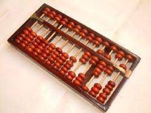

---

---

  
*다시보는 컴퓨터구조*

<!--truncate-->

## 명령어 셋 구조
*Instruction Set Architecture*

ISA란 무엇일까요? 어떤 인터페이스로 보아야 할까요, 아님 구현으로 보아야 할까요?

코드에서 구현과 인터페이스의 분리를 하여 이점을 얻는 것처럼,
CPU에도 동일하게 적용하면 어떨까요? 인터페이스는 사용자를 위해, 구현은 디자이너에게 맞기는 겁니다.

이런 방법으로 같은 아키텍처를 다양한 벤더가 구현할 수 있습니다.
예를 들어 볼까요? ARMv8-A 아키텍처로 ARM Cortex-A 시리즈, Qualcomm Snapdragon 800 시리즈, Apple A15 Bionic 시리즈, Samsung Exynos M 시리즈를 구현했습니다.

메모리 밴드윗 ~

그렇다면 진짜 ISA란 무엇일까요?

프로그래머와 하드웨어의 계약(contract)입니다
프로그래머에게 ISA란 프로그램이 어떻게 실행될 지에 대한 모델, 하드웨어 디자이너에게 ISA란 프로그램을 맞게 실행시키기 위한 정형적인 정의입니다.

현대의 ISA는 저장된 프로그램(stored program) 컴퓨터 모델을 따릅니다.
폰 노이만의 메모: 전자 컴퓨팅 기기의 논리적 디자인에 대한 첫 논의
프로그램: 명령어의 순열
하나의 스토리지가 같은 프로그램과 데이터를 보관하는데 사용됩니다.

- 스토리지
- 프로그램 카운터
- ALU

### Instruction Types

ALU Opertions
 - arithmetic (add, sub, mult, div)
 - logical (and, or, xor, srl, sra)
 - data type conversions (cvtf2d, cvtf2i)

Data Movement
 - memeory reference (lb, lw, sb, sw)
 - register to register (movi2fp, movf)

Control
 - test/compare (slt, seq)
 - branches and jumps (beq, bne, j, jr)
 - support for procedure call (jal, jalr)
 - operating system entry (trap)

### Components of Instructions
- Operations
- Number of operands
- Operand specifiers
- Instruction encodings
- Instruction classes

## ISA Basics: Register Organization

### The Index Register

????

### General Registers
*GPR*  
Merge accumulators(data) and index(address).

### Stack Machines

Register state in PC and SP

### Memory Organization
Little Endian(Intel)  
Big Endian(MIPS)  

### Data types

32-bit floating point
8-bit exp, 23-bit mantissa

## ISA Principles

### Role of the Optimizaing Compiler

### Instruction set Deisign
KISS *Keep it simple, stupid*

Frequency: make common case fast

Orthogonality(modularity): Simple rules, few exceptions

Generality:

Locality and concurrency

*KISS and FOG*
