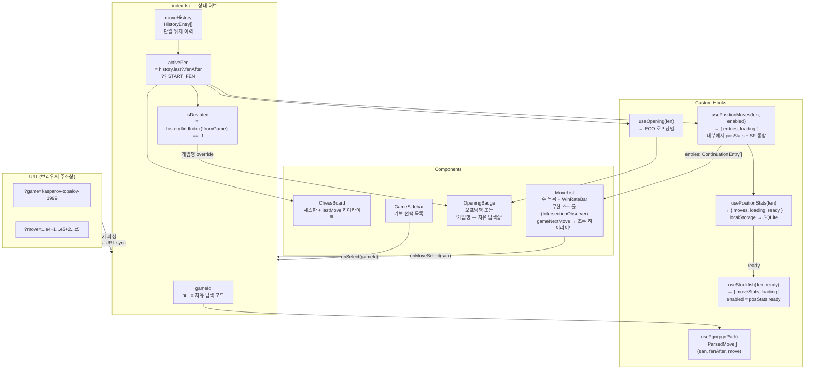
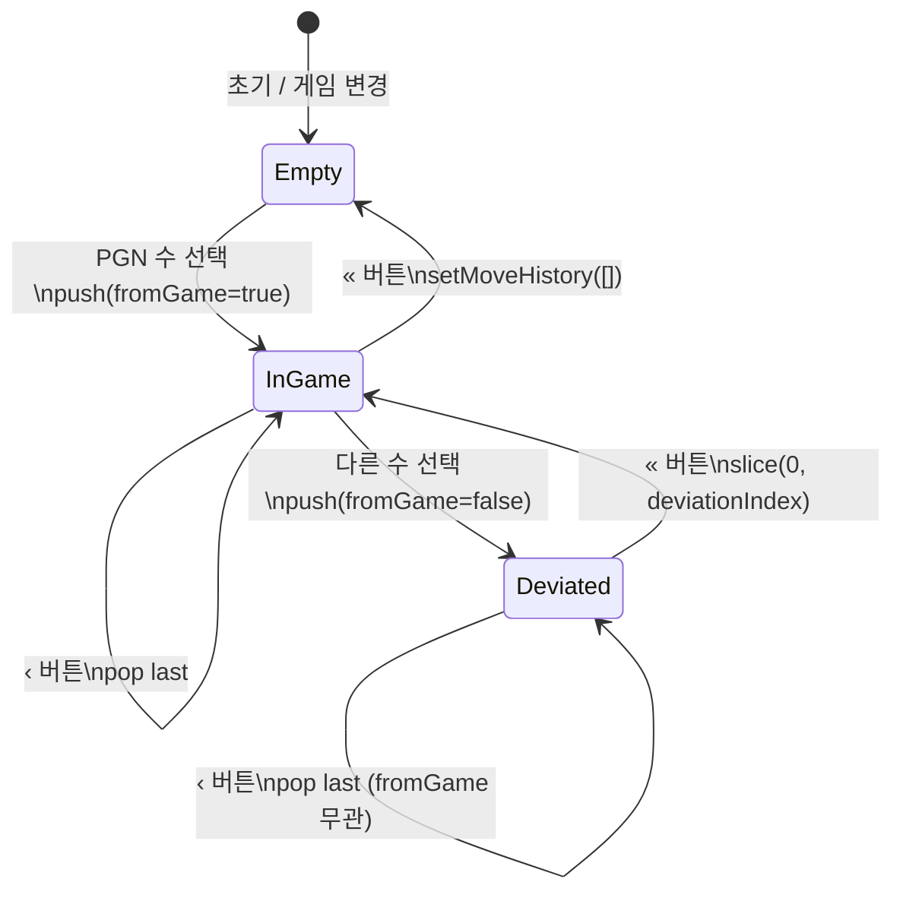
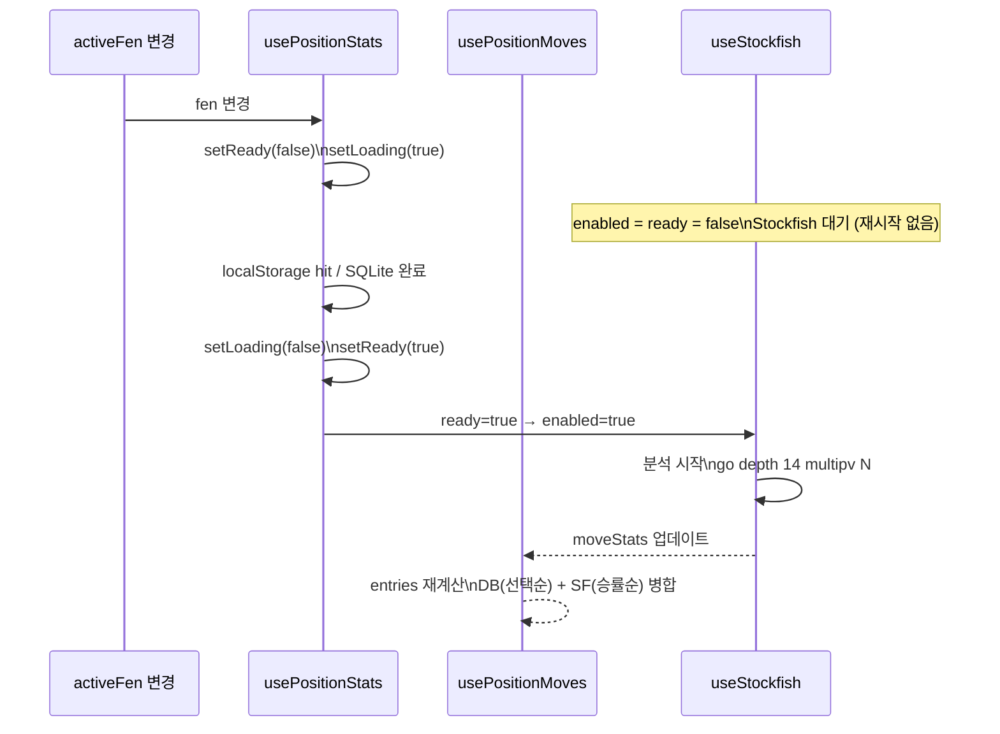
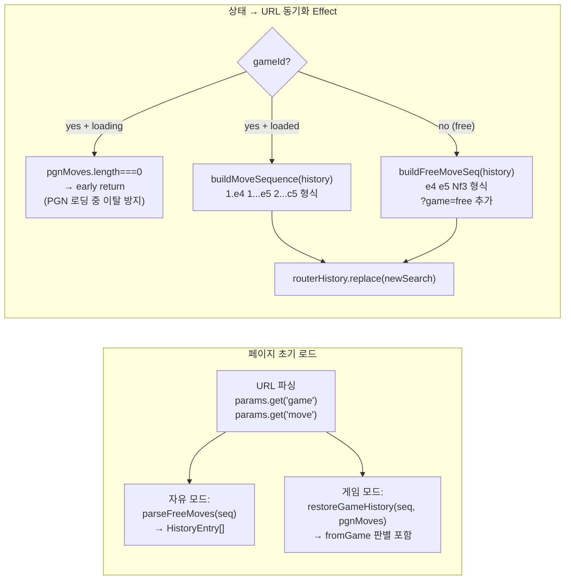

# Chess Explorer — 작업 맥락 문서

> `/art/chess` 페이지 체스 기보·오프닝 탐색기. 멀티 에이전트 작업 시 이 문서를 먼저 읽을 것.
>
> 브랜치: `docusaurus` | 빌드: `npm run build` | 개발 서버: `npm run start` (포트 3000)

---

## 1. 프로젝트 구조

```
/src
  /pages/art/chess/
    index.tsx              ← 메인 페이지, 위치 이력 + URL 동기화 허브
    chess.module.scss      ← 3-column grid 레이아웃

  /components/Chess/
    ChessBoard.tsx         ← skin prop 래퍼
    BoardSkin.ts           ← BoardSkin 인터페이스
    ClassicSkin.tsx        ← SVG 기물 + CSS transition
    ClassicSkin.module.scss
    MoveList.tsx           ← 수 목록 + WinRateBar + 무한 스크롤
    MoveList.module.scss
    GameSidebar.tsx        ← 기보 목록 사이드바
    GameSidebar.module.scss
    OpeningBadge.tsx       ← 오프닝/게임 이름 뱃지 (Navbar 아래)
    OpeningBadge.module.scss
    WinRateBar.tsx         ← 승률 바 (shimmer/aiEstimate/DB 모드)
    WinRateBar.module.scss

  /hooks/
    usePgn.ts              ← PGN fetch + chess.js 파싱 → ParsedMove[] 반환 (내비게이션 상태 없음)
    useOpening.ts          ← FEN → ECO 오프닝 매칭
    usePositionStats.ts    ← localStorage → SQLite(sql.js-httpvfs) 승률 조회 + ready 플래그
    useStockfish.ts        ← Stockfish 18 lite WASM UCI, multipv 분석
    usePositionMoves.ts    ← DB + Stockfish 통합 훅 → ContinuationEntry[] 반환

  /data/
    chess-games.ts         ← ChessGame[] 메타데이터 (현재 11개)
    chess-openings.ts      ← ECO 오프닝 데이터 (lichess TSV 변환)

/static/chess/
  games/                   ← PGN 파일 11개
  engine/
    stockfish-18-lite-single.js
    stockfish-18-lite-single.wasm
  pieces/                  ← cburnett SVG {w,b}{K,Q,R,B,N,P}.svg
  positions.db             ← sql.js-httpvfs SQLite (3.45MB, 3080 포지션)
  openings.json            ← 오프닝 JSON
  eco_all.tsv              ← 원본 ECO TSV

/static/wasm/
  sqlite.worker.js
  sql-wasm.wasm

/scripts/
  build-position-stats.js  ← PGN → positions.db 빌드 스크립트
  prefetch-lichess-stats.js← Lichess masters API 수집 스크립트
  generate-eco-data.js     ← ECO TSV → JSON 변환
```

---

## 2. 현재 게임 목록 (11개)

| ID | 게임 | 연도 |
|---|---|---|
| `byrne-fischer-1956` | Game of the Century | 1956 |
| `kasparov-topalov-1999` | Kasparov's Immortal | 1999 |
| `kasparov-deep-blue-g6-1997` | Deep Blue vs Kasparov 1997 G6 | 1997 |
| `morphy-opera-1858` | The Opera Game | 1858 |
| `anderssen-kieseritzky-1851` | The Immortal Game | 1851 |
| `anderssen-dufresne-1852` | The Evergreen Game | 1852 |
| `steinitz-bardeleben-1895` | Steinitz vs Von Bardeleben | 1895 |
| `fischer-spassky-1972-g6` | Fischer vs Spassky 1972 G6 | 1972 |
| `rotlewi-rubinstein-1907` | Rubinstein's Immortal | 1907 |
| `deep-blue-kasparov-1996-g1` | Deep Blue vs Kasparov 1996 G1 | 1996 |
| `samisch-nimzowitsch-1923` | The Immortal Zugzwang Game | 1923 |

---

## 3. 핵심 데이터 흐름

```
URL params (?game=, ?move=)
    ↓
index.tsx
  ├─ usePgn(game.pgnPath)          → ParsedMove[] (san, fenAfter, move)
  ├─ useOpening(activeFen)         → OpeningInfo → OpeningBadge
  └─ usePositionMoves(activeFen, mounted)
        ├─ usePositionStats(fen)   → { moves, loading, ready }
        │     localStorage → SQLite → ready=true on completion
        └─ useStockfish(fen, ready)→ { moveStats, loading }
              enabled = mounted && posStats.ready
              go depth 14 multipv min(legalMoves, 30)

usePositionMoves 반환값:
  ContinuationEntry[] — DB는 총 게임 수(선택 빈도)순, SF는 승률순
  각 entry에 source: 'db' | 'stockfish' | 'pending' | null 포함
```

### EPD (포지션 키)
```ts
const epd = fen.split(' ').slice(0, 4).join(' ');
// FEN에서 halfmove clock, fullmove number 제거
```

### Centipawn → MoveStats 변환
```ts
const winP = 1 / (1 + Math.exp(-0.00368208 * clamp(cp, -1000, 1000)));
// score mate N → cp = ±9999
// cp는 항상 white-perspective (흑 차례 시 부호 반전 후 입력)
```

---

## 4. URL 설계

| 상태 | URL |
|---|---|
| 기본 (자유 탐색, 수 없음) | `/art/chess` |
| 자유 탐색 중 | `/art/chess?game=free&move=e4+e5+Nf3` |
| 게임 선택 (시작) | `/art/chess?game=kasparov-topalov-1999` |
| 게임 진행 중 | `/art/chess?game=kasparov-topalov-1999&move=1.e4+1...e5+2.Nf3` |
| 게임 이탈 후 | `/art/chess?game=kasparov-topalov-1999&move=1.e4+1...e5+2...c5` |

- `?move=` — 단수. 게임 모드: `1.e4 1...e5 2.Nf3` 형식. 자유 모드: `e4 e5 Nf3` (번호 없음)
- `+` `#` 주석 스트립: `stripAnnotations(san)` 함수로 제거
- 이탈 감지: `?game=`은 이탈 후에도 유지. move 시퀀스를 PGN과 비교해 이탈점 판단
- 이전 `?moves=` param은 하위 호환을 위해 초기 파싱 시 인식함

---

## 5. 핵심 상태 (index.tsx)

```ts
// 단일 위치 이력 스택 — 기존 (pgn.currentMoveIndex + exploreStack) 이중 상태 통합
interface HistoryEntry {
  san: string;
  fenAfter: string;
  move: Move;        // chess.js Move (보드 마지막 수 하이라이트용)
  fromGame: boolean; // true = PGN 수, false = 탐색/이탈 수
}

const [moveHistory, setMoveHistory] = useState<HistoryEntry[]>([]);

// 활성 FEN: 스택 최상위 or 시작 포지션
const activeFen = moveHistory.at(-1)?.fenAfter ?? START_FEN;

// 이탈 감지
const deviationIndex = moveHistory.findIndex(h => !h.fromGame); // -1 = 이탈 없음
const isDeviated = deviationIndex !== -1;

// 현재까지 플레이한 게임 수 수 (이탈 전까지)
const gameMovesPlayed = isDeviated ? deviationIndex : moveHistory.length;
```

### handleMoveSelect 로직

```ts
// 이탈 없고 게임 모드 → 다음 PGN 수와 일치하면 fromGame=true로 push
if (!isDeviated && gameId && pgnMoves.length > gameMovesPlayed) {
  const nextPgn = pgnMoves[gameMovesPlayed];
  if (stripAnnotations(nextPgn.san) === stripAnnotations(san)) {
    setMoveHistory(prev => [...prev, { ...nextPgn, fromGame: true }]);
    return;
  }
}
// 이탈: new Chess(activeFen).move(san) → push with fromGame=false
```

### 내비게이션 버튼 동작

```
‹ (back):  setMoveHistory(prev => prev.slice(0, -1))
           fromGame 여부 무관 — BUG 1 수정 포인트

« (reset):
  이탈 상태: setMoveHistory(prev => prev.slice(0, deviationIndex))
             → 게임 포지션으로 복귀 ("기보로")
  이탈 없음: setMoveHistory([])
             → 시작 포지션
```

---

## 6. 컴포넌트 Props 인터페이스

### MoveList

```ts
interface MoveListProps {
  entries: ContinuationEntry[];  // source/winrate 포함
  loading: boolean;              // DB 로딩 중 (빈 목록 flash 방지)
  turnPrefix: string;            // "1." 또는 "14..." 형식
  gameNextMove?: string | null;  // 기보 다음 수 → 초록 하이라이트 + 최상단 정렬
  onMoveSelect: (san: string) => void;
}
// sfLoading, sfMoveStats prop 제거됨 — source 필드로 대체
```

### WinRateBar

```ts
interface WinRateBarProps {
  stats: MoveStats | null;
  loading?: boolean;    // shimmer 애니메이션 (source==='pending')
  aiEstimate?: boolean; // 무지개 테두리 (source==='stockfish')
}
```

### ChessBoard

```ts
interface ChessBoardProps {
  chess: Chess;
  lastMove: Move | null;
  skin: 'classic';
  flipped: boolean;
}
```

---

## 7. Stockfish 아키텍처 (useStockfish.ts)

```
싱글톤 Worker: /chess/engine/stockfish-18-lite-single.js
상태: 'idle' | 'loading' | 'ready' | 'failed'

초기화 시퀀스: postMessage('uci') → 수신 'uciok' → postMessage('isready') → 수신 'readyok'

분석 시퀀스:
  postMessage(`position fen ${fen}`)
  postMessage(`go depth 14 multipv ${min(legalMoves, 30)}`)
  → info lines 파싱: /score cp (-?\d+)/ 또는 /score mate (-?\d+)/
  → /pv ([a-h][1-8][a-h][1-8][qrbn]?)/ (UCI move)
  → bestmove 수신 시: UCI → SAN 변환 (chess.js), setMoveStats(result)

Race condition 방지:
  module-level let analysisGeneration = 0;
  각 분석 시작 시 myGen = ++analysisGeneration
  bestmove 핸들러: if (myGen !== analysisGeneration) return
  goCommandSent 플래그: stop 후 날아오는 stale bestmove 차단
  cleanup: postMessage('stop'), removeEventListener
```

---

## 8. SQLite DB (positions.db)

```sql
CREATE TABLE position_moves (
  epd TEXT,
  san TEXT,
  white INTEGER,
  draws INTEGER,
  black INTEGER,
  PRIMARY KEY (epd, san)
);
```

- 크기: 3.45MB, 포지션 3080개, 수 14422개
- 수집 출처: Lichess masters API (LICHESS_TOKEN env var 필요)
- **보안**: Lichess 토큰 — 절대 파일에 기록 금지. env var로만 사용.
- 캐시 계층: localStorage(즉시) → SQLite(HTTP Range Request) → Stockfish(fallback)

---

## 9. 알려진 이슈

### Stockfish 가끔 오류 (미들게임 이후)
- **현상**: 재현 방법 미확정, 사용자가 추후 공유 예정
- **현재 대응**: generation counter + goCommandSent 플래그로 race condition 방지
- **의심 원인 후보**:
  1. `stop` 후 `bestmove` 응답이 새 분석 시작 전에 도달하는 타이밍 문제 (goCommandSent로 방어)
  2. 매우 많은 legal moves (체스 오프닝 전 최대 218개)로 multipv 파싱 과부하
  3. Worker crash → sfState stuck at 'ready' with dead worker

---

## 10. IDE false positive 경고 (무시해도 됨)

빌드는 정상 통과. IDE만 오류 표시:
- `Cannot find module '@site/src/...'` — Docusaurus path alias, tsconfig 미인식
- `--jsx flag not provided` — Docusaurus tsconfig 미인식
- `esModuleInterop` — clsx import, Docusaurus tsconfig 미인식

---

## 11. 작업 분리 가이드

### UI 에이전트 담당
- 체스판/기물 스킨 교체 (ClassicSkin, BoardSkin)
- 레이아웃 조정 (chess.module.scss, MoveList.module.scss)
- OpeningBadge 표시 개선
- 모바일 반응형
- WinRateBar 시각 개선
- GameSidebar 스타일
- 체크메이트 시각 표시 (ClassicSkin.tsx — 공격 말/왕 하이라이트, 경로 화살표)

### Business Logic 에이전트 담당
- `usePgn`, `useOpening`, `usePositionStats`, `useStockfish`, `usePositionMoves` 훅
- positions.db 재빌드 (scripts/)
- chess-games.ts PGN 추가
- URL 직렬화/복원 로직 (index.tsx 하단 helper 함수들)
- Stockfish 오류 재현 및 수정

### 공유 파일 (충돌 주의)
- `src/pages/art/chess/index.tsx` — 상태 관리 허브, 동시 편집 위험
- `src/data/chess-games.ts` — 게임 목록

---

## 12. 빌드 명령

```bash
npm run build           # 프로덕션 빌드 (성공 여부 확인용)
npm run start           # 개발 서버 (포트 3000)

# DB 재빌드 (Lichess 수집)
LICHESS_TOKEN=<token> node scripts/prefetch-lichess-stats.js
node scripts/build-position-stats.js
```

---

## 13. 전체 로직 흐름도 (Mermaid)

### 13-1. 데이터 흐름 개요



### 13-2. HistoryEntry 기반 내비게이션 상태 기계



### 13-3. usePositionMoves — Stockfish 재시작 방지 흐름



### 13-4. URL ↔ 상태 동기화 흐름



---

## 14. 핵심 자료구조 정의

### 14-1. 상태 (index.tsx)

```ts
// 단일 위치 이력 항목 — pgn.currentMoveIndex + ExploreStep 이중 상태를 통합
interface HistoryEntry {
  san: string;       // 수 표기 (체크/체크메이트 포함, e.g. "Nxe4+")
  fenAfter: string;  // 이 수를 두고 난 후의 FEN
  move: Move;        // chess.js Move 객체 (보드 lastMove 하이라이트용)
  fromGame: boolean; // true = PGN 수, false = 탐색·이탈 수
}

// usePositionMoves가 반환하는 수 목록 항목
interface ContinuationEntry {
  san: string;
  stats: MoveStats | null;                     // DB: 실제 게임 수, SF: 1000 기준 확률값
  source: 'db' | 'stockfish' | 'pending' | null; // pending = SF 계산 중
  winrate: number | null;                       // 0–1, 현재 플레이어 기준 (정렬용)
}
```

### 14-2. Hook 반환 타입

```ts
// usePositionStats
interface PositionStats {
  moves: Record<string, MoveStats>;
  loading: boolean;
  ready: boolean;  // true = DB 쿼리 완료 (hit or miss). Stockfish 시작 신호.
}

// useStockfish
interface StockfishResult {
  moveStats: Record<string, MoveStats>;  // SAN → { white, draws, black } (1000 기준)
  loading: boolean;
}

// usePgn (내비게이션 상태 제거됨 — index.tsx의 moveHistory가 담당)
interface ParsedMove {
  san: string;
  fenAfter: string;
  move: Move;
}
interface PgnData {
  moves: ParsedMove[];
  loading: boolean;
  error: string | null;
}

// usePositionMoves (DB + SF 통합)
// { entries: ContinuationEntry[], loading: boolean }

// MoveStats (공유 타입, WinRateBar.tsx에 정의)
interface MoveStats {
  white: number;  // DB: 실제 게임 수 / SF: ~0–1000 확률값
  draws: number;
  black: number;
}
```

### 14-3. Stockfish 싱글톤 상태 (useStockfish.ts 모듈 수준)

```ts
let sfWorker: Worker | null = null;
let sfState: 'idle' | 'loading' | 'ready' | 'failed' = 'idle';
const sfReadyWaiters: Array<(ok: boolean) => void> = [];
let analysisGeneration = 0;  // race condition 방지: stale 응답 필터링
```

### 14-4. DB 스키마

```sql
CREATE TABLE position_moves (
  epd   TEXT,     -- FEN의 앞 4부분 (board + turn + castling + en-passant)
  san   TEXT,     -- 수 표기 (e.g. "Nf3", "O-O", "dxe4")
  white INTEGER,  -- 백 승 게임 수
  draws INTEGER,  -- 무승부 게임 수
  black INTEGER,  -- 흑 승 게임 수
  PRIMARY KEY (epd, san)
);
-- EPD 예: "rnbqkbnr/pppppppp/8/8/4P3/8/PPPP1PPP/RNBQKBNR b KQkq e3"
```

---

## 15. 객체지향 설계 원칙 점검 (SOLID)

### 15-1. SRP (단일 책임 원칙)

| 파일 | 평가 | 비고 |
|---|---|---|
| `useStockfish.ts` | ✅ 양호 | Worker 관리 + 분석 결과 변환만 담당 |
| `usePositionStats.ts` | ✅ 양호 | 캐시 계층(localStorage→SQLite) 추상화 + ready 플래그 |
| `usePositionMoves.ts` | ✅ 양호 | DB + SF 통합, ContinuationEntry 계산 일원화 |
| `usePgn.ts` | ✅ 양호 | PGN 파싱만. 내비게이션 상태는 index.tsx로 이동 |
| `MoveList.tsx` | ✅ 양호 | 수 목록 렌더링 + 무한 스크롤. sfLoading 의존 제거 |
| `WinRateBar.tsx` | ✅ 양호 | 승률 바 시각화만 |
| `index.tsx` | ⚠️ 여전히 허브 | URL sync, 이력 관리, 이벤트 핸들러 혼재. Docusaurus 페이지 특성상 완전 분리 제한적 |

**잔여 개선 여지**: URL sync 로직을 `useChessUrl` 훅으로 추출 가능.

### 15-2. OCP (개방-폐쇄 원칙)

- `BoardSkin` 인터페이스 → `ClassicSkin` 구현: ✅ 새 스킨 추가 시 기존 코드 수정 불필요
- `ContinuationEntry.source` 필드: ✅ 새 데이터 소스 추가 시 MoveList 변경 최소화

### 15-3. DIP (의존성 역전 원칙)

- `usePositionMoves`가 `posStats.ready`로 Stockfish를 간접 제어: ✅ 개선됨
  - 기존: `index.tsx`에서 `!posStats.loading`으로 직접 결합
  - 현재: `usePositionMoves` 내부에서 `posStats.ready` 사용, index.tsx 불개입
- Stockfish Worker 경로 하드코딩: ⚠️ 환경별 경로 변경 시 코드 수정 필요

### 15-4. 해결된 설계 취약점

```
1. [해결] exploreStack + pgn.currentMoveIndex 이중 상태 기계
   - HistoryEntry[] 단일 스택으로 통합
   - ‹ 버튼이 fromGame 여부 무관하게 안전하게 pop

2. [해결] Stockfish false→true→false 재시작 사이클
   - usePositionStats에 ready 플래그 추가
   - enabled = posStats.ready (DB 쿼리 완료 후 1회 시작)

3. [해결] MoveStats 단위 불일치 노출
   - source 필드로 'db'/'stockfish' 명시
   - MoveList가 source 기반으로 WinRateBar loading/aiEstimate 결정

4. [해결] DB 정렬 기준 혼용
   - DB 항목: 총 게임 수(선택 빈도) 내림차순
   - SF 항목: 현재 플레이어 기준 승률 내림차순

5. [해결] 버튼 페이지네이션 → IntersectionObserver 무한 스크롤
   - sentinel 항상 렌더링, hasMore 변경 시 observer 재연결
```

---

## 16. 미구현 기능 (남은 작업)

| 기능 | 담당 | 비고 |
|---|---|---|
| 체크메이트 시각 표시 | UI | ClassicSkin.tsx — 공격 말·왕 하이라이트 + 경로 화살표 |
| positions.db 재빌드 | Business Logic | `LICHESS_TOKEN=<token> node scripts/prefetch-lichess-stats.js` |
| PGN 추가 게임 | Business Logic | Fischer-Karpov, Morphy 등 |

---

## 17. 변경 이력

| 변경 | 파일 |
|---|---|
| **[아키텍처] HistoryEntry 단일 스택** — pgn.currentMoveIndex + exploreStack 이중 상태 제거 | `index.tsx`, `usePgn.ts` |
| **[아키텍처] usePositionMoves 신규 훅** — DB + SF 통합, ContinuationEntry 계산 일원화 | `usePositionMoves.ts` |
| **[버그] Stockfish 재시작 사이클 제거** — usePositionStats에 `ready` 플래그 추가, `enabled = posStats.ready` | `usePositionStats.ts`, `usePositionMoves.ts` |
| **[버그] URL 파라미터 정정** — `?moves=` → `?move=`, 자유 모드 `?game=free` | `index.tsx` |
| **[버그] 게임 이탈 후 URL 미반영 수정** — 이탈 수도 move 시퀀스에 포함 | `index.tsx` |
| **[기능] source/winrate 필드 추가** — MoveList에서 sfLoading/sfMoveStats prop 제거 | `MoveList.tsx`, `usePositionMoves.ts` |
| **[기능] 수 정렬 기준 분리** — DB: 총 게임 수(선택 빈도)순, SF: 승률순 | `usePositionMoves.ts` |
| **[기능] 무한 스크롤** — 버튼 페이지네이션 제거, IntersectionObserver로 교체 | `MoveList.tsx`, `MoveList.module.scss` |
| **[UX] 이탈 시 OpeningBadge 오버라이드** — "게임명 — 자유 탐색중" 표시 | `index.tsx` |
| **[이전] Stockfish stale bestmove 방지** (goCommandSent 플래그) | `useStockfish.ts` |
| **[이전] Stockfish cp 부호 수정** (흑 차례 시 반전, white-perspective 정규화) | `useStockfish.ts` |
| **[이전] 기보 다음 수 하이라이트** (초록 배경 + 최상단 정렬, gameNextMove prop) | `MoveList.tsx` |