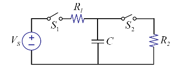
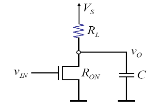
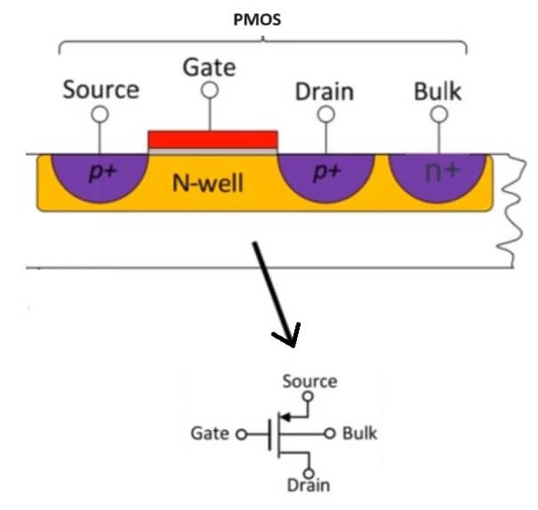
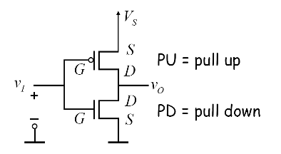

## RC Circuit with a Switch

Find energy dissipated in each cycle.  
Find the average power.

에너지 소모량 = v * i

t=0일때,  
$$
v_c = 0\\
\tau = RC\\
i = c \frac{dv}{dt} = \frac{V_s-e^{-t/\tau}}{R}
$$

에너지 소모량 = $E\int V_si \cdot dt = CV_s^2$
절반 캐패시터 저장, 절반 저항 소모(저항 특징에 독립적)

캐패시터 충전이 끝났을때  
v_c = V_S
캐패시터에 저장된 절반이 소모됨

평균 파워
\var{P} = \frac{E}{T} = CV_s^2f

## Power Dissipation of Inverter

input is low

V_c(t) = (V_{OL} - V_s)e^()+V_s
i = \frac{V_s - V_{OL}}{R} e^{}

E=\int V_s i dt = 

input is high  
전력이 공급되는 상황

R = R_L // R_{ON}

i = \frac{V_S - V_C(t)}{RL} = \frac{(V_s - V_{OL})(1 - e^(-t/RC))}{RL}

평균 파워
\var{P} = \frac{V_s^2}{2R_L} + CV_s^2f

static power가 더 크기 때문에 MOSFET의 단점.

### Examples

## Power Minimization

1. Dynamic power

$$
P_{dyn} = \alpha f c v^2
$$

\alpha는 activity factor. input freq가 얼마나 변하는가?

- voltage를 줄인다.
- capacitance를 줄인다
- frequency를 낮춘다  
클락을 사용하지 않을 때 낮춘다.
- 병렬회로

## CMOS Logic

PMOS

화살표 방향으로 NMOS로 구분.

on when $V_{GS} \leq V_{TP}$  
off when $V_{GS} \gt V_{TP}$  
e.g. $V_{TP} = -1v$  

## CMOS Inverter

No static power! 
- No direct path from the supply to ground

## VTC of CMOS Inverter

이상적인 Inverter이다.

$$
K_p (V_{SG} - \|V_{TP}\|)^2 = K_p (V_{GS} - \|V_{TN}\|)^2
$$

V_s/2 + \|V_{TP}\| ~ V_s/2 - \|V_{TN}\|

amplifier로 동작하는 구간이 넓음.

## Other comments on CMOS logic

CMOS logic is faster than NMOS logic. Why?

R_{ON}을 PMOS가 대체. 훨씬 적은 R_L.

active pull up / active pull down

저항+캐패시터가 가지는 RC delay가 트랜지스터를 사용해 없어짐..

CMOS logic requires more area than NMOS logic 

