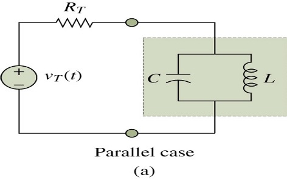

# Transients in Second-order Circuits

1. LC Circuit
2. RLC Circuits

## Solutions

1. Find the particular solution
2. Find the form of homogeneous solution
3. Use initial condition to obtain the total solution

LC \frac{D^2V}{dt^2} + V = V_I

## Homogeneous Solution

1. General Form
$$
LCAs^2 e^{st} + Ae^{st} = 0\\

s = \pm j\omega_o, \omega_o = \frac{1}{\sqrt{LC}}
$$

2. Review: complex exponential
e^{j\theta} = cos\theta + jsin\theta

## Total Solution

v(t) = v_p(t) + v_H(t) \\
v(t) = V_0 - \frac{V_0}{2}(e^{j\omega_ot} + e^{-j\omega_ot}) \\
= V_0 - V_0cos\omega_ot

## Observation

LC circuits are capable of oscillation

Important time constant: \sqrt{LC}

Characteristic impedance: \sqrt{\frac{L}{C}}

Example 12.1 (11p)
C = 1\muF
L = 100 \muH
=> \omega_0 = 1/\sqrt{LC} = 1/\sqrt{10^{-4} \cdot 1} = 100

E_c + E_L = \frac{1}{2} CV_c^2 + \frac{1}{2} L i_L^2
= \frac{1}{2}(100+25)

v_{peak} = \sqrt{125}

0.5a, 10v at some t

## Series RLC Circuit: Second Order Circuit

V_s = V_R + V_L + V_c = R_{ic} + L\frac{di_c}{d_t} + V_c
= R(C\cdot \frac{dV_c}{dt}) + L \frac{d}{dt} (C \frac{dV_c}{dt}) + V_c
= LC \frac{d^2v}{dt^2} + RC\frac{dV_c}{dt} + V_c = V_s

## Homogeneous Solution

Overdamped case: real and distinct roots
\alpha > \omega_0

Critically damped case: real and repeated roots
\alpha = \omega_0

Underdamped case: complex conjugate roots
\alpha < \omega_0

## Natural Response: Overdamped Case

모스펫 bjp

캐패시터 inductor

RC delay

energy consumption

cmos (remove static)
CMOS inverter의 VTC, Energy, Delay

Exercise 19p Parallel RLC Circuit

zero initial state 구하기

$$V_c = L \frac{di_L}{dt}$$

$$\frac{V_T - V_c}{R_T} = C \frac{dV_c}{dt} + i_L$$

=> particular, homogeneous solution

alpha와 omega를 사용해 converge

Exercise 21p

mesh analysis를 사용
12 = 2i + 2(4+i) + 1 \cdot \frac{d}{dt}(4+i) + V_c

i = \frac{1}{4} \frac{dV_c}{dt}

\frac{di}{dt} + 4i + 8 + V_c
=> critically damped

## Summary

1. LC Circuit

2. RLC Circuit
- over damped: 두 실근을 가질때 (진동x)
- critically damped: 중근을 가질때. 천천히
- under damped: 두 허근을 가질때. 진동 + 감쇠가 매우 빠르게
