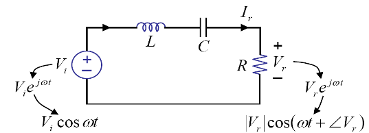

## Sinusoidal Response of RC Circuit

V_I(t) = V_i cos \omega t

V_I(t) = V_i \frac{e^{j\omega t}+e^{-j\omega t}}{2}

V_p(t) = \frac{V_i}{1+j\omega RC} e^{j\omega t}

pollar coordinate로 변환

## Sinusoidal Steady State(SSS)
V_c = (magnitude)

\Phi = (phase)

## Magnitude Plot
<중요>

transfer function

H{j\omega} = \frac{V_p}{V_i}

\| \frac{V_p}{V_i} \| = \frac{1}{1+\omega^2 R^2 C^2}

\omega가 무한으로 가면
\frac{1}{\omegaRC}

=> 주파수에 따라 증폭이 달라짐

## Phase Plot
\phi = tan^{-1} - \omega RC

sinusoidal이 아니더라도 fourier transform으로 sinusoidal들의 합으로 볼 수 있음.

## Impedance
온저항. 전압이 걸렸을때 순수하게 걸리는 저항?

이것만 계산하면 식은 풀 수 있음(particular solution)

sinusoidal은 이것이 복소수일때?? sinusoidal일때 성립

Z_R = R
Z_C = \frac{1}{j\omega C}
Z_L = j\omega L

RC 회로에서
V_c / V_I = Z_C / (Z_R + Z_C)

filter: 원하는 주파수만 선택하는 것

## Series RLC Circuit

V_i = V_i e^{j\omega t} (=V_i cos \omega t)

V_R = \frac{R}{\omega t + 1/j\omega c + R} V_i

Exercise 1 12p

10cos2t 에서 \omega=2
1H = j2
1uF = 1/j2

$$V_c = \frac{1/j2}{2 + j2 + 1/j2} = \frac{10}{-3 + 4j}$$

(magnitude) = \|V_c\| = 10 / 5 = 2
(복소수의 절댓값은, 복소평면 원점에서 거리 i.e. \|-3+4j\| = \sqrt{-3^2 + 4^2} = 5)

\theta = 4 / -3 /= -4 /3 (중요! 좌표 사분면에서 나타낼때 다른 위치)

V_c(t) = \|V_c\| cos (2t-\theta)

Exercise 2
two source -> superposition

1. cos2t 실수부 1?
계산: 1/\sqrt{17} cost(2t - \theta), tan\theta = 4/1

2. sint 실수부 -1?

전압만 계산하기 때문에, 전류소스에 영향을 미치지 않는 직렬저항은 무시해도 됨.

계산: 2/\sqrt{5} cos(t-\theta), tan\theta = 1/-2

## 요약

V_r / V_i = 
\|V_r / V_i\| =

\frac{R}{\sqrt{R+(\omega L - 1 / \omega c)^2}} 이렇게 변형해 사용

(R에 비해 \omega 값이)
Low \omega \omega RC
High

중앙(최대) \omega = \frac{1}{\sqrt{LC}}

## Frequency Response

C = \frac{1}{j\omega c}

따라서 DC에선 \omega가 0이 되므로 open circuit으로 동작

L =

## RC and RL Circuit

캐패시터 = 1/j\omega L
인덕터 = j\omega L

\frac{R}{R + 1/j\omega c} -> High path filter

\frac{1/j\omega c}{R + 1/j\omega c} -> Low path filter

LPF는 노이즈 제거에 쓰임. 노이즈는 높은 주파수

q) RL 회로에서는?

## Filter

Band stop filter

Comb filter

## Another Example

L / L + RCj(\omega L - 1 / \omega c)

Amplitude Modulation
=> Modulation: multifly a(t)원본 \cdot cos \omega t\
demodulation으로 소리?

=> capacitor를 조절함

Frequency Modulation

## Selectivity

Quality Factor

$$
Q = \frac{\omega_o}{\nabla \omega}
$$

\nabla \omega = \frac{R}{L}

=> R이 작아지면 Q가 커짐!

Exercise 28p

200mH = j0.2w
0.2\muF = 5/jw

5/jw // (0.6 + 0.2jw) = 5/jw (1.2jw) 0.2jw+0.6
3 + jw / 
