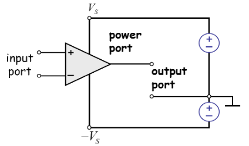
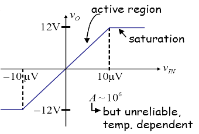

## Device Properties of OP AMP

### OP AMP

### Ideal Circuit Model of OP AMP

1. Input resistance is infinite
2. Output resistance is 0
3. Infinite gain

### Comparator (Saturation)
**No feedback loop**

non-inverting amplifier

low freq & high freq filter의 교집합?

Voltage gain = 1, current gain = infinite

Buffer: isolate the input and the output circuits

### Inverting OP AMP

virtual ground input?

### Adder

input에 node analysis 적용하면 된다.

### Negative feedback
**output is connected to minus port**

OP AMP Active Filter?

KCL = V_s / R_S + V_{out} / R_F + j\omega C_F V_{out} = 0

v_{out} = 

== low path filter

Exercise 19p

### Positive feedback
**output is connected to plus port**

Oscillator

### Voltage Characteristic

hysteresis

3개의 cascade?
1+2는 더하고, 3은 cascade해야 함.

정리: OP AMP는 딜레이가 있어서 frequency 변환할수 있는 한계가 있음

## OP AMP Circuits

## OP AMP RC Circuits
