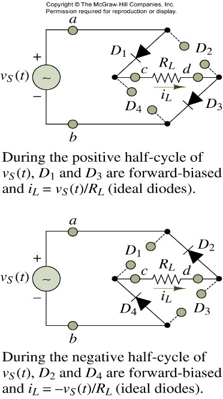

## Diode Characteristics

### Bridge Rectifier

## Peak Detector

Ripple voltage
:가장 낮은 전압

V_r = V_p(1-exp(-\frac{T-\delta t}{RC})) \sim V_p \frac{T}{RC}

1-exp(-\frac{T-\delta t}{RC}) \sim 1 - (1 - \frac{T-\delta t}{RC})

## Limitter

max voltage를 제한

## Clamping Circuit

diode clamping circuit
