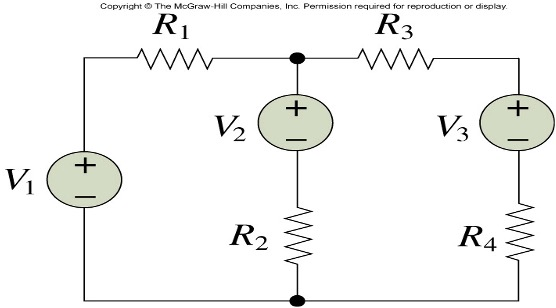
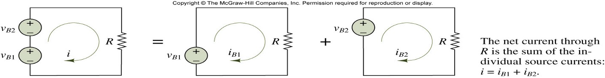

## Node (voltage) analysis

voltage를 모르는 경우 KCL을 각 노드에 적용한다.

*Illustration of Node Analysis

KCL at A:
$$
i_s = {v_a \over R_1} + {{v_a - v_b} \over R2}
$$

KCL at B:
$$
$$

*Example

Node1 income current = I_1 = 10mA
10 = v1 / r1 + {v1-v2} / r2 + {v1 - v2} / r3

{v1-v2} / r3 + {v1-v2} / r3 = v2 / r4 + I2

*Node Analysis with Voltage Source
V_a, V_b, V_c = 2v, v_b, 1v+v_b

i_{ab} + i_{bc} = i_b + i_c (KCL)
{2 - V_b} / 1 + 1 = vb / 2 + vc / 1 (ohms)

## Mesh (current) analysis

**Current source belong to single mesh!!**

### A Two-mesh Circuit

v_s - v_1 - v_2 = 0

Example

좌측 노드를 i_1, 우측 노드를 i_2로 나누고 i=i_1+i_2로 메쉬 분석

v_1 = R_1 v_1 + v_2 + R_2(i_1 + i_2)

v_3 = R_3 i_2 + v_2 + R_2(i_1+i_2) + R_4i_2

### Loop Analysis

### Linearity

1. Homogeneity: 배율
2. Superposition

## Superposition principle

Meaning: we can compute how much each source contribute to the output

$$
i = i_{B1} + i_{B2}
$$

voltage, current가 zero일때

Excersize  

풀이1 superposition

i = i_1 + i_2
i_1 = 2/5 mA
i_2 = 1 / (1+4) x 2

풀이2 node analysis
2-v_A / 1 + 2 = v_A / 4

풀이3 mesh
2 = 1 - i

## Thevenin/Norton equivalent circuits

Example 30p
Norton
I_sc = 2/1 + 2 = 4mA

Thevenin
V_sc = I_sc * R = 4v

Superposition(중첩)으로부터 유도되는 두가지 네트워크 이론은 강력합니다.

이는 많은 세부 사항을 억제하고 우리가 관심 있는 부분에 집중할 수 있게 합니다.

만일 시스템이 선형이라면 전압/전류/저항의 집합이 전압/전류/저항 하나의 쌍으로 단말(terminal)에 나타날 수 있다.

### Thevenin

전류와 전압을 구해야 한다.

1. i_test, V_t를 설정한다
2. V=0, I=0으로 두고 V_a를 구한다. v_a = i_test R_t
3. i_test=0으로 두고 V_b를 구한다. v_b = v_oc
4. V_t = V_a + V_b이다. v_t = v_a + v_b = v_oc + i_test R_t

