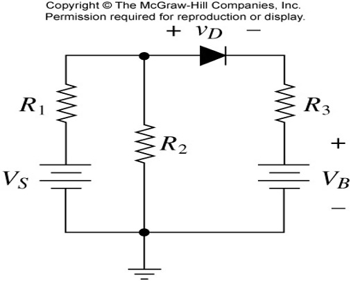

## Diode: Nonlinear Element
다이오드의 특징

## Analytical Solution

V_oc = V_A - V_B = R_2 / (R_1 + R_2) * V - R_3 I_0
R_{TH} = R_1 // R_2 + R_3

Step 1: Simplify the circuit using Thevenin’s theorem
Step 2: Solve for the nonlinear element
Step 3: Solve for the other elements

## Graphical Solutions
Load Line
Operating point(Q point)

## Piecewise Linear Analysis

Example 11p

if diode is on:
(12 - v) / 5 = v / 10 + (v-11) / 10
v = 35/4
i_d = (v - 11) / 10 < 0 wrong!
(켜져있는 방향아 아님)

if diode is off:
v = v_s * r_2 / (r_1 + r_2)
= 12 * 10 / 15 = 8

i_d = (v - 11) / 10 < 0 bingo!
(꺼져있는 방향)

Exercise p14

D1, D2 가 모두 켜져있을때
i_d1 = - (-5/10) - (10/10) < 0

답: v_o = 0

만약 저항이 바뀐다면?

위가 5ohm, 아래가 10ohm
d1 꺼지고, D2켜질때

1. None-zero turn-on resistance

## Incremental Analysis
