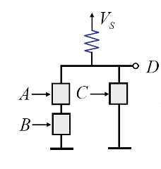
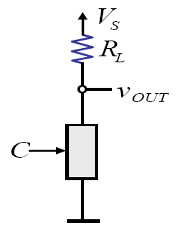

## Example
5p

find the logic of this circuit

D = AB + C

## MOSFET

Metal Oxide Semiconductor Field-Effect Transistor

## Voltage Transfer Characteristics (VTC)

Switch Model

Switch Register Model

## Inverter Characteristics: SR Model

V_s = 5v, V_T = 1v, R_L = 14k\Omega R_{ON} = 1k\Omega

V_OL = 5v \cdot \frac{1}{1+14} // voltage divider
= 1/3v

## Regions of operation of NMOS transistor

Region1: cutoff
Region2: Saturation = amplifier
Region3: triode

## Saturation Region

1. Condition: V_{GS} >= V_T, V_{GD} < V_T

I-V Characteristic of NMOS

i_D = K - v_{DS}^2 \\
K = \frac{1}{2}\mu C_{OX}(\frac{W}{L})

C_{OX} 산화된 부분, 제조과정 상수임
PNP에서 L: N의 전체길이, W: 접합길이

좌측: triode
우측: saturation

R_n = \frac{L/W}{\mu C_{OX}(V_GS - V_T)}

example 6.5 (19p)
1) Determine W/L for correct inverter operation

S-R model에서 V_{OL} = \frac{R_{ON}}{R_{ON} + R_L} \cdot 5 < V_{IL} = V_T
5R_{ON} < R_{ON} + 10
R_{ON} < 10/4

R_{ON} = R_n \frac{L}{W} (정의)
5 \frac{L}{W} = R_{ON} < 10/4
\frac{L}{W} < \frac{1}{2}

## Static Analysis of NAND Gate: SR Model

최악(최장) 경로를 찾아 분석

직렬일때
R_{ON} = 2 \cdot R_{ON}
=> V_{OL}이 2배 길어진다!

병렬일때
하나만 켜질 수 있음. -> nand??

## Signal Restoration and Gain

노이즈가 voltage level을 낮추기 때문에 buffer가 signal level을 회복시킴

Gain = \frac{V_{OH} - V_{OL}}{V_{IH} - V_{IL}}

## Buffer Voltage Transfer Characteristics (VTC)

V_{OH}, V_{OL}, V_{IL}, V_{IH} 영역에 맞게

## Inverter VTC

## Summary

- MOSFET and S Model
- MOSFET and SR Model
- MOSFET Analysis
- Signal Restoration and Gain
