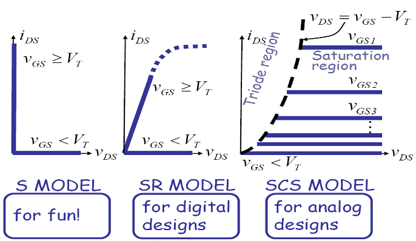
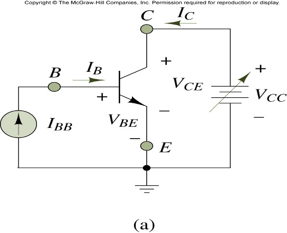
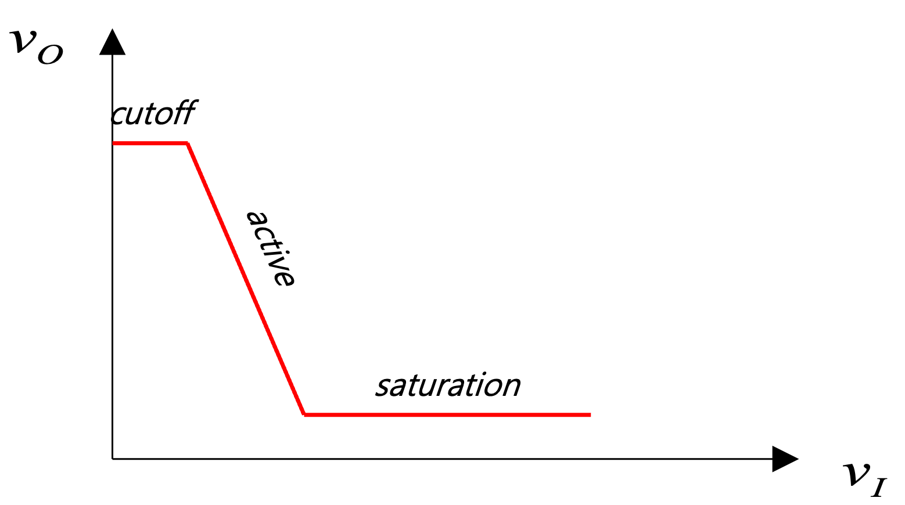

## Signal Amplification

왜 증폭을 하는가?
- 아날로그: 신호를 증폭시키면 노이즈의 영샹을 상대적으로 줄일 수 있음
- 디지털: static dicipline이 증폭을 요구하기 때문

VCCS 회로: 선형 증폭기

i_o = f(V_I) = -g_mV_I

V_o = R_L \cdot i_o = -g_m R_L V_I

i_o / i_I = \frac{-g_m V_I}{V_i / R_I}

Example 7p
V_I = V_GS - 1
V_o = V_s - R_i i_D = 10 - 5 \cdot 1 \cdot (V_GS - 1)^2

SR 모델 VTC로 보면 V_o = V_s - K R_L (V_i - V_T)^
는 서서히 감소하는 형태

operating point(Q point)를 찾자!

## Actual MOSFET Characteristics

## MOSFET Amplifier

\frac{dV_o}{dV_I} = -2 R_s K (V_I - V_T)

example 17p

저항이 높은 이유?: Q point를 설정하기 위해 전류량을 제한시킴. 사이의 v_in voltage는 변하지 않음

Q point에서
V_{GD} = V_I - V_o \leq V_T
V_o \geq V_I - V_T

source>VT
drain<VT
=> saturation(amplifier) ??

V_s 는 i_d 맞은편 점, V_{GS}는 접지

V_d = 4 ??

i_D = k(V_{GS}-V_T)^2
= 1/2 (5-3-1)^2 = 1/2

V_{GS} = 5 - V_s

V_s = R_s \cdot i_D
= 6 \cdot 1/2 (5-V_s-1)^2

R_D 저항은 계산에서 사용되지 않음!

## Large Signal Analysis

example 22p

1) valid range for the source follower circuit

1 <= V_{in} <= 11V

V_{IN} <= 10 + V_i = 11V

2) Find the operating point for maximum input swing

## Bipolar Junction Transitor (BJT)

p n -> diode

Source Drain Gain  
Emitter Collector Base => 진공관에서 유래  

진공관  
(전자 방출) (전자 수집) (양전압)  
=> 전자를 통한 전류 증폭기. 전압x

### Definition of BJT voltages and currents

V_B = 0.7
V_C = 0.5
V_E = 0.2 = saturation voltage (constant)

### BJT Model

- both turn off
cutoff
- only e turn on
active
- both turn on
saturate

example 7.15

i_B = 1 - 0.6 / R_I
V_{out} = V_s - R_L I_C = 10 - 10 \cdot \beta (V_{IN} - 0.6) / R_I
= 6v

R_L을 키우면 voltage gain이 커진다. 또한 선형 관계가 있음을 알 수 있다.

exercise1 33p

15 = R_C(i_B + i_C) + R_B \cdot i_B + V_{BE}
= 4 \cdot 100 i_B + 100 i_B + 0.7

exersise2 -1)

E가 ground가 아닌 register(회로)가 있다면?

BJT는 input loop, output loop 두개로 구분.

그라운드면 따로 계산  
레지스터면 E는 input/output loop 두개 연관

V_E = V_BB - V_BE = 4 - 0.7 = 3.3
I_E = V_E / R_E = 3.3 / 3.3 = 1mA

i_C = \alpha \cdot i_E = \beta / (1+\beta) i_E = 100 / 101 \times 1 mA
V_out = 10v - R_C \cdot i_C = 10 - 4.7 \times 100/101

V_CE > V_CE sat 보다 큰 것이 가정!

exersize2 -2)

V_E = 6 - 0.7 = 5.3

i_E = 5.3 / 3.3

V_{out} = ... = 2.53v

V_{CE} = 2.53 - 5.3 < V_{CE} sat

wrong! BJT is saturated.

V_{CE} sat은 일반적으로 0.2v
V_out = 5.3 + V_{CE} sat = 5.5v

example 7.19 36p
V_1 > V_2 => Q_1 on Q_2 off
V_1 < V_2 => Q_2 on Q_1 off

sense amplifier로 dram에 사용. 정보가 저장되있는지, 아닌지 확인

V_{out} = V_s - R_L i_2
i_1 + i_2 = I_s
i_1 = k(V_{GS} - V_T)^2
i_2 = k(V_{CS} - V_T)^2

