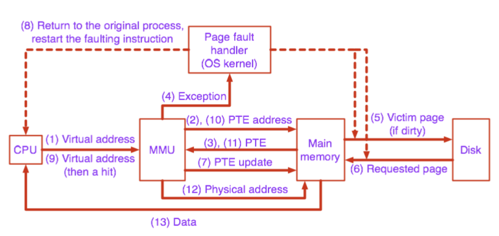
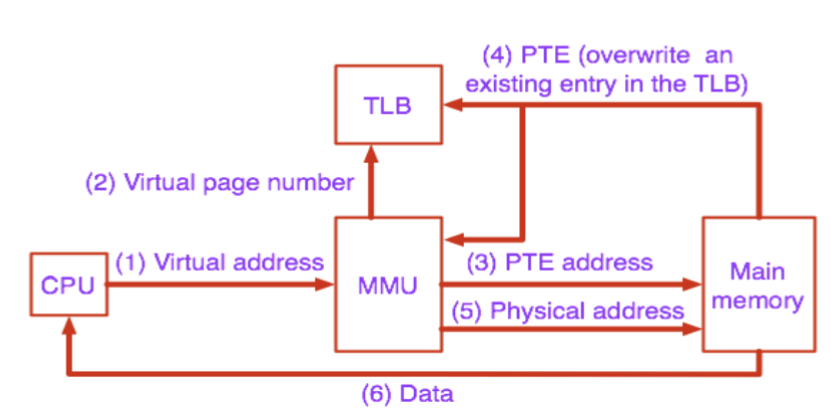

Coherence: 하나의 메모리

Consistency: 여러 메모리

멀티프로세서에서 일어나는 일

## The Effect of Reordering

thread 0
```
data = 5;
done = true;
```
=> dependency가 없어 reoder될 수 있음

thread 1
```
while (not done);
print data;
```
=> thread 0이 reoder 되면 어떻게 실행될까?

reordering을 할 수 없는 영역 지정 등...

## Memory Consistency Models

Sequential consistency
Relaxed memory consistency models
- Processor consistency 
- Weak ordering
- Release consistency

## Sequential Consistency
A multiprocessor system is sequentially consistent if the result of any execution is the same as if the operations of all the processors were executed in some sequential order, and the operations of each individual processor appear in this sequence in the order specified by its program

## Relaxed Memory Consistency Models

Sequential Consistency에서 지켜야 하는 것
write → write
write → read
read → write
read → read

Memory fence (memory barrier) instructions prevent reordering of memory instructions

개발자가 메모리 펜스를 넣어서 리오더링 가능한 부분을 표시
cuda 등이 이 모델을 사용

relaxing write → read order

• Allow a read to bypass (complete before) an earlier write in program order
• Write buffer with read bypassing

## Weak Ordering

Relax all program orders

synchronization 연산 사용

## Release Consistency

Relax all program orders, but not w.r.t. synchronization operations

synchronization 연산을 세분화해서 lock/unlock을 이용한다!

• read/write → release (릴리즈 앞으로 갈 수 없음)
• acquire → read/write (acquire 전으로 갈 수 없음)

## Virtual Memory

- provide large and uniform address space
- multi program
- memory protection

virtual memory는 virtual page로..
physical memory는 physical page로..

=> 리눅스 page는 4k

software로 physical address로 바꾸면 너무 느림.
memory management unit(MMU)로 물리주소로 바꿈

## Address Translation

가상 페이지의 세 종류
- unallocated
- cached
- uncached

전체 주소에 대해 하나의 페이지 테이블은 굉장히 클 수 있음
- 32bit address에 4KB 페이지 크기, 4B PTEs면 4MB 페이지 테이블
- 64bit address는 굉장히 커짐 -> 계층적 페이지 테이블 사용



## Page Replacement Policies

- LRU
- FIFO
- Second chance
- Clock

## Translation Lookaside Buffer (TLB)



## Caches and Virtual Memory

어떤 주소를 캐시에 둘 것인가?

virtual addressed cache: 빠름, 보안(컨텍스트 스위치때 cache flush)
physical addressed cache: 느림

• Physically indexed, physically tagged
• Physically indexed, virtually tagged => 안씀. 크리티컬 패스에 TLB가 있어 느리고, 캐시 태그 비교도 이점이 없음
• Virtually indexed, physically tagged => 실제 많이 사용. 크리티컬 패스에 TLB가 없고, 캐시 태그 비교를 물리 주소로..
• Virtually indexed, virtually tagged => OS가 캐시에 관여할 필요가 없음. 느림
