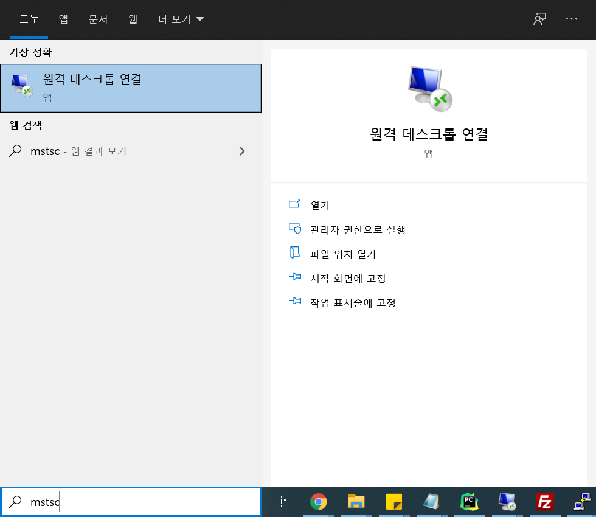
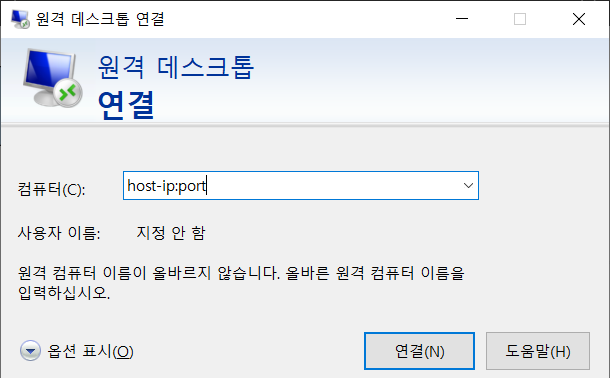
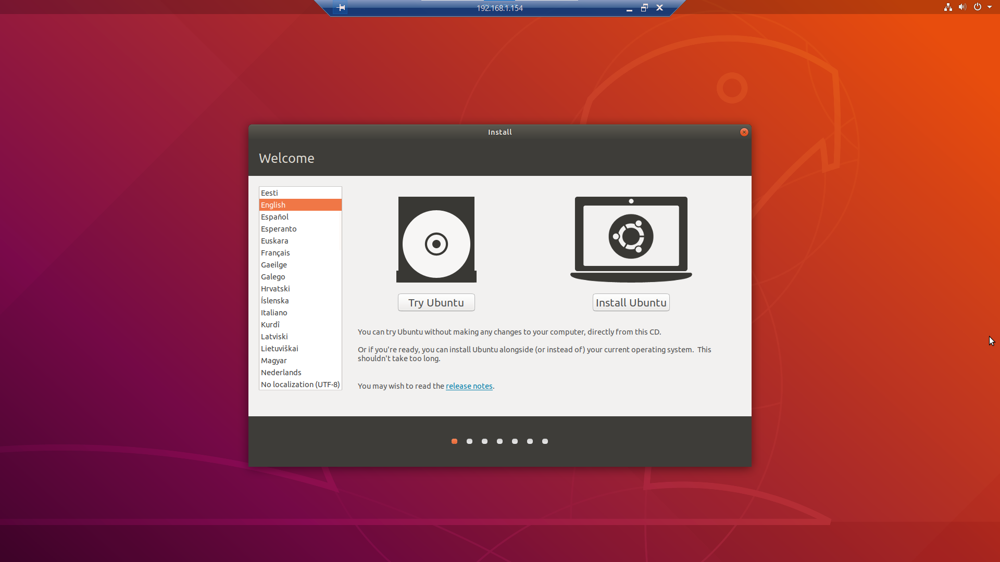

---
authors:
  - jwher
description: Virtualbox With No Gui
tags:
  - linux
  - virtualization
  - tutorial
title: GUI 없이 버추얼박스 사용하기
date: '2022-06-02'
---

  
*GUI 없이 버추얼박스 사용하기*

<!--truncate-->

리눅스 서버에 virtualbox로 가상 환경을 구성해야 합니다. 😲  
CLI는 잘 모르는데 어떡하죠? 한번 같이 vm을 실행시켜 봅시다!  

<br/>

## 요구사항

가상 머신을 사용하기 위해선 vm 매니저로 virtual box나 vmware가 필요합니다:D  
oracle virtualbox를 기준으로 설명하겠습니다.  

```bash
# 설치를 자세히 설명하진 않겠습니다
# https://www.virtualbox.org/wiki/Downloads
$ sudo apt-get install virtualbox

# 설치가 되었으면 확인해 봅시다
$ vboxmanage --version
```

<br/>

## 가상 머신 생성하기

먼저 설치 가능한 OS Type을 확인해야 합니다.  
```bash
$ vboxmanage list ostypes

... 전략 ...
ID:          Ubuntu
Description: Ubuntu (32-bit)
Family ID:   Linux
Family Desc: Linux
64 bit:      false

ID:          Ubuntu_64
Description: Ubuntu (64-bit)
Family ID:   Linux
Family Desc: Linux
64 bit:      true
... 후략 ...
```
저는 Ubuntu 18.04 LTS를 설치하려고 합니다.
목록에서 ubuntu_64가 존재하는지 확인해야겠네요.  
<br/>

확인이 끝났으면 가상 머신을 생성합시다.  
```bash
# --register 옵션을 사용해 등록까지 한번에 합니다
# 여러 설정을 지금 해줄 수 있습니다. 추후에 modifyvm 명령어로 수정해도 됩니다
$ vboxmanage createvm --name "your awesome vm" --register

Virtual machine 'your awesome vm' is created and registered.
UUID: 9a846e25-5227-4824-b396-2174264cb232
Settings file: '/some/path/your awesome vm.vbox'


# 만일 --register를 사용하지 않았다면, 명령어를 한번 더 입력해야 합니다
$ vboxmanage registervm "/some/path/your awesome vm.vbox"
```
*주의! virtualbox는 user마다 사용환경이 분리되어 있어 sudo를 사용하면 생성한 vm이 보이지 않습니다*
~~(어떻게 알았냐고요? 저도 알고싶지 않았어요...)~~

<br/>

가상 머신 등록을 마쳤으면 여려 spec을 설정합시다.
* ```--ostype```: 위에서 확인한 type을 입력합니다.
* ```--cpus```: 사용할 cpu 크기를 설정합니다.
* ```--memory```: 사용할 메모리를 설정합니다. (MB)
* ```--vram```: 비디오 메모리를 설정합니다. (MB)
* ```--mouse```: usbtablet으로 설정하면 mstsc에서 마우스 통합을 사용할 수 있습니다.
* ```--x2apic on``` ```--ioapic on```: Advanced Programmable Interrupt Controller.
  on을 설정해야 guest machine에서 cpu를 온전히 잡습니다.
* ```--pae```: Physical Address Extension. on/off 값으로 메모리 4GB 이상일 때 사용합니다.  

```bash
$ vboxmanage modifyvm "your awesome vm" --ostype ubuntu_64 --cpus 8 --memory 20480 --vram 16 --mouse usbtablet --x2apic on --ioapic on --pae on

# 설정은 다음 명령어로 확인할 수 있습니다
$ vboxmanage showvminfo "your awesome vm"

Name:                        your awesome vm
Groups:                      /
Guest OS:                    Ubuntu (64-bit)
UUID:                        570ea192-d2ed-4ebd-91e9-b8d98e0498e6
... 생략 ...
```

<br/>

마지막으로 storage와 dvddrive를 설정합시다.
* ```--filename```: 생성할 이미지 이름입니다. 주의! 경로를 지정하지 않으면 작업공간에 생깁니다. 
* ```--size```: 사용할 storage 크기입니다. (MB)
* ```--format```: 포멧 설정입니다. (default VDI)
* ```--variant```: Standard/Fixed 값으로 동적할당/정적할당 입니다.  

```bash
$ vboxmanage createmedium disk --filename "awesome storage.vdi" --size 20240 --format VDI --variant fix 

# storage controller를 추가합니다
$ vboxmanage storagectl "your awesome vm" --name "SATA" --add sata --portcount 1

# 생성한 컨트롤러에 이미지를 연결합니다
$ vboxmanage storageattach "your awesome vm" --storagectl "SATA" --port 0 --device 0 --type hdd --medium "awesome storage.vdi"


# 부팅에 사용할 iso 파일을 연결할 dvddrive를 설정합니다
# 먼저 storage contoller를 추가합니다
$ vboxmanage storagectl "your awesome vm" --name "IDE" --add ide

# 생성한 컨트롤러와 iso 파일을 vm에 연결해 줍니다
$ vboxmanage storageattach "your awesome vm" --storagectl "IDE" --port 1 --device 0 --type dvddrive --medium "ubuntu.iso"
```

<br/>

## virtualbox extension pack 설치
길고 긴 설정 끝에 vm을 시작하려는데,  
어라? ssh에서 vm에 os install을 어떻게 진행할까요?  
~~*나중에 고민한 끝에 OS가 설치된 VDI를 연결시키면 된다는걸 알았습니다...*~~

ubuntu server버전으로 headless(No gui, console)로 할 수 있을까 고민해봤지만,  
마침 이미지 버전도 **GUI**이고 **그래픽 인터페이스 화면**을 사용해 install을 하기로 했습니다!  


<br/>
GUI를 원격으로 보여주려면 virtualbox extension pack이 설치되어야 합니다.

```bash
# https://www.virtualbox.org/wiki/Downloads에서 버전에 맞는 extension pack을 받습니다
$ wget -O "확장팩 이름" "url"

$ sudo vboxmanage extpack install "확장팩 이름"
```
<br/>

이제 vm이 GUI를 실행시켜 주도록 설정하고 실행합니다.  
```bash
$ vboxmanage modifyvm "your awesome vm" --vrde on --vrdeport "port number" --vrdemulticon on

$ vboxheadless --startvm "your awesome vm"

Oracle VM VirtualBox Headless Interface 6.0.20
(C) 2008-2020 Oracle Corporation
All rights reserved.

VRDE server is listening on port 5031.

# 아래 명령어로 실행시킬 수 있으나 포트번호가 나오지 않습니다
$ vboxmanage startvm "your awesome vm" --vboxheadless

# 또한, vboxheadless 옵션을 주지 않으면 다음과 같은 에러가 납니다
Waiting for VM "your awesome vm" to power on...
VBoxManage: error: The virtual machine 'your awesome vm' has terminated unexpectedly during startup because of signal 6
VBoxManage: error: Details: code NS_ERROR_FAILURE (0x80004005), component MachineWrap, interface IMachine
```

<br/>

## 네트워크 설정과 RDP
저는 VM이 사설망과 연결되어야 했기에 네트워크 어댑터를 설정해 주었습니다.  
별도로 네트워크 세팅이 필요 없으면 건너뛰어도 됩니다. (기본적으로 NAT로 설정되어 있습니다)

```bash
# nat과 bridge를 둘 다 사용하기 위해 다음과 같이 구성했습니다
$ vboxmanage modifyvm "your awesome vm" --nic1 nat --nic2 bridged --bridgeadapter2 "host interface"
```
<br/>

### RDP(remote desktop protocol) 사용
*드디어 무중霧中을 빠져나와...*

  
작업중인 로컬 PC에서 원격 데스크톱 연결을 열어줍니다.

<br/>

  
호스트 컴퓨터의 ip와 vm 설정에 사용한 GUI 포트를 입력합니다.  

<br/>

  
이제 그리웠던 GUI를 사용할 수 있습니다! 😊

<br/>

## Tips

### vboxmanage The machine locked for a session 문제  
```bash
~$ vboxheadless --startvm your awesome vm
Oracle VM VirtualBox Headless Interface 5.2.44
(C) 2008-2020 Oracle Corporation
All rights reserved.

VBoxHeadless: error: The machine 'your awesome vm' is already locked for a session (or being unlocked)
VBoxHeadless: error: Details: code VBOX_E_INVALID_OBJECT_STATE (0x80bb0007), component MachineWrap, interface IMachine, callee nsISupports
VBoxHeadless: error: Context: "LockMachine(session, LockType_VM)" at line 947 of file VBoxHeadless.cpp
```
이런 에러와 함께 어떤 명령도 실행되지 않을 때가 있습니다.  

다음 명령어로 VM을 강제종료 할 수 있습니다.
```bash
$ vboxmanage startvm kube-slave-kf --type emergencystop
```

<br/>

## Reference  
[[공식]VBoxManage](https://docs.oracle.com/en/virtualization/virtualbox/6.1/user/vboxmanage.html)  


<!-- update log -->
<!--
본문에 추가할 내용을 적는다.
VBoxManage modifyvm "VM name" --natpf1 "guestssh,tcp,,2222,,22"
VBoxManage unregistervm --delete "Name of Virtual Machine"
참고
http://kimchki.blogspot.com/2018/07/virtualbox-command.html
블랙스크린
https://askubuntu.com/questions/162075/my-computer-boots-to-a-black-screen-what-options-do-i-have-to-fix-it
-->
