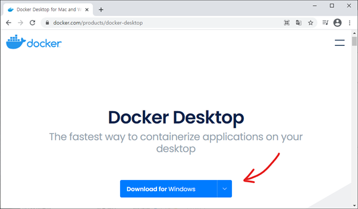
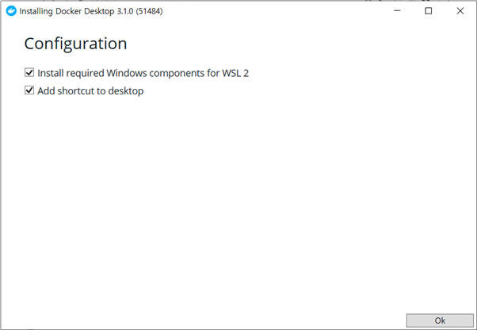
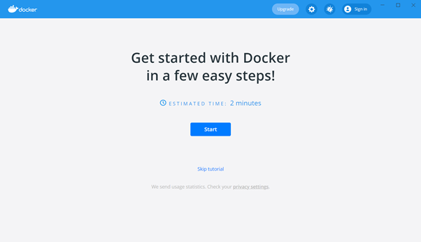

---
authors:
- jwher
description: Install Docker
tags:
  - docker
  - containerization
  - tutorial
  - installation
title: 나에게 필요한 도커 설치하기
---

  
*나에게 필요한 도커 설치하기*  

<!--truncate-->

# 목차
* [요구사항](#요구사항)
* [Ubuntu docker 설치](#ubnutu-docker-설치)
* [CentOS docker 설치](#centos-docker-설치)
* [Windows docker 설치](#windows-docker-설치)

<br/>

## 요구사항
이 글은 다양한 환경에서 내게 필요한 버전의 도커 설치법을 설명합니다. 🎉  
도커에 대해 이해가 부족하시다면 [이 글](https://jwher.github.io/2021-06-19-welcome-to-docker/) 을 먼저 읽는 걸 추천합니다!  
도커를 설치하기 전에 환경을 필요한 점검해 봅시다.

### OS
* Windows
* Ubuntu
* CentOS
* *이 외에 Debian, Fedora 기반 linux, Mac*  
*(장비를 보유하고, 테스트 할 수 있으면 추가로 작성하겠습니다)*

### Storage Driver
* overlay2 (권장)
* [aufs](https://docs.docker.com/storage/storagedriver/aufs-driver/)
* btrfs

### Architecture
* x86_64
* amd64
* arm64

<br/>

## Ubuntu docker 설치


1. 이전 버전 확인 & 제거

이미 도커가 설치되어 있다면, 다시 설치할 필요가 없겠죠? :D
```bash
# Ubuntu
$ sudo apt-get remove docker docker-engine docker.io containerd runc
```

<br/>

2. 레포지토리 설정

도커를 설치하고 업데이트 하기 위해 필요한 repository 위치를 설정해야 합니다.  
repository 위치를 설정해 주기 위해 필요한 기본 라이브러리를 설치해 줍시다.
```bash
# Ubuntu
$ sudo apt-get update

$ sudo apt-get install \
  apt-transport-https \
  ca-certificates \
  curl \
  gnupg \
  lsb-release
```
*HTTPS를 통해 repository를 사용할 수 있게 해줍니다*  

<br/>

필요한 패키지를 설치했으면 도커의 official GPG key를 추가해 줍시다.(Ubuntu만)  
```bash
# Ubuntu
$ curl -fsSL https://download.docker.com/linux/ubuntu/gpg \
| sudo gpg --dearmor -o /usr/share/keyrings/docker-archive-keyring.gpg
```

<br/>

다음 명령어로 stable repository를 설정합니다. nightly나 test repository를 사용하기 위해서는 ```stable``` 다음에
```nightly```, ```test```를 추가합니다.
아키텍처를 설정할 때엔 ```arch``` 다음에 ```amd64```, ```armhf```, ```arm64```를 변경합니다.  
```bash
# Ubuntu x86_64/amd64 
$ echo \
"deb [arch=amd64 signed-by=/usr/share/keyrings/docker-archive-keyring.gpg] https://download.docker.com/linux/ubuntu \
$(lsb_release -cs) stable" | sudo tee /etc/apt/sources.list.d/docker.list > /dev/null
```

*[여기](https://docs.docker.com/engine/install/) 에서 버전과 nightly 지원을 확인할 수 있습니다*

<br/>  

3. 도커 설치  

repository를 추가했으니 ```apt```를 업데이트 하고 설치합니다.  
```bash
# Ubuntu
$ sudo apt-get update
$ sudo apt-get install docker-ce docker-ce-cli containerd.io
```

<br/>

**특정 버전**을 설치하기 위해선 다음과 같이 합니다.  
<br/>

a. repo에서 가능한 버전을 리스트 합니다.  
```bash
# Ubuntu
$ apt-cache madison docker-ce

docker-ce | 5:20.10.6-3-0-ubuntu-focal | https://download.docker.com/linux/ubuntu focal/stable amd64 Packages
docker-ce | 5:20.10.5-3-0-ubuntu-focal | https://download.docker.com/linux/ubuntu focal/stable amd64 Packages
docker-ce | 5:20.10.4-3-0-ubuntu-focal | https://download.docker.com/linux/ubuntu focal/stable amd64 Packages
... 생략 ...
```
<br/>

b. ```VERSION_STRING```을 사용하여 특정 버전을 설치 합니다.  
```bash
# Ubuntu
$ sudo apt-get install docker-ce=<VERSION_STRING> docker-ce-cli=<VERSION_STRING> containerd.io
```

<br/>

설치가 완료되었으면 확인해 봅시다. 😊  
```bash
$ sudo docker run hello-world

Unable to find image 'hello-world:latest' locally
latest: Pulling from library/hello-world
b8dfde127a29: Pull complete 
Digest: sha256:308866a43596e83578c7dfa15e27a73011bdd402185a84c5cd7f32a88b501a24
Status: Downloaded newer image for hello-world:latest

Hello from Docker!
This message shows that your installation appears to be working correctly.

To generate this message, Docker took the following steps:
 1. The Docker client contacted the Docker daemon.
 2. The Docker daemon pulled the "hello-world" image from the Docker Hub.
    (amd64)
 3. The Docker daemon created a new container from that image which runs the
    executable that produces the output you are currently reading.
 4. The Docker daemon streamed that output to the Docker client, which sent it
    to your terminal.

To try something more ambitious, you can run an Ubuntu container with:
 $ docker run -it ubuntu bash

Share images, automate workflows, and more with a free Docker ID:
 https://hub.docker.com/

For more examples and ideas, visit:
 https://docs.docker.com/get-started/
```
<br/>

## CentOS docker 설치


1. 이전 버전 확인 & 제거  

~~설마 apt가 없는 걸 확인하고 오셨나요...?~~  
```bash
# CentOS
$  sudo yum remove docker \
                  docker-client \
                  docker-client-latest \
                  docker-common \
                  docker-latest \
                  docker-latest-logrotate \
                  docker-logrotate \
                  docker-engine
```

<br/>

2. 레포지토리 설정  

도커를 설치하고 업데이트 하기 위해 필요한 repository 위치를 설정해야 합니다.  
repository 위치를 설정해 주기 위해 필요한 기본 라이브러리를 설치해 줍시다.  
```bash
# CentOS
$ sudo yum install -y yum-utils
```

<br/>

CentOS에서 nightly나 test repository를 사용하기 위해서는 `--enable` 옵션에 `docker-ce-nightly`
또는 `docker-ce-test`를 추가해 줍니다.  

```bash
# CentOS
$ sudo yum-config-manager \
    --add-repo \
    https://download.docker.com/linux/centos/docker-ce.repo
```

*[여기](https://docs.docker.com/engine/install/) 에서 버전과 nightly 지원을 확인할 수 있습니다*

<br/>  

3. 도커 설치  

도커 최신 버전을 설치하려면 다음 명령어를 입력합니다.  
```bash
# CentOS
$ sudo apt-get install docker-ce docker-ce-cli containerd.io
```

<br/>

**특정 버전**을 설치하기 위해선 다음과 같이 합니다.  
<br/>

a. repo에서 가능한 버전을 리스트 합니다.
```bash
# CentOS
$ yum list docker-ce --showduplicates | sort -r

... 전략 ...
docker-ce.x86_64            17.03.2.ce-1.el7.centos            docker-ce-stable
docker-ce.x86_64            17.03.1.ce-1.el7.centos            docker-ce-stable
docker-ce.x86_64            17.03.0.ce-1.el7.centos            docker-ce-stable
Loaded plugins: fastestmirror, langpacks
Installed Packages
Determining fastest mirrors
Available Packages
 * updates: mirror.kakao.com
 * extras: mirror.kakao.com
 * epel: ftp.iij.ad.jp
 * centos-sclo-sclo: mirror.kakao.com
 * centos-sclo-rh: mirror.kakao.com
 * base: mirror.kakao.com
```
<br/>

b. ```VERSION_STRING```을 사용하여 특정 버전을 설치 합니다.  
예를 들면 ```docker-ce-17.03.0```입니다.  
```bash
# CentOS
$ sudo yum install docker-ce-<VERSION_STRING> docker-ce-cli-<VERSION_STRING> containerd.io
```

<br/>

<p>3. 도커 시작  </p>  

```bash
# CentOS
$  sudo systemctl start docker
```

<br/>

설치가 완료되었으면 확인해 봅시다. 😊  
```bash
$ sudo docker run hello-world

Hello from Docker!
This message shows that your installation appears to be working correctly.

To generate this message, Docker took the following steps:
 1. The Docker client contacted the Docker daemon.
 2. The Docker daemon pulled the "hello-world" image from the Docker Hub.
    (amd64)
 3. The Docker daemon created a new container from that image which runs the
    executable that produces the output you are currently reading.
 4. The Docker daemon streamed that output to the Docker client, which sent it
    to your terminal.

To try something more ambitious, you can run an Ubuntu container with:
 $ docker run -it ubuntu bash

Share images, automate workflows, and more with a free Docker ID:
 https://hub.docker.com/

For more examples and ideas, visit:
 https://docs.docker.com/get-started/
```

<br/>

## Windows docker 설치


*맥으로 테스트 해보지 못했으나 동일한 절차일 듯 합니다*  

1. [여기](https://www.docker.com/products/docker-desktop) 에서 Docker Desktop for Windows를 다운받습니다.



<br/>

2. 다운받은 인스톨러를 실행합니다.  



* 첫 번째 옵션(Install required Windows components for WSL 2)은 Docker를 동작하는데 필요한 Windows Subsystem Linux(WSL)의 설치를 진행합니다.
* 두 번째 옵션(Add shortcut to desktop)은 바탕화면에 바로가기 아이콘을 생성합니다.

설치가 완료되면 컴퓨터가 재시작됩니다.  

<br/>

3. 컴퓨터를 재시작되면 Docker Desktop이 실행됩니다. 특별한 사용 방법을 익힐 것이 아니면 Skip tutorial을 눌러줍시다.  



<br/>

CLI를 통해 사용 가능한지도 확인해 봅시다.  
```bash
> docker -v
Docker version 19.03.12, build 0ed913b8-
```

<br/>

## Tips  
*북마크 하고 보세요*

### sudo
도커 실행 권한을 추가해 superuser를 사용하지 않을 수 있습니다.  
```bash
$ sudo usermod -aG docker $USER
$ sudo service docker restart
```

<br/>

### 용량 확보
도커를 사용하다보면 build cache와 사용하지 않는 image, container가
용량을 차지하는 경우가 있습니다.
다음 명령어로 용량을 확보할 수 있습니다.
```bash
# 빌드 캐시 삭제하기
$ docker builder prune

# 종료된(exited) 컨테이너 전부 삭제하기
$ docker rm $(docker ps --filter status=exited -q)

# 사용하지 않는 이미지를 정리하기
$ docker image prune -a

# 사용하지 않는 build 캐시, 볼륨, 이미지 전부를 정리하기
$ docker system prune -a --volumes
```

<br/>

### 초기화
불행히 도커를 전부 삭제해야 할 일이 생겼을 수 있습니다.
모든 도커 캐시, 이미지, 컨테이너, 볼륨, 설정을 삭제하는 방법은 다음과 같습니다.  
```bash
# Ubuntu
$ sudo apt-get purge docker-ce docker-ce-cli containerd.io

```

이미지, 컨테이너, 볼륨, 설정은 자동으로 지워지지 않습니다.
다음 명령어로 지워주세요.
```bash
$ sudo rm -rf /var/lib/docker
$ sudo rm -rf /var/lib/containerd
```

<br/>

## Reference  
[[공식]Install Docker Engine on Ubuntu](https://docs.docker.com/engine/install/ubuntu/)  
[[공식]Install Docker Engine on CentOS](https://docs.docker.com/engine/install/centos/)


<!-- update log -->
