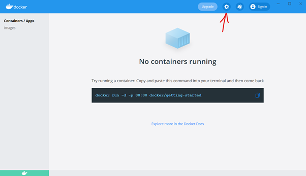
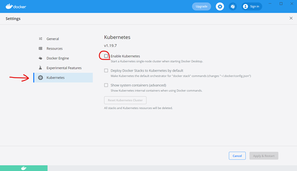
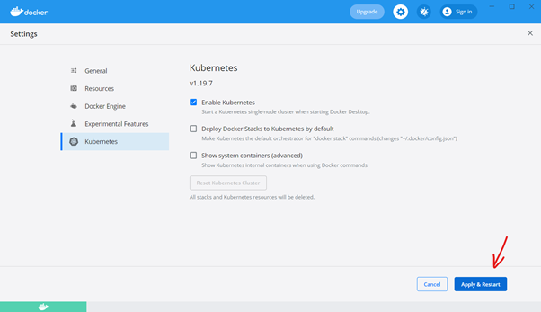

---
authors:
  - jwher
description: Install Kubernetes
tags:
  - kubernetes
  - installation
  - tutorial
title: 나에게 필요한 쿠버네티스 설치하기
date: '2022-06-02'
---

  
*나에게 필요한 쿠버네티스 설치하기*  

<!--truncate-->

# 목차
* [배포버전](#배포버전)
* [Kubeadm 설치](#kubeadm-설치)
* [Mini Kube 설치](#mini-kube-설치)
* [Docker Desktop 설치](#docker-desktop-설치)
* [Kind 설치](#kind-설치)

## 배포버전
이 글은 다양한 환경에서 내게 필요한 버전의 쿠버네티스 설치법을 설명합니다. 🎉  
쿠버네티스에 대해 이해가 부족하시다면 [이 글](/docs/infrastructure/kubernetes/welcome-to-kubernetes/) 을 먼저 읽는 걸 추천합니다!

kubernetes 저사양 node 등에 맞춰 다양한 배포판이 있습니다.
각각 배포판의 특징을 설명하면 다음과 같습니다.
* [Kubeadm](https://kubernetes.io/ko/docs/setup/production-environment/tools/kubeadm/install-kubeadm/)
  ([github](https://github.com/kubernetes/kubernetes))  
  CNCF: Cloud Native Computing Foundation 의 공식 쿠버네티스입니다.
  여러 리눅스 노드에서 동작하는 일반적인 쿠버네티스(k8s) 입니다.
* [Micro K8s](https://snapcraft.io/microk8s)
  ([github](https://github.com/ubuntu/microk8s#list-of-available-addons))  
  *사용해 보지 않았습니다*  
  단일 노드에서 동작하는 경량화된 쿠버네티스입니다. 리눅스 패키지 관리 툴 Snap을 사용해 설치할 수 있습니다.
* [Mini Kube](https://minikube.sigs.k8s.io/docs/start/)
  ([github](https://github.com/kubernetes/minikube))  
  리눅스, 윈도우, 맥에서 동작하는 단일 노드 쿠버네티스입니다.
  Virtual box나 VM ware를 사용해 리눅스 머신으로 쿠버네티스를 구성합니다.
* [Docker Desktop](https://www.docker.com/products/docker-desktop)  
  맥/윈도우에서 동작하는 도커 데스크탑에 포함된 기능입니다.
  실제 동작하는 쿠버네티스 도커 데스크탑 버전에 따라 micro k8s, kind 등 다른 것으로 알고 있습니다.
* [Kind](https://kind.sigs.k8s.io/docs/user/quick-start/)
  ([github](https://github.com/kubernetes-sigs/kind))  
  Kind: Kubernetes in docker 로써 쿠버네티스 클러스터를 도커로(...) 만들었습니다.
  따라서 도커가 동작하는 리눅스, 윈도우, 맥에서 사용할 수 있습니다.
* [K9s](https://k9scli.io/)
  ([github](https://github.com/derailed/k9s))  
  *사용해 보지 않았습니다*  
  CLI를 친숙하게 이용할 수 있게 해주는 도구입니다. (쿠버네티스가 아닙니다!)  
* [K3s](https://k3s.io/)
  ([github](https://github.com/k3s-io/k3s))  
  *사용해 보지 않았습니다*  
  다양한 edge 환경(IoT, ARM)에서 사용되는 저사양(512MB 램, 200MB 디스크) 쿠버네티스 입니다.
  어떠한 리눅스 배포에서 동작하도록 만들어졌습니다.

### 나한테 맞는게 없는데...
*그냥 한번 체험해 보고 싶어요*  
GCP, AWS에서 PaaS로 쿠버네티스를 사용할 수 있습니다!
[GKE](https://cloud.google.com/kubernetes-engine) [EKS](https://aws.amazon.com/ko/eks/)  
클라우드를 적극 활용중이거나 충분한 스펙의 하드웨어가 없다면 추천드립니다!

<br/>

## Kubeadm 설치
  
**Deprecated**  
*리눅스 서버가 여러대고 on premise 쿠버네티스가 필요할 때*  
쿠버네티스를 설치하기 전에 환경을 필요한 점검해 봅시다.

### OS
* 데비안 배포판 (Ubuntu 20.04 기준 작성)
* 레드햇 배포판 (CentOS는 추후 작성하겠습니다)
* [윈도우 서버](https://kubernetes.io/docs/setup/production-environment/windows/intro-windows-in-kubernetes/)
는 사용해 보지 못했습니다

### Hardware spec
* 2 CPU 이상
* 2 GB 이상의 램
* 머신 전체 네트워크 연결

### Software setting  
*Dockershim은 쿠버네티스 릴리스 1.24부터 제거되었습니다.*
*[[공식]container runtimes](https://kubernetes.io/ko/docs/setup/production-environment/container-runtimes/)*
*에서 소개하는 다른 컨테이너 런타임을 사용해 주세요.*  
~~[도커 설치](/docs/infrastructure/containerization/install-docker)~~  

<details>
<summary>도커 데몬 드라이버 변경</summary>
<div markdown="1">

도커 데몬 드라이버를 systemd로 변경해 줍니다.  

```bash
$ sudo vi /etc/docker/daemon.json

# 아래 내용으로 파일을 만듭니다
# exec-opts에 주목해 주세요
{
  "exec-opts": ["native.cgroupdriver=systemd"],
  "log-driver": "json-file",
  "log-opts": {
    "max-size": "100m"
  },
  "storage-driver": "overlay2"
}

# 또는 다음 명령어로 한번에 파일을 생성할 수 있습니다
$ sudo cat > /etc/docker/daemon.json <<EOF
{
  "exec-opts": ["native.cgroupdriver=systemd"],
  "storage-driver": "overlay2"
}
EOF

# systemd에 경로를 만들어 주고 docker service를 재시작 합니다
$ sudo mkdir -p /etc/systemd/system/docker.service.d
$ sudo systemctl daemon-reload
$ sudo systemctl restart docker
```
  
</div>
</details>

<details>
<summary>swap 비활성화(必)</summary>
<div markdown="1">

쿠버네티스는 스왑 메모리를 지원하지 않습니다.
따라서 linux 스왑 메모리를 비활성화 해주어야 합니다.

```bash
$ sudo swapoff -a

# 다음 명령어는 잘못 삽입되면 시스템의 정지를 불러올 수 있습니다
$ sudo sed -i '2s/^/#/' /etc/fstab

# 따라서, /ect/fstab을 열어 직접 확인하고 스왑메모리에 대한 줄만 주석 처리합시다
$ sudo vi /etc/fstab

# /etc/fstab: static file system information.
#
# Use 'blkid' to print the universally unique identifier for a
# device; this may be used with UUID= as a more robust way to name devices
# that works even if disks are added and removed. See fstab(5).
#
# <file system> <mount point>   <type>  <options>       <dump>  <pass>
# / was on /dev/sda2 during installation
UUID=f33b74a8-d88b-4e05-aa01-86d51a883c53 /               ext4    errors=remount-ro 0       1
# /boot/efi was on /dev/sda1 during installation
UUID=9AD5-66E5  /boot/efi       vfat    umask=0077      0       1
#주석 /swapfile                                 none            swap    sw              0       0
```
  
</div>
</details>

<details>
<summary>방화벽(必) (firewalld)</summary>
<div markdown="1">

firewall daemon 을 비활성화 시켜줍시다.  

```bash
# firewalld의 종료 방법입니다
$ sudo systemctl stop firewalld
```
  
</div>
</details>

<details>
<summary>포트 개방 (iptables)</summary>  
<div markdown="1">

kubernetes 재설치를 진행하다 보면
간혹 iptables에 이전 rule들이 남아있어 문제가 생깁니다.  

```bash
# kubeadm join이 안될 시 iptables를 확인해 봅니다

# iptables 조회
$ sudo iptables -L

# iptables 초기화(flush) 실행하기 전 backup을 꼭 합시다
$ sudo iptables -F

```  
  
</div>
</details>

<br/>

### Kubeadm 설치하기

1. 네트워크 확인  
쿠버네티스는 MAC과 product_uuid를 사용하여 클러스터의 노드를 식별합니다.
따라서, 네트워크 인터페이스의 MAC 주소가 고유한지 확인해 주어야 합니다.

```bash
$ ifconfig -a

# 다음 출력은 virtualbox NAT 네트워크로 머신 간 네트워크 어댑터를 설정한 내용입니다
 enp0s3: flags=4163<UP,BROADCAST,RUNNING,MULTICAST>  mtu 1500
      inet 10.0.2.9  netmask 255.255.255.0  broadcast 10.0.2.255
      inet6 fe80::f80d:352b:ef2a:da26  prefixlen 64  scopeid 0x20<link>
      ether 08:00:27:62:15:3e  txqueuelen 1000  (Ethernet)
      RX packets 80558  bytes 120842058 (120.8 MB)
      RX errors 0  dropped 0  overruns 0  frame 0
      TX packets 6397  bytes 424385 (424.3 KB)
      TX errors 0  dropped 0 overruns 0  carrier 0  collisions 0
# 해당 내용을 보면 inet 10.0.2.9가 NAT 네트워크에서 ip 주소이고
# ether 08:00:27:62:15:3e가 맥 주소임을 확인할 수 있습니다

$ sudo cat /sys/class/dmi/id/product_uuid

f570f467-9980-1a47-b9c8-1933b3838dff
```
<br/>

사용할 노드간 통신이 원활한지 확인해 봅시다.
```bash
# ping, curl ,telnet 등을 사용할 수 있습니다
$ ping <ip-addr>

PING 10.0.2.9 (10.0.2.9) 56(84) bytes of data.
64 bytes from 10.0.2.9: icmp_seq=1 ttl=64 time=0.777 ms
64 bytes from 10.0.2.9: icmp_seq=2 ttl=64 time=1.01 ms
64 bytes from 10.0.2.9: icmp_seq=3 ttl=64 time=1.01 ms
... 생략 ...
```
<br/>

다음 포트는 사용가능해야 합니다.  

**마스터 노드**  

| 프로토콜 | 방향     | 포트 범위 | 목적                     | 사용자               |
|----------|----------|-----------|--------------------------|----------------------|
| TCP      | 인바운드 | 6443*     | 쿠버네티스 API 서버      | 모두                 |
| TCP      | 인바운드 | 2379-2380 | etcd 서버 클라이언트 API | kube-apiserver, etcd |
| TCP      | 인바운드 | 10250     | kubelet API              | 자체, 컨트롤 플레인  |
| TCP      | 인바운드 | 10251     | kube-scheduler           | 자체                 |
| TCP      | 인바운드 | 10252     | kube-controller-manager  | 자체                 |

**워커 노드**  

| 프로토콜 | 방향     | 포트 범위   | 목적             | 사용자              |
|----------|----------|-------------|------------------|---------------------|
| TCP      | 인바운드 | 10250       | kubelet API      | 자체, 컨트롤 플레인 |
| TCP      | 인바운드 | 30000-32767 | NodePort 서비스† | 모두                |

*NodePort 대역이 30000-32767인 것에 주목합시다*

2. kubeadm, kubelet, kubectl 설치  

*해당 내용은 master, worker 노드 둘다 해주어야 합니다*  
  
쿠버네티스를 설치하고 업데이트 하기 위해 필요한 repository 위치를 설정해 주어야 합니다.  
repository 위치를 설정해 주기 위해 필요한 기본 라이브러리를 먼저 설치해 줍시다.
```bash
$ sudo apt-get update
$ sudo apt-get install -y apt-transport-https ca-certificates curl
```
<br/>

구글 클라우드의 공개 사이닝 키를 다운로드 합니다.  
```bash
$ sudo curl -fsSLo /usr/share/keyrings/kubernetes-archive-keyring.gpg https://packages.cloud.google.com/apt/doc/apt-key.gpg
```
<br/>

쿠버네티스 ```apt``` 레포지토리를 추가합니다.  
```bash
$ echo "deb [signed-by=/usr/share/keyrings/kubernetes-archive-keyring.gpg] https://apt.kubernetes.io/ kubernetes-xenial master" \
| sudo tee /etc/apt/sources.list.d/kubernetes.list
```
<br/>

```apt``` 패키지 색인을 업데이트하고, kubelet, kubeadm, kubectl을 설치하고 해당 버전을 고정합니다.  
```bash
$ sudo apt-get update
$ sudo apt-get install -y kubelet kubeadm kubectl
$ sudo apt-mark hold kubelet kubeadm kubectl
```
<br/>
   
3. 마스터 노드, 워커 노드 join  
   
a. 마스터 노드 설정  
Container Network Interface로 [flannel](https://github.com/flannel-io/flannel)를 사용할 예정입니다.
(Calico 플러그인도 존재합니다)  
flannel의 default cidr 네트워크를 구성할 것이기에 10.244.0.0/16을 사용하여 kubeadm을 init 시켜줍시다.  

api 서버의 노출 주소는 Master 노드의 ip 주소를 적습니다.
```bash
$ sudo kubeadm init --pod-network-cidr=10.244.0.0/16 --apiserver-advertise-address=10.0.2.9
    
 ... 생략 ...
 Your Kubernetes control-plane has initialized successfully!
     
  To start using your cluster, you need to run the following as a regular user:
  
    mkdir -p $HOME/.kube
    sudo cp -i /etc/kubernetes/admin.conf $HOME/.kube/config
    sudo chown $(id -u):$(id -g) $HOME/.kube/config
  
  Alternatively, if you are the root user, you can run:
   
    export KUBECONFIG=/etc/kubernetes/admin.conf
    
  You should now deploy a pod network to the cluster.
  Run "kubectl apply -f [podnetwork].yaml" with one of the options listed at:
    https://kubernetes.io/docs/concepts/cluster-administration/addons/
   
  Then you can join any number of worker nodes by running the following on each as root:
   
  kubeadm join 10.0.2.9:6443 --token zxdtkt.mi91c5sbky3ubp08 \
      --discovery-token-ca-cert-hash sha256:dc525e7dfce2d699346d6898814936f8276b4b821afa41933f2036ca70f5a04f 
```
<br/>  

kubectl을 사용하기 위해 콘솔 출력 결과대로 설정을 해줍시다.  
```bash
$ mkdir -p $HOME/.kube
$ sudo cp -i /etc/kubernetes/admin.conf $HOME/.kube/config
$ sudo chown $(id -u):$(id -g) $HOME/.kube/config

# 정상 설치가 되었는지 모든 cluster pod를 조회해 봅시다
$ kubectl get pods -A

NAMESPACE     NAME                               READY   STATUS    RESTARTS   AGE
kube-system   coredns-558bd4d5db-nkcmg           0/1     Pending   0          6m47s
kube-system   coredns-558bd4d5db-pnmll           0/1     Pending   0          6m47s
kube-system   etcd-gpuadmin                      1/1     Running   0          6m54s
kube-system   kube-apiserver-gpuadmin            1/1     Running   0          7m1s
kube-system   kube-controller-manager-gpuadmin   1/1     Running   0          7m1s
kube-system   kube-proxy-wj24j                   1/1     Running   0          6m47s
kube-system   kube-scheduler-gpuadmin            1/1     Running   0          6m54s
```
<br/>  

CNI 네트워크 에드온 Flannel을 배포합니다.
 ```bash
$ kubectl apply -f https://raw.githubusercontent.com/coreos/flannel/master/Documentation/kube-flannel.yml
 ```
<br/>

Flannel을 배포한 후 모든 pod를 조회하면 coredns가 Pending에서 Running으로 바뀌며 동작하는 것을 볼 수 있습니다. 😀
```bash
$ kubectl get pod -A

NAMESPACE     NAME                               READY   STATUS    RESTARTS   AGE
kube-system   coredns-558bd4d5db-nkcmg           1/1     Running   0          46m
kube-system   coredns-558bd4d5db-pnmll           1/1     Running   0          46m
kube-system   etcd-gpuadmin                      1/1     Running   0          46m
kube-system   kube-apiserver-gpuadmin            1/1     Running   0          46m
kube-system   kube-controller-manager-gpuadmin   1/1     Running   0          46m
kube-system   kube-flannel-ds-g4vxx              1/1     Running   0          70s
kube-system   kube-proxy-wj24j                   1/1     Running   0          46m
kube-system   kube-scheduler-gpuadmin            1/1     Running   0          46m
```

<br/>

b. 워커 노드 설정  

마스터 노드를 설정하며 kubeadm 출력에서 나온 명령어가 있습니다.  
```bash
$ kubeadm join 10.0.2.9:6443 --token zxdtkt.mi91c5sbky3ubp08 \
      --discovery-token-ca-cert-hash sha256:dc525e7dfce2d699346d6898814936f8276b4b821afa41933f2036ca70f5a04f 
```

해당 명령어를 워커 노드에서 실행하면 join이 완료됩니다.
<br/>

마스터 노드에서 노드를 조회해 확인해 봅시다.  
```bash
$ kubectl get node
NAME       STATUS     ROLES                  AGE     VERSION
cwadmin    Ready      control-plane,master   2m41s   v1.21.0
gpuadmin   NotReady   <none>                 6s      v1.21.0

# 적당한 시간이 지나면 Ready로 바뀝니다

$ kubectl get node
NAME       STATUS   ROLES                  AGE     VERSION
cwadmin    Ready    control-plane,master   4m28s   v1.21.0
gpuadmin   Ready    <none>                 113s    v1.21.0
```

<br/>

## Mini Kube 설치


*한대의 컴퓨터를 가지고 있고 여러 설정이 귀찮을 때*  
쿠버네티스를 설치하기 전에 환경을 필요한 점검해 봅시다.

### 요구사항
* 2 CPU 이상
* 2GB 여유 메모리
* 20GB 여유 디스크
* VM 매니저 (VirtualBox 기준 작성)

### Mini Kube 설치하기

1. 설치하기

[공식 페이지](https://minikube.sigs.k8s.io/docs/start/) 에서 설치파일을 받습니다.  
linux는 deb 또는 rpm 패키지, windows는 exe 인스톨러나 Chocolatey로 받을 수 있습니다.  
[리눅스 패키지 설치](https://jwher.github.io/2021-05-10-install-tar.gz/)

2. 클러스터 시작하기

다음 명령어를 입력하여 클러스터를 시작합니다. 참 쉽죠?  
```bash
> minikube start
```

3. 클러스터 사용하기

쿠버네티스 컨트롤(kubectl)을 사용해 클러스터와 상호작용 할 수 있습니다.
kubectl이 없다면 [이 글](https://jwher.github.io/2021-05-28-kubernetes-usage/) 을 읽어보세요. 😊

<br/>

## Docker Desktop 설치


*한대의 윈도우 컴퓨터를 가지고 있을 때, 커맨드 라인을 보면 어지러울 때*  
먼저 [도커 데스크탑](https://jwher.github.io/2021-04-13-install-docker/#windows) 이 없다면 설치합시다.

### Docker Desktop 설치하기

1. 대쉬보드를 열고 설정을 눌러줍니다



<br/>

2. Kubernetes – Enable Kubernetes를 눌러줍니다



<br/>

3. Apply & Restart를 눌러줍니다.



Kubernetes 설치는 많은 량의 docker container를 생성하기 때문에 상당한 시간을 소요로 합니다.  
완료되면 커맨드라인으로 확인해 봅시다.

*kubectl이 없다면 [이 글](/docs/infrastructure/kubernetes/kubernetes-usage/) 을 읽어보세요.* 😊
```bash
> kubectl version
```

<br/>

## Kind 설치


*한대의 컴퓨터를 가지고 있고, 쉬운 설치와 그나마 빠른(...) 성능이 필요할 때*

### Kind 설치하기

1. Install Kind  

OS에 맞게 설치합니다

 ```bash
# On Linux
$ curl -Lo ./kind https://kind.sigs.k8s.io/dl/v0.10.0/kind-linux-amd64
$ chmod +x ./kind

# On Mac
~ curl -Lo ./kind https://kind.sigs.k8s.io/dl/v0.10.0/kind-darwin-amd64
# or
~ brew install kind

# On Windows
> curl.exe -Lo kind-windows-amd64.exe https://kind.sigs.k8s.io/dl/v0.10.0/kind-windows-amd64
# or
> choco install kind
 ```

2. 쿠버네티스 클러스터 생성  

클러스터 생성 시 쿠브플로우를 사용할 것이므로 port-forwarding을 해주어야 합니다.  
다음 yaml을 작성합니다.  
(세부적인 ingress 설정은 [[공식]Ingress](https://kind.sigs.k8s.io/docs/user/ingress)  참고합시다)
 ```yaml
kind: Cluster
apiVersion: kind.x-k8s.io/v1alpha4
nodes:
- role: control-plane
  # port forward 80 on the host to 80 on this node
  extraPortMappings:
  - containerPort: 31380
    hostPort: 31380
    # optional: set the bind address on the host
    # 0.0.0.0 is the current default
    listenAddress: "0.0.0.0"
    # optional: set the protocol to one of TCP, UDP, SCTP.
    # TCP is the default
    protocol: TCP
 ```

<br/>  
클러스터를 생성합니다.

 ```bash
> kind create cluster
# or
> kind create cluster --config {config}.yaml

   Creating cluster "kind" ...
 • Ensuring node image (kindest/node:v1.20.2) 🖼  ...
 ✓ Ensuring node image (kindest/node:v1.20.2) 🖼
 • Preparing nodes 📦   ...
 ✓ Preparing nodes 📦
 • Writing configuration 📜  ...
 ✓ Writing configuration 📜
 • Starting control-plane 🕹️  ...
 ✓ Starting control-plane 🕹️
 • Installing CNI 🔌  ...
 ✓ Installing CNI 🔌
 • Installing StorageClass 💾  ...
 ✓ Installing StorageClass 💾
Set kubectl context to "kind-kind"
You can now use your cluster with:

kubectl cluster-info --context kind-kind

Have a question, bug, or feature request? Let us know! https://kind.sigs.k8s.io/#community 🙂
 ```

3. Access Cluster

쿠버네티스 노드 쉘에 접속합니다.
 ```bash
# 디폴트 쉘이 bash가 아니면
# /bin/bash

$ kubectl --version
  
Client Version: version.Info{Major:"1", Minor:"20", GitVersion:"v1.20.2", GitCommit:"faecb196815e248d3ecfb03c680a4507229c2a56", GitTreeState:"clean", BuildDate:"2021-01-21T01:10:43Z", GoVersion:"go1.15.5", Compiler:"gc", Platform:"linux/amd64"}
The connection to the server localhost:8080 was refused - did you specify the right host or port?
 
# conf 파일을 복사해 주면 kubectl을 이용할 수 있습니다
$ mkdir -p $HOME/.kube
$ cp -i /etc/kubernetes/admin.conf $HOME/.kube/config
$ chown $(id -u):$(id -g) $HOME/.kube/config

$ kubectl --version

Client Version: version.Info{Major:"1", Minor:"20", GitVersion:"v1.20.2", GitCommit:"faecb196815e248d3ecfb03c680a4507229c2a56", GitTreeState:"clean", BuildDate:"2021-01-21T01:10:43Z", GoVersion:"go1.15.5", Compiler:"gc", Platform:"linux/amd64"}
Server Version: version.Info{Major:"1", Minor:"20", GitVersion:"v1.20.2", GitCommit:"faecb196815e248d3ecfb03c680a4507229c2a56", GitTreeState:"clean", BuildDate:"2021-01-21T01:11:42Z", GoVersion:"go1.15.5", Compiler:"gc", Platform:"linux/amd64"}
 ```  

<br/>
쿠버네티스 클러스터를 확인해 봅시다.🎉   

 ```bash
$ kubectl get node

NAME                 STATUS   ROLES                  AGE   VERSION
kind-control-plane   Ready    control-plane,master   23m   v1.20.2

$ kubectl get pod -A

NAMESPACE            NAME                                         READY   STATUS    RESTARTS   AGE
kube-system          coredns-74ff55c5b-jwwg7                      1/1     Running   0          23m
kube-system          coredns-74ff55c5b-v4l25                      1/1     Running   0          23m
kube-system          etcd-kind-control-plane                      1/1     Running   0          23m
kube-system          kindnet-fqkvr                                1/1     Running   0          23m
kube-system          kube-apiserver-kind-control-plane            1/1     Running   0          23m
kube-system          kube-controller-manager-kind-control-plane   1/1     Running   0          23m
kube-system          kube-proxy-hq6qz                             1/1     Running   0          23m
kube-system          kube-scheduler-kind-control-plane            1/1     Running   0          23m
local-path-storage   local-path-provisioner-78776bfc44-pv9gw      1/1     Running   0          23m
 ```

<br/>

## Tips
*북마크 하고 보세요!*  


자, 이제 당신도 작고 귀여운 kubernetes를 가지고 있습니다!  
이제 잘 돌봐줘야겠네요

<br/>

### worker 노드에서 kubectl 사용  
보안 문제로 권장하진 않으나 admin.config를 복사해 worker에서 kubectl을 사용할 수 있습니다.  
```bash
# 앞서 kubeadm init 때 사용한 명령어 입니다
# worker 노드에서
$ mkdir -p $HOME/.kube

# master 노드에 다음 위치 파일을 worker 노드로 복사합니다
# scp를 사용한다면 master 노드에서
$ scp /etc/kubernetes/admin.conf {user}@{ip}:{HOME}/.kube/config

# 권한 설정을 해줍니다
# worker 노드에서
$ sudo chown $(id -u):$(id -g) $HOME/.kube/config
```

(인증서 발급으로 외부에서 API 서버 접속은 다음에 작성)

<br/>

### 토큰 재발급  
kubeadm에서 생성된 토큰은 만료기간이 하루입니다.  
따라서 새롭게 노드를 추가할 상황이 온다면 토큰을 재발급 받아야 합니다.  

```bash
# 토큰을 조회합니다
$ kubeadm token list

TOKEN     TTL       EXPIRES   USAGES    DESCRIPTION      EXTRA GROUPS

# 아무 것도 조회되지 않으면 새로 생성합니다
$ kubeadm token create

# ca cert hash를 얻기 위해 다음 명령어를 사용합니다
$ openssl x509 -pubkey -in /etc/kubernetes/pki/ca.crt | openssl rsa -pubin -outform der 2>/dev/null | openssl dgst -sha256 -hex | sed 's/^.* //'

# 이제 TOKEN과 hash 값을 얻었으니 새롭게 노드를 join할 수 있습니다
# 새 worker 노드에서
$ kubeadm join {k8s API server ip}:{PORT 6443} --token {TOKEN} --discovery-token-ca-cert-hash sha256:{HASH}
```

<br/>

## Reference  
[[레딧]K3s, minikube or microk8s?](https://www.reddit.com/r/kubernetes/comments/be0415/k3s_minikube_or_microk8s/)  
[[공식]kubeadm 설치하기](https://kubernetes.io/ko/docs/setup/production-environment/tools/kubeadm/install-kubeadm/)    
[쿠버네티스(kubernetes) 설치 및 환경 구성하기](https://medium.com/finda-tech/overview-8d169b2a54ff)  
[쿠버네티스 노드 조인(Join)시 Token 값 확인](https://sarc.io/index.php/cloud/1383-join-token)    

<!--
update log

pleg not healthy
-->
