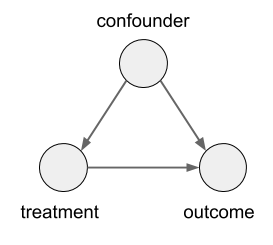

*Causal Inference in Natural Language Processing: Estimation, Prediction, Interpretation and Beyond*
*최대한 번역된 단어를 통일하였으나 원문을 보는것을 권장합니다.*

## 요약
*Abstraction*

과학 연구의 근본적인 목표는 인과 관계에 대해 배우는 것이다. 그러나, 삶과 사회 과학에서 중요한 역할에도 불구하고, 인과관계는 전통적으로 예측 작업에 더 중점을 둔 자연어 처리(NLP)에서 같은 중요성을 가지지 않았다. 이 구별은 인과 추론과 언어 처리의 융합에서 학제 간 연구의 새로운 영역과 함께 퇴색하기 시작했다. 여전히, NLP의 인과관계에 대한 연구는 고유한 적절한 유대와 함께 텍스트 도메인에 대한 인과 추론의 적용에서 단일 정의, 벤치마크 데이터 세트 및 도전과 기회 관계에 대한 명확한 표현 없이 도메인에 흩어져 있다. 이 설문 조사에서, 우리는 학문 분야에 걸친 연구를 통합하고 더 넓은 NLP 환경에 배치합니다. 우리는 텍스트가 결과, 치료 또는 혼란을 해결하기 위해 사용되는 설정을 포함하는 텍스트로 인과 효과를 추정하는 통계적 도전을 소개합니다.

## 1. 개요
*Introduction*

### 예제 1
*Example 1.*

온라인 포럼은 사용자가 프로필에 여성 또는 남성 아이콘으로 선호하는 성별을 표시할 수 있도록 허용했습니다.
그들은 여성 아이콘으로 자신을 표시하는 사용자가 게시물에서 '좋아요'를 덜 받는 경향이 있다는 것을 알았습니다.
프로필에서 성별 정보를 허용하는 정책을 더 잘 평가하기 위해 묻습니다:
여성 아이콘을 사용하면 게시물의 인기가 감소합니까?

### 예제 2
*Example 2.*

의료 연구 센터는 환자의 의료기록 텍스트서술(textual narratives)에서 임상 진단을 감지하기 위한 분류기를 만들고자 합니다.
기록은 여러 병원 사이트에 걸쳐 집계되며, 이는 목표 임상 상태의 빈도와 서술의(the narratives) 글쓰기 스타일에 따라 다릅니다.
분류기가 훈련 세트에 없는 사이트의 기록에 적용되면 정확도가 감소합니다.
사후 분석(Post-hoc)은 formatting markers와 같이 겉보기에 관련이 없는 기능에 상당한 비중을 부여한다는 것을 나타냅니다.

## 2. 배경
*Background*

이 설문 조사가 초점하는 문제 (강건하고, 설명 가능한 예측을 위한 causal effect estimation, causal formalism)은 causal inference에 대한 내용입니다.
Causal inference에 핵심 요소는 관심있는 개입에 대한 counterfactuals의 정의입니다.
§1의 motivating example로 이 아이디어를 설명할 것입니다.

**예제 1**은 온라인 포럼 게시물과 그들이 받는 좋아요 Y의 수를 다룹니다.
Binary variable T를 사용하여 게시물이 '여성 아이콘'(T = 1) 또는 '남성 아이콘'(T = 0)을 사용하는지 여부를 나타냅니다.
이 예제에서 게시물 아이콘 T를 'Treatment'로 보지만, Treatment가 무작위로 할당되었다고 가정하지 않습니다(게시물 작성자가 선택할 수 있음).
Counterfactual outcome Y(1)는 게시물이 여성 아이콘을 사용했다면 받았을 좋아요 수를 나타냅니다. Conterfactual outcome Y(0)는 유사하게 정의됩니다.

Causal inference의 근본적인 문제(Holland, 1986)는 어떤 분석 단위(unit of analysis)에 대해서도 Y(0)과 Y(1)를 동시에 관찰할 수 없다는 것입니다.
이는 counterfactual inquiries를 하고 싶은 가장 작은 단위입니다(e.g. 에제 1의 '게시물').
이 문제는 causal inference를 통계적 추론보다 어렵게 만들고 식별 가정 없이는 불가능하게 합니다.(§ 2.2 참조).

**예제 2**는 텍스트 임상 서술(narrative) X를 입력으로 취하고 진단 예측을 출력하는 훈련된 분류기 f(X)를 다룹니다.
텍스트 X는 의사의 진단 Y를 기반으로 작성되었으며, 또한 병원 Z에서 사용되는 글쓰기 스타일의 영향을 받습니다.
라벨 Y를 고정하는 동안 병원 Z에 개입(intervene)하고 싶습니다.
Counterfactual 서술 X(z)는 진단을 고정하는 동안 병원을 값 z로 설정했다면 관찰했을 텍스트입니다.
Counterfactual 예측(prediction) f(X(z))는 Counterfactural 리뷰 X(z)를 입력으로 주어 학습된 분류기에서 나온 것입니다.

### 2.1 인과 관계
*Causal Estimands*

## 3. 텍스트로 인과 관계 평가하기
*Estimating Causal Effects with Text*
