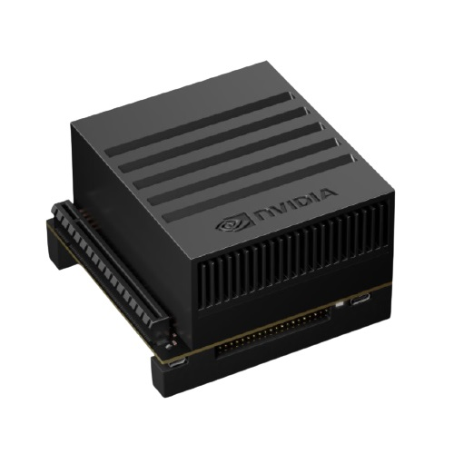

  
*LPIRC에서 우승하는 방법*

<!--truncate-->

## LPIRC 대회

## 최적화 단계

## Jetson TX2

## Tiny-YOLO

## 소프트웨어 최적화 기법

### 1. 파이프라이닝

### 2. Tucker Decomposition

### 3. CPU 병렬화

### 4. 양자화

### 전체 성능 증가

### 5. Normalization 합치기

### 6. 배치 크기

### 7. half

### 이미지 크기 감소

## 에너지 소모량 탐색

