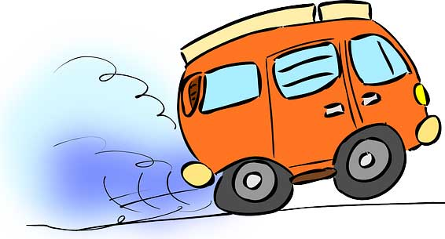

  
*근사를 통한 가속*

<!--truncate-->

## 근사를 통한 가속

DNN은 일반적으로 많이 중복됩니다. 중복을 줄이는 것은 메모리 공간과 계산 요구량을 줄입니다.

근사 방법은 다음 종류가 있습니다.

* 연산자 크기를 줄여 스토리지와 계산량을 줄입니다
예) 부동소수점 -> 고정소수점, 낮은 정밀도 양자화

* 연산의 숫자를 줄여 스토리지와 계산량을 줄입니다
예) low rank 근사, 네트워크 프루닝

* 근사 회로를 사용

## 양자화
*Quantization*

부동소수점 = $(-1)^s \times m \times 2^{(e-127)}$
<!-- +- 2~2^-127 -->
1(s) + 8(exponent) + 23(mentisa)

이점
- 큰 정확도 손실 없이 메모리 요구량을 줄입니다
- 하드웨어 플랫폼이 제공하면(4bit ALU, FPGA 등) 계산 오버헤드 감소

## 저정밀도 숫자
*Low Precision Numbers*

fp16
1 + 5(exponent) + 10(mentisa)

-5.96e^-8 ~ 65504

bfloat16
1 + 8(exponent) + 7(metisa)

-1e^38 ~ 3e^38 더 많은 범위

### Symmetric

$Q = \big[{r \over S}\big]$
s는 스케일 팩터

### asynmmetric

$Q = \big[{r \over S}\big] + Z$  
중점이 이동

### 로그 양자화

곱셈이 쉬프트와 덧셈으로 교체됨

### 가중 양자화
*Weighted Quantization*

주 목표는 메모리 사용량을 줄이는 것

- deep compression
- weighted-entropy based quantization
- value-aware quantization
- adaptive quantization
- Outlier quantization
- learnable quantization

## 양자화 입도
*Quantization Granularity*

- layerwise
간단하고 모든 가속기에 적합
- groupwise
몇 채널을 묶어 계산
- channelwise
CPU와 GPU에서 가장 인기
- sub-channelwise
오버헤드가 큼

## 양자화 기법

### QAT
*Quantization Aware Training*

State Through estimator

### PTQ
*Post Training Quantization*

calibartion data를 사용해 계산, 얼마나 많이는 의문
범위를 어떻게 정할 것인가?

## 프루닝

PaI(Pruning at Init)
PaT(Pruning after Training)

Occam's Hill

무엇을? - 희소한것을
어떤걸? - 규칙
어떻게? - 스케줄
얼마나? - 비율

### 희소 구조

비정규적
- Fine grained sparsity(0-D)
- Vector-level sparsity(1-D)
- Kernel-level sparsity(2-D)
- Filter-level sparsity(3-D)
정규적

### 프루닝 규칙

- Data free
- Data driven
- Selection based on the training loss func

### 프루닝 스케줄

- 학습 후 희소화
가장 인기있는 방법
- 학습 중 희소화
- 희소 학습

### 프루닝 비율

글로벌, 레이어 비율

## 시작시 프루닝
*Pruning at Initialization*

## 
작은 것부터가 나은가?
큰 것부터 잘라나가는게 나은가?

## 0 활용 처리
*Zero aware processing*

## 저수준 근사

### 행렬 분해
큰 필터는 작은 필터 여러개로 근사 가능

### Tucker Decomposiiton

### Bottleneck Architecture

### Depthwise Separable Convolution

K x K x C x N

K x K x C + C x N
