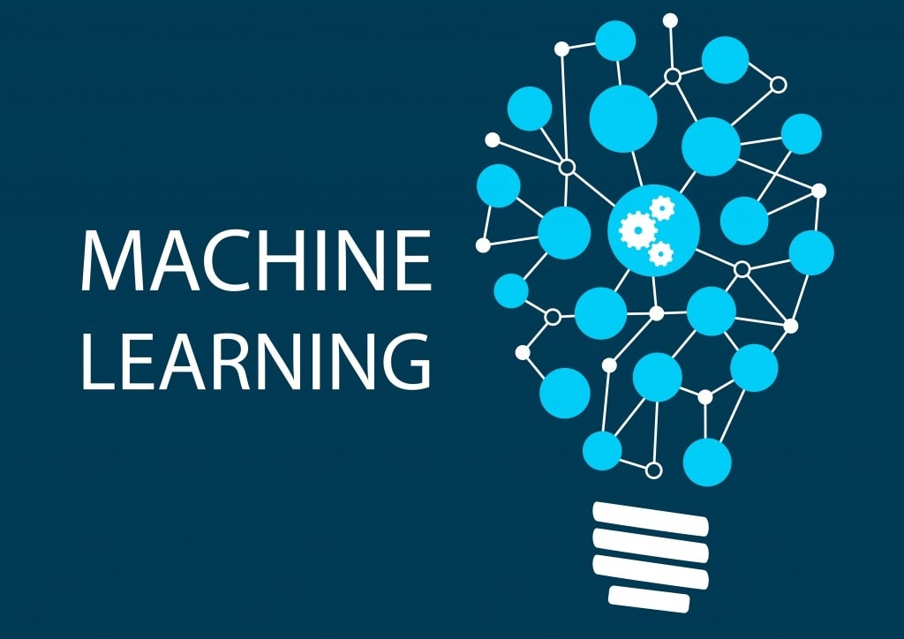
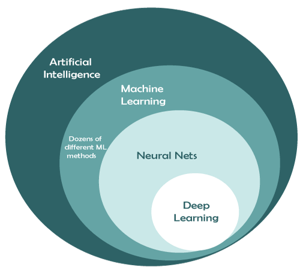

  

<!--truncate-->

## 머신러닝이란?

이 글을 읽고 계신 분은 인공지능, 특히 그 중에서도 **머신러닝**에 흥미가 생기신 분일 것입니다.
최근 몇 년간, 머신러닝은 다양한 분야에서 큰 관심을 받고 있으며 그 인기는 날로 높아지고 있습니다.
자동으로 사진 속 사물을 인식하거나, 스스로 학습해 게임에서 사람을 이기는 인공지능의 등장 등 머신러닝은 우리의 일상 곳곳에 깊숙이 자리 잡았습니다.

머신러닝과 딥러닝이라는 용어가 종종 같은 의미로 사용되기도 하지만, 이 둘 사이에는 미묘한 차이가 존재합니다. 머신러닝은 인공지능(AI)의 한 하위 분야이고, 딥러닝은 다시 머신러닝의 하위 분야인 신경망 기술에 기반을 둡니다. 신경망은 인간 뇌의 구조를 본따 설계된 알고리즘이며, 이 신경망을 활용해 복잡한 문제를 해결하는 것이 바로 딥러닝입니다. 따라서 머신러닝과 딥러닝은 연결되어 있지만, **모든 머신러닝이 딥러닝은 아닙니다.** [[IBM]](#mldef)

우리가 중점적으로 다룰 머신러닝은 기본적으로 데이터를 통해 학습하는 알고리즘을 말합니다.
이때, 고전적 머신러닝은 딥러닝과 달리, 인간의 개입을 더 많이 필요로 합니다.
전문가가 데이터의 특징을 직접 선정하고, 그 차이점을 이해하여 학습에 적합한 형태로 제공하는 과정이 필수적이기 때문입니다.
또 머신러닝 모델은 **구조화된 데이터**에 의존하는 경향이 큽니다.

여기서 말하는 구조화된 데이터란, 데이터를 효율적으로 분석하고 활용하기 위해 명확한 형태로 정리된 데이터를 의미합니다.
그리고 이 데이터를 제대로 다루기 위해서는 **통계**와 **수학**적 지식이 필수적입니다.

수학이 어렵게 느껴질 수 있지만, 걱정하지 마세요! 저도 처음에는 많은 부분이 복잡하게 느껴졌습니다.
하지만 차근차근 함께 공부하며 복잡한 개념도 쉽게 풀어갈 수 있도록, 이 글에서 중요한 수학적 개념들을 최대한 알기 쉽게 설명해보려 합니다.

## References

#### [IBM 머신러닝](https://www.ibm.com/kr-ko/topics/machine-learning) {#mldef}
