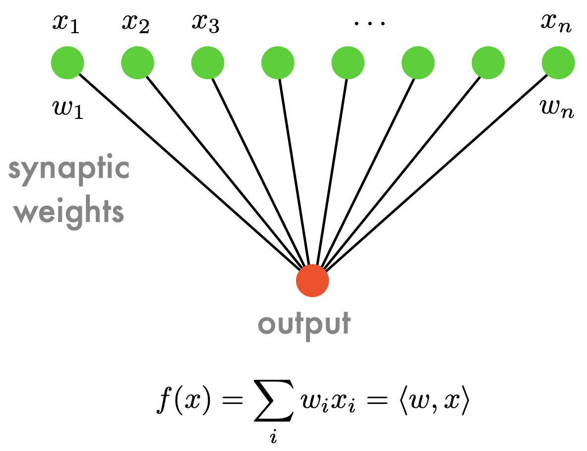

## Kernel
머신러닝에서 커널은 non-lineary를 풀기 위함

## Perceptron



$$
f(x) = \sum_i w_i x_i = \langle w, x \rangle
$$

$w$ Weighted linear combination

$\sigma$ nonlinear decision function

$b$ linear offset (bias)

-> estimating the paratmeters $w$ and $b$.

### Single-layer perceptron

이 문제를 고려해 봅시다.

$$
D = {(xi,yi)}m
i=1 , xi ∈Rn, yi ∈{−1,1}
$$

```
initialize w = 0 and b = 0.
1: repeat
2: Pick (xi,yi) from data.
3: if yi (〈w,xi〉+ b) 60 then
4: w ←w + yixi and b ←b + yi.
5: end if
6: until yi [〈w,xi〉+ b] > 0 for all i
```

설명

이게 수렴한다는 보장은?

## Convergence theorem

if there exists some (w∗,b∗) with ‖w∗‖= 1 and
yi (〈w∗,xi〉+ b∗) >ρ, ∀i,
then the perceptron converges to a linear separator after a number of steps
bounded by

$$
((b∗)^2 + 1)(R^2 + 1)ρ^−2
$$
where ‖xi‖ <= R

- difficulty of problem ($\rho$)

**증명**

## 결론
Stochastic Gradient Descent(SGD)

noisy data가 있어 linearity가 깨지면 실패

## Ref
출처: https://alex.smola.org/teaching/cmu2013-10-701x/slides/4_Perceptron.pdf