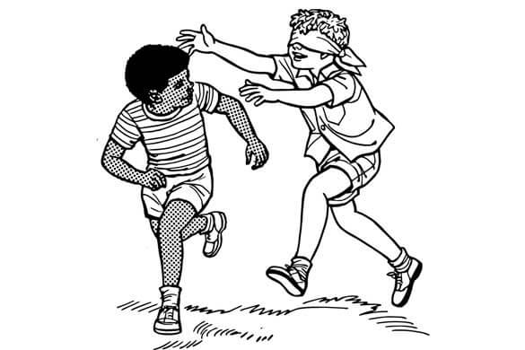

  
*Reinforcement Learning*

<!--truncate-->

## 마르코프 결정 과정

각 행동 a와 상태 s에서 최고의 행동을 선택해
$q_*(s,a)$나 $V_*(s)$를 예상하는 것입니다.

## 유한 MDP

$$
p(s',r|s,a)=P\{S_t=s',R_t=r|S_{t-1}=s,A_{t-1}=a\}
$$

확률분포 $p$는 MDP에 의해 동적으로 정의됩니다.

$$
p \rightarrow [0,1] \newline
\sum_{S'}\sum_rp(s',r|s,a) = 1
$$

### 상태 변화 확률

### 예상 보상
$$
p(s'|s,a) = P\{S_t=s'|S_{t-1}=s,A_{t-1}=a\} = \sum_rp(s',r|s,a) \newline
r(s,a) = E[R_t|S_{t-1}=s,A_{t-1}=a]=\sum_rr\sum_{S'}p(s',r|s,a)
$$

## 용어
행동 : action
상태 : state
