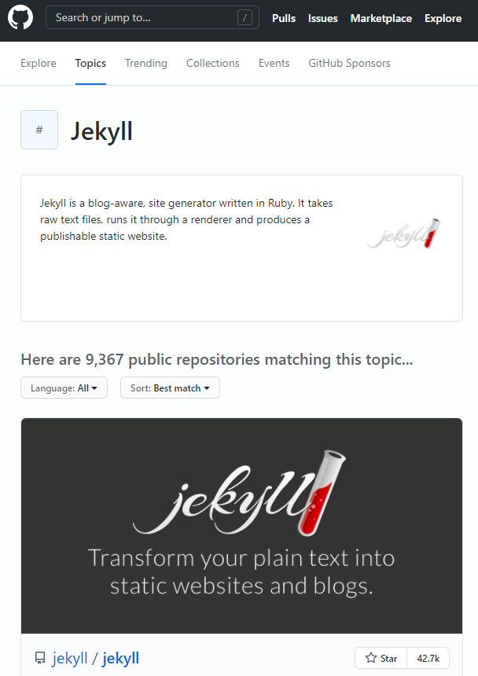

---
authors:
- jwher
description: Update Blog
slug: update-blog
tags:
- blog
- update
title: 지킬 블로그 업데이트
---

  
*Jekyll 블로그 사용하기*  
<!--truncate-->

## Jekyll 

*지킬 박사와 하이드씨를 읽어 본 적이 있나요?*

지킬은 소설속의 박사로 선과 악을 분리하는 약을 만듭니다.
하지만, 여기에서 다루는 Jekyll과 아직까지는 어떤 연관성도 찾지 못했습니다...  

Jekyll은 [Ruby on Rails](https://ko.wikipedia.org/wiki/루비_온_레일즈)
프레임워크에서 동작하는 정적 사이트 라이브러리입니다. 따라서 Ruby 특징을 갖추고 있습니다.  

공식 사이트에선 다음과 같은 장점을 소개하고 있습니다.

### 심플함  
ROR 프레임워크를 사용하기 때문에 애자일하게(빠르게) 개발할 수 있다는 장점을 지닙니다.  

### 정적  
마크다운(.md), Liquid, HTML&CSS를 넣으면 바로 사이트를 완성할 수 있습니다.

### 블로그 지향적
고유주소, 카테고리, 페이지, 포스트, 사용자 레이아웃 등 기능이 이미 포함되어 있습니다.  

Ruby로 직접 개발한다면 다음과 같은 명령어를 사용할 수 있습니다.
```bash
# Ruby gem을 통해 설치합니다
$ gem install jekyll bundler
$ jekyll new {blog}
$ cd {blog}

$ bundle exec jekyll serve
# http://localhost:4000 에서 확인할 수 있습니다
```

### 직접 해보자
*3초면 될껄요?*

사실 위와 같은 장점과 함께 Github Pages로 **무료 호스팅** 이 된다는 점이
Jekyll 선택에 가장 큰 요소였습니다.  

최근엔 한국에서도 워드프레스를 많이 사용하고, 네이버 블로그 등 플랫폼은 많으나 좀더 자유로운 환경을 찾았습니다.  
직접 개발하기엔 시간과 비용이 부족했고, Jekyll의 장점이 필요했습니다.

Ruby에 대한 이해가 부족했지만, 서버 호스팅, 도메인 비용과 웹 사이트를 직접 개발한다고 생각하면...  
Ruby 지식 부족으로 인한 시행착오를 겪었지만 2021.05.23일 블로그를 리뉴얼했습니다.   

소개는 이만 줄이고 만들어봅시다.  
*(github 아이디가 없지는 않겠지...?)*

1. [깃헙 토픽](https://github.com/topics/jekyll) 에 가서 마음에 드는 테마를 고릅니다.
    
  *다양한 테마를 바로 사용할 수 있습니다*

2. 마음에 드는 테마를 fork 합니다.
  
  *본 블로그에 사용한 beautiful-jekyll*

3. Settings에서 레포지토리를 Rename 합니다.
  Github Pages 호스팅을 위해 {yourusername}.github.io로 이름이 바뀌어야 합니다.

4. 레포지토리의 _config.yml을 수정합니다.
  각각의 테마마다 형식이 다릅니다. 테마별 설명대로 수정해줍니다.

<br/>

자! 이제 {yourusername}.github.io에 접속하면 나만의 블로그를 찾을 수 있습니다.  
글을 추가하려면 테마마다 다르겠지만 _post 밑에 마크다운`.md` 파일을 작성해 주면 됩니다.

<br/>

## Disqus를 사용해 댓글 만들어 주기
*정적이네...*

Jekyll의 단점이라면, 정적 사이트로써 블로그 접속자와 소통이 어렵다는 것입니다.  
시간을 쪼개서 포스팅을 하다 보니 자세하게 글을 작성하지 못하는데,
다른 사람에겐 어떤 부분이 어렵고 설명이 필요한지 몰라 답답했습니다.

이런 단점을 없에주는, 소셜 계정 댓글 서비스인 Disqus를 사용법을 소개합니다.

### 직접 해 보자
1. https://disqus.com/ 에 가서 구글계정의 소셜로그인으로 가입합니다.
2. Get Started 버튼을 누릅니다.
3. I want to install Disqus on my site를 선택합니다.
4. 설정 페이지가 나오면 Website Name을 지정해 주고 Create Site 버튼을 누릅니다.  
   *Website Name을 기억하자*  
5. Let's get started를 누르면 What platform is your site on?에서 Jekyll을 선택합니다.  
6. 설정을 마치고 Configure 버튼을 누릅니다.  
   *Setup Complete! 페이지가 나오면 완료된것입니다*  
7. 이제 {yourusername}.github.io 저장소 안에 있는 _config.yaml 파일을 열어서 편집합니다.  
disqus: 구문을 찾아서 다음과 같은 식으로 수정합니다.  
disqus: "Website Name"  
*혹시나 Disqus를 지원하지 않는 테마이면...*  
8. {yourusername}.github.io 페이지를 확인헤서 잘 반영되었는지 봅니다.  
테마에 따라 post header에 ```comments: true``` 등을 추가해야 할 수 있습니다.

<br/>

## Search console 사용하기
*아무도 주소를 모르는 집*

블로그 게시글에 방문하려면 검색엔진에 등록이 되어야 합니다.
안타깝게도 이는 자동으로 이루어지지 않습니다.
**구글**에 등록하기 위해선 [search console](https://search.google.com/search-console)을 이용해야 합니다.

## 여기까지 오다니
어찌어찌 해서 내가 원하는 blog를 작성할 수 있었습니다.  
다른 분들이 먼저 좋은 귿을 작성해 주셔서 감사합니다:)  

22년 현재는 [다른 프레임워크](/posts/first-post-with-docusaurus)를 사용하고 있습니다!

<br/>

## Reference  
[[공식]Jekyll](http://jekyllrb-ko.github.io/)  
[Github에 Beautiful-jekyll을 구축하는 순서 설명](https://dymaxionkim.github.io/beautiful-jekyll/2017-01-10-make-blog/)


<!-- update log -->
<!--
본문에 추가할 내용을 적는다.
사진 추가
-->