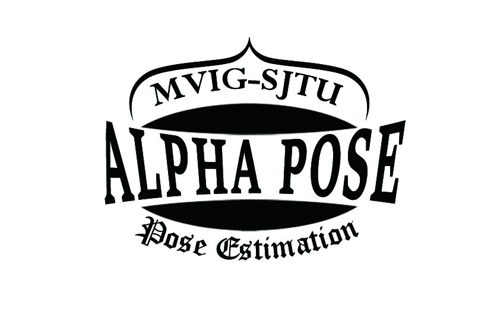
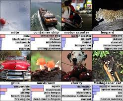
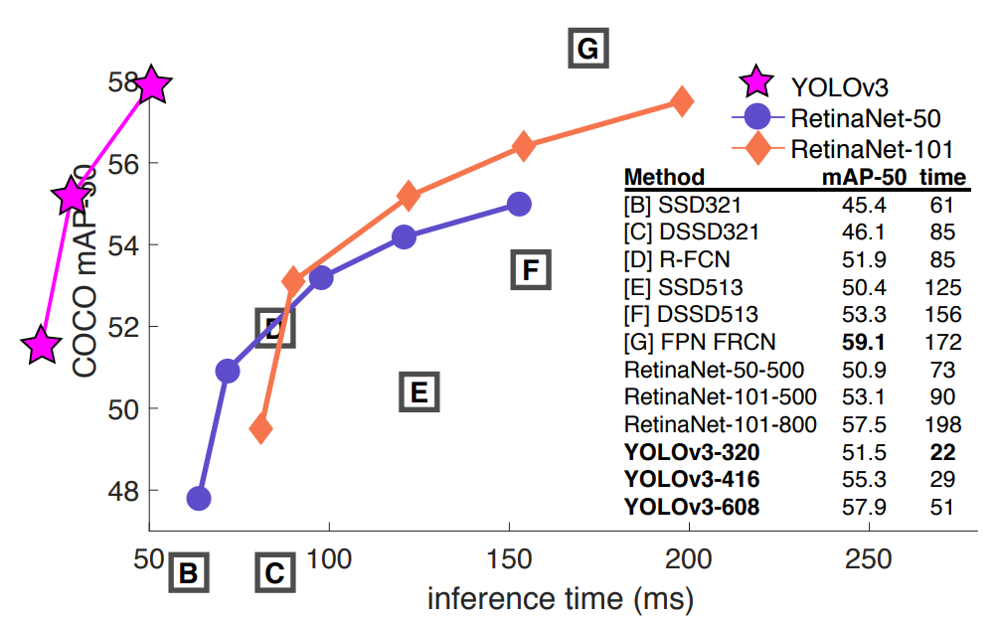
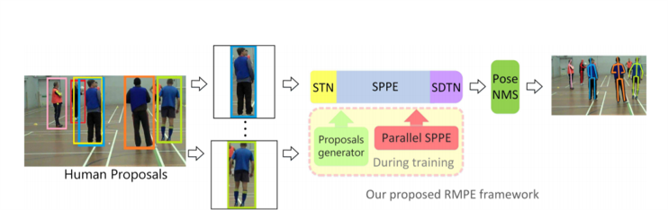
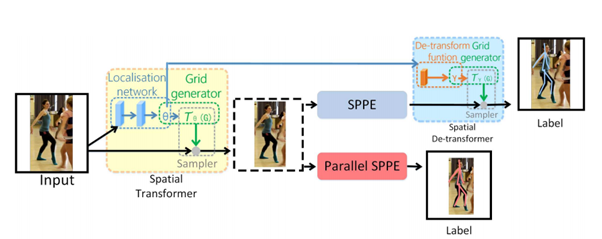
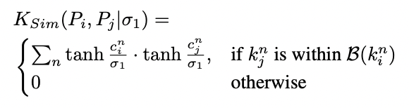
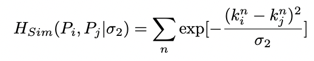
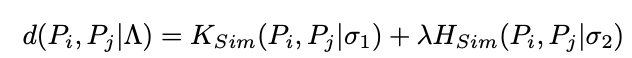
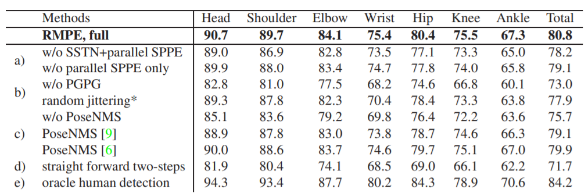
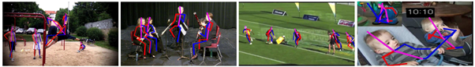

---
authors:
- jwher
description: Alphapose 논문 리뷰와 사용
slug: alphapose
tags:
- paper
- ml
title: Alphapose
---


  
*Regional Multi-Person pose Estimation*  
<!--truncate-->

## Computer Vision  

컴퓨터 비전은 기계의 시각적인 부분을 연구합니다. 범위를 좁혀 보면, 사람의 시각을 사용해야 하는 일을
컴퓨터가 수행할 수 있도록 만드는 것을 목표로 하고 있습니다.  

한국에서 인공지능이 대중적인 관심을 끌게 된 것은 단연 [Alpha GO](https://ko.wikipedia.org/wiki/알파고)
이후겠지만, 학자들이 다시 인공지능(신경망)에 관심을 갖게 된 것은 컴퓨터 비전의 [AlexNet](https://en.wikipedia.org/wiki/AlexNet)입니다.  

  
*AlexNet 신경망에 대해 공부할때 한번씩 봤을 이미지*  

컴퓨터 비전은 다시 하위에 많은 영역이 있습니다. 예를 들어 Alex Net은 Object Detection에 해당합니다.
여기에서 다루는 Alphapose는 Pose Estimation을 위한 Keypoint Detection에 해당합니다.
(Pose를 '자세'로 번역할 수 있겠지만, 용어의 혼동을 피해 '포즈'라고 부르겠습니다)

### 체험해보자
컴퓨터 비전을 처음 접하는 사람이라면 감이 잘 안잡힐 수 있습니다.  
구글 [Move Mirror] 링크를 통해 Pose Estimation이 뭔지 브라우저에서 체험해 볼 수 있습니다.
[Move Mirror]는 webcam으로 들어온 사진을 [Javascript library](https://github.com/tensorflow/tfjs)로 포즈를 인식하고,
가장 유사한 사진을 보여줍니다. 
   
<br/>

## Alphapose  
*왜 Alphapose인데?*


딥러닝 모델에서 *속도*와 *정확도*는 Trade Off 관계입니다. 모델이 커지고 레이어가 많아질수록 정확해지지만, 속도는 느려지죠. 하지만 대부분 출판되는 논문은 *정확도*에 초점을 두고 있습니다.
하지만, 현실에서 등장하는 vision 문제는, 동영상과 실시간 스트리밍을 처리해야 되고 *속도* 에 중점을 준 모델이 필요합니다.

[CVPR 2017] Carnegie Mellon University에서 [OpenPose](https://github.com/CMU-Perceptual-Computing-Lab/openpose)를 발표했습니다.
[Alphapose](https://github.com/MVIG-SJTU/AlphaPose)는 조금 뒤인 [ICCV 2017]에 나왔고, OpenPose보다 뛰어난 성능을 보여줍니다. Alphapose는 pytorch 기반으로 작성되었습니다.
마침 업무에서도 pytorch 기반 모델로 통일하기로 했고, 상업용 라이선스도 alphapose가 더 싸 선택하게 되었습니다.

둘 다 현재(2021) 기준으로 굉장히 오래되었으나, Alphapose는 [MPII](http://human-pose.mpi-inf.mpg.de/) 데이터 셋에서 아직도 1위를 기록하고 있습니다. [COCO](https://cocodataset.org/#home) 데이터 셋 에서도 pytorch 기반 모델 중에 2번째로 뛰어난 순위를 기록하고 있습니다.  
(사용해 보진 않았으나 2019년에는 MXNet 버전도 나왔습니다)  

<br/>

### 왜 빠른데?

Alphapose는 backbone으로 [YOLOv3]을 사용합니다(github master branch 기준).  

*0.5 IOU에서 속도/정확도 tradeoff*

논문에서는 ResNet backbone인 RetinaNet 보다 3배 빠른 *속도*를 보였다고 소개합니다.
*정확도*에서도 RetinaNet보다 오히려 조금 나음을 보여주고 있습니다.
현재(21.05) 최신 모델인 HRNet과 성능을 비교해 보지 못해 가장 좋은지는 모르겠습니다만, 상당히 빠르고 정확함을 알 수 있습니다.
(YOLO의 backbone인 Darknet은 다른 포스트에서 다루겠습니다)

<br/>

### Paper

[원문](https://openaccess.thecvf.com/content_iccv_2017/html/Fang_RMPE_Regional_Multi-Person_ICCV_2017_paper.html)

최신 Human detector의 등장으로 Regional Multi-Person pose Estimation의 성능은 향상되었으나, 
localization과 recognition의 작은 오류는 피할 수 없습니다.
Alphapose는 two-step 모델(bounding box->pose estimation)로써 bounding box의 정확도가 품질을 좌우합니다.
따라서 이 논문은 부정확한 bbx(bounding box)를 줄이기 위해 세 항목을 제안합니다.
* [SSTN](#sstn): Symmetric Spatial Transformer Network
* [NMS](#nms): Parametric Pose Non-Maximum Suppression
* [PGPG](#pgpg): Pose-Guided Proposals Generator

이 방법으로 부정확하고 중첩된 bbox를 줄여 MPII 데이터 셋에서 76.7 mAP 성능을 기록했습니다.

  
*RMPE 프레임워크*

<br/>

#### SSTN


STN(Spatial Transformer Network)이 좋은 사람 영역을 추출하도록, 학습 단계에서 Parallel SPPE(Single Person Pose Estimator)를 둡니다. 하지만 여기서 사용된 SPPE는 SDTN이 빠져있습니다.
학습할 때 parallel SPPE의 가중치(weight)를 고정하고 직접 참(truth) 포즈와 비교해 STN을 업데이트 합니다.
이때, 정확한 위치(center-located)에 있지 않으면 STN에 큰 오류가 전파되어 성능이 향상됩니다.

성능 향상치는 [ablation studies의 a](#ablation-studies)에서 비교하고 있습니다. 
   
<br/>

#### NMS

가장 정확한(confident) 포즈를 레퍼런스로 선택합니다.
그리고 너무 가까운 포즈는 elimination criterion(pose similarity)을 사용해 지웁니다.
이때 포즈 거리(pose distance)를 지표(metric)로 사용해 계산하게 됩니다.





포즈i와 포즈j간 distance function은, 포즈간 몇개의 관절(joint)이 일치하는지 의마하는 soft matching function **Ksim**과, 부분간의 공간거리인 **Hsim**의 합으로 이루어집니다.
여기서 λ는 두 거리간 weight balancing 입니다.

성능 향상치는 [ablation studies의 c](#ablation-studies)에서 비교하고 있습니다. 

<br/>

#### PGPG

two-stage 모델에서 데이터 augmentation은 SSTN+SSPE가 불완전한 사람의 의도에 적응하게 만들어야 합니다.
정답(ground truth) bbx와 감지된(detected) bbx의 offset은 포즈마다 다릅니다. 이 분포를 모델링 할 수 있으면 사람이 만든(generated by the human detector) 것과 비슷한 샘플을 많이 얻을 수 있습니다.

성능 향상치는 [ablation studies의 b](#ablation-studies)에서 비교합니다.

<br/>

#### Ablation Studies  
  
*w/o는 without(x)의 의미입니다*

<br/>

#### Failure cases
  
1.	SPPE는 희소하게 발생하는 특이한 자세에서 실패합니다
2.	너무 겹치는 사람을 구분하지 못합니다
3.	사람 인식(detect)을 실패하면 찾을 수 없습니다
4.	반대로 사람과 비슷한 사물을 오인식 할 수 있습니다

<br/>

리뷰를 하고 보니 안타깝게도 paper에는 속도 관련 이야기가 없었습니다.
정확도는 높아졌으나, SPPE를 부착했을 때 어느정도 속도가 나오는지 정량적으로 측정해 보고 싶습니다.
기회가 되면 속도를 측정해 비교해 보고 싶습니다. 

<br/>

## 사용하기

* cuda 11.0
* cudnn 8.0
* pytorch 1.7.0

도커 이미지로 빌드하여 docker hub에 등록하였습니다. 간단하게 pull 해서 사용할 수 있습니다.
```bash
$ docker pull jwher/alphapose:v1

$ conda activate alphapose
```

자세한 demo inference 코드는 나중에 작성하겠습니다...

<br/>

## Reference  
[Computer Vision Foundation](https://openaccess.thecvf.com/menu)  
[Paper with codes](https://paperswithcode.com/area/computer-vision)  
[[위키]컴퓨터_비전](https://ko.wikipedia.org/wiki/컴퓨터_비전)

[Move Mirror]: https://experiments.withgoogle.com/collection/ai/move-mirror/view
[CVPR 2017]: https://openaccess.thecvf.com/CVPR2017
[ICCV 2017]: https://openaccess.thecvf.com/ICCV2017
[YOLOv3]: https://pjreddie.com/media/files/papers/YOLOv3.pdf


<!-- update log -->
<!--
본문에 추가할 내용을 적는다.
https://younghk.github.io/machine-learning/2020-01-10---rmpe-retional-multi-person-pose-estimation/
https://www.fritz.ai/pose-estimation/
https://jonathan-hui.medium.com/object-detection-speed-and-accuracy-comparison-faster-r-cnn-r-fcn-ssd-and-yolo-5425656ae359
-->
