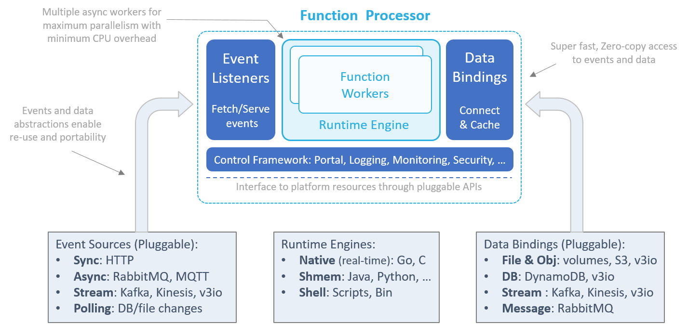
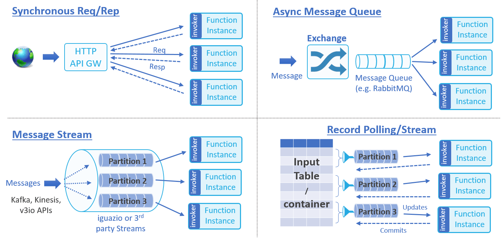
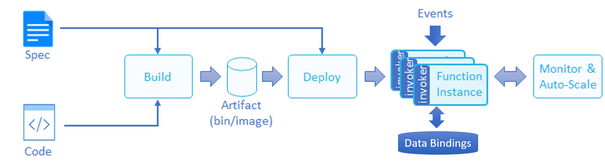

---
authors:
- jwher
description: Automate the Data Science Pipeline with Serverless Functions
slug: nuclio
tags:
- tech
- kubernetes
- docker
title: Nuclio 개념과 아키텍처
---


  
*Automate the Data Science Pipeline with Serverless Functions*  

<!--truncate-->

disclaimer: 필자도 배우는 중입니다. 정확히 이해가 가지 않은 개념은 *기울게?* 표시했습니다. 많은 의견 부탁드립니다! ~~죄송합니다!~~


# 목차
* [nuclio의 필요성](#nuclio의-필요성)
* [nuclio architecture](#nuclio-architecture)

<br/>

## nuclio의 필요성  
*server역할을 하는데 serverless라고??*

딥러닝 모델 알고리즘(function)이 외부와 통신하려면 어떤 방법을 사용해야 할까요?
당연히 서버와 인터페이스(ex REST API) 프로그램을 추가로 개발해야 합니다.:sob:

>   
> 나는 딥러닝밖에 모르는데...

이런 딥러닝 모델 개발자, 데이터 과학자를 위해 **서버 없이** 인터페이스를 만들어 주려는 시도는 많았습니다.
nuclio 또한 고가용성 **serverless** 프레임워크로서 특히 data, I/O, 연산 집중적(compute intensive) 작업에 초점을 두고 있습니다.
nuclio는 딥러닝 모델의 **serverless function**의 서빙과 인터페이스를 제공합니다.

nuclio는 서버를 운영하는데 필요한 load balancing과 scaling을 아주 잘(10-100 times faster) 지원합니다.
하지만 다른 serverless 프로젝트는 아래 요구사항을 잘 해결하지 못했습니다.
* 최소한의 CPU/GPU와 I/O 오버헤드, 병렬화의 최대로 Real-time 처리
* 다양한 data source, trigger, processing models, ML framework와 저수준 통합(Native integration)
* data-path 가속을 통한 상태 함수(stateful function) *(stateless REST와 반대 개념?)*
* 저수준 장치, 랩탑, edge *(edge computing?)*, op-premise, public cloud와 이식성
* **오픈소스** 근데 이제 기업용을 곁들인(로깅, 모니터링, 보안, 사용성)  

nuclio는 이 요구사항을 모두 충족합니다.:smile:  
<br/>  

> When this happens, do that

<br/>

### 사례와 일반적인 실수

nuclio function이 배포되면 worker 마다 런타임(python interpreter, JVM, goroutine...)이 생성되고 실행 컨텍스트에 따라 서빙됩니다.
앞서 살펴봤듯이 nuclio 런타임에는 다중 스레딩 컨셉이 적용되어 있습니다.
* 필요없는 lock을 방지하기 위해 worker(threads *?*)간 데이터 공유를 하지 않습니다
* Thread-local storage(TLS)를 사용해 **전역변수**를 사용하지 않고 상태(state)를 관리합니다

그렇다면 function lifetime 동안 데이터베이스와 연결을 유지하는 상황을 생각해봅시다.
요청마다 데이터베이스 연결을 생성하는 것은 비효율적입니다.
따라서 다음과 같이 데이터베이스 연결을 **전역변수**로 만드는 방법을 생각해 볼 수 있습니다.  

```python
my_db_connection = my_db.create_connection()

def handler(context, event):
    my_db_connection.query(...)
```

하지만 이 방법은 두가지 큰 문제가 있습니다.  
1. 전역변수는 worker 사이에서 공유될 수 있습니다(Go에서는 언제나 공유됩니다).
이는 데이터베이스에 접근할 때 Race condition을 발생시킬 수 있습니다.  
2. 데이터베이스 연결에 실패하면 function이 왜 import 되지 않았는지 이해하기 어렵습니다
(scratching your head trying to understand).

nuclio에서 올바른 해결책은 ```init_context``` 사용입니다. 💡  
```python
def handler(context, event):
    context.user_data.my_db_connection.query(...)


def init_context(context):

    # Create the DB connection under "context.user_data"
    setattr(context.user_data, 'my_db_connection', my_db.create_connection())
```

<br/>

## nuclio architecture



nuclio 구조는 function의 성능 최대화, 추상화, 플랫폼간 이식성을 목표하고 있습니다.  

### Event-source listeners

function은 이벤트 기반으로 실행되고, function runtime engine으로 푸쉬합니다.
event-source listener는 소켓, 메시지 큐, 외부 이벤트 가져오기(polling)를 할 수 있습니다.
event listner는 정확히 한번 또는 최소한 한번 실행을 보장하고 오류를 처리합니다.  

  

event source는 동작이나 흐름 관리로 분류할 수 있습니다(divided into classes). nuclio는 다음 event를 지원합니다.
1. Synchronous Request/Response: HTTP요청이나 Remote Procedure Calls 같이 client가 즉시 응답을 원함
2. Asynchronous Message-Queue Request: RabbitMQ, MQTT, emails, scheduled event 같이 메시지가 subscriber에게 분배되고 교횐됨
3. Message or Record Streams: Kafka, AWS Kinesis, lguazio V3IO 같이 정렫된 메시지나 기록의 순차적 업데이트
4. Record or Data Polling(ETL): 주기적이거나 트리거된 외부에서 필터된 기록, 데이터 오브젝트

[궁금점-graceful shutdown](#궁금점)

### Runtime engine

runtime engine은 function 환경(변수, 컨텍스트, 로그, 데이터 바인딩 ...)을 초기화하고 worker에 이벤트를 공급(feed), 결과 반환을 합니다.
runtime은 non-blocking 연산과 CPU 최적화를 위해 독립적인 병렬(parallel) worker로 이루어집니다(goroutine, python asyncio, akka *?*, thread)

nuclio는 현재 세가지 processor runtime 구현이 있습니다.
1. Native: real-time, inline Go 또는 C 루틴
2. SHMEM: 공유메모리를 이용하는 Python, Java, Node.js언어
   processor는 SHMEM function 런타임을 이용해 zero-copy 공유 메모리 채널로 통신합니다.  
3. Shell: CLI 실행환경이나 바이너리(excutables). stdout과 stderr를 맵핑해서 function 결과를 만듭니다.

[궁금점-worker](#궁금점)

### Data bindings

*가장 멋진 부분이라 생각합니다*

function은 외부 파일, 오브젝트, database, messaging system과 지속적인 연결로 이점(benefit)을 얻습니다.
Data binding은 SDK나 연결, 자격 관리의 통합을 없에 개발을 단순화 합니다.
또한, 같은 종류(class)의 다른 데이터 서비스를 맵핑해 재사용성과 이식성을 가능하게 합니다.

data binding은 prefetching, 캐싱, micro-batching을 처리해 대기시간을 줄이고 I/O 성능을 향상시킵니다.
data binding은 특별한 function 코드 없이 zero-copy, zero-serialization, and non-blocking operation, real-time 처리를 위해 설계되었습니다.

### Control Framework

control framework는 초기화, 다른 프로세서 컴포넌트 컨트롤, 프로세서와 function의 logging 제공, 실행 통계 모니터링,
작은 원격 관리 포털 서빙을 합니다.
control framework는 추상화 인터페이스를 제공해 IoT 장치, 컨테이너, 오케스트레이터, cloud간에 이식성을 제공합니다(allowing).  


<br/>

## 궁금점

* graceful shutdown  
종료시, 이벤트 큐 처리, worker에 있는 작업 처리가 되는지?
⇒ 모델 교체나 버전 업그레이드로 종료하면, 기존 작업 요청에 어떻게 반응할까요?
단순 연결 종료, 요청받은 이벤트까지만 처리, 리디렉션 등 다양한 정책이 있을텐데 누클리오는 어떨까요
  
* worker  
worker로 docker container 또는 kubernetes pod를 사용하는 것으로 보이는데(공부가 부족해서일지도)
이것을 scale out(즉, 컨테이너 증가)로 병렬화를 하는 것인지, 아니면 컨테이너 OS 프로세스를 증가시키는건지,
OS thread를 사용하는지, PL이 제공하는 경량 thread(goroutine, erlang)를 증가시키는 것인지?
⇒ Runtime engine에서 힌트를 얻을 수 있습니다만, 언어에 따라 scale up 방식이 다른 걸까요?

## Reference  
[Comparing Nuclio and AWS Lambda](https://theburningmonk.com/2019/04/comparing-nuclio-and-aws-lambda/)  
[Nuclio Documentation](https://nuclio.io/docs/latest/)

<!-- update log -->
<!--
본문에 추가할 내용을 적는다.
-->
