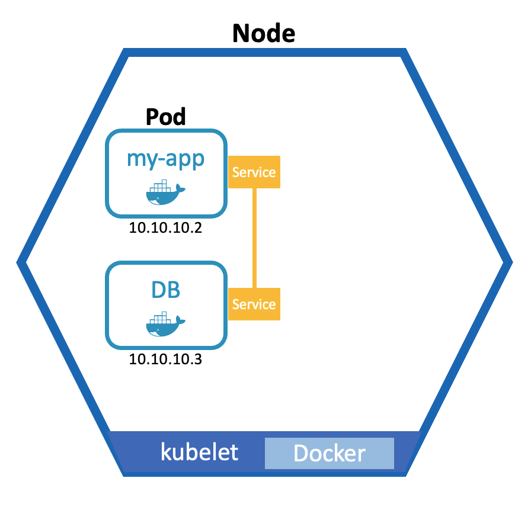

---
authors:
- jwher
description: Kubernetes Architecture
slug: kubernetes-architecture
tags:
- tech
- kubernetes
- linux
title: 쿠버네티스 아키텍처
---


*쿠버네티스 아키텍처*  
*이 글은 쿠버네티스의 창시자 중 한명인 브렌던 번스의 매니징 쿠버네티스를 참고해 작성했습니다.*
<!--truncate-->

# 기본 개념
이 단락에서는 쿠버네티스의 기본 구성 요소인 노드(node), 파드(pod), 서비스(Service), 퍼시스턴트 볼륨(Persistent Volume), 컨피그맵(ConfigMap), 시크릿(Secret)을 설명합니다.


## 노드
*Node*  
Docker 데몬이 동작하는 호스트로 가상(virtual) 또는 물리(physical) 머신을 말합니다.
쿠버네티스는 하나 이상의 마스터와 워커(슬레이브, 미니언) 노드로 구성됩니다.
이중 클러스터 제어용 프로그램이 동작(API)하는 노드가 마스터 노드입니다.

노드 taint를 제거해 마스터/워커(미니언)을 겸용 가능하나 일반적으로 그렇게 사용하지 않습니다.


## 파드
*pod는 고래 떼를 말합니다*  
파드는 쿠버네티스의 가장 작은 단위이자 컨테이너의 추성으로 **하나** 또는 긴밀하게 연계되는 **컨테이너 세트**를 생성할 수 있습니다.
파드는 각각 하나의 사설 ip를 할당받고, 같은 파드 안의 컨테이너는 루프백 네트워크(localhost)로 통신할 수 있습니다.
또한 프로세스, IPC와 네임스페이스를 공유하고 있어 공유 메모리나 시그널링 툴을 사용해
파드의 여러 프로세스를 제어할 수 있습니다.
<!-- (docker-compose와 유사하다고 생각됩니다) -->

파드는 하나의 컨테이너일 수도, 한 시스템일 수도 있어 헷갈릴 수 있습니다
(일반적으로 하나의 애플리케이션만 사용합니다).
쿠버네티스에서 파드는 스케일링과 복제의 단위입니다.
파드는 디플로이먼트에 기술해 상태와 레플리카를 관리할 수 있습니다.

주의해야할 점은, 파드는 단명(ephemeral) 하는 특징을 지녔다는 것입니다.
이는 노드에 문제가 생기거나, 자원이 모자라면 쿠버네티스가 파드를 다른 곳에 할당할 수 있다는 뜻입니다.
이때 사용하던 데이터와 할당된 사설 IP가 바뀌고 파드간 통신에 문제가 생길 수 있습니다.
다음 단락에서 이 문제를 어떻게 해결하는지 확인해 봅시다.


## 서비스
*Service*  
서비스는 각 파드에 고정 IP 주소를 붙일 수 있는 요소입니다.
파드와 서비스의 생명주기는 연결되지 않기때문에, 파드의 변경에도 서비스는 고정된 주소를 제공합니다.
정확히는 [*레플리카셋*](#레플리카셋)으로 생성된 로드밸런서의 엔드포인트를 제공합니다.

또한, 서비스는 TCP/UDP에 없는 다음 세가지를 제공합니다.

### 자체 IP 주소
  
가상 IP 주소로 네트워크 인터페이스와 일치하지는 않습니다.
대신 로드 밸런싱될 IP 주소로 네트워크 패브릭에 프로그래밍 됩니다.
네트워크 패브릭은 레플리카셋에 따라 동적으로 재프로그래밍 됩니다.
즉, Service IP 주소 연결은 신뢰할 수 있습니다.

### 쿠버네티스 클러스터 DNS
  
클러스터의 다른 컨테이너가 `name.namespace.svc`로 DNS를 이용할 수 있습니다.

### 로드 밸런싱 규칙

규칙을 정하지 않으면 라운드 로빈이나 대상 IP 주소 튜플에 기반해 결정합니다.

<!--
https://gruuuuu.github.io/network/lb01/
-->


*쿠버네티스 구성 요소 묘사*  


## 스토리지
초기 볼륨 인터페이스는 코드를 작성해 확장이 가능했습니다.
이제는 쿠버네티스 외부에서 개발해 컨테이너 스토리지 인터페이스(CSI)를 사용합니다.
이는 이식성과 자동 볼륨 생성을 모두 가능하게 합니다.

### 퍼시스턴트 볼륨
*persistent volume*  
구체적인 제공자를 지정하지 않고 일반적인 스토리지를 요청하는 경우,
파드 정의가 필요합니다. 이를 위해 pv와 pvc(persistent volume claim)을 제공합니다.

스토리지는 같은 환경(local) 뿐만 아니라, 클러스터 밖의 외부 스토리지도 사용할 수 있습니다.
주의할점은, 쿠버네티스는 이들을 관리하지 않는다는 것입니다. 

### [컨피그맵](/posts/k8s-tip-configmap)
*ConfigMap*  
컨피그맵은 외부 설정(External Configuration)의 모음을 나타냅니다.
파드에 컨피그맵 기반 볼륨을 추가하면 실행중인 컨테이너의 지정된 디렉터리에 나타납니다.

### 시크릿
*Secret*  
시크릿은 볼륨 컨텍스트 안에서 컨피그맵과 동일합니다.
데이터베이스 암호 및 인증서와 같은 보안 데이터를 저장합니다.

<hr/>
<br/>
<br/>
<br/>

# 고급 개념
이 단락에서는 인그레스(Ingress), 레플리카셋(Replicaset), 디플로이먼트(Deployment), 스테이트풀셋(StatefulSet)을 설명합니다.

## 인그레스
*Ingress*  
서비스로 간단한 TCP 수준의 로드 밸런싱과 노드 포트를 지정해 애플리케이션을 노출시킬 수 있습니다.
이는 내부 서비스에서 확인하기 유용할 수 있지만,
각 노드의 IP 주소와 포트를 사용하는것은 외부 서비스에 부적합합니다.

대부분 애플리케이션은 HTTP 웹 기반이기 때문에 HTTP 로드 밸런서가 필요합니다.
인그레스는 가상 IP 주소를 받아 HTTP 요청 내용을 확인해 서비스로 라우팅 해주는 역할을 합니다.

<details>
<summary>example-ingress.yaml</summary>

```yaml
apiVersion: extensions/v1beta1
kind: Ingress
metadata:
  annotations:
    ingress.kubernetes.io/proxy-body-size: "0"
    ingress.kubernetes.io/ssl-redirect: "true"
    meta.helm.sh/release-name: harbor
    meta.helm.sh/release-namespace: harbor
    nginx.ingress.kubernetes.io/proxy-body-size: "0"
    nginx.ingress.kubernetes.io/ssl-redirect: "true"
  generation: 1
  labels:
    app: harbor
    app.kubernetes.io/managed-by: Helm
    chart: harbor
    heritage: Helm
    release: harbor
  name: harbor-ingress
  namespace: harbor
  resourceVersion: "9589535"
  selfLink: /apis/extensions/v1beta1/namespaces/harbor/ingresses/harbor-ingress
  uid: 02d7bb0c-12e0-44fc-9a38-1ec2f921b675
spec:
  rules:
  - host: core.harbor.192.168.1.161.nip.io
    http:
      paths:
      - backend:
          serviceName: harbor-portal
          servicePort: 80
        path: /
      - backend:
          serviceName: harbor-core
          servicePort: 80
        path: /api/
      - backend:
          serviceName: harbor-core
          servicePort: 80
        path: /service/
      - backend:
          serviceName: harbor-core
          servicePort: 80
        path: /v2
      - backend:
          serviceName: harbor-core
          servicePort: 80
        path: /chartrepo/
      - backend:
          serviceName: harbor-core
          servicePort: 80
        path: /c/
status:
  loadBalancer:
    ingress:
    - ip: 192.168.1.161
```

</details>


## 레플리카셋
수평적 확장(스케일 아웃)을 제공합니다.
과거 버전은 `Replication Controller`를 사용하였고 하위 호환성을 위해 존재하나,
현재는 `Replica Set`을 사용합니다.
레플리카는 다른 레플리카와 구별되는 고유한 ID가 없습니다.
레플리카셋은 복제된 애플리케이션을 구분하는 방법을 제공합니다.


## 디플로이먼트
*Deployment*  
파드와 같은 구성요소 배포 내용에 대한 청사진을 제공합니다.
디플로이먼트를 통해 사용불가능한 파드는 다른 노드에 스케줄링 될 수 있습니다.
또한 여러 노드에 레플리카를 생성해 스케일 다운과 업을 할 수 있습니다.

레플리카셋 버전의 안전한 롤아웃을 지원하기 위해 추가되었습니다.

<details>
<summary>example-deployment.yaml</summary>

```yaml
apiVersion: apps/v1
kind: Deployment
metadata:
  annotations:
  labels:
    app: myapp
  name: myapp
  namespace: mynamespace
spec:
  replicas: 1
  selector:
    matchLabels:
      app: myapp
  template:
    metadata:
      labels:
        app: myapp
    spec:
      containers:
        image: jwher/myapp
        imagePullPolicy: IfNotPresent
        name: server
        ports:
        - containerPort: 5000
          protocol: TCP
```
</details>


## 스테이트풀셋
*Stateful Set*  
하지만, 데이터베이스와 같이 저장된 데이터 **상태**가 필요한 파드가 있습니다.
이때 데이터 부정합을 방지하기 위해 스토리지에 어떤 파드가 쓰기가 가능한지 결정해줘야 합니다.

레플리카셋으로 표현할 수 있지만, 최종 사용자에게 복잡하고, 오류가 나기 쉬우며, 반복적입니다.
스테이트풀 셋은 컨테이너를 만들고 삭제하는 방식이 더 확실합니다.

<!--

```yaml
apiVersion: apps/v1
kind: StatefulSet
metadata:
  generation: 1
  labels:
    app: metacontroller
    kustomize.component: metacontroller
  name: metacontroller
  namespace: kubeflow
  resourceVersion: "207220"
  selfLink: /apis/apps/v1/namespaces/kubeflow/statefulsets/metacontroller
  uid: 103f0abb-1247-4476-a0ee-9abdcb179482
spec:
  podManagementPolicy: OrderedReady
  replicas: 1
  revisionHistoryLimit: 10
  selector:
    matchLabels:
      app: metacontroller
      kustomize.component: metacontroller
  serviceName: ""
  template:
    metadata:
      annotations:
        sidecar.istio.io/inject: "false"
      creationTimestamp: null
      labels:
        app: metacontroller
        kustomize.component: metacontroller
    spec:
      containers:
      - command:
        - /usr/bin/metacontroller
        - --logtostderr
        - -v=4
        - --discovery-interval=20s
        image: metacontroller/metacontroller:v0.3.0
        imagePullPolicy: Always
        name: metacontroller
        ports:
        - containerPort: 2345
          protocol: TCP
        resources:
          limits:
            cpu: "4"
            memory: 4Gi
          requests:
            cpu: 500m
            memory: 1Gi
        securityContext:
          allowPrivilegeEscalation: true
          privileged: true
        terminationMessagePath: /dev/termination-log
        terminationMessagePolicy: File
      dnsPolicy: ClusterFirst
      restartPolicy: Always
      schedulerName: default-scheduler
      securityContext: {}
      serviceAccount: meta-controller-service
      serviceAccountName: meta-controller-service
      terminationGracePeriodSeconds: 30
  updateStrategy:
    rollingUpdate:
      partition: 0
    type: RollingUpdate
status:
  collisionCount: 0
  currentReplicas: 1
  currentRevision: metacontroller-6559b8f5c7
  observedGeneration: 1
  readyReplicas: 1
  replicas: 1
  updateRevision: metacontroller-6559b8f5c7
  updatedReplicas: 1
```

TODO 잡 크론잡 데몬셋
-->

<hr/>
<br/>
<br/>
<br/>

# 관리 개념
*컴포넌트를 위한 컴포넌트*  
이 단락에서는 네임스페이스(namespace), 레이블(label), 어노테이션(annotation)을 설명합니다.

## 네임스페이스
*Namespace*  
쿠버네티스 API 오브젝트를 구분하기 위한 개념입니다.
RBAC 규칙 범위를 제공합니다.
삭제시 하위 오브젝트가 준부 삭제됩니다.
네임스페이스를 지정하지 않은 오브젝트는 `default` 네임스페이스가 사용됩니다.

## 레이블
*Label*  
쿠버네티스의 모든 오브젝트는 연관된 임의의 레이블 집합을 가질 수 있습니다.
API 서버에 **레이블 쿼리**, **레이블 설렉터**를 보내 조회할 수 있습니다.
많은 오브젝트는 레이블 설렉터를 사용해 다른 오브젝트 집합을 식별합니다.
예를들어 파드의 [노드 셀렉터](https://jwher.github.io/k8s-tip-nodeselector) ,
서비스의 파드 설렉터가 있습니다.

<!-- (노드 셀렉터, 노드 어피니티, 테인트/톨러레이션) -->
<!--라벨 설렉터, 동적 그룹을 제공합니다.-->

## 어노테이션
*Annotation*  
API 오브젝트가 전부 정보 식별용은 아닙니다.
일부는 단순 **주석**(어노테이션)입니다.

<hr/>
<br/>
<br/>
<br/>

# 아키텍처 구성요소

* Docker
* kubelet
* etcd
* kube-proxy
* kube-apiserver
* kube-controller-manager
* kube-scheduler
* kube-proxy

## etcd
키/값 저장소로 쿠버네티스 클러스터의 핵심입니다.
etcd 서버는 분산된 합의 알고리즘인 래프트를 구현해, 장애 극복과 데이터 복구가 가능합니다.
(낙관적 동시성, 비교 후 교환(CAS, compare and swap), 워치 프로토콜)

네임스페이스의 모든 오브젝트는 etcd 디렉터리에 저장됩니다.
워치 프로토콜을 사용해 전체 키/값 저장소의 변경사항을 효율적으로 감시합니다.
클라이언트가 지속적으로 폴링하지 않아도 됩니다.

## api 서버

중요!

## 스케줄러

파드가 실행될 위치를 찾아줍니다.  

```javascript
schedule(pod): string
    nodes := getAllHealthyNodes()
    viableNodes := []
    for node in nodes:
        for predicate in predicates:
            if predicate(node, pod):
                viableNodes.append(node)

    scoredNodes := PriorityQueue<score, Node[]>
    priorities := GetPriorityFunctions()
    for node in viableNodes:
        score = CalculateCombinedPriority(node, pod, priorities)
        scoredNodes[score].push(node)

    bestScore := scoredNodes.top().score
    selectedNodes.append(scoredNodes.pop())

    node := selectAtRandom(selectedNodes)
    return node.Name
```
*현재는 로직이 바뀌었습니다.*

## 컨트롤러 관리자

스케줄러 명령을 실제 실행하는 조정 제어 루프를 관리합니다.

## 쿠블렛

쿠버네티스 클러스터에 포함되는 모든 시스템의 노드 데몬입니다.
사용가능한 cpu, 디스크, 노드를 쿠버네티스 클러스터에 연결하는 다리입니다.
이런 상태를 API 서버에 전달해 다른 조정 제어 루프가 컨테이너 상태를 볼 수 있습니다.

또한, 실행될 것으로 예상되는 컨테이너의 상태를 확인하고 다시 시작합니다.
하지만 모든 상태 정보를 API 서버에 전달하는 것은 비효율적이기 때문에
조정 루프를 재실행하고, 상태와 재시작 정보만 API 서버에 전달합니다.

## kube-proxy

서비스의 로드 밸런서 네트워킹 모델을 담담합니다.

<!-- 스케줄된 구성요소 kube-dns 힙스터 -->

<hr/>
<br/>
<br/>
<br/>
   
# 노드간 통신

서비스 디스커버리(flannel)

<br/>

# 기능 범위

공식문서에서 쿠버네티스가 제공하는것/쿠버네티스가 아닌 것을 다음과 같이 설명하고 있습니다.  

제공하는것
* 서비스 디스커버리와 로드 밸런싱
* 스토리지 오케스트레이션
* 자동화된 롤아웃과 롤백
* 자동화된 빈 패킹
* 자동화된 복구
* 시크릿과 구성 관리

쿠버네티스가 아닌 것
* 애플리케이션 유형 제약
* 소스 코드 빌드/배포
* 애플리케이션 레벨의 서비스
* 로깅/모니터링(일부 메트릭 수집 제공)
* 기본 설정 언어(PL) 제약  
  ⇒선언적 API를 사용합니다
  
세부적인 내용을 살펴보면 다음과 같습니다.

| 기능                           | 제공여부 | 비고                           |
|--------------------------------|---|--------------------------------|
| 컨테이너가 정지시 재실행 | ○ |                                |
| 노드 정지시 재실행 | × |                                |
| 노드 정지시, 다른 노드에서 부족한 만큼 컨테이너 실행 | × | 쿠버네티스만으로 불가능합니다 |
| 노드 부하에 따라 컨테이너수 증가 | × |                                |
| 노드 부하에 따라 노드수(?!) 증가 | × |                                |
| 관리자가 지정한 수의 컨테이너 실행 | ○ |                                |
| 영구 스토리지를 제공 | △ | NFS, EBS, GCP 등을 추상화해 제공합니다 |
| 오브젝트 스토리지를 제공 | × | S3, Cloud Storage 사용합니다 |
| 노드간 도커 네트워크 접속 | × | flannel, calico 등을 사용합니다 |
| 엔드포인트에서 컨테이너로 부하분산 | ○ |                                |
| 각 노드로 트래픽 분산 | × |                                |

<hr/>
<br/>

## Tips

상당히 많은 글과 운영 검혐으로 작성했습니다.

## References  

[[공식]What is kubernetes](https://kubernetes.io/ko/docs/concepts/overview/what-is-kubernetes/)  
[[공식]Kubernetes Components](https://kubernetes.io/docs/concepts/overview/components/)


<!-- update log -->
<!--
본문에 추가할 내용을 적는다.
-->