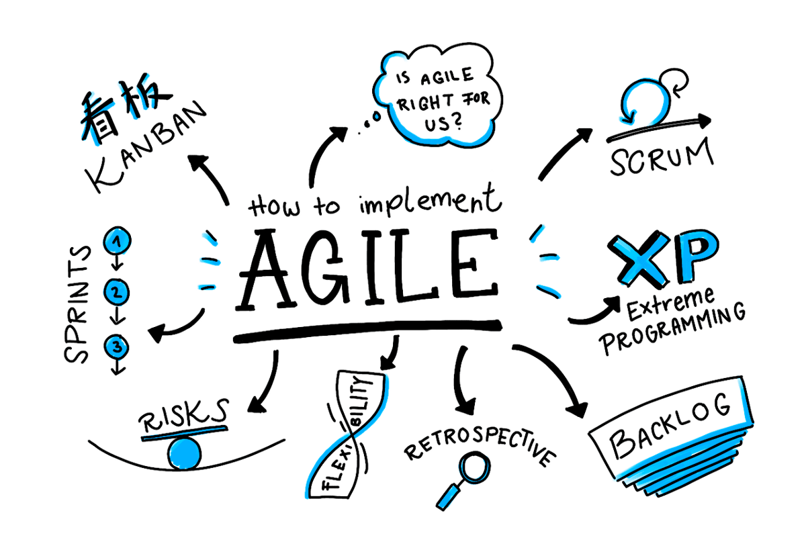
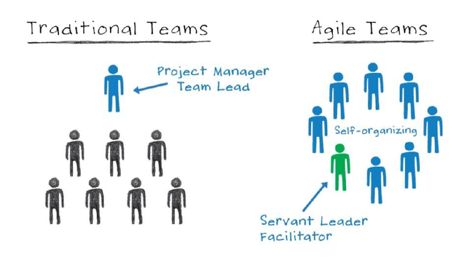

---
authors:
- jwher
description: 애자일
slug: agile
tags:
- tech
title: Agile
---


*애자일이란 무엇인가?*
<!--truncate-->

## 애자일이란?

소프트웨어 공학 수업에서도, 회사에서도 애자일은 참 핫합니다.
무려 20년이 넘게.. 요

애자일이 등장한 배경은 **소프트웨어 위기**와 관련이 깊습니다.
대표적인 예로
* 프로젝트 일정이 지연되었다.
* 소프트웨어 품질이 낮았다.
* 소프트웨어가 요구 사항을 만족시키지 못하는 일이 빈번히 일어났다.
* 프로젝트는 관리 불가능했고 코드 관리는 힘들었다.

이런 문제 속에서 애자일은 **제한된 시간과 비용 안에서 정보는 불완전하고 예측은 불가능하다**는 전제를 가지고 등장합니다.

~~쉽게 말해서 고객이 뭘 원하는지 고객도 모릅니다!~~

하지만 애자일이 무엇인지 아직도 실체가 명확하지 않습니다.
함꼐 애자일 선언(menifesto)를 볼까요?

* 공정과 도구보다 개인과 상호작용을
* 포괄적인 문서보다 작동하는 소프트웨어를
* 계약 협상보다 고객과의 협력을
* 계획을 따르기보다 변화에 대응하기를

흠, 아직도 모호하네요:(
실제 사례를 살펴봅시다.

<details>
<summary>TL;DR</summary>

```
Manifesto for Agile Software Development


We are uncovering better ways of developing
software by doing it and helping others do it.
Through this work we have come to value:

Individuals and interactions over processes and tools
Working software over comprehensive documentation
Customer collaboration over contract negotiation
Responding to change over following a plan

That is, while there is value in the items on
the right, we value the items on the left more.

Kent Beck
Mike Beedle
Arie van Bennekum
Alistair Cockburn
Ward Cunningham
Martin Fowler
James Grenning
Jim Highsmith
Andrew Hunt
Ron Jeffries
Jon Kern
Brian Marick
Robert C. Martin
Steve Mellor
Ken Schwaber
Jeff Sutherland
Dave Thomas

© 2001, the above authors
this declaration may be freely copied in any form,
but only in its entirety through this notice.
```
[Agile menifesto](https://agilemanifesto.org/)

</details>

## 방법론으로써 애자일

애자일의 실현은 팀과 조직에 따라 다른데요, 대표적으로 다음 방식으로 이루어 집니다.

* 익스트림 프로그래밍(Extreme Programming, XP)

고객과 함께 2주 정도의 반복개발을 하고, 테스트우선 개발(TDD)을 특징으로 합니다.
XP는 위와 같이 명시적인 기술과 방법이 있는데요, 그 때문인지 애자일 개발 프로세스의 대표적인 예입니다.

* 스크럼

30일마다 동작 가능한 제품을 제공하는 스프린트(Sprint)를 중심으로 하고 있습니다.
동작 가능한 제품을 만들기 위해 많은 회의가 필요해 매일 정해진 시간에 정해진 장소에서 개발을 하는 팀에게 적합합니다.

* Feature-Driven Development

feature마다 2주정도의 반복 개발을 수행합니다.
Peter Coad가 제창하는 방법론으로써, UML을 이용한 설계 기법과 밀접한 관련을 가집니다.

* 익스트림 모델링

익스트림 모델링은 UML을 이용한 모델링 중심 방법론입니다.
다만, 여타 모델링 방법들과는 달리, 언제나 실행할 수 있고 검증할 수 있는 모델을 작성하는 공정을 반복해서 최종적으로는 모델로부터 자동적으로 제품을 생성합니다.

간단하게 칸반과 번인차트를 통한 개발도 애자일 기법이라 볼 수 있습니다.

~~사실 이 외에도 많은 방법이 있지만, 직접 경험? 해본 방법만 기록했습니다.~~

## 문화로써 애자일

애자일은 다양한 덕목을 담고 있습니다.
대표적으로 XP는 다음 가치를 따릅니다.
* Communication
* Simplicity
* Feedback
* Courage
* Respect

이런 문화를 가진 개발 그룹을 애자일 방법론을 사용한다고 할 수 있습니다.

## 마케팅으로써 애자일

많은 한국 기업은 애자일 방법 도입을 실패했다고 봅니다.
하지만 제품과 고객 중심이라는 애자일 덕목은 마케팅에서 살아남아 유지되고 있습니다.

## 한국에선 왜 실패했을까?



사실 본 글을 쓰게 된 이유는 이 단락 때문인데요,  
애자일 방법론이 한국에서 실패한 대표적인 이유입니다.
* 계획 세우기에 과도한 시간을 투입하지 않는다 → 팀내에서 같은 비전을 공유하는가?
* 지방분권식(distributed) → 무책임
* 모든 정보를 구성원 모두와 공유한다 → 수직적인 대규모 조직
* 개개인이 아닌 팀으로 움직인다 → 다른 환경에서 팀으로 모여 생긴 신뢰 부족
* 디테일한 모습에 대한 정의는 없다 → 개인의 역량에 의존

너무 부정적이였나요?
하지만 2022년 현재 한국도 다양한 팀단위 IT 회사, 개발그룹이 생겨나며
애자일 방법론으로 가는 과도기에 있다고 생각합니다:)

### Reference

[[위키]애자일 소프트웨어 개발](https://ko.wikipedia.org/wiki/애자일_소프트웨어_개발)  
[[위키]소프트웨어 위기](https://ko.wikipedia.org/wiki/소프트웨어_위기)
