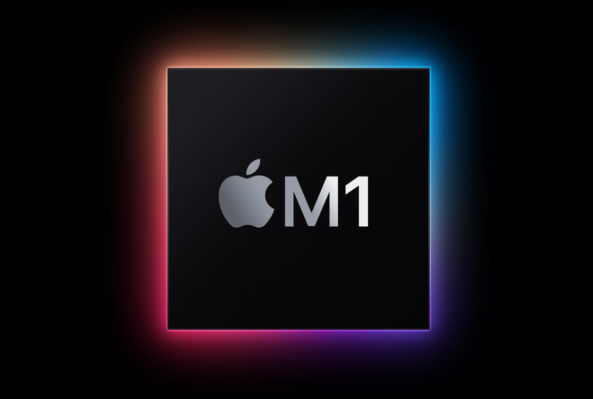
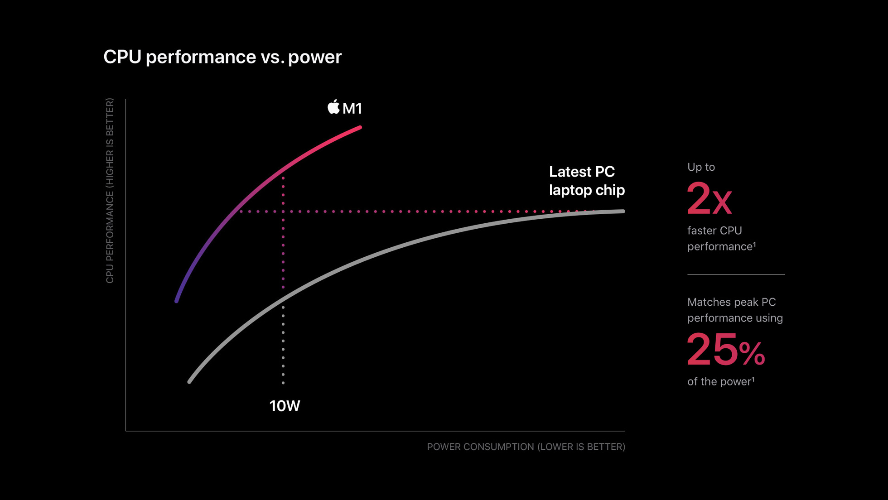

---
authors:
- jwher
description: M1 Mac에서 PyTorch GPU 가속 사용하기 - Metal Performance Shaders로 최대 500% 성능 향상
slug: pytorch-in-m1
tags:
- pytorch
- m1
- apple-silicon
- machine-learning
- gpu
title: M1 Mac에서 PyTorch GPU 가속 활용하기
---


*Apple Silicon에서 PyTorch GPU 가속 사용하기*

<!--truncate-->

## TL;DR

M1/M2/M3 Mac에서 PyTorch GPU 가속을 사용하려면:
1. macOS 12.3 이상 필요
2. PyTorch 1.12+ 설치
3. `device = torch.device("mps")` 사용
4. CPU 대비 2~5배 성능 향상 기대

설치와 사용방법만 보시려면 [설치하기](#설치해보기) 섹션으로 바로 이동하세요!

## Pytorch

> 이 글을 읽는 분이라면, pytorch가 뭔지 모르시는 분은 없을 것이라 생각합니다만 🤣

파이토치는 오픈소스 머신 러닝 프레임워크로
제품 개발 연구를 빠르게 하기 위한 방법입니다.

머신 러닝 특성상 많은 행렬 연산을 하게 됩니다.
python에서는 Numpy가 대표적인 행렬 계산 라이브러리죠.
pytorch에서는 Numpy의 [ndarrays](https://numpy.org/doc/stable/reference/generated/numpy.ndarray.html)와 비슷하며 GPU 가속을 사용할 수 있는 [tensor](https://pytorch.org/docs/stable/tensors.html)를 제공합니다.

## GPU 가속

그렇다면 왜 GPU 가속을 해야할까요?  

하드웨어 가속(Hardware Accelation)이란 특정한 소프트웨어 작업을 general-purpose CPU 보다 빠르게 작업하기 위해 만들어 졌습니다.

GPU가 그렇죠, 근데 GPU에서 그래픽 작업만 하드웨어 가속을 할 수 있는 게 아닙니다.
역으로 General-purpose on GPU, [GPGPU](https://en.wikipedia.org/wiki/General-purpose_computing_on_graphics_processing_units) 기술이 있습니다.

대표적인 GPU hardware 제조사 nvidia는 Compute Unified Device Architecture, [CUDA](https://developer.nvidia.com/cuda-toolkit)를 지원합니다.
이 가속은 AI와 딥러닝을 빠르게 해 주었습니다. GPU 가격을 폭등시킬 정도로요!

## M1

그렇다면 맥북은 Nvidia GPU를 쓸까요?
답은 이젠 **아니요** 입니다.

애플은 Mac을 Apple silicon으로 전환한다는 계획을 발표합니다.

[Apple announces Mac transition to Apple silicon](https://www.apple.com/newsroom/2020/06/apple-announces-mac-transition-to-apple-silicon/)  
[Apple unleashes M1](https://www.apple.com/newsroom/2020/11/apple-unleashes-m1/)

M1은 [ARMv8.5-A](https://en.wikipedia.org/wiki/ARM_architecture_family#ARMv8-A) [명령어 집합](https://github.com/llvm/llvm-project/blob/main/llvm/include/llvm/Support/AArch64TargetParser.def)을 가진 Advanced RISC Machine(ARM)으로 설계되었습니다.
[RISC](https://en.wikipedia.org/wiki/Reduced_instruction_set_computer), Reduced Instruction Set Computer는 적은 명령어 수를 사용하여 실행속도를 높인 마이크로프로세서 입니다.
고정 길이의 명령어를 사용해 빠르게 해석되고 명령어 파이프라인 대기가 없습니다.

이는 Intel과 같은 전통적인 하나의 특정한 연산을 위한 복잡한 명령어를 제공하는 [CISC](https://en.wikipedia.org/wiki/Complex_instruction_set_computer), Complex Instruction Set Computer와 비교할 수 있습니다.
CISC에 비해 RISC가 갖는 대표적인 장점으로 **전력 소모가 적다**는 것입니다.
따라서, 저전력으로 작동해야 하는 많은 모바일 기기와 임베디드 프로세서에서 채택하고 있습니다.



M1 칩은 GPU와 Neural Engine이 포함되어 있습니다.
그렇다면, Mac에서 GPU 가속을 사용해 머신러닝을 하는건 불가능 할까요?

## 공식 발표

[Official Blog](https://pytorch.org/blog/introducing-accelerated-pytorch-training-on-mac/)
에 따르면, pytorch 개발팀은 애플 Metal engineering 팀과 함께 Mac GPU 가속 파이토치 학습을 도입했습니다.
이는 apple의 [Metal Performance Shaders](https://developer.apple.com/videos/play/wwdc2021/10152/) 를 backend로 해 구현되었습니다.

<!-- In collaboration with the Metal engineering team at Apple, we are excited to announce support for GPU-accelerated PyTorch training on Mac.
Accelerated GPU training is enabled using Apple’s Metal Performance Shaders (MPS) as a backend for PyTorch. -->

이는 CPU로 연산을 할 때 보다 최소 5%에서 20% 정도의 성능 향상을 보인다고 보고되었습니다.


* Testing conducted by Apple in April 2022 using production Mac Studio systems with Apple M1 Ultra, 20-core CPU, 64-core GPU 128GB of RAM, and 2TB SSD. Tested with macOS Monterey 12.3, prerelease PyTorch 1.12, ResNet50 (batch size=128), HuggingFace BERT (batch size=64), and VGG16 (batch size=64). Performance tests are conducted using specific computer systems and reflect the approximate performance of Mac Studio.

## 설치해보기

하지만 진짜 그런지 확인해 봐야겠죠?

설치한 Library 입니다. (Conda나 Venv를 사용하시길 추천합니다)
<details>
<summary>requirements.txt</summary>

```
certifi==2022.5.18.1
charset-normalizer==2.0.12
cycler==0.11.0
fonttools==4.33.3
idna==3.3
joblib==1.1.0
kiwisolver==1.4.2
matplotlib==3.5.2
numpy==1.23.0rc3
packaging==21.3
Pillow==9.1.1
pyparsing==3.0.9
python-dateutil==2.8.2
pytz==2022.1
requests==2.28.0
scikit-learn==1.1.1
scipy==1.8.1
six==1.16.0
sklearn==0.0
threadpoolctl==3.1.0
torch==1.13.0.dev20220611
torchaudio==0.14.0.dev20220603
torchvision==0.14.0.dev20220609
tqdm==4.64.0
typing_extensions==4.2.0
urllib3==1.26.9
```
</details>
<br/>

> **주의**
>
> 안타깝게도 12.3+ 이상의 Mac OS 에서 동작합니다. 이전 버전의 OS에서 `torch.device("mps")` 를 사용하면 다음 오류가 발생합니다.
> 
> ```
> The MPS backend is supported on MacOS 12.3+.Current OS version can be queried using `sw_vers`
> ```
<br/>

설치 전에 OS Version을 확인합시다.
```
# Bad
jwher@jwher-MacBookPro ~ % sw_vers
ProductName:	macOS
ProductVersion:	12.2.1
BuildVersion:	21D62

# Good (12.3+)
jwher@jwher-MacBookPro ~ % sw_vers
ProductName:	macOS
ProductVersion:	12.4
BuildVersion:	21F79
```


## 테스트

torchvision에서 제공하는 pre-trained weight로 Mnist를 학습해 봅시다.

<details>
<summary>Full Script</summary>

```
# main thread에서만 실행가능한 함수가 있습니다
if __name__ == "__main__":

    import platform, torch
    print(platform.platform())

    CPU= False
    device = "cpu" if CPU else torch.device("mps")
    print("Device is : {}".format(device))

    class CFG:
        lr = 0.001
        train_batch_size = 4
        total_epochs = 1
        num_classes = 10
        input_shape = (224,224)

    # Important to fix random seed
    torch.manual_seed(1)
    np.random.seed(1)

    from torch.utils.data import TensorDataset
    from torch.utils.data import DataLoader
    import torchvision
    from torchvision import datasets, transforms
    from torchvision.transforms import ToTensor

    image_path = "./data/"
    mnist_dataset = torchvision.datasets.MNIST(
        image_path, 'train', download=False,
        transform=transforms.Compose(
            [transforms.Resize(CFG.input_shape), transforms.Grayscale(3),ToTensor()]
        )
    )
    trainset_1 = torch.utils.data.Subset(mnist_dataset, list(range(1000)))
    mnist_loader  = DataLoader(trainset_1,batch_size=CFG.train_batch_size,shuffle=True,num_workers=4)
    x_batch, y_batch = (next(iter(mnist_loader)))

    import torchvision.models as models
    import torch.nn as nn
    import time, numpy as np
    from tqdm import tqdm

    class MODELS:
        vgg16_model = models.vgg16(pretrained=True)
        alexnet = models.alexnet(pretrained=True)
        resnet_18 = models.resnet18(pretrained=True)
        mobilenet_v2 = models.mobilenet_v2(pretrained=True)
        efficientnet_b0 = models.efficientnet_b0(pretrained=True)
        squeezenet = models.squeezenet1_0(pretrained=True)

        vgg16_model.classifier[6] = nn.Linear(vgg16_model.classifier[6].in_features,CFG.num_classes)
        alexnet.classifier[6] = nn.Linear(alexnet.classifier[6].in_features,CFG.num_classes)
        resnet_18.fc = nn.Linear(resnet_18.fc.in_features,CFG.num_classes)
        mobilenet_v2.classifier[1] = nn.Linear(mobilenet_v2.classifier[1].in_features,CFG.num_classes)
        efficientnet_b0.classifier[1] = nn.Linear(efficientnet_b0.classifier[1].in_features,CFG.num_classes)
        squeezenet.classifier[1] = nn.Linear(squeezenet.classifier[1].in_channels,CFG.num_classes)

    def train(model_name,model,train_dl,n_epochs=CFG.total_epochs):
        '''
        call train_one_epoch:
        we will take average time taken to train per epoch for a max of 5 epochs
        '''
        loss_fn = nn.CrossEntropyLoss()
        optimizer = torch.optim.Adam(model.parameters(),lr=CFG.lr)
        average_time = []
        for epoch in range(n_epochs):
            start_time = time.time()
            print(f"Epoch {epoch} -->")
            pbar = tqdm(enumerate(train_dl), total=len(train_dl), desc='Train : '+model_name)
            for step, (x_batch, y_batch) in pbar:   
                x_batch = x_batch.to(device)
                y_batch = y_batch.to(device)
                pred = model(x_batch)[:,0]
                loss = loss_fn(pred,y_batch.float())
                loss.backward()
                optimizer.step()
                optimizer.zero_grad()
            end_time = time.time() - start_time
            average_time.append(end_time)
        return np.mean(average_time)

    model_dict = {
        'vgg16_model' : MODELS.vgg16_model, 
        'alexnet' : MODELS.alexnet, 
        'resnet_18' : MODELS.resnet_18, 
        'mobilenet_v2' : MODELS.mobilenet_v2, 
        'efficientnet_b0' : MODELS.efficientnet_b0, 
        # 'squeezenet' : MODELS.squeezenet, 
    }

    time_calc = {}
    for model_name,model in model_dict.items():
        print("Model name is : {}".format(model_name))
        print("-----------------------------------------")
        model_epoch_avg_time = train(model_name,model.to(device),mnist_loader)
        time_calc[model_name] = model_epoch_avg_time

    print("Time result with device={}".format(device))
    for key, value in time_calc.items():
        print(f"{key}: {value}")
```

</details>

### CPU 결과

```
Time result with device=cpu
vgg16_model: 188.27877402305603
alexnet: 35.99792671203613
resnet_18: 42.05255889892578
mobilenet_v2: 223.11423015594482
efficientnet_b0: 256.45679998397827
```

### MPS 결과

```
Time result with device=mps
vgg16_model: 36.275963306427
alexnet: 10.713558197021484
resnet_18: 18.608237743377686
mobilenet_v2: 45.10530471801758
efficientnet_b0: 75.51856923103333
```

속도 개선률을 계산해보면,

| Model        | Speed Up |
|--------------|----------|
| vgg16        | 519.02%  |
| alexnet      | 336.00%  |
| resnet18     | 224.99%  |
| mobilenet v2 | 494.65%  |
| efficientnet | 339.59%  |
* 2022년 6월 Mac Book Pro M1 Max, 10-core CPU, 32-core GPU 64GB of RAM, 1TB SSD를 사용했습니다. macOS Monterey 12.4, prerelease PyTorch 1.13 환경, batch size=4로 테스트 했습니다.성능 테스트는 특정 컴퓨터 시스템으로 수행되었고 Mac Book Pro의 대략적인 성능을 반영합니다.

**놀랍습니다!**

공식 발표보다 속도 개선이 굉장히 높습니다. 이는 배치 크기가 작아서 생긴 결과 같습니다. 추후에 64 배치로 다시 테스트하여 비교해보겠습니다.

<details>
<summary>64 배치로 테스트 해봤는데...</summary>

```
# 64 batch CPU
Time result with device=cpu
vgg16_model: 217.3836727142334
alexnet: 18.045451164245605
resnet_18: 63.90257787704468
mobilenet_v2: 436.72195410728455
efficientnet_b0: 497.7381250858307

# 64 batch MPS
Time result with device=mps
vgg16_model: 35.657764196395874
alexnet: 4.972366094589233
resnet_18: 10.434533834457397
mobilenet_v2: 17.130388975143433
efficientnet_b0: 25.93315291404724
```

어떤 모델에선 성능이 더 좋습니다..?! 단순히 pytorch 공식 벤치마크보다 성능이 뛰어난걸까요,
아니면 실험이 잘못된 걸까요. 이유를 아시는 분이 나타나시길 🙏🏻

</details>

## 주의사항 및 제한사항

### MPS Backend 제한

**지원되지 않는 기능:**
- 일부 연산자가 MPS에서 미구현
- Sparse tensors 미지원
- 일부 고급 indexing 연산 제한

**해결 방법:**
```python
# MPS 지원 여부 확인
if torch.backends.mps.is_available():
    device = torch.device("mps")
elif torch.cuda.is_available():
    device = torch.device("cuda")
else:
    device = torch.device("cpu")
```

### 메모리 관리

M1/M2/M3는 통합 메모리(Unified Memory)를 사용합니다. GPU와 CPU가 같은 RAM을 공유하므로:

```python
# 명시적 메모리 해제
import torch.mps

torch.mps.empty_cache()
```

## 최신 동향 (2025년 기준)

**PyTorch 2.x에서의 개선:**
- MPS backend 안정성 크게 향상
- 더 많은 연산자 지원
- torch.compile과의 통합

**M3 시리즈 성능:**
- M3 Max/Ultra에서 더욱 향상된 성능
- Dynamic Caching으로 메모리 효율성 개선
- Neural Engine과의 더 나은 통합

## 참고 자료

**공식 문서:**
- [PyTorch MPS Backend 공식 문서](https://pytorch.org/docs/stable/notes/mps.html)
- [PyTorch 공식 블로그](https://pytorch.org/blog/introducing-accelerated-pytorch-training-on-mac/)
- [Apple Metal Performance Shaders](https://developer.apple.com/metal/pytorch/)

**커뮤니티:**
- [PyTorch Discussions - MPS](https://discuss.pytorch.org/c/mps/25)
- [M1 GPU Training Medium 가이드](https://abhishekbose550.medium.com/pytorch-training-on-m1-air-gpu-c534558acf1e)

---

*이 글은 2022년 6월 작성되었습니다. PyTorch와 Apple Silicon 지원은 계속 발전하고 있으니 최신 정보는 공식 문서를 참고하세요.*
