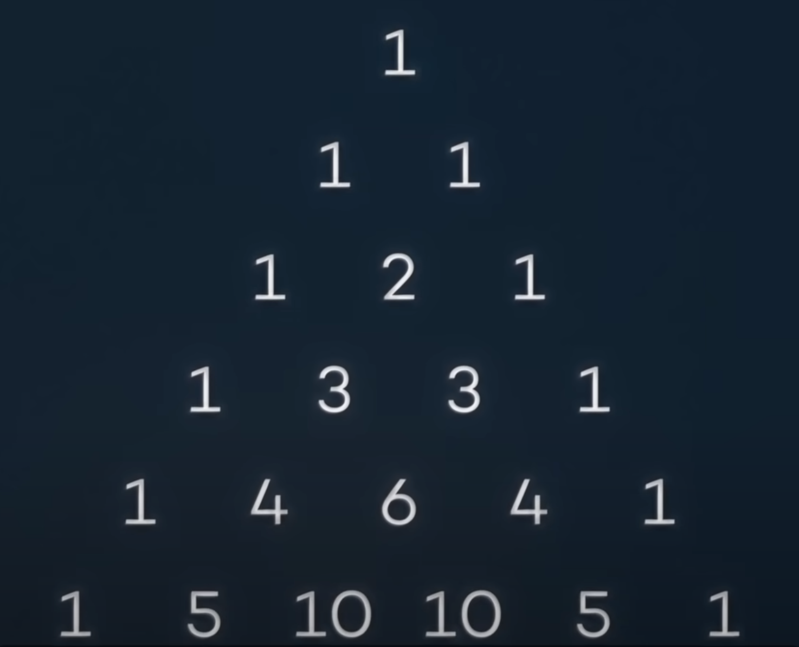
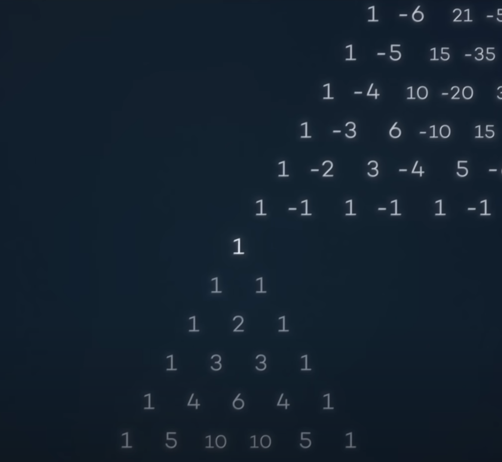
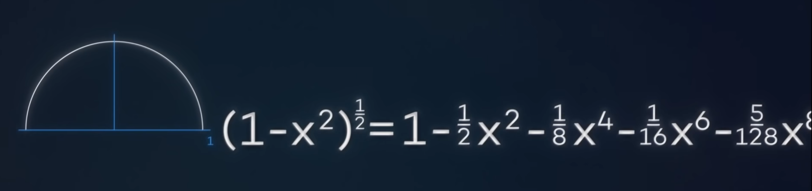

---
authors:
- jwher
description: Binomial Theorem
slug: binomial-theorem
tags:
- math
title: 이항정리 - π값을 구하는 법
---

  
*이항정리 - π값을 구하는 법*
<!--truncate-->

##  $\pi$

여러분은 $\pi$값을 알고 계신가요?  

$\pi$는 원의 반지름과 둘레의 비율을 나타내는 값으로,
3.14 언저리의 값이라는 것을 알고 계실겁니다.

  

> $\pi$ Day  
>
>   
> [[트위터]파이데이](https://twitter.com/AlexKontorovich/status/1236008125645434885?ref_src=twsrc%5Etfw)

동영상에서 보듯이, 피자의 둘레를 펴 지름에 놓으면 3판보다 조금 더 큰 것을 알 수 있습니다.

  

그렇다면 파이값을 어떻게 구할 수 있을까요?  
고대인들도 $π$값을 알고 있었습니다.

한 변의 길이가 1인 육각형의 둘레는 6입니다.
육각형에 외접원을 그리면, 육각형보다 큰 원을 그릴 수 있습니다.  
같은 지름을 공유하는 원의 둘레가 더 크므로, 다음 부등식을 세울 수 있습니다.

$$
(원의 둘레)=(지름)*π=2π > 6
$$
양변을 2로 나누면,

$$
π > 3
$$

$\pi$ 값은 3보다 크다는걸 알았습니다!

  

한 변의 길이가 2인 사각형은 둘레가 8로, 이전에 그렸던 도형보다 큽니다.  
사각형의 둘레가 더 크므로, 다음 부등식을 세울 수 있습니다.

$$
2π < 8
$$
양변을 2로 나누면,

$$
π < 4
$$

$\pi$는 4보다 작은 값임을 알아냈습니다!

이렇게 다각형을 이용해 근사하는 방법은 2200년전, BC 250년에 아르키메데스가 계산한 방법으로,
내접, 외접한 다각형의 변을 늘려가며 더 정확한 근사치를 구할 수 있습니다.
이 방법은 1000년간 $\pi$ 값을 구하는 방법으로 사용되었습니다.

$$
{223 \over 71} < \pi < {22 \over 7}
$$
$$
3.1408<π<3.1429
$$

사실 이정도만 되어도 실용적인 정확도를 넘어섭니다.  
1850년, William Shanks는 15년간 $\pi$값을 계산해 707자리까지 계산합니다.
하지만 527자리부터 오류가 있었죠. 이걸 계산하는데 사용한 사간은 아무것도 아닌 것에 낭비된 것 처럼 보입니다.

이 외에도 $\pi$값을 구하는 방법은 [Monte Carlo Simulation](https://en.wikipedia.org/wiki/Monte_Carlo_method),
[Buffon’s Needles](https://en.wikipedia.org/wiki/Buffon%27s_needle_problem) 등 방법이 있지만,
지금 다룰 진짜 주제는 $π$가 아니니 넘어가겠습니다.

## 적분의 등장

<!-- 아이작 뉴턴, 고드프리트 빌헬름 라이프니츠 -->
뉴턴과 라이프니츠는 17세기 미적분학의 기본정리를 완성합니다.

* 미분과 적분이 서로 역연산관계에 있습니다.

* 정적분은 부정적분의 차로 구할 수 있습니다.

정적분 값을 계산할수 있게 되면서 $\pi$ 값을 구하는 방법은 변하게 됩니다.  
이전까지는 $(원의 둘레)=2*\pi$를 이용했다면,
이제부터는 $(원의 넓이)=r^2*\pi$을 이용하게 됩니다.

## 원의 넓이1
좌표계에서 단위원의 방정식 $x^2+y^2=1$을 나타내면 다음과 같습니다

적분가능한 함수 $y=\sqrt{1-x^2}$로 나타내면

어떻게 적분할 수 있을까요?
안타깝게도, 지금 알고있는 지식으로는 적분할수 없습니다.

그래도 궁금하신 분을 위해

이 식의 부정적분은 다음과 같습니다.

$$
\int \sqrt{(1-x^2)}  = {1\over2}(1-x^2)^{1\over2}x+sin(x)^{-1}
$$

## 이항계수(binomial coefficient)

위의 식을 적분하려면, **이항정리**와 **이항계수**를 알아야 합니다.

**이항식**은, 두 단항식의 합인 다항식을 말합니다.
$$
ax^m-bx^n
$$

**이항정리**는, 이항식의 거듭제곱 $(x+y)^n$을 단항식$ax^by^c$들의 합으로 전개하는 정리입니다.
여기에서 $b+c=n$이고, 단항식의 계수$a$는 **이항계수**라고 불리고
$a={\begin{pmatrix} n\\b \end{pmatrix}}={\begin{pmatrix} n\\c \end{pmatrix}}$입니다.  
*n choose b 또는 n개에서 b개를 고르는 조합으로 읽습니다*

 

직접 이항식$(x+1)$의 거듭제곱을 계산해 볼까요?  
$$
\begin{aligned}
&(1+x)^0 = 1 \\
&(1+x)^1 = 1+x \\
&(1+x)^2 = 1+2x+x^2 \\
&(1+x)^3 = 1+3x+3x^2+x^3 \\
&(1+x)^4 = 1+4x+6x^2+4x^3+x^4 \\
\end{aligned}
$$

눈치 빠르신 분이라면 $(1+x)^n$이 어떤 형태인지 추측하셨을 겁니다.

위에서 설명했듯이, n항식의 k항의 계수는 조합 ${\begin{pmatrix} n\\k \end{pmatrix}} = {n! \over k!(n-k)!}$
또는, ${Π_{i=0}^{k-1}(n-i) \over k!}$와 같습니다.

 

조합수는 pascal's triangle에서 찾을 수 있습니다.

1을 y변수로 바꿔주면, 이항식이 됩니다.

(x+y)^n

이항식의 거듭제곱 n승의 계수를 구할 때,
대수학으로 계산하는 대신 조합수를 사용해 편리하게 계산할 수 있고,
이를 이항정리라고 합니다.

## negative number

<!-- natural numbers(N) - integers(Z) - rational(Q) - real(R) - complex(C) -->

## fraction

분수일 때에도 성립합니다.

## 원의 넓이2

이제 식을 전개할 수 있습니다!

정적분을 구하면

이 값은 무한히 전개되므로 구할 수 없습니다.
하지만 원의 넓이 2π의 1/4, π/2를 나타낸다는 것을 알고 있습니다.

## 원의 넓이3
정적분의 범위를 [0, 1/2]로 설정하면
값을 더 빠르게 구할 수 있습니다.

피타고라스와 삼각함수 덕에 이 넓이는 쉽게 알 수 있습니다.

밑변의 길이가 1/2이고 빗변이 1인 삼각형은 사이각이 60도 입니다.
따라서, 이 부분의 넓이는 원의 넓이 π의 12분의 1인 원뿔과
밑변이 1/2, 높이가 3^(1/2)/2인 삼격형 넓이의 합입니다.

> π/12 + 3^(1/2)/8

이제 다항식의 앞부분부터 계산해 나가면 π 값을 구할 수 있습니다.
아르키메데스의 방법과 정확도를 비교해보면,
4천조각형을 계산할 때와 뉴턴 급수의 50개의 항을 계산했을때가 같습니다.

## References
[Calculating Pi](https://medium.com/swlh/calculating-pi-73ece2d3c9a9)  
[π를 계산하는 특별한 방법](https://www.youtube.com/watch?v=ZWwdAidVsZ8)  
