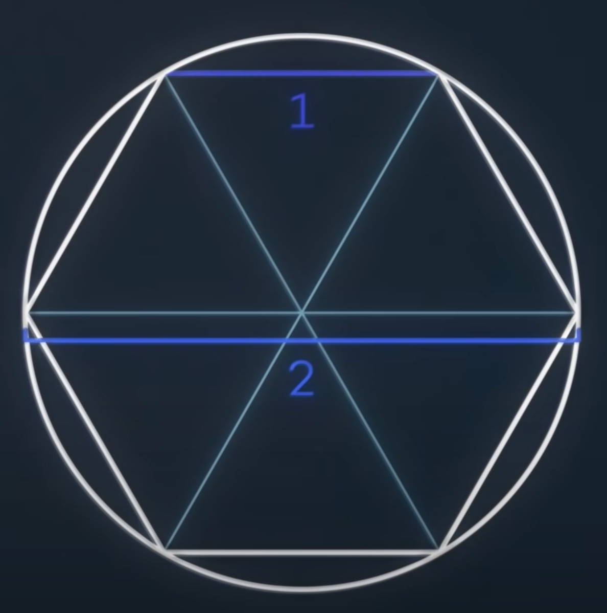
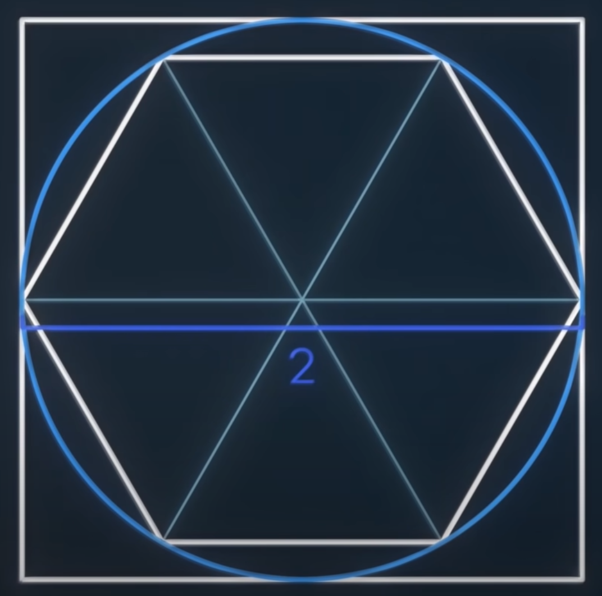
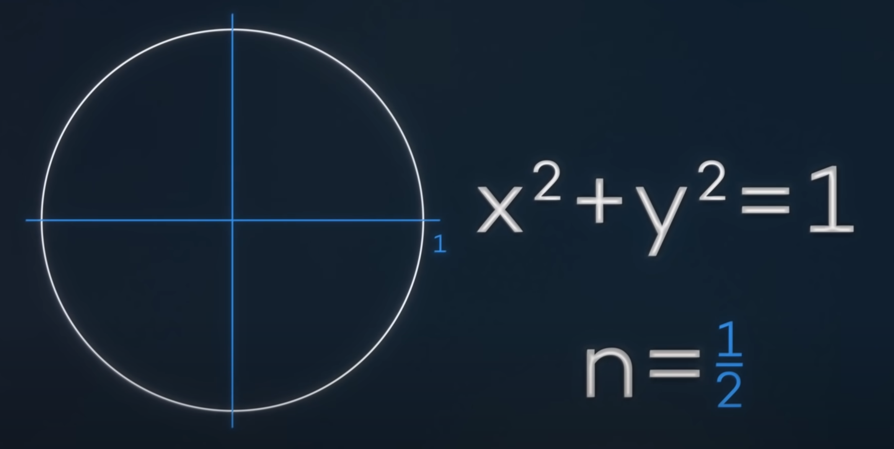

---
authors:
- jwher
description: 이항정리 - π값을 구하는 법
slug: binomial-theorem
tags:
- math
title: Binomial Theorem
draft: true
---

<!--  -->
*이항정리 - π값을 구하는 법*
<!--truncate-->

##  π

여러분은 π값을 알고 계신가요?  
중학교 수학이 기억나신다면, 3.14 언저리의 값이라는 것을 알고 계실겁니다.
원의 반지름과 둘레의 비율을 나타내는 값입니다.

> Pi Day  

그렇다면 파이값을 어떻게 구할 수 있을까요?  
고대인들도 π값을 알고 있었습니다.

한 변의 길이가 1인 육각형의 둘레는 6입니다.
육각형에 외접원을 그리면, 육각형보다 큰 원을 그릴 수 있습니다.
같은 지름을 공유하는 원의 둘레가 더 크므로, 다음 부등식을 세울 수 있습니다.

> 2*π > 6
> π > 3

한 변의 길이가 2인 사각형은 둘레가 8로, 이전에 그렸던 도형보다 큽니다.
사각형의 둘레가 더 크므로, 다음 부등식을 세울 수 있습니다.

> 2*π < 8
> π < 4

이 방법은 내접, 외접한 다각형의 변을 늘려가며 더 정확한 근사치를 구할 수 있습니다.
introduced by Archimedes was an innovative example of iterative computation, introduced by Greek Mathematicians around 2200 years ago now.

> 3.1408<π<3.1429

사실 이정도만 되어도 실용적인 정확도를 넘어섭니다.  
In 1850, William Shanks took 15 years to estimate Pi to 707 digits. Turns out he made an error at digit 527. Makes all the time “wasted” on video gaming seem like nothing.

이 외에도 Monte Carlo Simulation, Buffon’s Needles 등 방법이 있지만,
지금 다룰 주제는 π가 아니니 넘어가겠습니다.

## 적분

<!-- 아이작 뉴턴, 고드프리트 빌헬름 라이프니츠 -->
뉴턴과 라이프니츠는 17세기 미적분학의 기본정리를 완성합니다.

* 미분과 적분이 서로 역연산관계에 있습니다.

* 정적분은 부정적분의 차로 구할 수 있습니다.

## 원의 넓이1
좌표계에서 원의 방정식을 나타내면 다음과 같습니다

적분가능한 함수로 나타내면

어떻게 적분할 수 있을까요?

이 식의 부정적분은 다음과 같습니다.

integral( (1-x^2)^(1/2) ) = 1/2((1-x^2)^(1/2)*x+sin(x)^(-1))

## binomial coefficient

(1+x)^2 = 1+2x+x^2  
(1+x)^3 = 1+3x+3x^2+x^3  
(1+x)^4 = 1+4x+6x^2+4x^3+x^4  

(1+x)^n 이 어떤 형태인지 추측할 수 있습니다.

계수(coefficient) 는 (3/2) (three choose two) = 3
조합 (n/k) = n! / k!(n-k)! 과 같습니다.

조합수는 pascal's triangle에서 찾을 수 있습니다.

1을 y변수로 바꿔주면, 이항식이 됩니다.

(x+y)^n

이항식의 거듭제곱 n승의 계수를 구할 때,
대수학으로 계산하는 대신 조합수를 사용해 편리하게 계산할 수 있고,
이를 이항정리라고 합니다.

## negative number

<!-- natural numbers(N) - integers(Z) - rational(Q) - real(R) - complex(C) -->

## fraction

분수일 때에도 성립합니다.

## 원의 넓이2

이제 식을 전개할 수 있습니다!

정적분을 구하면

이 값은 무한히 전개되므로 구할 수 없습니다.
하지만 원의 넓이 2π의 1/4, π/2를 나타낸다는 것을 알고 있습니다.

정적분의 범위를 [0, 1/2]로 설정하면
값을 더 빠르게 구할 수 있습니다.

피타고라스와 삼각함수 덕에 이 넓이는 쉽게 알 수 있습니다.

밑변의 길이가 1/2이고 빗변이 1인 삼각형은 사이각이 60도 입니다.
따라서, 이 부분의 넓이는 원의 넓이 π의 12분의 1인 원뿔과
밑변이 1/2, 높이가 3^(1/2)/2인 삼격형 넓이의 합입니다.

> π/12 + 3^(1/2)/8

이제 다항식의 앞부분부터 계산해 나가면 π 값을 구할 수 있습니다.
아르키메데스의 방법과 정확도를 비교해보면,
4천조각형을 계산할 때와 뉴턴 급수의 50개의 항을 계산했을때가 같습니다.

## References
[Calculating Pi](https://medium.com/swlh/calculating-pi-73ece2d3c9a9)
[π를 계산하는 특별한 방법](https://www.youtube.com/watch?v=ZWwdAidVsZ8)
