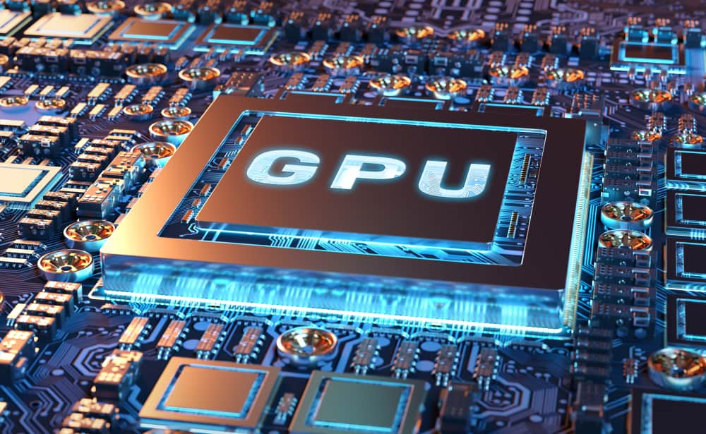

---
authors:
- jwher
description: Nvidia GPU Architectures
slug: nvidia-gpu-architectures
tags:
- tech
- hardware
title: Nvidia GPU 아키텍처
---

  
*Graphic Processing Unit*  

<!--truncate-->

아직 작성중입니다.

## Nvidia Architectures                                                                                                                                                                                 |

### Streaming Multiprocessor

### Streaming Processor
Compute Unified Device Architecture. CUDA Core
논리 수학 연산(Multiply add Divide)

### Special Function Unit
초월함수, 부동소수점 곱셈기

### Shared Memory

### Tensor Core
V100

### Single Instruction Multiple Threading

Single Instruction Multiple Data

### FLoat point Operations Per Seconds
FLOPS

## Compute Capability
장치의 *Compute Capability*는 버전 넘버로 표현됩니다.
이 버전 넘버는 GPU 하드웨어가 어떤 기능을 지원하는지 식별하고,
애플리케이션이 어떤 하드웨어 기능과 명령어가 현재 GPU에서 가능한지 런타임에 결정할 수 있게 합니다.

Compute Capability는 major 리버전 번호와 minor 리비전 번호를 붙여 표시합니다.
장치는 같은 코어 아키텍처끼리 같은 major 리비전 번호를 공유합니다.
예를들어, major 리비전 번호 9는 NVIDIA Hopper GPU를 나타냅니다.

minor 리비전 번호는 새 기능이 포함되어있을 코어 아키텍처에 기능 업데이트에 대응합니다.
*Turing*은 Compute Capability 7.5에 대응합니다. 이는 볼타 이키텍처의 업데이트를 기반으로 한 것입니다.

|            | Kepler cards (CUDA 5 until CUDA 10)                                                                                                                                                                     |
|------------|---------------------------------------------------------------------------------------------------------------------------------------------------------------------------------------------------------|
| compute 30 | generic Kepler, GeForce 700, GT-730                                                                                                                                                                     |
| compute 35 | Tesla K40                                                                                                                                                                                               |
| compute_37 | Tesla K80                                                                                                                                                                                               |

|            | Maxwell cards (CUDA 6 until CUDA 11)                                                                                                                                                                    |
|------------|---------------------------------------------------------------------------------------------------------------------------------------------------------------------------------------------------------|
| compute_50 | Quadro RTX 4000                                                                                                                                                                                         |
| compute_52 | Quadro M6000 , GeForce 900, GTX-970, GTX-980, GTX Titan X                                                                                                                                               |
| compute_53 | Tegra (Jetson) TX1 / Tegra X1, Drive CX, Drive PX, Jetson Nano                                                                                                                                          |

|            | Pascal (CUDA 8 and later)                                                                                                                                                                               |
|------------|---------------------------------------------------------------------------------------------------------------------------------------------------------------------------------------------------------|
| compute_60 | Quadro GP100, Tesla P100, DGX-1                                                                                                                                                                         |
| compute_61 | GTX 1080, GTX 1070, GTX 1060, GTX 1050, GTX 1030 (GP108), GT 1010 (GP108) Titan Xp, Tesla P40, Tesla P4, Discrete GPU on the NVIDIA Drive PX2                                                           |
| compute_62 | Integrated GPU on the NVIDIA Drive PX2, Tegra (Jetson) TX2                                                                                                                                              |

|            | Volta (CUDA 9 and later)                                                                                                                                                                                |
|------------|---------------------------------------------------------------------------------------------------------------------------------------------------------------------------------------------------------|
| compute_70 | DGX-1 with Volta, Tesla V100, GTX 1180 (GV104), Titan V, Quadro GV100                                                                                                                                   |
| compute_72 | Jetson AGX Xavier, Drive AGX Pegasus, Xavier NX                                                                                                                                                         |

|            | Turing (CUDA 10 and later)                                                                                                                                                                              |
|------------|---------------------------------------------------------------------------------------------------------------------------------------------------------------------------------------------------------|
| compute_75 | GTX/RTX Turing – GTX 1660 Ti, RTX 2060, RTX 2070, RTX 2080, Titan RTX, Quadro RTX 4000, Quadro RTX 5000, Quadro RTX 6000, Quadro RTX 8000, Quadro T1000/T2000, Tesla T4                                 |

|            | Ampere (CUDA 11.1 and later)                                                                                                                                                                            |
|------------|---------------------------------------------------------------------------------------------------------------------------------------------------------------------------------------------------------|
| compute_80 | NVIDIA A100 (the name “Tesla” has been dropped – GA100), NVIDIA DGX-A100                                                                                                                                |
| compute_86 | Tesla GA10x cards, RTX Ampere – RTX 3080, GA102 – RTX 3090, RTX A2000, A3000, A4000, A5000, A6000, NVIDIA A40, GA106 – RTX 3060, GA104 – RTX 3070, GA107 – RTX 3050, Quadro A10, Quadro A16, Quadro A40 |

|            | Hopper (CUDA 12 [planned] and later)                                                                                                                                                                    |
|------------|---------------------------------------------------------------------------------------------------------------------------------------------------------------------------------------------------------|
| compute_90 | NVIDIA H100 (GH100)    

> Compute Capability 버전과 CUDA 버전을 헷갈리지 맙시다. CUDA 버전은 소프트웨어 플랫폼입니다.
> 애플리케이션 개발자는 개발되지 않은 아키텍처를 포함해 여러 세대의 GPU 아키텍처를 실행시키기 위해 CUDA 플랫폼을 사용합니다.
> 새 버전의 CUDA는 새 GPU 아키텍처에 기본 지원을 포함하는 경우가 많지만, 일반적으로 하드웨어 세대와 독립적인 소프트웨어 기능을 제공합니다.

*Tesla*와 *Fermi* 아키텍처는 각 CUDA 7.0, CUDA 9.0에서 지원하지 않습니다.

## References

[NVIDIA GPU 아키텍처](https://89douner.tistory.com/159)
[[NVIDIA]Cuda GPUS](https://developer.nvidia.com/cuda-gpus)
[[NVIDIA]Cuda Legacy GPUS](https://developer.nvidia.com/cuda-legacy-gpus)
[[NVIDIA]Compute Capabitity](https://docs.nvidia.com/cuda/cuda-c-programming-guide/index.html#compute-capability)
[[NVIDIA]Compute Capabitities](https://docs.nvidia.com/cuda/cuda-c-programming-guide/index.html#compute-capabilities)
