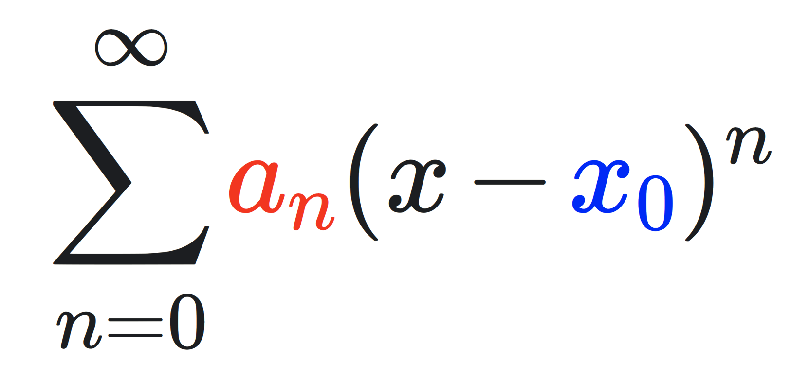

---
authors:
- jwher
description: 다양한 멱급수
slug: power-series
tags:
- tech
title: Power series
draft: true
---

*Power series*

<!--truncate-->

## 멱급수
멱급수 또는 거듭제곱 급수(Power series)는 주어진 변수를 거듭제곱한 항들의 무한급수이자,
중심이 같은 멱함수를 항으로 하는 무한급수입니다.

$$
\huge
\sum_{n=0}^{\infty}{\color{red}a_n}(x-{\color{blue} x_0})^n
$$

자세히 살펴보면 등차수열$\color{red}a_n$과 등비수열$(x-x_0)^n$로 이루어져 있습니다.
이 멱급수가 수렴하게 만드는 $x \in \mathbb{K}$의 집합을 멱급수의 수렴영역(domain of convergence)이라고 합니다.
실수 영역에선 **수렴구간**(interval of convergence)
복소수 영역에선 **수렴원판**(disc of convergence)라고 구분하기도 합니다.

## 테일러 급수
테일러 급수(Taylor series)는 도함수들의 한 점에서 계산된 항의 무한합으로 해석함수를 나타냅니다.

$$
\huge
\sum_{n=0}^{\infty}{\color{red}{f^{(n)}(a) \over n!}}(x-{\color{blue} x_0})^n
$$

매끄러운 함수(Smooth function) $f:\mathbb{R} \rightarrow \mathbb{R}$ 및 실수 $a \in \mathbb{R}$이 주어졌을 때,
$f$의 테일러 급수를 나타냅니다.
여기에서 $\color{red}{f^{(n)}(a)}$는 $f$의 $a$에서 $n$계 도함수를 말합니다.
특히 0계 도함수는 원래 함수 자신입니다.

테일러 급수는 오차를 가지고 있습니다.

$$
\huge
\sum_{\color{green}k=0}^{\color{green}n}{f^{(k)}(a) \over k!}(x-x_0)^k + \color{green}{R_{n+1}(x)}
$$

마지막 항인 $\color{green}{R_{n+1}(x)}$dmf $f$의 **나머지 항** 또는 **절단오차**라고 합니다.
$[a,x]$ 또는 $[x,a]$에 속하는 적당한 실수 b에 대해서 다음과 같이 표현됩니다.

$$
\huge
{R_{n+1}(x)} = {f^{\color{green}(n+1)}({\color{green}b}) \over \color{green}(n+1)!}(x-x_0)^{\color{green}n+1}
$$

이 오차가 0으로 원래 함수로 수렴하는 경우 **해석 함수**라고 합니다.

## 매클로린 급수

## 이항급수

## 실생활
조수주기
jpeg(joint photographic experts group), mpeg(moving picture experts group)
DCT(descrete cosine transform), IDCT

양자화(quantization)
색변환(RGB->YCbCr)
block splitting (nxn -> 8x8*m)
DCT
양자화 테이블
zigzag scanning
run-length encoding
huffman coding

## References
[[wiki]멱급수](https://ko.wikipedia.org/wiki/멱급수)  
[[wiki]테일러 급수](https://ko.wikipedia.org/wiki/테일러_급수)  
https://m.blog.naver.com/PostView.naver?isHttpsRedirect=true&blogId=mindo1103&logNo=90103327556
https://www.jezzamon.com/fourier/
https://studyfield.tistory.com/742

<!--
https://web.archive.org/web/20060821030321/http://f-cpu.seul.org/whygee/dct_fc0/dct_fc0.html
-->