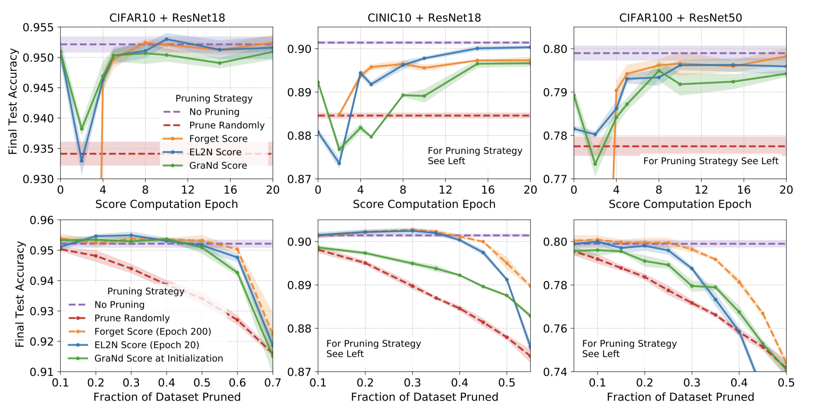
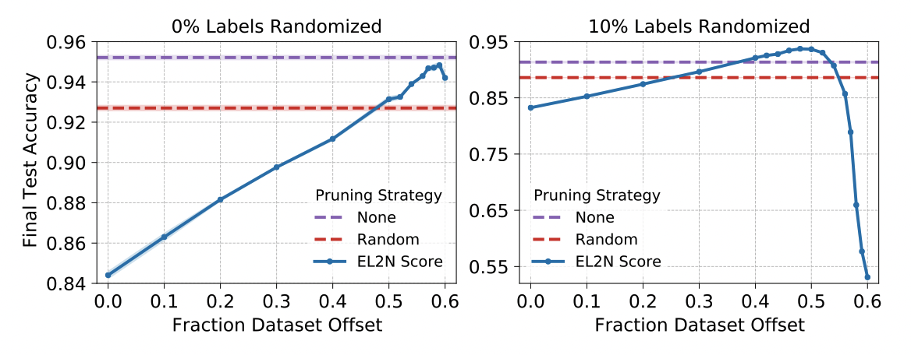
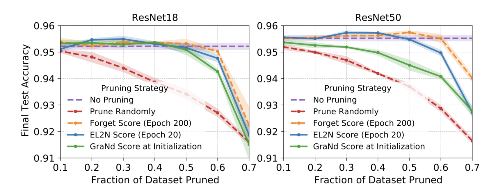

---
authors:
- jwher
description: 학습에 중요한 데이터 찾기
slug: deep-learning-on-a-data-diet
tags:
- ml
title: 학습에 중요한 데이터 찾기
---

  
*학습에 중요한 데이터 찾기*  
*이 글은 2021 7 15 NeurIPS에 등재된 Deep learning on a data diet을 번역해 작성되었습니다*

 

<!--truncate-->

*최대한 번역된 단어를 통일하였으나 원문을 보는것을 권장합니다.*  
*개인적으로 첨가한 단락은 기울게 표시했습니다.*  

## 딥러닝과 데이터
최근 딥러닝에서 성과 일부는, 더욱더 큰 데이터셋을 사용해서 과매개변수화(overparameterized)된 네트워크를 만들며 이루어졌습니다.  
*\* 과매개변수화: 데이터로부터 추정할 수 있는 것보다 많은 매개변수를 가지는 모델을 이릅니다*

이는 자연스러운 질문을 남깁니다. 그럼 얼마만큼의 데이터가 일반화에 불필요(superfluous)한가? 이는 어떻게 찾아야 하는가?  

 
 

## 최근 연구
데이터 정리(pruning data)에 대한 최근 연구[[1](#1-selection-via-proxy), [2](#2-data-distribution-search-to-select-core-set-for-machine-learning)]는 원본 데이터셋과 동일한 정확도를 유지하는 중심집합(coresets)의 넓은 맥락을 찾는 것이였습니다. 이는 전체 데이터셋에서 학습 오류의 작은 차이를 내는 예제들을 찾는 방법으로 접근합니다. 하지만, 딥러닝의 볼록하지않은(non-convex) 본질 때문에, 이 기법은 약한 이론적 보장과, 실례에서 비효율성은 보수적인 추정을 불러일으킵니다.  
*\* 볼록하지 않음(non-convex): 해결방법이 하나 이상일 수 있는, 즉 지역 최솟값(local minimizer)이 존재하는 문제를 말합니다*

최근에 발견된 다른 접근 방식 [[8](#8-an-empirical-study-of-example-forgetting-during-deep-neural-network-learning)]은 학습 동안 "잊혀진 사건(forgetting event)"으로 불리는 맞게 분류되었다 맞지 않게 분류되도록 바뀐 예제 횟수를 추적하고, 다른 것들이 반복적으로 잊혀질동안 덜 잊혀진 예제를 발견합니다. 하지만, 이 방법은 학습 중에 잊혀지는 통계 정보를 수집하기 때문에 학습의 중간 또는 끝에서 망각점수(forgetting score)가 계산됩니다.

넓게 바라보면, 데이터셋 정리 방법은 많은 질문을 남깁니다. 정확도(accuracy) 손상 없이 학습 데이터에서 제거할 수 있는 예제의 본질은 무엇인가? 얼마나 빨리 그런 예제를 알아챌 수 있을까? 얼마나 많은 예제를 찾아야 하고, 어떻게 데이터 분산에 의존하는가? 이에 대한 일반적인 대답은 없을 것입니다. 이 연구에서는 표준 비전 벤치마크와 네트워크 구조에서 경험적인 방법을 찾습니다.

 
 

## 어떤 표본이 학습에 중요한가?

 

### 사전조건
지도학습(supervised), 분류(classification)에서 독립항등분포(independent and identically distribution)인 알려지지 않은 데이터 분포 $D$, $x \in {\mathbb R}^d$ 인 입력 벡터, 원핫 벡터 $y \in {\{0,1\}}^K$로 인코딩된 레이블에서 정의된 $S \in {\{(x_i, y_i)\}}^N_{i=1}$ 학습 셋을 가정합니다.

고정된 신경망 아키텍처에서 입력 $x \in \mathbb R^d$과 신경망 가중치 $w \in W \subseteq \mathbb R^D$에 대한 출력 로짓을 $f_w(x) \in \mathbb R^K$라고 합시다.

$\sigma (z_1,...,z_k)_k = exp{\{z_k\}}/\sum^K_{k'=1}exp{\{z_{k'}\}}$로 주어진 소프트맥스 함수 $\sigma$를 가정합니다.

$p(w,x) = \sigma(f(w,x))$를 신경망 출력의 확률벡터 형태로 가정합니다.

크기 $M$의 미니배치 수열 $S_0, S_1, ..., S_{T-1} \subseteq S$에 따라 반복되는 $w_0, w_1, w_2, ..., w_T$의 stochastic gradient descent(SGD)를 가정하면, $g_{t-1}(x,y)=\triangledown_{w_{t-1}}l(p(w_{t-1},x),y)$, and $t=1,...,T$에서

$$
w_t = w_{t-1} - \eta \sum_{(x,y) \in S_{t-1}}g_{t-1}(x,y)
\tag{1}
$$

위를 얻을 수 있습니다.

 

### Gradient norm score 와 infinitesimal analysis
학습셋 $S$를 고정합니다. SGD는 무작위 초기화 과정으로 학습되기 때문에 시간 t>0에서 가중치 벡터 $w_t$는 확률변수(random variable)입니다. 여기에서 손실 벡터의 크기가 관심 대상입니다.

**정의1** 학습 예제(x,y)의 시간 t에서 GraNd score는 $x_t(x,y)=\mathbb E_{W_t} ||g_t(x,y)||_2$ 입니다.

여기서 어떤 GraNd score가 학습 예제의 training loss 변화에 기여를 제어하는지 설명합니다. 분석의 단순화를 위해 training dynamicst가 연속적인 시간에 있는것처럼 근사합니다.

분석의 핵심 분량은 일반적인 레이블된 예제 (x,y)에 대한 loss의 시간 미분값 $\triangle_t((x,y),S_t) = - {dl(f_t(x),y) \over dt}$ ($f_t(\cdot)=f_{w_t}(\cdot)$에서) 입니다. 시간 t에서 미니배치 $S_t$에서 계산된 경사도에서 (x,y)의 loss의 변화율은 체인룰에 따라

$$
\triangle_t((x,y),S_t) = g_t(x,y){d_{W_t} \over dt}
\tag{2}
$$

이는 이산 시간 ${d_{W_t} \over dt} \approx W_{t+1} - W_t$과 연관되어 있습니다(식1 참고).
우리의 목표는 미니배치 $S_t$에서 학습점을 제거하는 것이 $\triangle_t((x,y),S_t)$에 어떤 영향을 미치는지 이해하는 것입니다.

**부분정리2** 학습에서 제거된 집합 $S_{\neg{j}} = S \backslash (x_j, y_j)$라 하자. 그러면 모든 $(x,y)$에 대해 다음을 만족하는 $c$가 존재한다.

$$
|| \triangle_t((x,y),S)-\triangle_t((x,y),S_{\neg{j}}) || \le c||g_t(x_j,y_j)||
\tag{3}
$$

*증명.* 주어진 예제 $x$에 대해 체인룰에 따라 $\triangle_t((x,y),S) = - {dl(f_t(x),y) \over dt} = - {dl(f_t(x),y) \over dW_t}{dW_t \over dt}$를 얻는다. SGD를 이용하므로 ${dW_t \over dt} = -\eta \sum_{(x_j,y_j) \in S_t}g_t(x_j,y_j)$ 입니다. 학습에 관련 없는 상수 $c=\eta||{dl(f_t(x),y) \over dW_t}||$라고 하면 수식(3)을 얻을 수 있습니다.

어떤 학습 단계에서 주어진 현재 위치 $W_t$에서 다른 예제의 loss를 줄이기 위한 학습 예제 (x,y)의 기여는 수식(3)으로 제한됩니다. 상수 $c$는 $(x,y)$로 결정되지 않기 때문에 경사 노름(gradient norm) $||g_t(x,y)||$만 고려하면 됩니다. 예상되는 경사 노름 값은, (x,y)에서 GradNd score와 같습니다. 다른말로, 작은 GraNd score는 주어진 시간 안에 나머지 훈련 데이터를 배우는데 제한된 영향을 지닙니다. 따라서 $\triangle_t(x)$를 관리하는데 더 큰 노름값이 중요하므로 예제를 각 GraNd score로 순위를 매길 것을 제안합니다.

임의의 입력 $x \in \mathbb R^d$에 대해 $k$번째 로짓 경사도 $\psi^{(k)}_t(x)=\triangledown_{W_t}f^{(k)}_t(x)$를 가정합시다. GraNd는 다음과 같습니다.

$$
X_t(x,y) = \mathbb E ||\sum^K_{k=1}\triangledown_{f^{(k)}} l(f_t(x),y)^T\psi^{(k)}_t(x)||_2
\tag{4}
$$

Cross entropy를 사용하므로 $\triangledown_{f^{(k)}} l(f_t(x),y)^T=p(W_t,x)^{(k)}-y_k$ 입니다. $\{\psi^{(k)}_t(x)\}_k$ 가 로짓에 대해 대락적으로 직교하고, logit과 예제 x에 대해 비슷한 크기이면 **GraNd를 error vector의 노름으로 추정할 수 있습니다.**

**정의3** EL2N score는 학습 표본 $(x,y)$에서 $\mathbb E||p(W_t,x)-y||_2$ 입니다.

실험적인 결과로, 이 추정은 몇 epoch 이후 정확해집니다.

 
 

## 데이터 정리를 통한 GraNd와 EL2N 점수의 경험적 평가

신경망 Depth의 다양성을 위해 ResNet18과 ResNet50을, 데이터셋 난이도의 다양성을 위해 CIFAR-10, CIFAR-100, CINIC-10을 사용하였습니다. 모든 점수는 10회의 독립적인 학습 결과의 평균입니다. 최종 테스트 정확도(accuracy)는 무작위 초기화된 네트워크와 선택된 부분집합으로 학습해 얻은 결과입니다.

Fig. 1은 상하로 두개의 실험과, 3개의 다른 네트워크와 데이터셋 조합의 결과입니다.

 

### 시작할때 데이터 정리
**Pruning at initialization**  
모든 설정에서 GraNd 점수를 사용한 것이 무작위로 선택한것 보다 나았습니다. 이는 주목할만한데, GraNd는 초기값의 평균 경사도 노름 정보만 가지고 있기 때문입니다. 이는 무작위 네트워크로 만들어진 학습 분포가 분류 문제에서 기하학적으로 많은 정보를 가진다는 것입니다. EL2N은 일관적인 효과를 거두지 못했고 망각점수(forgetting score)는 정의되지 않습니다.

 

### 학습 초기에 데이터 정리
**Pruning early in training**  
몇번의 학습 후에, EL2N 점수는 일반화를 위한 중요한 예제 식별에 매우 효과적이였습니다. 중간정도의 데이터를 정리했을 때 전체 데이터셋을 사용한것과 같거나 더 나은(CINIC10+ResNet18 0.3 pruned) 결과를 보였습니다. 많은 데이터를 정리했을 때에도, 학습 궤적마다 정보를 얻는 망각점수에 대해 경쟁력이 있습니다. 흥미로운점은, 극히 많은 데이터가 정리된 상황에서 EL2N과 GraNd 다 급격히 성능이 떨어지는것을 관찰했습니다. 많은 데이터 정리시 데이터 분포에 대해 나쁜 커리리지를 지닌다는 가설을 세울 수 있습니다. 이는 가장 높은 오류 예제만 집중하므로써 테스트 데이터에 존재하는 집합이 제외될 가능성이 높습니다. 어려운 문제만 맞추고 테스트 오류가 좋은 학습 모델을 위한 예제의 다양성을 갖추지 못합니다.

 

### 데이터가 갖는 자산
**A property of the data**  
두 결과는 EL2N과 GraNd이 데이터셋에 속한 자산이고 네트워크에 특정되지 않음을 보여줍니다. [Appendix D](#d-additional-experiments)를 살펴보세요.

실험결과로, EL2N 점수는 학습 초기에 계산하는 것이 중요한 예제 식별에 더 정확하다는 것을 보입니다.

 
 

## 노이즈 예제 식별
*선별된 데이터는 여러가지 정보를 담는 모델 학습에 좋은 데이터일수 있지만, 그냥 어려운 문제(노이즈)일 수 있습니다*  

이전 단락에서 살펴본 50%의 데이터로 정확도 감소 없이 학습시킬 수 있었던 이유는 뭘까요?
한 가설은, 높은 점수를 받은 예제가 classifier의 정확도를 달성하기 위해 중요했던 것입니다.
이 단락에선 그 가설을 반박하고, 레이블 노이즈의 역할을 증명합니다.

높은 점수를 받은 예제가 높은 정확도를 얻기 위해 가장 중요한지 실험을 위해,
먼저 예제를 적은 횟수의 학습(epoch 10)을 한 후 계산된 EL2N 점수로 정렬합니다. (Appendix E.3에서 GraNd로 실험)
$f$부터 항상 같은 P%만큼 부분집합을 취하며 $f$를 따라 움직이는 윈도우를 만듭니다.
이 윈도우는 최고점으로 갈때를 제외하고 높은 백분위로 올라갈수록 좋은 성능을 냅니다.
최고 성능을 내는 윈도우는 대략 500개의 최고점수를 제외한 것이였습니다.

레이블 분포에 노이즈 수에 따라 어떤 변화가 있는지 더 다양한 상황을 만듭니다.
무작위 K% 레이블을 다른 무작위 레이블로 교체[[13](#13-understanding-deep-learning-requires-rethinking-generalization)]를 포함해 위의 실험을 반복합니다.
이때 최적 윈도우는, 더 많은 높은점수 레이블을 제외하는 쪽으로 이동했습니다.
노이즈가 없을 때 나타나는 효과가 노이즈가 존재할때 강화되는것을 볼 수 있었습니다.

Fig. 2 ResNet18+CVFAR-10 데이터셋에서 40%의 부분집합으로 학습한 결과(좌)와
여기에 10%의 무작위 레이블을 포함한 결과(우)입니다.

이것은 다양한것을 암시합니다. **높은점수 예제만으로 학습한것은 최적의 방법이 아닐 수 있습니다.**
레이블에 노이즈가 있을 때는 더더욱 그렇습니다.
모집단이 낮은 베이즈 에러가 있다면, 높은점수 예제만으로 학습하는게 최적의 결과일 것입니다.

 
 

<!--
## Optimization landscape and the training dynamics
*todo: 나중에 작업하겠습니다*

 
 

-->

<!--
## Discussion
*todo: 나중에 작업하겠습니다*
-->

 
 
 

## Appendix

### A. Ethical and societal consequences
경험적 연구에 따른 많은 노력이 있었습니다. 본질적으로 다른 결과를 숨기려는 경향이 있기 때문에 정확도와 같은 지표에 더 집중했습니다.

### B. Implementation Details
[[깃헙]코드](https://github.com/mansheej/data_diet)

### C. Example Images

### D. Additional Experiments

#### 1. Sensitivity analysis of GraNd and EL2N scores

#### 2. Comparison between scores from different architectures on the same dataset
CIFAR-10로 학습된 ResNet18, ResNet50 실험을 다시 수행했습니다.

네트워크 깊이는 데이터를 정리한 결과에 적은 영향을 미칩니다.

#### 3. Correlations between scores

### E. Noise

### F. Comparison to memorization threshold

 
 
 

## TL;DR

$\sigma$는 소프트맥스 함수,
$p(w,x) = \sigma(f(w,x))$를 신경망 출력의 확률벡터 형태로 가정합니다.

$k$번째 로짓 경사도 $\psi^{(k)}_t(x)=\triangledown_{W_t}f^{(k)}_t(x)$를 가정하고, $\{\psi^{(k)}_t(x)\}_k$ 가 로짓에 대해 대락적으로 직교하고, logit과 예제 x에 대해 비슷한 크기이면 **GraNd를 error vector의 노름으로 추정할 수 있습니다.**

$$
EL2N = \mathbb E||p(W_t,x)-y||_2
$$

실험적으로 봤을때, 이는 네트워크와 관계없이 데이터에 종속적인 값입니다. Data driven AI를 더욱 강조하게 되는 것 같습니다.

GraNd: Gradient Norm distance  
EL2N: Error L2 Norm  
의 약자로 생각됩니다.

 

## Reference

[[Arxiv]Deep learning on a data diet](https://arxiv.org/pdf/2107.07075.pdf)

#### [[1] Selection via proxy](https://arxiv.org/pdf/1906.11829.pdf)
#### [[2] Data distribution search to select core-set for machine learning](http://manuscriptlink-society-file.s3.amazonaws.com/kism/conference/sma2020/presentation/SMA-2020_paper_50.pdf)
#### [[8] An empirical study of example forgetting during deep neural network learning](https://arxiv.org/pdf/1812.05159.pdf)
#### [[13] Understanding deep learning requires rethinking generalization](https://arxiv.org/abs/1611.03530v2) 
