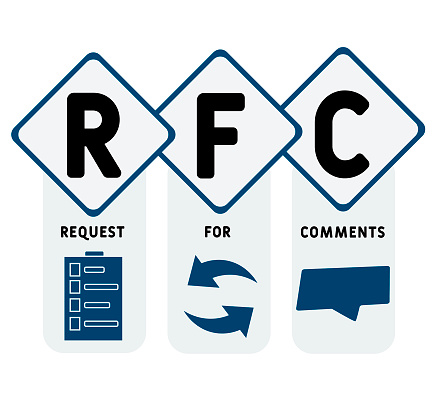

---
authors:
- jwher
description: Key words for use in RFCs to Indicate Requirement Levels
slug: requirement-levels
tags:
- tech
title: 요구사항에 사용하는 RFC 키워드
---

  
*Key words for use in RFCs to Indicate Requirement Levels*  
<!--truncate-->

## Request For Comments

RFC(Request for Comments) 문서는 "비평을 기다리는 문서"라는 의미로,
대부분 Internet Engineering Task Force(IETF)에서 관리되는
컴퓨터 네트워크 공학 등에서 인터넷 기술에 적용 가능한 새로운 연구, 혁신, 기법 등을 아우르는 메모를 나타냅니다.

대표적으로 웹의 기반이 되는 프로토콜인 HTTP 1.1은 [RFC-2068](https://www.rfc-editor.org/rfc/rfc2068)에서 시작되었습니다.

RFC 편집자는 매 RFC 문서에 일련 번호를 부여합니다.
일단 일련 번호를 부여 받고 출판되면, RFC는 절대 폐지되거나 수정되지 않습니다.
만약 어떤 RFC 문서가 수정이 필요하다면, 저자는 수정된 문서를 다른 RFC 문서로 다시 출판해야 합니다.

변화하는 환경에 맞게 프로토콜이 업그레이드되어 기술 표준을 갱신할 경우,
RFC 는 명확성을 위해 기존 문서를 갱신하는게 아니라 새로운 RFC 를 만들고
수정된 문서는 상단에 Update, Obsoletes로 어떤 문서가 수정되고 무효화되었는지 표시합니다.

앞서 본 HTTP 1.1을 처음 제안한 RFC-2068 또한 [RFC-2616](https://www.rfc-editor.org/rfc/rfc2616)와 같은 많은 문서로 업데이트 되었습니다.

## RFC 2119

Key words for use in RFCs to Indicate Requirement Levels

**Abstract**  

많은 표준 문서에서 요구사항을 나타내는데 여러 단어가 사용됩니다.
이 문자는 대문자로 작성되고, 문서의 시작에 다음 문구를 사용합니다.

> The key words "MUST", "MUST NOT", "REQUIRED", "SHALL", "SHALL NOT",
> "SHOULD", "SHOULD NOT", "RECOMMENDED",  "MAY", and
> "OPTIONAL" in this document are to be interpreted as described in
> [RFC 2119](https://www.rfc-editor.org/rfc/rfc2119).

이 단어 사용의 간제성은 문서의 요구 레벨에 따라 바뀔 수 있습니다.

1. MUST  
REQUIRED, SHALL

2. MUST NOT  
SHALL NOT

3. SHOULD  
RECOMMANDED

4. SHOULD NOT  
NOT RECOMMANDED

5. MAY  
OPTIONAL

6. Guidance in the use of these Imperatives  
이 용어는 조심스럽게 사용되어야 합니다.
각별히 MUST는 상호 운영에 진짜 필요한 것 또는 위협을 부를 수 있는 행동의 제한을 두기 위해 사용되어야 합니다.

7. Security Considerations  
이 용어는 주로 보안 구현사항에 자주 사용됩니다.

## Tips

RFC 뿐만 아니라 많은 공개 소프트웨어 문서에서 RFC 2119를 서두에 포함하고 있습니다.
가장 많이 인용되는 문서가 아닌가 싶네요.

심심할때 [만우절날 작성된 RFC](https://en.wikipedia.org/wiki/April_Fools%27_Day_Request_for_Comments)를 읽는 재미가 있습니다.

~~HTTP Status code 중에 `418 I'm a teapot`이 있는걸 아시나요~~  
[RFC 2324 — Hyper Text Coffee Pot Control Protocol (HTCPCP/1.0).](https://www.rfc-editor.org/rfc/rfc2324)

## References

[RFC 2119](https://www.rfc-editor.org/rfc/rfc2119)  
[[Wiki]Request for Comments](https://en.wikipedia.org/wiki/Request_for_Comments)
