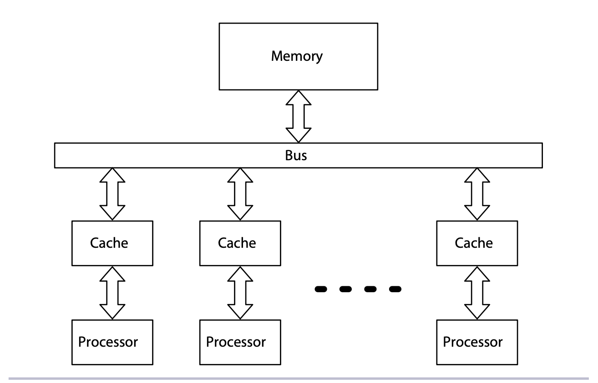
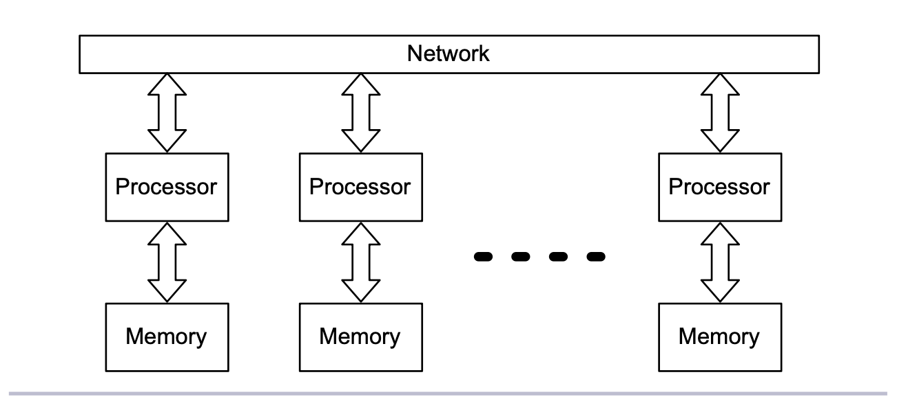

---
authors:
- jwher
description: Seven Concurrency Models in Seven Weeks - Chapter1
slug: concurrency-models-1
tags:
- tech
- distributed computing
title: 7가지 동시성 모델(소개)
---

  
*이 글은 Paul Butcher의 Seven Concurrency Models in Seven Weeks을 읽고 작성했습니다*  
<!--truncate-->

As Amdahl’s law starts to eclipse Moore’s law, a transition from object-oriented programming to concurrency-oriented programming is taking place.

# ch1. introduction

## Concurrent or Parallel?
*통상 Concurrent는 동시성, Parallel은 병렬성으로 해석합니다*

As Rob Pike puts it,

> Concurrency is about dealing with lots of things at once. Parallelism is about doing lots of things at once.

concurrency는 여러개를 한번에 다루는것, parallel은 여러개가 한때에 진행되는 것을 의미합니다.

> 수업에서 학생이 읽는것을 들으면서, 반을 조용히시키고, 질문을 하는것은 concurrent 합니다.
> 만약, 보조 선생님이 한명 추가되어 같은 일을 하면 concurrent하고 parallel 하다고 할 수 있습니다.

concurrency나 parallelism은 전통적인 threads와 locks이 직접적인 parallelism을 지원하지 않기때문에 더 헷갈립니다.
멀티코어를 쓰레드와 락을 사용하고 싶다면, concurrent 프로그램을 작성해 parallel 하드웨어에서 돌리는 방법만 선택할 수 있습니다.

concurrent 프로그램은 종종 *nondeterministic(비결정적)*하기 때문에 불행합니다.
하지만 parallelism은 비결정적인 것을 도입하지 않아도 됩니다. 예를들어, array가 가진 숫자가 두배가 되는것은 비결정적인 것이 아닙니다. 프로그래밍 언어들은 비결정적이라는 공포를 도입하지 않아도 parallelism을 위해 특별한 지원을 할 수 있습니다.

## 병렬 아키텍처
*Pararell Architecture*  

parallelism을 멀티 코어로 생각할 수 있지만, 현대 컴퓨터에선 parallel을 다양한 레벨에서 수행합니다.

### 비트 레벨
32bit 컴퓨터가 왜 8bit 보다 빠를까요? 8bit 컴퓨터가 32bit 숫자 두개를 더할려면 8bit 연산 연속이 필요할 것입니다. 반대로, 32bit가 8bit 숫자 두개를 더하려면 32bit에 포함된 4byte 각각으로 계산해 동시에 처리할 수 있습니다.

이렇게 64bit 아키텍쳐까지 왔지만, 이런 병렬성엔 제한이 있기 때문에 128bit 컴퓨터를 조만간 볼 순 없을것입니다.

### 명령어 레벨
pipelining, out-of-order execution, speculative excution으로 현대 cpu는 높은 병렬성을 지닙니다.

### 데이터 병렬성
SIMD, for “single instruction, multiple data”
이미지 처리에서 많이 사용, 현대의 GPU는 엄청나게 강력한 data-parallel 프로세서 입니다.

### 작업 레벨
가장 많은 사람들이 생각하는 병렬처리 단계입니다. 멀티 프로세서로 이루어집니다.
프로그래머의 관점으로 보면, 가장 구분되는 특징은 메모리 모델입니다.
공유 메모리 구조를 가지는가, 분산 메모리 구조를 가지는가의 차이가 있습니다.

  
*공유메모리를 통한 병렬성*  

 

  
*분산메모리를 통한 병렬성*

## 동시성
*Concurrency*  

동시성을 사용하면 더 responsive(반응적)하고, fault tolerant(오류 무결), efficient(효율적), simple(단순)합니다.

### Concurrent Software for a Concurrent World
*Concurrency is the key to responsive systems.*  

The world is concurrent, and so should your software be if it wants to interact effectively.
> By downloading files in the background, you avoid frustrated users having to stare at an hourglass cursor.

### Distributed Software for a Distributed World
*distributing software helps it handle failure.*  

Sometimes geographical distribution is a key element of the problem you’re solving.
>  You might locate half your servers in a data center in Europe and the others in the United States, so that a power outage at one site doesn’t result in global downtime.

### Resilient Software for an Unpredictable World
*Concurrency enables resilient, or fault-tolerant*  

Independence is important because a failure in one task should not be able to bring down another.

### Simple Software in a Complex World
*it might be hard to believe, but a concurrent solution can be simpler and clearer*

The extra work required to translate from the concurrent problem to its sequential solution clouds the issue.
You can avoid this extra work by creating a solution with the same structure as the problem:
rather than a single complex thread that tries to handle multiple tasks when they need it, create one simple thread for each.

## 일곱개의 모델

* thread and locks
* functional programming
* the clojure way
* actors
* communicating sequential processes
* data parallelism
* the lambda architecture

각 모델은 다른 장점을 지니고 있습니다. 앞으로의 챕터에서 다음 질문을 기억합시다.
* 모델이 동시성 문제를 해결하는지, 병렬성 문제를 해결하는지, 둘다인지
* 어떤 병렬성 아키텍처를 타깃으로 하는지
* 모델이 탄력적이거나 지리학적으로 분산된 코드 작성을 제공하는지
