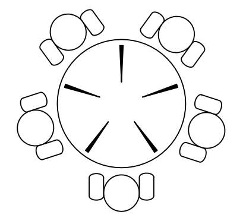

---
authors:
- jwher
description: Seven Concurrency Models in Seven Weeks 2
slug: concurrency-models-2
tags:
- tech
- distributed computing
- java
title: 7가지 동시성 모델 2(스레드와 락)
---

  
*이 글은 Paul Butcher의 Seven Concurrency Models in Seven Weeks을 읽고 작성했습니다*  

Threads-and-locks programming is like a Ford Model T
<!--truncate-->

# The Simplest Thing That Could Possibly Work

Thread와 Lock은 하드웨어가 실제로 동작하는 것에 조금 더 형식을 부여한 것입니다.
이는 너무 간단하기 때문에, 강한 강점과 강한 약점을 같게 합니다.

Thread와 Lock은 목표를 달성하기에 작은 제약조건만 요구합니다.
하지만 실력없는 프로그래머한텐 처음부터 제대로 작동하게 만들기 어렵고,
심지어 관리하기 힘들게 만들어 거의 어떤 도움도 주지 못합니다.

이 글에선 자바를 통해 threads-and-locks 프로그래밍을 할 것입니다.
하지만, 원리는 thread를 지원하는 어떤 언어든 적용 가능합니다.

## Day 1: Mutual Exclusion and Memory Models

동시성 프로그래밍을 전혀 해보지 않은게 아니라면,
당신은 *mutual exclusion*에 대한 컨셉에 익숙할 것입니다.
lock을 사용하여 한 스레드만 데이터에 접근 가능합니다.

또한, mutual exclusion이 *race conditions*와 *deadlocks*로 잘못될 수 있다는 것에 익숙할 것입니다.
이것에 대해 더 자세히 다룰 것이지만, 더 기본적인 shared memory를 다루는데에 더 걱정해야 합니다.
race condition과 deadlock이 이상한 행동을 보일 수 있다고 생각하면,
shared memory가 얼마나 기괴해질 수 있는지 기다려보세요.

### Creating a Thread

자바의 기본적인 동시성 단위는 *thread*입니다.
이름에서 알 수 있다시피 하나의 스레드 제어를 대표합니다.
스레드는 다른 스레드들과 공유메모리를 통해 통신합니다.

```java
public class HelloWorld {
    public static void main(String[] args) throws InterruptedException {
        Thread myThread = new Thread() {
            public void run() {
                System.out.println("Hello from new thread");
            }
        };
        myThread.start();
        Thread.yield();
        System.out.println("Hello from main thread");
        myThread.join();
    }
}
```
이 코드는 하나의 스레드 인스턴스를 생성하고 시작합니다.
이 시점에서, 스레드의 `run()` 메소드가 남은 `main()`과 함께 동시적으로 실행됩니다.
마지막으로 `join()`이 모든 스레드가 종료될 때 까지 기다립니다.
(이는 `run()`이 return하면 수행됩니다.)

다음 결과를 얻거나
```
Hello from main thread
Hello from new thread
```

대신 이런 결과를 얻을 수 있습니다.
```
Hello from new thread
Hello from main thread
```

이는 어떤 스레드가 `println()`을 받는가에 따라 다릅니다.
이런 타이밍에 대한 의존성은 멀티스레드 프로그래밍을 어렵게 만드는 원인입니다.
코드를 한번 실행시켰을 때 동작이 일관성을 보장한다고 할 수 없기 때문입니다.

<details>
<summary>왜 `Thread.yield`를 사용하나요?</summary>

Java documentation에 따르면 `yeild()`는
> a hint to the scheduler that the current thread is willing to yield its current use of a processor.

이 호출이 없다면, 새 스레드의 시작 오버헤드 때문에 메인 스레드가 거의 확정적으로 `println()`을 처음으로 받을 수 있습니다.
(하지만, 보장되는것은 아닙니다)

이를 `Thread.sleep(1)`로 바꾸면 어떻게 될까요?

</details>

### Our First Lock

여러 스레드가 공유 메모리에 접근하면, 서로의 발을 밟을 수 있습니다.
*lock*을 사용하여 한 시점에 한 스레드만 접근가능하게 하여 *mutual exclusion(상호배제)*함으로서 회피할 수 있습니다.

```java
public class Counting {
    public static void main(String[] args) throws InterruptedException {
        class Counter {
            private int count = 0;
            public void increment() { ++count; }
            public int getCount() { return count; }
        }
        final Counter counter = new Counter();
        class CountingThread extends Thread {
            public void run() {
            for(int x = 0; x < 10000; ++x)
                    counter.increment();
            }
        }
        CountingThread t1 = new CountingThread();
        CountingThread t2 = new CountingThread();
        t1.start(); t2.start();
        t1.join(); t2.join();
        System.out.println(counter.getCount());
    }
}
```

이 코드를 돌린다면, 매번 다른 값을 얻을 것입니다.
이는 연산할 때 타이밍이 연관되면서, 두 스레드간 `Counter`의 `count`멤버에 *race condition*이 발생했기 때문입니다.

이런 결과에 놀랐다면, 자바 컴파일러가 `++count`에서 생성하는 바이트코드를 생각해 봅시다.
```
getfield #2
iconst_1
iadd
putfield #2
```
JVM 바이트코드에 익숙하지 않더라도 `getfield`에서 `count` 값을 가져오고
`iconst_1`는 따라오는 `iadd`를 통해 1을 더합니다.
`putfield`는 다시 값을 `count`에 작성하게 됩니다.
이 패턴은 *read-modify-write*로 흔히 알려져 있습니다.

해결법은 `count`에 *synchronize* 엑세스를 주는 것입니다.
그 방법 중 하나는 모든 자바 객체에 고유 락(intrinsic lock)을 사용하며 `increment()`를 동기화 시키는 것입니다.
(*mutex*, *monitor*, *critical section*으로도 들어봤을 것입니다.)

```java
class Counter {
    private int count = 0;
>   public synchronized void increment() { ++count; }
    public int getCount() { return count; }
}
```

이제 `increment()`는 호출할때 `Counter`의 오브젝트 락을 요구하고, 반환할때 해제합니다.
따라서 한 스레드만 한 때에 함수 바디를 실행할 수 있습니다.
다른 스레드가 호출하면 락이 해제될 때까지 *block* 됩니다.
(이후에 `java.util.concurrent.atomic` 패키지가 락을 사용하는 대신 좋은 대안을 제공하는것을 보입니다)

매번 20000이라는 결과를 얻기에 이제 충분합니다!
하지만, 이 코드에도 약간의 버그가 남아있습니다.

### Mysterious Memory

이 코드는 어떤 결과를 낼까요?
```java
public class Puzzle {
    static boolean answerReady = false;
    static int answer = 0;
    static Thread t1 = new Thread() {
        public void run() {
            answer = 42;
            answerReady = true;
        }
    };

    static Thread t2 = new Thread() {
        public void run() {
            if (answerReady)
                System.out.println("The meaning of life is: " + answer);
            else
                System.out.println("I don't know the answer");
        }
    };

    public static void main(String[] args) throws InterruptedException {
        t1.start(); t2.start();
        t1.join(); t2.join();
    }
}
```

"race condition"을 생각하고 계셨다면, 정답입니다!
어떤 스레드가 먼저 실행될지 순서에 따라 meaning of life을 알 수 있을지 다릅니다.
하지만 우리가 볼 수 있는 다른 결과가 있습니다.
```
The meaning of life is: 0
```

어떻게 `answer`가 `answerReady`가 `true`가 되기전에 0일 수 있을까요?
이는 6-7번째 줄에서 우리에 발밑에서 일어나는 일 때문입니다.
* 컴파일러가 코드를 재정렬하며 정적으로 최적화하게 허용되었습니다
* JVM이 코드를 재정렬하여 동적으로 최적화하게 허용되었습니다.
* 하드웨어가 그것들을 재정렬하여 성능을 향상시킬 수 있게 허용되었습니다.

가끔 우리 스레드에 보이지 않는 것들이 영향을 미치기도 합니다. `run()`을 다시 작성했다고 상상해 봅시다.
```java
public void run() {
    while (!answerReady)
        Thread.sleep(100);
    System.out.println("The meaning of life is: " + answer);
}
```
이 프로그램은 `answerReady`가 `true`가 되지 않기 때문에 절대 끝나지 않을 수 있습니다.

불행하게도 최근의 성능 향상은 이런 최적화를 통해 이루어졌기 때문에, 이 결과를 다뤄야만 합니다.
확실하게 모든것에 자유로울 순 없지만, 어떤것에 의지하고 의지하지 말아야 할지 알아야 합니다.
따라서 자바 메모리 모델이 들어오게 되었습니다.

### Memory Visibility

자바 메모리 모델은 하나의 스레드를 통해 메모리 변화가 일어나면 다른 스레드에 *visible* 하도록 정의되었습니다. [[1]](#1java-memory-model)
결론은 읽기 쓰기에 synchronization을 사용하지 않는 한 보장할 수 없음을 나타냅니다.

<!-- 이미 synchronization 예제를 보았기 때문에,
`join()`으로 멈춘 스레드를 감지해 시작하는 `java.util.concurrent` 패키지에서 많은 클래스에서 사용중인 다른것들을 포함합니다. -->

중요한 점은 두 스레드 모두 synchronization이 필요하다는 것을 쉽게 놓친다는 것입니다.

멀티스레드 프로그램이 잘못될 수 있는 일반적인 두 방법인
race condition과 memory visibility를 살펴보았으니 세번째로 deadlock을 살펴봅시다.

### Multiple Locks

앞선 단락을 다 읽었다면 멀티스레드 세계에서 모든 메소드가 동기화되어야 한다고 생각한다면 용서받을 것입니다.
하지만 이는 쉽지 않습니다.

첫째로 끔찍하게 비효율적입니다.
모든 메소드가 동기화된다면 대부분의 시간을 block되는데 사용할 것입니다.
하지만 이는 걱정 중 하나일 뿐입니다.
하나 이상의 락이 있다면 스레드가 데드락에 걸릴 기회를 만드는 것입니다.

학술논문에서 동시성에 대해 자주 사용되는 "식사하는 철학자" 문제를 통해 deadlock을 보일 것입니다.
다섯명의 철학자가 원탁에 앉은 것을 상상해 보세요.
테이블에는 5개의 젓가락(10개가 아닙니다)이 다음과 같이 놓여있습니다.



철학자들은 배고프다고 생각할 수 있고, 배고프면 양쪽의 젓가락을 잡아 잠시 식사합니다.
다 먹으면 젓가락을 다시 내려놓습니다.

```java
class Philosopher extends Thread {
  private Chopstick left, right;
  private Random random;

  public Philosopher(Chopstick left, Chopstick right) {
    this.left = left; this.right = right;
    random = new Random();
  }

  public void run() {
    try {
      while(true) {
        Thread.sleep(random.nextInt(1000));     // Think for a while
        synchronized(left) {                    // Grab left chopstick 
          synchronized(right) {                 // Grab right chopstick 
            Thread.sleep(random.nextInt(1000)); // Eat for a while
          }
        }
      }
    } catch(InterruptedException e) {}
  }
}
```

다섯명을 동시에 설정하면, 몇시간정도 행복하게 작동하다 어느 순간 모두 멈추게 됩니다.
잠깐 생각해보면, 모든 철학자가 같은 때에 먹기를 결심할때 왼쪽의 젓가락을 잡고
오른쪽을 잡으려는 순간, 모두가 한 젓가락을 잡고 자신의 오른쪽에 젓가락을 기다리느라 멈춰있게 됨을 알 수 있습니다.
Deadlock

행복하게도 데드락에 걸리지 않도록 보장하는 규칙이 있습니다.
항상 전역으로 고정된 순서대로 락을 얻는 것입니다.

```java
class Philosopher extends Thread {
> private Chopstick first, second;
  private Random random;

  public Philosopher(Chopstick left, Chopstick right) {
>   if(left.getId() < right.getId()) {
>     first = left; second = right;
>   } else {
>     first = right; second = left;    
>   }
    random = new Random();
  }

  public void run() {
    try {
      while(true) {
        Thread.sleep(random.nextInt(1000));     // Think for a while
>       synchronized(first) {                   // Grab first chopstick 
>         synchronized(second) {                // Grab second chopstick 
            Thread.sleep(random.nextInt(1000)); // Eat for a while
          }
        }
      }
    } catch(InterruptedException e) {}
  }
}
```

`left`와 `right` 젓가락을 잡는 대신, `first`와 `second`를 젓가락 id 순서대로 잡으면서 락 없이 행복하게 계속될 수 있습니다.
*(젓가락 1번과 5번 사이에 앉은 사람이 왼쪽 대신에 오른쪽을 먼저 살펴보며 해결됩니다)*

### The Perils of Alien Methods

큰 프로그램은 종종 *listeners*를 만들어 모듈과 디커플링합니다.
여기에 예제로 *ProgressListeners*가 등록될 수 있는 클래스가 있습니다.

```java
class Downloader extends Thread {
private InputStream in;
    private OutputStream out;
    private ArrayList<ProgressListener> listeners;

    public Downloader(URL url, String outputFilename) throws IOException {
        in = url.openConnection().getInputStream();
        out = new FileOutputStream(outputFilename);
        listeners = new ArrayList<ProgressListener>();
    }
    public synchronized void addListener(ProgressListener listener) {
        listeners.add(listener);
    }
    public synchronized void removeListener(ProgressListener listener) {
        listeners.remove(listener);
    }
    private synchronized void updateProgress(int n) {
        for (ProgressListener listener: listeners)
>           listener.onProgress(n);
    }

    public void run() {
        int n = 0, total = 0;
        byte[] buffer = new byte[1024];

        try {
            while((n = in.read(buffer)) != -1) {
                out.write(buffer, 0, n);
                total += n;
                updateProgress(total);
            }
            out.flush();
        } catch (IOException e) { }
    }
}
```
`addListener()`, `removeListener()`, `updateProgress()`가 모두 동기화되면서
여러개의 스레드가 다른 스레드의 발을 밟지 않고 호출될 수 있습니다.

문제는 *alien method*라 불리는 `updateProgress()` 입니다.
이 메소드는 아무것도 모르고, 다른 락을 요구하는 것을 포함해 모든 것을 할 수 있습니다.
따라서 우리는 두개의 락이 어떤 순서대로 요구해야하는지 알지 못한다는 것입니다.
이것은 우리가 방금 본 데드락을 이끌 수 있습니다.

유일한 해결 방법은, 락 없이 alien 메소드를 실행하는 것입니다.
이를 위해 `listener`의 *defensive copy*를 해야합니다.

```java
private void updateProgress(int n) {
    ArrayList<ProgressListener> listenersCopy; synchronized(this) {
>       listenersCopy = (ArrayList<ProgressListener>)listeners.clone();
    }
    for (ProgressListener listener: listenersCopy)
        listener.onProgress(n);
}
```

이 변경은 일석이조의 효과를 가집니다.
락 없이 alien 메소드를 부를 수 있게 해주고 락을 들고있는 시간을 최소화시켜줍니다.
필요 이상으로 락을 들고있으면 성능 하락과과 데드락의 위험성을 부릅니다.
또한, 이 변경은 동시성과 관련 없는 다른 버그를 고칩니다.
리스너는 `removeListener()`를 `onProgress()` 메소드 실행 중에 `listner`의 복사 없이 호출할 수 있습니다.

## Day1 Wrap-Up
자바의 멀티스레드의 기초 코드를 다뤘습니다.
다음에서는 더 나은 선택을 제공하는 표준 라이브러리를 살펴볼 것입니다.

### What We Learned in Day 1
자바에서 상호 배제 실행을 위해, 모든 자바 객체에 포함된 락을 사용한 스레드를 만드는 법을 다뤘습니다.
또한 스레드와 락에서 세가지 주요 위험인 race conditions, deadlock, and memory visibility를 보았습니다.
그리고 이를 피하기 위한 방법에 대해 논의했습니다.

* Synchronize all access to shared variables.
* Both the writing and the reading threads need to use synchronization.
* Acquire multiple locks in a fixed, global order.
* Don’t call alien methods while holding a lock.
* Hold locks for the shortest possible amount of time.

### Day 1 Self-Study

찾아보기  
* Check out William Pugh’s “Java memory model” website.
* Acquaint yourself with the JSR 133 (Java memory model) FAQ.
* What guarantees does the Java memory model make regarding initialization safety? Is it always necessary to use locks to safely publish objects between threads?
* What is the double-checked locking anti-pattern? Why is it an anti-pattern?

실습  
Experiment with the original, broken “dining philosophers” example.
Try modifying the length of time that philosophers think and eat and the number of philosophers.
What effect does this have on how long it takes until deadlock?
Imagine that you were trying to debug this and wanted to increase the likelihood of reproducing the deadlock—what would you do?

(Hard) Create a program that demonstrates writes to memory appearing to be reordered in the absence of synchronization.
This is difficult because although the Java memory model allows things to be reordered,
most simple examples won’t be optimized to the point of actually demonstrating the problem.

## References
### [[1]Java Memory Model](http://docs.oracle.com/javase/specs/jls/se7/html/jls-17.html#jls-17.4)
