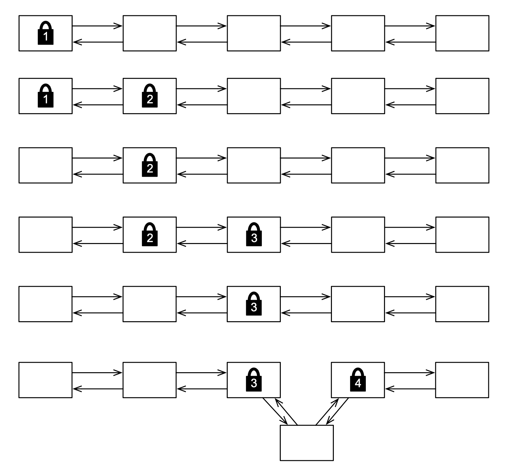

---
authors:
- jwher
description: Seven Concurrency Models in Seven Weeks - Chapter2 Day2
slug: concurrency-models-3
tags:
- tech
- distributed computing
- java
title: 7가지 동시성 모델(스레드와 락) 고유 락 개선하기
---

[](/posts/concurrency-models-3)  
*이 글은 Paul Butcher의 Seven Concurrency Models in Seven Weeks을 읽고 작성했습니다*  

Declaring a method as synchronized is just syntactic sugar for surrounding the method’s body
<!--truncate-->

## Day 2: Beyond Intrinsic Locks

자바 5는 `java.util.concurrent`를 도입하며 모든것이 바뀌었습니다.
이번에는 향상된 락 메커니즘이 제공하는 것을 살펴 보겠습니다.

고유 락은 편리하지만 제한되었습니다.
* 고유 락을 얻기 위해 블락된 스레드를 인터럽트할 수 있는 방법이 없습니다
* 고유 락을 요구하는 동안 시간제한을 할 수 있는 방법이 없습니다.
* 고유 락을 요구하는 방법은 `synchronized` 한 방법 뿐입니다. 이 뜻은 락 점유와 해제가 같은 메소드에서 수행되어야 하고 엄격하게 중첩되야 합니다.

`ReentrantLock`은 명확한 락과 언락 메소드를 `synchronized` 대신 제공하면서 이런 제한을 넘을 수 있게 해줍니다.
어떻게 고유 락을 개선할지 보기 전에, 어떻게 `ReentrantLock`이 `synchronized`를 대체하는지 살펴봅시다.

```java
Lock lock = new ReentrantLock();
lock.lock();
try {
    «use shared resources»
} finally {
    lock.unlock();
}
```
`try ... finally` 구문은 언제나 락이 해제되도록 보장하는 좋은 예제입니다.

### Interruptible Locking

고유 락이 인터럽트가 불가능 하므로, 데드락을 복구할 방법이 없습니다.
데드락을 유발하고 스레드를 통해 인터럽트하는 예제 코드를 살펴봅시다.

```java
public class Uninterruptible {

  public static void main(String[] args) throws InterruptedException {

    final Object o1 = new Object(); final Object o2 = new Object();

    Thread t1 = new Thread() {
      public void run() {
        try {
          synchronized(o1) {
            Thread.sleep(1000);
            synchronized(o2) {}
          }
        } catch (InterruptedException e) { System.out.println("t1 interrupted"); }
      }
    };

    Thread t2 = new Thread() {
      public void run() {
        try {
          synchronized(o2) {
            Thread.sleep(1000);
            synchronized(o1) {}
          }
        } catch (InterruptedException e) { System.out.println("t2 interrupted"); }
      }
    };

    t1.start(); t2.start();
    Thread.sleep(2000);
    t1.interrupt(); t2.interrupt();
    t1.join(); t2.join();
  }
}
```
이 프로그램은 JVM이 죽이지 않는 한 데드락상태가 끝나지 않습니다.

하지만 `ReentrantLock`을 사용해 재구현하면, `lockInterruptibly()` 메서드를 통해 해결할 수 있습니다.
```java {7,9}
final ReentrantLock l1 = new ReentrantLock();
final ReentrantLock l2 = new ReentrantLock();

Thread t1 = new Thread() {
    public void run() {
        try {
>           l1.lockInterruptibly();
            Thread.sleep(1000);
>           l2.lockInterruptibly();
        } catch (InterruptedException e) { System.out.println("t1 interrupted"); }
    }
};
```
이 버전은 `Thread.interrupt()`가 호출되면 깨끗이 종료됩니다.
좀더 지저분해 보이는 구문은, 데드락 스레드에 인터럽트 가능하게 하는 작은 비용입니다.

### Timeouts

`ReentrantLock`은 락을 요구할때 시간제한을 허용함으로써 고유 락의 제한을 해결합니다.
[day1](/posts/concurrency-models-2) 에서 살펴본 “dining philosophers”를 봅시다.

```java {16,21} showLineNumbers
class Philosopher extends Thread {
    private ReentrantLock leftChopstick, rightChopstick;
    private Random random;

    public Philosopher(ReentrantLock leftChopstick, ReentrantLock rightChopstick) {
        this.leftChopstick = leftChopstick;
        this.rightChopstick = rightChopstick;
        random = new Random();
    }

    public void run() {
        try {
            while(true) {
                Thread.sleep(random.nextInt(1000)); // Think for a while leftChopstick.lock();
                try {
>                       if (rightChopstick.tryLock(1000, TimeUnit.MILLISECONDS)) { // Got the right chopstick
                            try {
                                Thread.sleep(random.nextInt(1000)); // Eat for a while
                            } finally { rightChopstick.unlock(); }
                        } else {
>                       // Didn't get the right chopstick - give up and go back to thinking
                        }
                    } finally { leftChopstick.unlock(); }
                }
        } catch(InterruptedException e) {}
    }
}
```
`lock()`을 사용하는 대신, 락을 얻는데 시간제한을 두고 실패하는 `tryLock()`을 사용합니다.
이 버전은 고정된 전역 순서대로 여러 락 요청을 해야하는 규칙을 지키지 않고 데드락에 걸리지 않습니다.
(최소한 영원히 데드락상태이지 않습니다)

<details>
<summary>Livelock</summary>

`tryLock()`은 영원히 데드락에 빠지는걸 막아주지만, 좋은 해결책을 뜻하는 것은 아닙니다.
첫째로 데드락이 발생했을 때 복구하는 방법을 제공하지 데드락을 피하는 방법이 아닙니다.
둘째로 *livelock*이라 불리는 현상에 취약합니다. 모든 스레드가 동시에 시간제한을 초과했을 때 즉시 데드락에 걸릴 수 있습니다.
데드락이 영원히 지속되지 않지만, 진행도 일어나지 않습니다.

이 현상은 각 스레드를 다른 시간제한 값을 설정하며 시간제한을 동시에 발생할 기회를 줄이는 방법 등으로 완화할 수 있습니다.
그러나 시간제한은 좋은 해결책인 경우는 적습니다. 데드락을 피하는 방법이 첫번째로 고민되어야 할 것입니다.

</details>

### Hand-over-Hand Locking

연결 리스트에 한 엔트리를 추가하길 원하는 상황을 가정해 봅시다.
한 방법은 전체 리스트를 보호하는 하나의 락을 가지는 접근 방법이 있습니다.
이 방법은 락이 걸렸을때 아무도 리스트에 접건할 수 없음을 의미합니다.
*Hand-over-hand* 락은 리스트의 작은 부분만 락을 하는 대안으로,
다른 스레드가 락이 걸린 특정 노드를 제외하고 자유롭게 접근할 수 있도록 하는 방법입니다.

  
*Hand-over-hand locking*  

노드를 삽입하려는 위치의 양 옆을 락해야 합니다.
1번과 2번 노드를 락하며 시작합니다.
새 노드를 삽입하기 위해 락을 해야하는 맞는 지점이 아니기 때문에 1번 노드의 락을 해제하고 3번 노드를 락합니다.
여전히 맞는 지점이 아니기 때문에 2번 노드의 락을 해제하고 4번 노드를 락합니다.
이 과정을 적절한 위치를 찾을때까지 반복하고, 새 노드를 넣습니다.
마지막으로 삽입한 위치의 노드 양 옆의 락을 해제합니다.

이 락과 언락은 고유 락으로 불가능합니다. 하지만 `ReentrantLock`은 우리가 `lock()`과 `unlock()`을 원하는 시점에 호출할 수 있어 가능합니다. 여기 이 방법으로 정렬 링크드 리스트를 구현한 클래스입니다.

```java showLineNumbers
class ConcurrentSortedList {

  private class Node {
    int value;
    Node prev;
    Node next;
    ReentrantLock lock = new ReentrantLock();

    Node() {}

    Node(int value, Node prev, Node next) {
      this.value = value; this.prev = prev; this.next = next;
    }
  }

  private final Node head;
  private final Node tail;

  public ConcurrentSortedList() {
    head = new Node(); tail = new Node();
    head.next = tail; tail.prev = head;
  }

  public void insert(int value) {
    Node current = head;
    current.lock.lock(); 
    Node next = current.next;
    try {
      while (true) {
        next.lock.lock(); 
        try {
          if (next == tail || next.value < value) { 
            Node node = new Node(value, current, next); 
            next.prev = node;
            current.next = node;
            return; 
          }
        } finally { current.lock.unlock(); } 
        current = next;
        next = current.next;
      }
    } finally { next.lock.unlock(); } 
  }
}
```

`insert()` 메서드는 새로 삽입되는 항목보다 작은 엔트리가 나올때까지 찾으며 리스트가 언제나 정렬된 상태를 보장합니다.
이를 찾으면 새 노드를 직전에 삽입해 해결합니다.

<!-- 코드 설명 생략 -->

삽입 뿐만 아니라 리스트에 안전하게 자리잡을 수 있게 다른 연산도 지원합니다.
여기 리스트에 얼마나 많은 개체가 있는지 세는 메서드가 있습니다.

```java
public int size() {
    Node current = tail;
    int count = 0;

    while (current.prev != head) {
        ReentrantLock lock = current.lock;
        lock.lock();
        try {
            ++count;
            current = current.prev;
        } finally { lock.unlock(); }
    }
    return count;
}
```

<details>
<summary>Global Ordering 규착을 깨지 않나요?</summary>

`ConcurrentSortedList`의 `insert()`는 리스트의 head부터 tail로 찾습니다.
`size()`는 리스트의 tail부터 head로 움직입니다.
이게 "항상 전역으로 고정된 순서대로 여러 락을 얻는" 규칙을 위배하지 않나요?

그렇지 않습니다. `size()` 메서드는 절대 *여러* 락을 잡고있지 않습니다.
한번에 하나의 락 이상으로 갖지 않기 때문입니다.

</details>

### Condition Variables

동시성 프로그래밍은 종종 어떤 일이 일어나길 기다리는것에 연관됩니다.
아마 큐에서 개체를 제거하기 전에 비지 않은 상태인지 기다려야 할 것입니다.
또는 버퍼에 개체를 추가할 때 가능한 공간이 있는지 기다려야 합니다.
이런 상황을 해결하기 위해 컨디션 변수가 디자인되어야 합니다.

컨디선 변수를 효과적으로 사용하기 위해, 특별한 패턴을 따라야 합니다.

```java
ReentrantLock lock = new ReentrantLock();
Condition condition = lock.newCondition();

lock.lock();
try {
    while (!«condition is true»)
        condition.await();
    «use shared resources»
} finally { lock.unlock(); }
```

컨디션 변수는 락과 관련있습니다. 그리고 스레드는 조건이 가능할 때까지 락을 쥐고 있어야 합니다.
락을 쥐고 있는 동안 조건이 참인지 확인합니다.
조건이 참이 되면 하려고 하는 일을 하고 락을 해제합니다.

만약 조건이 참이 아니라면 `await()`를 호출해 *자동으로* 락을 해제하고 컨디션 변수를 블록합니다.
다른 스레드의 관점에서, 연산이 일어났는지 아닌지 둘중 하나인 하나의 연산으로 보이고, 절반만 된 상태가 없기 때문에, 연산이 *atomic* 하다고 할 수 있습니다.

다른 스레드가 `signal()` 또는 `signalAll()`을 호출해 조건이 참이 됨을 알리면,
`await()`는 블록을 해제하고 자동으로 락을 다시 요구합니다.
중요한 점은 `await()`이 리턴하는 시점입니다. 이는 단지 조건이 참 *일수도* 있다는걸 나타내기 때문입니다.
이게 `await()`이 루프 안에서 불리는 이유입니다. 다시 돌아가 조건이 참인지 확인하고 `await()`을 필요하면 다시 호출해야 합니다.

이는 "식사하는 철학자" 문제에 다른 해결책을 제시합니다.
```java
class Philosopher extends Thread {
    private boolean eating;
    private Philosopher left;
    private Philosopher right;
    private ReentrantLock table;
    private Condition condition;
    private Random random;

    public Philosopher(ReentrantLock table) {
        eating = false;
        this.table = table;
        condition = table.newCondition();
        random = new Random();
    }

    public void setLeft(Philosopher left) { this.left = left; }
    public void setRight(Philosopher right) { this.right = right; }

    public void run() {
        try {
            while (true) {
                think();
                eat();
            }
        } catch (InterruptedException e) {}
    }

    private void think() throws InterruptedException {
        table.lock();
        try {
            eating = false;
            left.condition.signal();
            right.condition.signal();
        } finally { table.unlock(); }
        Thread.sleep(1000);
    }

    private void eat() throws InterruptedException {
        table.lock();
        try {
            while (left.eating || right.eating)
                condition.await();
            eating = true;
        } finally { table.unlock(); }
        Thread.sleep(1000);
    }
}
```

이 해결책은 `chopstick`이 아닌 `table` 하나의 락을 사용하여 다릅니다.
철학자가 양 옆의 식사하는 이웃과 동시에 식사할 수 없다는 사실을 이용합니다.
다른말로, 배고픈 철학자는 이 조건을 기다립니다.

```java
!(left.eating || right.eating)
```

철학자가 배고프면 먼저 식탁에 락을 걸어 다른 철학자가 상태 변화를 할 수 없게 합니다.
그리고 이웃이 먹고있는지 확인합니다. 그렇지 않다면 먹기 시작하고 식탁의 락을 해제합니다.
먹는중이였다면 (식탁의 락을 해제하는) `await()`을 호출합니다.

철학자가 식사를 끝내고 생각을 하길 원한다면, 먼저 식탁에 락을 걸고 식사중이지 않음을 설정합니다.
그리고 이웃에게 신호를 보내 식사가 가능함을 알리고 식탁의 락을 해제합니다.
만약 이웃이 현재 대기중이였으면, 깨어나 식탁의 락을 요구하고, 그들이 먹을 수 있는 상태인지 살펴볼 것입니다.

비록 살펴본 해결책중 코드가 더 복잡하지만, 더 나은 동시성을 제공합니다.
이전 해결책은 다른 철학자들이 하나의 젓가락을 가지고 다른사람을 기다리느라 한명만 식사를 하는 경우가 종종 있었습니다.
이 해결책으로는 이론적으로 먹을 수 있는 상태라면(이웃이 먹고있지 않을 때) 먹을 수 있습니다.

### Atomic Variables

[day 1](/posts/concurrency-models-2#our-first-lock)에서 `increment()` 메서드에 동기화를 사용해 멀티스레드 카운터를 고정시켰습니다.
이제 `java.util.concurrent.atomic`이 더 좋은 옵션을 주는 것을 보여줍니다.

```java
public class Counting {
    public static void main(String[] args) throws InterruptedException {
        final AtomicInteger counter = new AtomicInteger();
        
        class CountingThread extends Thread {
            public void run() {
                for(int x = 0; x < 10000; ++x)
                    counter.incrementAndGet();
            }
        }

        CountingThread t1 = new CountingThread();
        CountingThread t2 = new CountingThread();

        t1.start(); t2.start();
        t1.join(); t2.join();

        System.out.println(counter.get());
    }
}
```

`AtomicInteger`의 `incrementAndGet()` 메서드는 기능적으로 `++count`와 같습니다.
(`count++`와 같은 `getAndIncrement()` 또한 제공합니다)
`++count`와 다르게 이는 원자성을 가집니다.

락 대신에 atomic 변수를 사용하는건 많은 이점이 있습니다.
첫째로 락을 필요할때 요구하는 것을 잊지 않습니다.
예를들어, `getCount()`가 동기화되지 않아 발생한 `Counter`의 memory-visible 문제가 이 코드에서 발생할 수 없습니다.
둘째로 어떤 락도 관련되어있지 않기 때문에 atomic 변수를 데드락에 걸리게 하는 연산은 불가능합니다.
마지막으로, atomic 변수는 락이나 블록 없이 달성하는 *non-blocking*, *lock-free* 알고리즘의 기초입니다.
락이 들어간 프로그램이 다루기 어렵다고 생각하면, lock-free 코드를 짤 수 있을때까지 기다리세요.
다행이 `java.util.concurrent`는 lock-free 코드가 가능하고 만들어 고통 없이 이점을 얻을 수 있습니다.
이 클래스는 [day3](/posts/concurrency-models-4)에서 다룹니다.

<details>
<summary>Volatile은 어떤가요?</summary>

자바는 변수를 *volatile*로 표시해 읽고 쓰는 순서가 바뀌지 않게 보장합니다.
[`Puzzle`](/posts/concurrency-models-2/#-mysterious-memory)의 `answerReady`를 volatile로 만들어 해결할 수 있습니다.

Volatile은 동기화에 매우 약합니다.
예를들어 `count`를 volatile로 만들어도 `count++`가 atomic하게 동작하는것을 보장하지 않기 때문에,
`Counter`를 해결하는데 도움을 주지 않습니다.

최근에 고도로 최적화된 JVM은 락에 매우 적은 오버헤드를 지니고 volatile 변수를 사용하는게 맞는 경우는 적습니다.
`volatile` 사용을 고려하고 있다면 `java.util.concurrent.atomic` 클래스를 사용하는걸 먼저 고려해보세요.

</details>

## Day 2 Wrap-Up

day1에서 기본적으로 배운 것에 `java.util.concurrent.locks`와 `java.util.concurrent.atomic`에서 제공하는 더 세련되고 유연한 방법을 배웠습니다.
이 방법을 이해하는게 중요하지만, lock을 직접 사용해야 하는 예제를 day3에서 살펴볼 것입니다.

### What We Learned in Day 2

`ReentrantLock`과 `java.util.concurrent.atomic`이 다음에 나오는 것을 할 수 있어 고유 락의 제한을 극복하는 것을 확인했습니다.  
* 락을 요구하는 중에 interrupt
* 락을 요구하는데 시간제한
* 어떤 순서로든 락 요구 및 해제
* 중재를 위한 조건이 참이 될때까지 기다리는 컨디션 변수
* atomic 변수를 사용해 락 사용을 완전히 회피

### Day 2 Self-Study

찾아보기  
* ReentrantLock supports a fairness parameter. What does it mean for a lock to be “fair”? Why might you choose to use a fair lock? Why might you not?
* What is ReentrantReadWriteLock? How does it differ from ReentrantLock? When might you use it?
* What is a “spurious wakeup”? When can one happen and why doesn’t a well-written program care if one does?
* What is AtomicIntegerFieldUpdater? How does it differ from AtomicInteger? When might you use it?

실습  

What would happen if the loop within the “dining philosophers” implementation that uses condition variables was replaced with a simple if statement? What failure modes might you see? What would happen if the call to signal() was replaced by signalAll()? What problems (if any) would this cause?

Just as intrinsic locks are more limited than ReentrantLock, they also support a more limited type of condition variable. Rewrite the dining philosophers to use an intrinsic lock plus the wait() and notify() or notifyAll() methods. Why is it less efficient than using ReentrantLock?

Write a version of ConcurrentSortedList that uses a single lock instead of hand-over-hand locking. Benchmark it against the other version. Does hand-over-hand locking provide any performance advantage? When might it be a good choice? When might it not?
