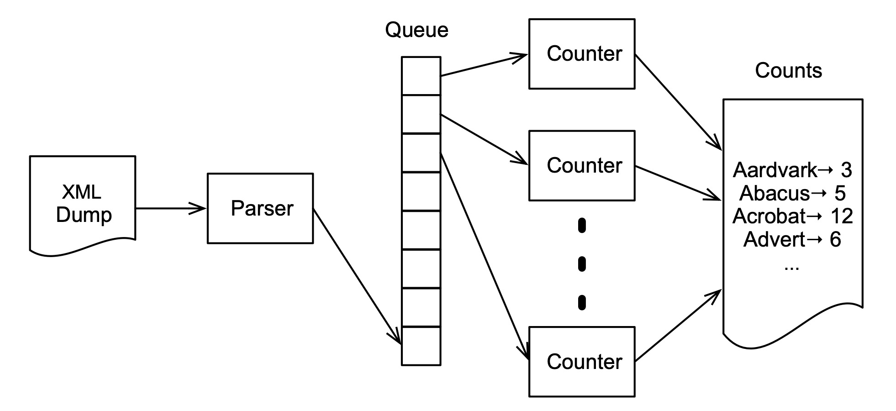
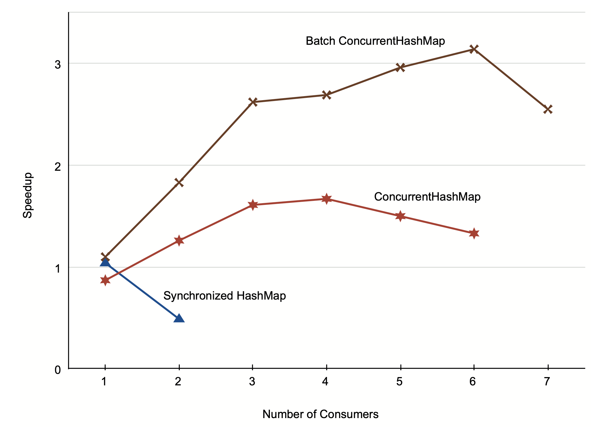

---
authors:
- jwher
description: Seven Concurrency Models in Seven Weeks - Chapter2 Day3
slug: concurrency-models-4
tags:
- tech
- distributed computing
- java
title: 7가지 동시성 모델(스레드와 락) 거인의 어깨 위에서
---

[](/posts/concurrency-models-4)  
*이 글은 Paul Butcher의 Seven Concurrency Models in Seven Weeks을 읽고 작성했습니다*  

Nanos gigantum humeris insidentes
<!--truncate-->

## Day 3: On the Shoulders of Giants

[Day2](/posts/concurrency-models-3)에서 `java.util.concurrent`가 포함하는
광범위하고, 고성능에, 완전히 디버그된 동시성 데이터 구조와 유용성이 강화된 락을 다뤘습니다.
오늘은 자체 해결책을 만드는 것보다 이를 사용하는게 더 좋다는것을 보일 것입니다.

### Thread-Creation Redux

[day1](/posts/concurrency-models-3)에서는 어떻게 스레드를 시작하는지 보았습니다.
하지만 스레드를 직접 만들어서 제대로 작동하게 되는 경우는 드뭅니다.
여기 어떤것을 보내던 메아리(echo)치는 서버가 있습니다.

```java {25-27}
public class EchoServer {

    public static void main(String[] args) throws IOException {
        class ConnectionHandler implements Runnable {
            InputStream in; OutputStream out;
            ConnectionHandler(Socket socket) throws IOException {
                in = socket.getInputStream();
                out = socket.getOutputStream();
            }

            public void run() {
                try {
                    int n;
                    byte[] buffer = new byte[1024];
                    while((n = in.read(buffer)) != -1) {
                        out.write(buffer, 0, n);
                        out.flush();
                    }
                } catch (IOException e) {}
            }
        }

        ServerSocket server = new ServerSocket(4567);
        while (true) {
>           Socket socket = server.accept();
>           Thread handler = new Thread(new ConnectionHandler(socket));
>           handler.start();
        }
    }
}
```

강조된 라인은 들어오는 연결을 수락하고 새 스레드를 만들어 처리하는 일반적인 패턴을 따릅니다.
이것은 잘 작동하나 몇가지 문제를 겪습니다.
첫째로 스레드 생성이 싸지만, 공짜는 아닙니다. 이 디자인은 매 연결마다 값을 치를 겁니다.
둘째로 연결 만큼 커넥션을 생성합니다. 커넥션이 처리될 수 있는 양보다 빠르게 들어오면 스레드가 증가할 것이고 서버는 멈추거나 고장날 것입니다.
이는 Denial-of-Service(DoS) 공격에 완전히 열려있습니다.

스레드 풀을 사용해서 문제를 해결할 수 있습니다.
```java
int threadPoolSize = Runtime.getRuntime().availableProcessors() * 2;
ExecutorService executor = Executors.newFixedThreadPool(threadPoolSize);
while (true) {
    Socket socket = server.accept();
    executor.execute(new ConnectionHandler(socket));
}
```

이 코드는 가능한 프로세스의 두배의 스레드를 생성합니다.
`execute()`요청이 한 순간에 더 많이 들어온다면 스레드가 사용가능할때까지 큐에 들어갈 것입니다.
이 뜻이 연결마다 생성되는 스레드의 오버헤드에 손해를 입지 않는게 아닙니다.
그러나 서버가 높은 부하에서 동작 가능한 것을 보장합니다.
(모든 요청이 빠르게 처리되기 충분하지 않겠지만, 적어도 몇은 처리될 것입니다)

### Copy on Write

[day1](/posts/concurrency-models-2#the-perils-of-alien-methods)에서 동시성 프로그램에서 어떻게 리스너를 안전하게 부를 수 있는지 살펴봤습니다.
`updateProgress()`를 변경해 방어적인 복사를 했던 것을 상기해봅시다. [code](/posts/concurrency-models-2#the-perils-of-alien-methods)
자바 표준 라이브러리가 제공하는 더 세런되고 준비된 `CopyOnWriteArrayList` 해결책이 있습니다.

```java
private CopyOnWriteArrayList<ProgressListener> listeners;

public void addListener(ProgressListener listener) {
    listeners.add(listener);
}
public void removeListener(ProgressListener listener) {
    listeners.remove(listener);
}
private void updateProgress(int n) {
    for (ProgressListener listener: listeners)
        listener.onProgress(n);
}
```

이름에서 알 수 있다시피. `CopyOnWriteArrayList`는 이전 방어적 복사 전략을 처음부터 뒤집습니다.
리스트를 순회하기 전에 복사본을 만드는 대신에, 변경사항이 있으면 복사합니다.
존재하는 이터레이터는 이전 복사본을 계속 참조할 것입니다.
이는 많은 사용사례에서 적절한 접근 방법이 아니지만 여기에선 적합한 방법입니다.

첫째로 결과물이 매우 명확하고 간결한 코드를 만든다는 것입니다.
사실 `listeners`의 정의와 별개로 day1에서 단순하게 만든 스레드 안전하지 않은 버전과 동일합니다.
둘째로 `updateProgress()`이 호출될 때마다 복사할 필요가 없고, `listeners` 만 수정하면 되어 더 효과적입니다.

<details>
<summary>How Large Should My Thread Pool Be?</summary>

스레드의 적절한 크기는 실행하는 하드웨어,
IO나 CPU bound 어떤 것에 관련 있는지,
기계가 어떤 것을 같은 시간에 실행시키는지,
기타 다른 요인들에 따라 다릅니다.

그렇지만, 좋은 경험 법칙은 계산 집약적인 작업의 경우 사용 가능한 코어와 거의 같은 수의 스레드를 갖는 것입니다.
더 많은 숫자가 IO 집약적인 작업에서 적절할 수 있습니다.

이 경험 첩칙을 너머, 실제적인 부하 테스트를 하는것이 최선일 것입니다.

</details>

### A Complete Program

현재까지 격리된 독립적인 도구를 살펴봤습니다.
다시 상기하자면, 작지만 현실적인 문제를 해결하려고 합니다.
위키피디아에서 가장 많이 사용되는 단어가 무엇일까요?

이는 찾기 쉬울 것입니다. XML 덤프를 다운로드 받아 단어수를 세는 프로그램을 만듭니다.
덤프 크기가 40GiB정도 되어 좀 걸리겠지만, 병렬화를 통해 속도를 높일 수 있을 것입니다.

베이스라인을 시작합시다.
첫 10만장에서 단어를 세는 sequential 프로그램은 얼마나 걸릴까요?

```java
public class WordCount {
    private static final HashMap<String, Integer> counts =
        new HashMap<String, Integer>();

    public static void main(String[] args) throws Exception {
        Iterable<Page> pages = new Pages(100000, "enwiki.xml");
        for(Page page: pages) {
            Iterable<String> words = new Words(page.getText());
            for (String word: words)
                countWord(word);
        }
    }

    private static void countWord(String word) {
        Integer currentCount = counts.get(word);
        if (currentCount == null)
            counts.put(word, 1);
        else
            counts.put(word, currentCount + 1);
  }
}
```

저자의 맥북 프로에선 105초 미만으로 걸립니다.

병렬 버전을 어디에서 시작하면 될까요? 메인 루프에서 각 순회마다 두 작업을 합니다.
처음엔 XML에서 `Page`를 파싱하고, 텍스트에서 단어를 셉니다.

*producer-comsumer* 패턴은 이 문제를 해결하기 위한 고전적인 패턴입니다.
한 스레드가 값을 만들고 소비하는 대신, producer와 consumer 두 스레드를 만듭니다.

여기에 producer를 구현한 `Parser`가 있습니다.

```java {10-12}
class Parser implements Runnable {
    private BlockingQueue<Page> queue;

    public Parser(BlockingQueue<Page> queue) {
        this.queue = queue;
    }

    public void run() {
        try {
>           Iterable<Page> pages = new Pages(100000, "enwiki.xml");
>           for (Page page: pages)
>               queue.put(page);
        } catch (Exception e) { e.printStackTrace(); }
    }
}
```

`run()` 메서드는 이전의 sequential 해결책으로 이루어진 외부 루프를 포함합니다.
대신 새로 파싱된 페이지의 단어를 세는 대신에 큐의 꼬리에 넣습니다.

여기 대응하는 consumer가 있습니다.

```java {13,17-19}
class Counter implements Runnable {
    private BlockingQueue<Page> queue;
    private Map<String, Integer> counts;

    public Counter(BlockingQueue<Page> queue, Map<String, Integer> counts) {
        this.queue = queue;
        this.counts = counts;
    }

    public void run() {
        try {
            while(true) {
>               Page page = queue.take();
                if (page.isPoisonPill())
                    break;

>               Iterable<String> words = new Words(page.getText());
>               for (String word: words)
>                   countWord(word);
            }
        } catch (Exception e) { e.printStackTrace(); }
    }
}
```

예상하셨을지 모르겠지만, sequential 해결책이 내부에 포함되어 있고, 큐에서 값을 가져옵니다.

마지막으로 수정된 버전의 두 스레드를 생성하는 메인 루프입니다.

```java
ArrayBlockingQueue<Page> queue = new ArrayBlockingQueue<Page>(100);
HashMap<String, Integer> counts = new HashMap<String, Integer>();

Thread counter = new Thread(new Counter(queue, counts));
Thread parser = new Thread(new Parser(queue));

counter.start();
parser.start();
parser.join();
queue.put(new PoisonPill());
counter.join();
```

`java.util.concurrent`의 `ArrayBlockingQueue`는 동시성 큐로 producer-consumer 패턴을 구현합니다.
이는 단지 효율적인 `put()`과 `take()` 메서드를 제공하는게 아닌 필요할때만 블록합니다.
빈 큐에서 `take()` 하려는 것은 큐가 비지 않을 때까지 큐를 블록합니다.
가득 찬 큐에서 `put()` 하려는 것은 큐가 빌때까지 큐를 블록합니다.

<details>
<summary>Why a Blocking Queue?</summary>

블로킹 큐와 같이 `java.util.concurrent`는 unbounded, wait-free, nonblocking 큐인 `ConcurrentLinkedQueue`를 제공합니다.
마치 필요한 것만 있는 것 같은데 왜 이 문제에 좋은 선택이 아닐까요?

이 문제는 producer와 consumer가 같은 속도로 동작하지 않는다는 것입니다.
특히 producer가 더 빠르게 동작하면 큐는 점점 더 커집니다.
여기서 사용한 위키피디아 덤프는 40GiB 정도입니다. 이는 쉽게 메모리에 너무 큰 큐를 만듭니다.

따라서 블로킹 큐를 사용해 producer가 consumer보다 앞에 있는걸 허용하지만, 너무 많이가지 못하게 합니다.

</details>

이 문제에 다른 흥미로운 점은 consumer가 언제 종료되어야 할지 아는 것입니다.

```java
if (page.isPoisonPill())
    break;
```

이름이 보이듯 *poison pill*은 언제 데이터가 끝에 도달하고 consumer가 종료해야하는지 알려주는 특별 토큰입니다.
C/C++에서 end of string에 사용하는 null character와 같은 역할을 합니다.

좋은 소식은 속도 향상이 있다는 것입니다.
(저자의 컴퓨터에선 95초로 10초 빨라졌습니다.)
하지만 더 좋게 할 수 있습니다.
producer-consumer 패턴의 장점은 다중 producer와 consumer에도 적용할 수 있다는 것입니다.

하지만 producer와 consumer중 어디에 더 집중해야 할까요? 어느 부분에 시간이 더 소요될까요?
저자가 stopwatch로 확인했을때 문서 파싱은 10초 소요되었습니다.
잠깐 생각하면 놀랍지 않은게, 순차적인 방법이 105초가 걸리고 producer-consumer가 95초가 걸렸습니다.
명확하게 10초가 파싱(producer)에, 95초가 단어를 세는데(consumer) 사용됬습니다.
병렬적으로 진행하며 10초를 아낀 것입니다.

따라서 성능을 더 개선하기 위해 consumer의 개수를 늘려야 합니다.



다중 스레드가 단어를 동시에 세려면, `count` 맵에 동기적인 접근하는 방법을 찾아야 합니다.

첫번째로 고민할 수 있는 방법은 `Colleections`에서 반환하는 `synchronizedMap()`을 사용하는 것입니다.
불행히 synchronized collections는 atomic 읽기-수정-쓰기 메서드를 제공하지 않습니다.
`HashMap`을 쓰고자 한다면, 직접 동기적인 접근을 해야합니다.

여기 정확히 동기적인 접근을 하는 수정된 `countWord()` 메서드가 있습니다.
```java {2,9}
private void countWord(String word) {
>   lock.lock();
    try {
        Integer currentCount = counts.get(word);
        if (currentCount == null)
            counts.put(word, 1);
        else
            counts.put(word, currentCount + 1);
>   } finally { lock.unlock(); }
}
```

여기 다중 consumer를 실행하는 수정된 메인 루프가 있습니다.
```java
ArrayBlockingQueue<Page> queue = new ArrayBlockingQueue<Page>(100);
HashMap<String, Integer> counts = new HashMap<String, Integer>();
ExecutorService executor = Executors.newCachedThreadPool();
for (int i = 0; i < NUM_COUNTERS; ++i)
    executor.execute(new Counter(queue, counts));
Thread parser = new Thread(new Parser(queue));
parser.start();
parser.join();
for (int i = 0; i < NUM_COUNTERS; ++i)
    queue.put(new PoisonPill());
executor.shutdown();
executor.awaitTermination(10L, TimeUnit.MINUTES);
```

다중 스레드를 관리하기 편하게 thread pool로 바꾼것을 빼고 이전것과 비슷합니다.
깨끗이 종료하기 위해 정확한 숫자의 poison pill을 큐에 넣는 것이 중요합니다.

보기에 좋지만 꿈을 짖밟는 결과를 봅시다.


| Consumer | Time(s) | Speedup |
|----------|---------|---------|
| 1        | 101     | 1.04    |
| 2        | 212     | 0.49    |

왜 consumer를 추가한게 더 느려졌을까요? 약간 느려진것도 아닌 두배나?
답은 너무 많은 스레드가 하나의 공유 자원에 동시에 접근해 과도한 경쟁이 발생했기 때문입니다.
여기에선 `count` 맵에 접근할때 locked여서 unlock 할때까지 유용한 일을 하는 대신 대기시간이 더 길었기 때문입니다.

행복하게도, `java.util.concurrent`에선 `ConcurrentHashMap`이 우리가 정확히 필요한 것입니다.
atomic 읽기-수정-쓰기 메서드만 제공하는게 아니라 lock striping이라 불리는 기술을 사용해 고수준의 동시성 접근을 허용하기 때문입니다.

여기에 `ConcurrentHashMap`을 사용한 수정된 `countWord()`가 있습니다.
```java
private void countWord(String word) {
    while (true) {
        Integer currentCount = counts.get(word);
        if (currentCount == null) {
            if (counts.putIfAbsent(word, 1) == null)
                break;
        } else if (counts.replace(word, currentCount, currentCount + 1)) {
            break;
        }
    }
}
```

정확히 어떻게 작동하는지 이해하기 위해 작은 시간을 소모할만 합니다.
`put()`을 사용하는 대신 `putIfAbsent()`와 `replace()`를 조합합니다.
여기 `putIfAbsent()`에 대한 문서가 있습니다.

> If the specified key is not already associated with a value, associate it with the given value. This is equivalent to
> ```java
> if (!map.containsKey(key))
>   return map.put(key, value);
> else
>   return map.get(key);
> ```
> except that the action is performed atomically.

`replace()`에 대한 문서입니다.

> Replaces the entry for a key only if currently mapped to a given value. This is equivalent to
> ```java
> if (map.containsKey(key) && map.get(key).equals(oldValue)) {
>   map.put(key, newValue);
>   return true;
> } else return false;
> ```
> except that the action is performed atomically.

따라서 이 함수를 언제 호출하던, 반환값을 확인 후 예상대로 변화를 만들었는지 확인합니다.
그렇지 않다면 루프를 돌아 다시 시도합니다.

이 버전에서 스톱워치는 더 좋은 결과를 보여줍니다.

| Consumer | Time(s) | Speedup |
|----------|---------|---------|
| 1        | 120     | 0.87    |
| 2        | 83      | 1.26    |
| 3        | 65      | 1.61    |
| 4        | 63      | 1.67    |
| 5        | 70      | 1.50    |
| 6        | 79      | 1.33    |

성공했습니다! 이번에는 더 많은 consumer가 적어도 4 초과하기 전까지 속도를 빠르게 해주었습니다.
63초는 105초보다 더 빠르긴 하지만, 두배로 빠르지 않습니다.
저자의 맥북은 4코어입니다. 4배의 속도 향상에 가까워 질 순 없을까요?

약간의 생각을 해보면, 이 해결책이 `counts` 맵에 더 많은 경쟁을 만드는게 확실합니다.
각 consumer가 공유된 카운터를 동시에 업데이트 하기보다, 로컬 카운트를 가지고 종료하기 전에 합치는게 낫습니다.

```java
private void mergeCounts() {
    for (Map.Entry<String, Integer> e: localCounts.entrySet()) {
        String word = e.getKey();
        Integer count = e.getValue();
        while (true) {
            Integer currentCount = counts.get(word);
            if (currentCount == null) {
                if (counts.putIfAbsent(word, count) == null)
                    break;
            } else if (counts.replace(word, currentCount, currentCount + count)) {
                break;
            }
        }
    }
}
```

이는 이상적인 4배 속도 향상에 더 가깝습니다.

| Consumer | Time(s) | Speedup |
|----------|---------|---------|
| 1        | 95      | 1.10    |
| 2        | 57      | 1.83    |
| 3        | 40      | 2.62    |
| 4        | 39      | 2.69    |
| 5        | 35      | 2.96    |
| 6        | 33      | 3.14    |
| 7        | 41      | 2.55    |

이 버전은 consumer를 추가했을 때 성능이 더 빨라질 뿐만 아니라, 4개 이상일때도 속도가 증가합니다.
이는 저자의 맥북 코어가 하다당 두 [하이퍼스레드](/categories/cs/computer-organization)를 지원하기 때문입니다(intel).
`availableProcessors()`는 물리 코어가 4개여서 실제론 8을 반환합니다.



이 그래프는 세가지 버전의 퍼포먼스를 보여줍니다.
성능은 처음에 선형으로 증가하다 폭이 줄어들고, 결국엔 피크에 도달한 후 느려집니다.

잠시 당신이 한 것을 돌아볼 필요가 있습니다.
여기에서 concurrent queue와 concurrent map을 사용해 좀더 세련된 producer-consumer 프로그램을 만들었습니다.
또한 standard library의 도움을 받아 어떠한 명시적인 락 없이 구현했습니다.

## Day 3 Wrap-Up
3일차에서 스레드와 락을 사용한 프로그래밍 논의를 마치려고 합니다.
### What We Learned in Day 3

`java.util.concurrent`가 쉽고 더 안전하고 더 효율적인 기능을 제공하는것을 살펴보았습니다.

* 스레드를 직접 생성하는 대신 스레드 풀을 사용
* `CopyOnWriteArrayList`를 사용해 더 효과적이고 단순한 리스너 관리 코드 생성
* `ArrayBlockingQueue`를 사용해 producer와 consumer가 소통 허용
* `ConcurrentHashMap`을 통해 맵에 대한 높은 동시성 접근 허용

### Day 3 Self-Study

찾아보기  

* The documentation for `ForkJoinPool`—how does a fork/join pool differ from a thread pool? When might you prefer one, and when the other?
* What is *work-stealing* and when might it be useful? How would you implement work-stealing with the facilities provided by `java.util.concurrent`?
* What is the difference between a `CountDownLatch` and a `CyclicBarrier`? When might you use one, and when the other?
* What is Amdahl’s law? What does it say about the maximum theoretical speedup we might be able to get for our word-counting algorithm?

실습  

* Rewrite the producer-consumer code to use a separate “end of data” flag instead of a poison pill. Make sure that your solution correctly handles the cases where the producer runs faster than the consumer and vice versa. What will happen if the consumer has already tried to remove something from the queue when the “end of data” flag is set? Why do you think that the poison-pill approach is so commonly used?
* Run the different versions of the word-count program on your computer, as well as any others you can get access to. How do the performance graphs differ from one computer to another? If you could run it on a computer with 32 cores, do you think you would see anything close to a 32x speedup?

<br/><br/>

# Wrap-Up

스레드와 락 프로그래밍은 아마 다른 기술보다 더 많은 의견을 나눈 것입니다.
이는 올바르게 하기 매우 어렵다는 명성이 있고, 많은 프로그래머가 축소해 어떤 희생을 치르더라도 멀티스레드 프로그래밍을 피합니다.
다른사람이 이해하지 못해도, 몇가지 간단한 규칙만 따르면 프로그래밍에 어려움이 없을 것입니다.

## Strengths

스레드와 락의 주요 강점은 광범위하게 적용할 수 있는 모델이라는 것입니다.
예상할 수 있듯이, 우리가 나중에 다룰 많은 접근방식의 기초라는 점을 감안할 때, 광범위한 문제에 적용할 수 있습니다.
이는 실제 하드웨어가 하는 것에 더 가깝기 때문에, 올바르게 사용한다면 매우 효율적일 것입니다.
또한 매우 작은 문제부터 큰 범위까지 세부 문제를 해결하는데 사용될 수 있다는 것입니다.

게다가, 대부분 프로그래밍 언어에 쉽게 통합할 수 있습니다.
언어 디자이너는 적은 노력으로 명령형이나 객체지향 언어에 스레드와 락을 추가할 수 있습니다.

## Weaknesses

스레드와 락은 병렬처리를 직접 지원하지 않습니다. [intro](/posts/concurrency-models-1#concurrent-or-parallel)

몇몇 실험적인 분산 메모리 공유 시스템에 의해 스레드와 락은 공유 메모리 아키텍처만 지원합니다.
분산 메모리를 지원하는 경우, 다른 곳을 찾아야 합니다. 이는 스레드와 락이 단일 시스템 문제를 해결하기에 너무 크기 때문입니다.

가장 큰 약점은 스레드와 락 프로그램이 어려워 접근하기 힘들다는 것입니다.
언어 디자이너가 스레드와 락을 언어에 추가하는 건 쉬울 수 있지만, 실력이 떨어지는 프로그래머에겐 도움이 되지 않을 것입니다.

### The Elephant in the Room

멀티스레드 프로그램이 어렵다는 말은, 작성하기가 아니라 *테스트* 하기가 어렵다는 것입니다.
이는 빠질 수 있는 함정이 아니라, 빠졌는지 알 수도 없는 함정입니다.

메모리 모델을 예로 들어보면, [day1](/posts/concurrency-models-2#memory-visibility)에서 두 스레드가 동기화 없이 메모리 위치에 엑세스하면 모둔 종류의 이상한 일이 일어날 수 있습니다.
하지만 틀린 것을 어떻게 알까요? 적절한 동기화 없이 메모리에 절대 접근할 수 없다는것을 증명하기 위해 어떤 테스트를 작성하겠습니까?

안타깝게도 방법이 없습니다. 당신은 스트레스 테스트를 위해 무언가 쓸 수 있지만,
그 테스트를 통과한다고 해서 그게 옳다는 것을 의미하지 않습니다.
[식사하는 철학자](/posts/concurrency-models-2#multiple-locks) 문제에서도 문제가 잘못된걸 알았지만, 일주일 이상 시행되는 것을 보았습니다.

스레딩 버그가 드물게 발생하는 것도 문제의 큰 부분입니다.
문제가 10분마다 발생하면 빨리 찾겠지만, 문제의 재발을 위해 몇달간 서버를 실행시켜야 한다면 디버깅하는건 사실상 불가능합니다.

더 나쁜 것은, 철저하고 오랫동안 테스트하면 스레딩 버그가 없는 프로그램을 작성하는 것이 가능하다는 것입니다.
엑세스 메모리 접근이 재정렬될 수 있다고 해도, 실재로 일어나지 않습니다.
이 문제는 JVM을 업그레이드 하거나 다른 하드웨어로 옮길때 갑자기 마주하는 아무도 이해못하는 신비한 실패로 맞닥드릴 것입니다.

### Maintenance

이 문제는 코드를 작성할때도 끔직하지만, 코드가 그대로 있는 경우는 거의 없습니다.
한가지 사실은 모둔 것이 정확하게 동기화 되야 하는 것입니다.
락은 순서대로 요구되고, 외부 함수가 락중에 호출되선 안됩니다.
다른 10명의 프로그래머가 12개월간 유지보수를 해도 그렇게 유지될 수 있는지는 또 다른 문제입니다.
지난 10년간 우리는 자동화된 테스트로 리팩토링을 자신있게 할 수 있었습니다.
하지만, 스레드 문제를 테스트를 신뢰할 수 없다면,
멀티스레드 코드 리팩토링도 신뢰할 수 없습니다.

결론은 멀티스레드 코드에 매우 신중해야 하는 것입니다.
작업 후에도 신중하게 살펴보세요. 이것은 쉽지도 않고 확장할수도 없습니다.

## Other Languages

JVM에서 스레드와 락 프로그래밍을 더 하고 싶다면,
Java Concurrency in Practice로 시작하세요.
`java.util.concurrent` 패키지의 저자가 작성한 책입니다.
멀티스레드 프로그래밍은 여러 언어마다 다양하지만, chapter1에서 다룬 일반적인 원칙은 널리 적용 가능합니다.
공유 변수를 접근하기 위해 동기화 필요, 락을 요구할때 고정된 전역 순서로, alien 메서드를 락을 가진 상태에서 호출하면 안되는 규칙은
스레드와 락이 있는 모든 언어에 적용할 수 있습니다.

특별히 Java memory model을 살펴봤으나, 동시성 코드에서 재정렬된 메모리 접근은 자바의 독특한 점이 아닙니다.
차이점은, 대부분의 언어는 어떻게 언제 재정렬이 가능한지 잘 정의된 메모리 모델이 없다는 것입니다.
자바는 잘 정의된 메모리 모델을 가진 주요 언어의 선구자입니다. C와 C++는 C11과 C++11 표준에서야 메모리 모델이 추가되었습니다.

## Final Thoughts

이런 도전에도 멀티스레드 프로그래밍은 미래에 함께할 것입니다.
하지만 우리는 다른 옵션에 대해 나머지 부분에서 살펴볼 것입니다.

다음 장에서는 변화 가능한 상태를 피하며 스레드와 락 문제를 피하는 함수형 프로그래밍에 대해 알아볼 것입니다.
함수형 코드를 써 본적이 없어도 함수형 언어를 이해하는 것은 가치있습니다.
확인하겠지만, 다른 많은 동시성 모델의 기반이 되고 있습니다.
