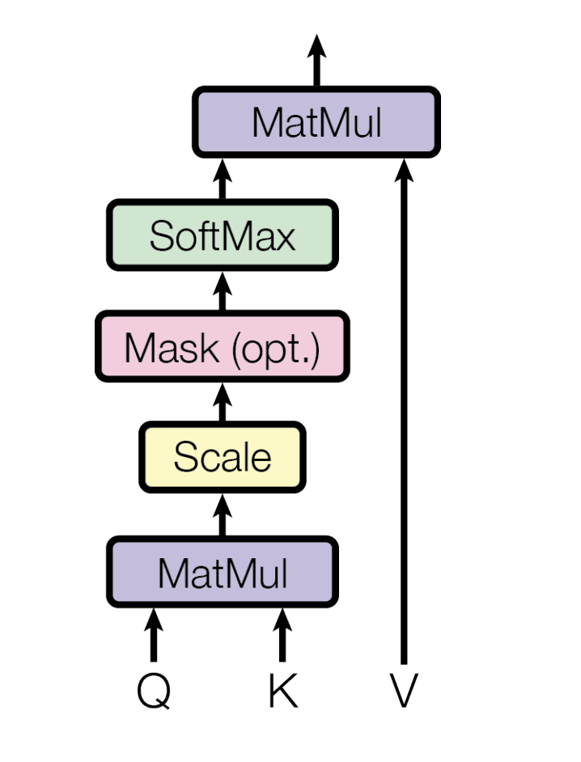

---
authors:
- jwher
description: Attention is all you need
slug: attention-is-all-you-need
tags:
- ml
- paper
title: Attention 다시보기
---

  
*이 글은 Attention is all you need를 읽고 번역한 내용입니다*  

<!--truncate-->

2017년에 작성되어 이제는 옛날 논문이자 NLP의 기본 논문이 된 Attention Is All You Need를 다시 살펴보려 합니다.
[원문](https://arxiv.org/pdf/1706.03762)

같이 보기  
* tensor2tensor
* BERT

*최대한 번역된 단어를 통일하였으나 원문을 보는것을 권장합니다.*  
*개인적으로 첨가한 단락은 기울게 표시했습니다.*  

## Abstract

지배적인 sequence transduction 모델은 인코더와 디코더를 포함한 복잡한 recurrent 또는 convolutional 신경망을 기반으로 합니다.
가장 성능이 좋은 모델 또한 attention 메커니즘을 통해 인코더와 디코더를 연결합니다.

여기서 새로운 간단한 네트워크 아키텍처를 제안합니다, **Transformer**로 attention 메커니즘에만 기반해, recurrence와 convolutions를 완전히 분배합니다.
실험은 두 기계번역 작업이 얼마나 우수한 품질로 더 많은 병렬화와 확연히 적은 학습 시간이 필요한지 보여줍니다.

우리 모델은 WMT 2014 영어-독일어 번역 작업에서 28.4 BLEU를 달성했습니다, 앙상블을 포함한 기존의 존재하는 최고 결과를 2 BLEU만큼 향상했습니다.
WMT 2014 영어-프랑스어 번역 작업에선 새 단일 모델 state-of-the-art BLEU 점수를 41.8로, 학계에서 최고의 모델을 학습시키는 비용의 아주 작은 부분인, 3.5일간 8대의 GPU로 학습시켜 달성했습니다.  

Transformer는 크고 작은 학습 데이터에서 성공적인 영여권 파싱을 적용하며 다른 작업을 일반화하기 쉬움을 보입니다.

*transduction <-> induction*

## 1 Introduction

Recurrent 신경망, long short-term memory [[13]](#13-long-short-term-memory) 와 gated recurrent
신경망은 특히, sequence 모델링과 언어 모델링, 기계 번역같은 transduction 문제에 sota 접근 방식으로 확고히 자리잡았습니다.
많은 공헌이 recurrent 언어 모델과 encoder-decoder 구조의 경계를 넓히기 위해 있어왔습니다.

Recurrent 모델은 일반적으로 입출력의 글자 위치를 기반으로 계산합니다.
계산 시간을 기준으로 위치를 정렬하면, hidden state $h_t$가 이전 hidden state인 $h_{t-1}$과 위치 $t$에 대한 입력으로 생성됩니다.
자연스럽게 상속되는 sequential한 특징은 학습에서 병렬화를 배제하고, 메모리 제한이 예제의 배치를 제한하기 때문에, 긴 sequence에서 더 심각한 문제를 만듭니다.
최근 작업은 분해 트릭과 조건부 계산을 통해 계산 효율성을 크게 향상시켰으며, 후자의 경우 모델 성능 또한 크게 향상시켰습니다.
그러나 기본적인 sequential 계산 제한은 남아있습니다.

Attention 메커니즘은 많은 작업에서 매력적인 sequence 모델링과 transduction 모델의 필수적인 부분이 되었으며,
입력 또는 출력 시퀀스 거리에 상관없이 종속성을 모델링할 수 있습니다. [[19]](#19-structured-attention-networks)
그러나 몇몇 경우 [[27]](a-decomposable-attention-model) 를 제외하고 attention 메커니즘은 recurrent 네트워크와 함께 사용됩니다.

이번 작업물에서 Transformer, recurrence를 피하고 입력과 출력 사이에서 전역 종속성을 끌어내기 위해 attention 메커니즘에 전부 의존하는 모델 구조, 를 제안합니다.
Transformer는 확연히 많은 병렬성과 8대의 P100 GPU를 12시간이라는 적은 시간동안 학습시켜 새로운 번역 품질의 sota를 달성할 수 있습니다.

## 2 Background

Sequential 계산을 줄이기 위한 목표는 Extended Neural GPU, Byte Net, ConvS2S [[9]](#9-convolutional-sequence-to-sequence-learning) 의 기초를 형성했고,
전부 convolutional neural networks를 기본 빌딩 블록으로 사용하고,
모든 입출력 위치에 hidden representation을 병렬로 계산합니다.

이 모델에서, 두개의 임의 입출력 위치 신호를 연관시키는데 필요한 작업 수는,
ConvS2S에서는 선형적으로, ByteNet에선 로그로 증가합니다.
이는 먼 위치 사이에 의존성을 배우는걸 더 어렵게 만듭니다.
Transformer는 이 연산을 상수로 줄이지만,
평균 attention-weighted 위치로 안한 효과적인 resolution을 줄여도,
[3.2](#32-attention) 섹션에서 설명한 대로 Multi-Head Attention이 상쇄하는 효과를 지닙니다.

Self-attention, 때로 intra-attention으로 불리는것은 sequence의 표현을 계산하기 위해
단일 sequence의 다른 위치를 연관시키는 attention 메커니즘입니다.
Self-attention은 읽기 이해, 추상적인 요약, 텍스트 함의 및 문장 표현에 독립적인 학습을 포함한 다양한 작업에 효과적으로 사용되었습니다.

End-to-end 메모리 네트워크는 sequence-aligned recurrence 대신 recurrent attention 메커니즘에 기반으로 해
간단한 언어 question answering과 언어 모델링 작업을 잘 수행하는 것으로 나타났습니다.

우리가 아는한, Transformer는 입출력 표현을 계산하기 위해 sequence-aligned RNN이나 convolution이 아닌
self-attention에 완전히 의존하는 최초의 transduction 모델이란 것입니다.
다음 단락에서 Transformer를 설명하고, self-attention의 동기와 Neural GPUs learn algorithms, ByteNet,
ConvS2S [[9]](#9-convolutional-sequence-to-sequence-learning) 같은 다른 모델에 비한 장점을 논의합니다.

## 3 Model Architecture

가장 경쟁력있는 신경 sequence transduction 모델은 encoder-decoder구조를 가지고 있습니다.
여기 인코더는 입력 심볼 표현의 sequence ($x_1, ..., x_n$)을 연속적인 표현 sequence $\mathbb{z} = (z_1,...,z_n)$에 매핑합니다.
주어진 $z$에 대해 디코더는 출력 sequence ($y_1, ..., y_n$)를 한번에 한 요소씩 생성합니다.
각 단계에서 모델은 다음을 생성할 때 이전에 생성된 기호를 추가 입력으로 사용해, auto-regressive [[10]](10-generating-sequences-with-recurrent-neural-networks) 합니다.

Transformer는 stacked self-attention과 point-wise를 사용해, Figure1의 왼쪽과 오른쪽에서 각각 볼 수 있는, 인코더와 디코더를 위한 fully connected layer 전체 구조를 따릅니다.

  
*Figure1 : The Transformer - model architecture.*

### 3.1 Encoder and Decoder Stacks

Encoder:  
인코더는 N=6의 동일한 레이어 스택으로 구성됩니다.
각 레이어는 두 하위 레이어를 가집니다.
첫번째는 multi-head self-attention 메커니즘이고,
두번째는 간단한 position-wise fully connected 네트워크입니다.
두 하위 레이어에 layer normalization [[1]](#1-layer-normalization) 을 거친,
residual connection [[11]](#11-deep-residual-learning-for-image-recognition) 을 연결했습니다.
즉, 각 하위 레이어의 출력은 $LayerNorm(x+Sublayer(x))$이고, $Sublayer(x)$는 하위 계층 자체에 의해 구현된 함수입니다.
이런 residual connection을 용이하게 하기 위해, embedding 레이어를 포함한 모델의 모든 하위 레이어는,
$d_{model}=512$ 차원 출력을 만듭니다.

Decoder:  
디코더 또한 N=6의 동일한 레이어 스택으로 구성됩니다.
각 인코더 레이어에 있는 두 하위 레이어에 더해서, 디코더는 인코더 스택 출력에 multi-head attention을 하는 세번째 레이어 하위 레이어를 추가합니다.
인코더와 마찬가지로, 각 하위 계층에 layer normalization을 거친,
residual connection을 도입했습니다.
또한 디코더 스택이 subsequent 위치를 attending하는 걸 막기 위해 self-attention 하위 레이어를 수정했습니다.
이 마스킹은, 출력 임베딩이 한 위치로 offset 된다는 사실과 결합해, 위치 i에 대한 예측이 i 보다 작은 알려진 출력 위치에만 의존하도록 보장합니다.

### 3.2 Attention

Attention 함수는 query와 key-value 짝을 출력에 매핑하는 것으로 설명할 수 있으며,
query, key, value와 출력은 모두 벡터입니다.
출력은 value 가중치의 합으로 계산되고,
각 value에 할당된 가중치는 해당 query와 그에 대응하는 key의 compatibility function에 의해 계산됩니다.

  
*Figure2 : (left) Scaled Dot-Product Attention. (right) Multi-Head Attention consists of several attention layers running in parallel.*

#### 3.2.1 Scaled Dot-Product Attention

이 attention을 "Scaled Dot-Product Attention"으로 부릅니다. (Figure 2)
입력은 $d_k$ 차원의 query와 key, $d_v$ 차원의 value로 이루어 집니다.
모든 query와 key의 dot-product(*내적*) 을 계산하고, 각각 $\sqrt{d_k}$로 나눈 후, softmax 함수를 거쳐 value 가중치를 얻습니다.

실제로는, matrix Q에 함께 모인, query 집합을 한번에 attention function을 계산합니다.
key와 value도 마찬가지로 함께 모인 matrix K 와 V로 있습니다.
출력 matrix는 다음과 같이 계산합니다.

$$
\begin{equation}
Attention(Q,K,V) = softmax({QK^T \over \sqrt{d_k}})V
\end{equation}
$$

가장 많이 사용되는 attention function은 additive attention [[2]](#2-neural-machine-translation-by-jointly-learning-to-align-and-translate) 과,
Dot-product(multiplicative) attention입니다.
Dot-product attention은 scaling 요소인 $1 \over \sqrt{d_k}$를 제외하고 여기서 다루는(*Scaled Dot-Product Attention*) 알고리즘과 동일합니다.
Additive attention은 하나의 hidden layer를 사용한 feed-forward network 함수로 호환성 함수를 계산합니다.
이 둘은 이론적으로 복잡성이 같지만, dot-product attention은 고도로 최적화된 행렬 곱셈 코드가 적용되기 때문에, 더 빠르고 공간 효율적입니다.

$d_k$가 작을때는 두 메커니즘이 유사하게 수행되지만,
$d_k$가 클때 스케일링 하지 않으면 additive attention은 dot-product attention를 능가합니다. [[3]](#3-massive-exploration-of-neural-machine-translation-architectures)
여기에선 $d_k$가 크다면 dot-product는 큰 단위로 커져, softmax 함수를 매우 작은 영역으로 밀어 넣는다고 추측합니다.
이에 대응하기 위해 dot-product를 $1 \over \sqrt{d_k}$로 scale 합니다.

#### 3.2.2 Multi-Head Attention

$d_{model}$ 차원 크기의 key, value와 query를 사용한 하나의 attention 함수를 사용하는 것 보다,
query, key, value를 다르게 h번, 각각 $d_k$, $d_k$, $d_v$ 차원으로 linear projection으로 학습된 것을
선형으로 사영하는게 유익함을 알았습니다.
각각 사영된 버전의 query, key, value로 attention 함수를 완전히 병렬적으로 수행할 수 있으며, $d_v$ 차원 출력 value를 넘겨줍니다.
이는 다시 한번 연결되고 사영되어, Figure2에서 처럼 최종 value를 결과로 냅니다.

Multi-head attention은 모델이 다른 위치의 다른 representation subspace에서 공동으로 정보를 얻을 수 있게 합니다.
하나의 attention head만 있으면 평균이 이를 억제합니다.

$$
MultiHead(Q, K, V ) = Concat(head_1, ..., head_h)W^O \\
where \ head_i = Attention(QW_i^Q , KW_i^K , VW_i^V )
$$

사영이 매개변수 행렬이라고 하면 $W_i^Q \in \mathbb{R}^{d_{model} \times d_k}$, $W_i^K \in \mathbb{R}^{d_{model} \times d_k}$,
$W_i^V \in \mathbb{R}^{d_{model} \times d_v}$ 그리고 $W^O \in \mathbb{R}^{hd_v \times d_{model}}$ 입니다.

여기에선 h = 8인 병렬적인 attention layer와 head를 사용했습니다.
각 레이어에서 $d_k = d_v = d_{model} / h =64$를 사용했습니다.
각 head의 차원 감소로, 최종 계산 비용은 전체 차원의 single-head attention과 비슷합니다.

#### 3.2.3 Applications of Attention in our Model

Transformer는 multi-head attention을 세가지 다른 방법으로 사용합니다:

* "인코더-디코더 attention" 레이어에서, 쿼리는 이전 디코더 레이어에서 가져오고, 메모리 키와 값은 인코더의 출력에서 가져옵니다.
이는 디코더의 모든 위치에서 모든 출력 sequence를 attend 할 수 있게 합니다.
이는 sequence-to-sequence 모델에서 일반적인 인코더-디코더 attention 메커니즘을 모방한 것입니다.
[38, [2](#2-neural-machine-translation-by-jointly-learning-to-align-and-translate), [9](#9-convolutional-sequence-to-sequence-learning)]

* 인코더는 self-attention layer를 포함하고 있습니다. self-attention 레이어의 모든 key, value, query는 같은 위치에서 나오고,
여기에서는 인코더의 이전 레이어 출력입니다. 인코더의 각 위치는 이전 계층의 인코더의 모든 위치를 attend 할 수 있습니다.

* 유사하게, 디코더의 self-attention 레이어는 디코더의 각 모든 위치에서 자기 위치를 포함한 모든 디코더 위치를 attend 할 수 있게 합니다.
디코더가 auto-regressive한 특징을 보존하기 위해 leftward 정보 흐름을 방지해야 합니다.
scaled dot-product attention 안에 허용되지 않는 소프트맥스의 입력 value를 모두 마스킹(-$\inf$)해 구현했습니다. Figure2를 보세요.

### 3.3 Position-wise Feed-Forward Networks

attention 하위 계층 외에도 인코더와 디코더의 각 레이어에는, 각 위치에 개별적이고 동일하게 적용되는, fully connected feed-forward 네트워크를 포함합니다.
이는 사이에 ReLU 활성함수를 포함한 두 linear transformation로 구성됩니다.

$$
\begin{equation}
FFN(x) = max(0,xW_1+b_1)W_2 + b_2
\end{equation}
$$

linear transformation은 다른 위치에서도 동일하지만, 레이어마다 다른 매개 변수를 사용합니다.
다른 방법으로 커널 크기가 1인 두 convolution으로 표시할 수 있습니다.
입력과 출력 차원은 $d_{model} = 512$이고 내부 layer는 $d_{ff} = 2048$ 입니다.

### 3.4 Embeddings and Softmax

다른 sequence transduction 모델과 비슷하게,
학습된 embedding을 사용해 $d_{model}$ 차원의 벡터 입력 토큰과 출력 토큰으로 바꿉니다.
또한 일반적인 학습된 linear transformation과 softmax 함수를 이용해 디코더 출력으로 다음 토큰의 확률을 예측합니다.
여기서 다루는 모델은, 두개의 embedding layer와 pre-softmax linear transformation 사이에 동일한 가중치 메트릭스를 공유합니다.
Embedding layer에서 가중치에 $\sqrt{d_{model}}$을 곱합니다.

### 3.5 Positional Encoding

이 모델은 recurrence도 convolution도 없기 때문에, 모델이 sequence의 순서를 사용하려면,
sequence에서 상대적이거나 절대적인 토근 위치 정보를 삽입해줘야만 했습니다.
이를 해결하기 위해 "positional encodings"를 인코더와 디코더 스택의 바닥에 있는 입력 embedding에 추가했습니다.
Positional encoding은 $d_model$과 같은 차원을 임베딩으로 가져, 둘이 더해질 수 있도록 합니다.
여기에 많은 학습되고 고정된 positional encoding 선택이 있습니다. [[9]](#9-convolutional-sequence-to-sequence-learning)

여기에선, 다른 주기의 사인과 코사인 함수를 사용합니다:

$$
PE_{(pos, 2i)} = sin(pos/10000^{2i/d_{model}}) \\
PE_{(pos, 2i+1)} = cos(pos/10000^{2i/d_{model}})
$$

$pos$는 위치이고 $i$는 차원입니다. 따라서 각 차원의 positional encoding은 사인 곡선에 대응됩니다.
파장은 2$\pi$에서 10000까지 기하학적 진행을 형성합니다.
어떤 고정된 offset k, $PE_{pos+k}$가 선형 함수 $PE_{pos}$로 표현될 수 있기 때문에,
모델이 상대적인 위치에 따라 쉽게 attend 하는 법을 배울 수 있다는 가설을 세웠고 이 함수를 선택했습니다.

또한 학습된 positional embedding [[9]](#9-convolutional-sequence-to-sequence-learning) 을 사용하는 방법을 실험했으나,
두 버전이 거의 동일한 결과를 냈다는 것을 발견했습니다. (Table 3 열 E를 보세요)
모델이 훈련 중에 발생하는것 보다 더 긴 sequence 길이를 추정할 수 있기 때문에 사인 곡선 버전을 선택했습니다.

## 4 Why Self-Attention

## 5 Training

## 6 Results

## 7 Conclusion

작성중

## References

내용 이해에 필요한 부분을 번역했습니다. 원문을 보는걸 권장합니다.

### [1 Layer normalization](https://arxiv.org/pdf/1607.06450.pdf)
### [2 Neural machine translation by jointly learning to align and translate](https://arxiv.org/pdf/1409.0473.pdf)
### [3 Massive exploration of neural machine translation architectures](https://arxiv.org/pdf/1703.03906.pdf)

섹션 4.5 Attention Mechanism
주로 사용하는 어텐션 메커니즘은 additive, multiplilicative입니다.

계산량은 식(7)이 적습니다. 주어진 어텐션 key $h_j$(인코더 상태)와 어텐션 쿼리 $s_i$(디코더 상태)일때 어텐션 값은 다음과 같이 계산됩니다.

$$
score(h_j, s_i) = <v,tanh(W_1h_j)+W_2s_i)>  \tag{6}
$$
$$
score(h_j, s_i) = <W_1h_j,W_2s_i>           \tag{7}
$$

$W_1h_j$와 $W_2s_i$의 차원성을 "attention dimensionality"라고 부르고,
128에서 1024까지 레이어 크기를 바꿔봤습니다.

<!-- 또한 디코더 상태를 초기화하는데 이전 인코더 상태(None-State)로 하거나 디코더 상태를 각 디코더 입력(None-Input)에 연결하여,
어텐션 메커니즘을 사용하지 않는 실험도 합니다. -->

| Attention  | newstest2013             | Params |
|------------|--------------------------|--------|
| Mul-128    | 22.03 ± 0.08 (22.14)     | 65.73M |
| Mul-256    | 22.33 ± 0.28 (22.64)     | 65.93M |
| Mul-512    | 21.78 ± 0.05 (21.83)     | 66.32M |
| Mul-1024   | 18.22 ± 0.03 (18.26)     | 67.11M |
| Add-128    | 22.23 ± 0.11 (22.38)     | 65.73M |
| Add-256    | 22.33 ± 0.04 (22.39)     | 65.93M |
| Add-512    | 22.47 ± 0.27 (22.79)     | 66.33M |
| Add-1028   | **22.10** ± 0.18 (22.36) | 67.11M |

<!-- | None-State | 9.98 ± 0.28 (10.25)  | 64.23M |
| None-Input | 11.57 ± 0.30 (11.85) | 64.49M | -->

additive 어텐션이 multiplicative 보다 조금씩이지만 더 나은 성능을 보여주고
차원은 적은 영향만 있는 것을 보입니다.

*여기에서 볼 것은 multiplicative 어텐션이 차원이 커질수록 성능이 떨어지는데, 논문에서는 scale로 해결할 수 있다고 생각한 것입니다.*

### [9 Convolutional sequence to sequence learning](https://arxiv.org/pdf/1705.03122.pdf)
### [10 Generating sequences with recurrent neural networks](https://arxiv.org/pdf/1308.0850.pdf)
### [11 Deep residual learning for image recognition](https://arxiv.org/pdf/1512.03385.pdf)
### [13 Long short-term memory](https://blog.xpgreat.com/file/lstm.pdf)
### [19 Structured attention networks](https://arxiv.org/pdf/1702.00887.pdf)
### [27 A decomposable attention model](https://arxiv.org/pdf/1606.01933.pdf)
