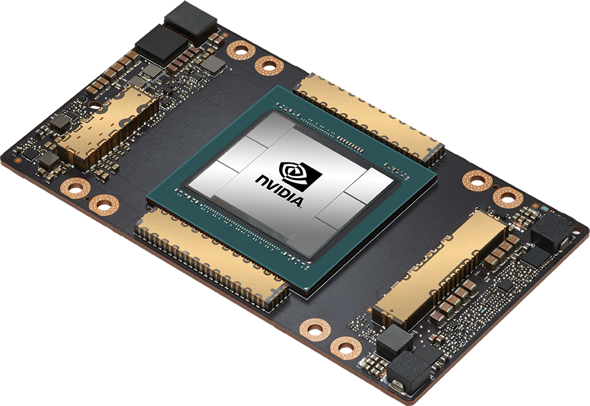

---
authors:
- jwher
description: Programming Massively Parallel Processors - Chapter 1
slug: cudabook-1
tags:
- tech
title: 대규모 병렬프로세서 프로그래밍(소개)
---

  
*이 글은 David B. Kirk의 Programming Massively Parallel Processors를 읽고 작성했습니다.*  
*과거의 내용이여서 맞지 않는 부분은 임의로 수정하였습니다*  

<!--truncate-->

# 1. 소개

마이크로프로세서는 하나의 central processing unit(CPU), 인텔이나 AMD의 것에 기반하고
빠른 성능 향상과 값 감소를 30년간 이끌었습니다.
이 마이크로프로세서는 GFLOPS 또는 기가(10^12) 부동소수점 연산을 데스크탑에선 초당 수행하고,
TFLOPS 또는 테라(10^15) 부동소수점 연산을 클러스터 서버에서 초당 수행합니다.
이 엄격한 성능 향상은 애플리케이션 소프트웨어가 더 많은 기능을 하고,
더 나은 사용자 경험을 제공하며, 더 유용한 결과를 생성해 내고 있습니다.
사용자는 이런 개선에 익숙한 상황속에서 더 나은 개선을 요구하고, 컴퓨터 산업계에 긍정적인 사이클을 만듭니다.

하지만 이 동기는, 2003년부터 에너지 소모와 방열 문제로 클럭 주기에 제한을 걸고
단일 cpu에서 각 클락에 수행할 수 있는 생산적인 수준을 낮추면서 느려졌습니다.
따라서 모든 마이크로프로세서 벤더가 프로세서 코어라 불리는 멀티프로세싱 유닛을 가진 모델로 전환하였고,
처리 능력을 높이기 위해 각 칩에 사용되었습니다.
이 전환은 소프트웨어 개발자 커뮤니티에 엄청난 영향을 미쳤습니다.
[[Sutter2005]](#software-and-the-concurrency-revolution)

*No free cake*

전통적으로, 대다수의 소프트웨어 응용 프로그램은 폰 노이만의 1945년 보고서에 설명한 것처럼 순차적 프로그램으로 작성되었습니다.
이러한 프로그램의 실행은 사람이 순차적으로 코드 단계를 나아가는 것으로 이해할 수 있습니다.
역사적으로, 대부분의 소프트웨어 개발자는 순차적 애플리케이션의 속도를 높이기 위해
새로운 하드웨어 발전에 의존해 왔습니다.
새로운 세대의 프로세서가 도입될 때마다 같은 소프트웨어는 더 빨리 실행됬습니다.
컴퓨터 사용자 또한 새로운 세대의 마이크로프로세서마다 더 빠르게 실행되는 기대에 익숙해졌습니다.
그러한 기대는 더이상 유효하지 않습니다.
순차적 프로그램은 하나의 프로세서 코어에서만 작동하고, 오늘날 사용중인 것보다 더 빨라지지 않습니다.
성능 개선이 없다면 애플리케이션 개발자들은 새로운 마이크로프로세서가 도입될 때마다,
더이상 새 기능과 능력을 도입할 수 없으며, 컴퓨터 산업의 성장 기회를 줄일 것입니다.

대신에, 새 세대의 마이크로프로세서마다 성능 향상을 꾸준히 누릴수 있는 애플리케이션 소프트웨어는,
다중 스레드가 작업을 더 빨리 끝내도록 협업하는 병렬 프로그램이 될 것입니다.
이 새롭고 극적으로 확대된 병렬 프로그램 개발의 인센티브는 동시성 혁명[[Sutter2005]](#software-and-the-concurrency-revolution)이라고 불립니다.
병렬 프로그래밍의 실체는 결코 새로운 것이 아닙니다.
고성능 프로그래밍 커뮤니티는 수년간 병렬프로그램을 개발해 왔습니다.
이 프로그램은 대규모의 비싼 컴퓨터에서 동작합니다.
단지 몇개의 엘리트 애플리케이션만 이 비싼 컴퓨터를 사용할 수 있게 정의되었고,
따라서 적은 수의 애플리케이션 개발자만 병렬 프로그래밍을 할 수 있게 제한되었습니다.
이제는 모든 새 마이크로프로세서가 병렬 컴퓨터임으로, 병렬적으로 개발되어야 하는 애플리케이션이 급격히 늘었습니다.
이제는 소프트웨어 개발자들이 병렬 프로그램을 어떻게 해야할지 강한 필요가 생겼습니다.
이 책은 그 내용에 집중합니다.

## 1.1 이기종 병렬 컴퓨팅

## 1.2 현대 GPU의 아키텍처

## 1.3 왜 더 빠르거나 병렬화를 해야하는가?

## 1.4 실제 애플리케이션에서 속도 높이기

## 1.5 병렬 프로그래밍 언어와 모델

## References

### [Software and the Concurrency Revolution](https://dl.acm.org/doi/pdf/10.1145/1095408.1095421)
