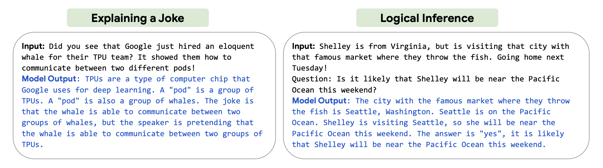
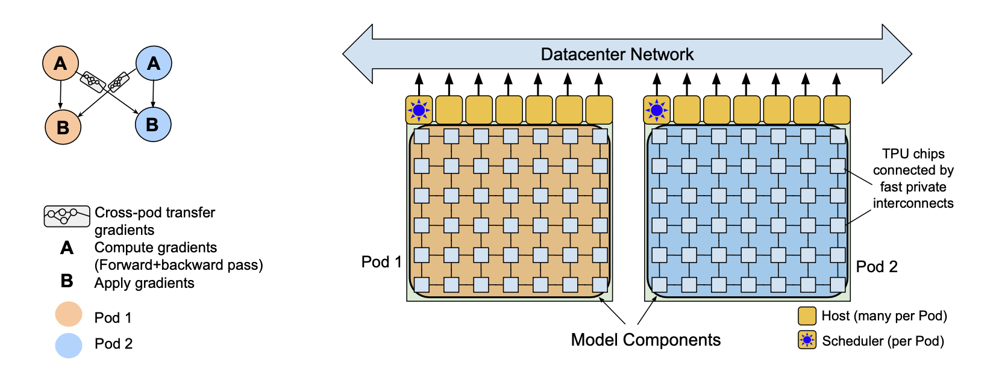

---
authors:
- jwher
description: 'PaLM: Scaling Language Modeling with Pathways'
slug: palm
tags:
- ml
- paper
title: Pathways를 이용한 언어모델 스케일링
---

  
*최대한 번역된 단어를 통일하였으나 원문을 보는것을 권장합니다.*  

<!--truncate-->

## 요약
*Abstract*

대규모 언어 모델은 few-shot learning을 사용한 다양한 자연어 처리 분야에서 눈에 띄는 성과를 보이고 있습니다.
이는 모델을 task-specific하게 적응하기 위한 예제 수를 수를 크게 줄입니다.
더 나아가 few-shot learning에 대한 영향에 대한 이해를 높이기 위해,
5400억개의 매개 변수, densely activated, [transformer](/posts/attention-is-all-you-need) 언어 모델인 Pathways Language Model(PaLM)을 학습시켰습니다.

PaLM은 6144 TPU v4칩에서 Pathways를 사용해 학습했습니다. Pathways는 다양한 TPU Pods에서 고효율로 학습하길 가능하게 하는 ML system입니다.
수백개의 **언어 이해와 생성** 벤치마크에서 few-shot learning의 sota를 달성함을 보여줍니다.
많은 작업에서 PaLM은 540B는 고성능을 달성합니다. **multi-step reasoning tasks**에서 sota를 달성하고,
최근의 BIG-bench 벤치마크에서 평균 사람보다 나은 성능을 보여줍니다.
상당수의 BIG-bench tasks는 모댈 규모에 따라 불연속적인 성능 개선을 보여주었고,
이는 가장 큰 모델로 확장함에 따라 급격한 성능 증가를 보였음을 뜻합니다.
PaLM은 다양한 벤치마크에서 증명되는 강한 **multilingual tasks**와 **source code generation**을 갖춥니다.
편견(bias)과 독성(toxicity)에 대한 포괄적인 분석을 제공하고, 모델 규모와 관련하여 학습 데이터 암기(memorization)을 연구합니다.
최종적으로 LLM에 대한 윤리적 고려 사항과 점진적인 완화 전략에 대해 논의합니다.

## 1. 소개

(WIP 사전연구들)

(GLaM, Gopher, Chinchilla, Megatron-Turing NLG, LaMDA)

이 논문에서, scaling line으로 언어 모델링 개선을 계속하고 7800억 개의 고품질 텍스트 토큰에, densely activated, autoregressive transformer 5400억 개의 매개 변수를 학습합니다.
이것은 여러 텐서 처리 장치(TPU) v4 pod를 포함해 수천 개의 가속기 칩에 걸쳐 **매우 큰 신경망**을 **매우 효율적**으로 학습할 수 있는 새로운 ML 시스템인
[Pathways](#pathways-asynchronous-distributed-dataflow-for-ml)를 사용해 달성했습니다.
새로운 모델은 Pathways Language Model (PaLM)이라고 부르며 수백 개의 자연어, 코드 및 수학적 추론 작업에서 sota few-shot 결과를 달성합니다.

이 작업의 요점은 다음과 같습니다.

### 효율적인 스케일링
*Efficient scaling*

하나의 모델을 학습하는데 천에서 만개의 고효율 가속기를 사용할 수 있게 하는 새로운 ML system
[Pathways](#pathways-asynchronous-distributed-dataflow-for-ml)의 첫번째 대규모 사용을 보입니다.
Pathways를 사용하면서 이전에는 도달할 수 없었던 효율성 수준에서 6144TPU v4 칩에 대한 540B 매개 변수 언어 모델을 학습했습니다.
대부분 이전의 대형 언어 모델은 단일 TPU 시스템(GLaM)이나 파이프라인 병렬 처리(GPipe)를 사용해
GPU 클러스터(-)나 여러 TPU v3 pod(Gopher)를 확장해 최대 4096 TPU v3 chips을 확장했습니다.
섹션 4에서 우리는 모델 FLOPS를 활용해 PaLM 540B를 6144 칩 두개의 TPU v4 Pods에서
매우 높은 46.2%라는 모델 FLOPs utilization을 달성하였고(이론적인 최고 수치에 비교한 수치)
57.8%의 하드웨어 FLOPs utilization을 보였습니다.

### 스케일링을 통한 지속적인 향상
*Continued improvements from scaling*

섹션 6에서 다양한 주요 벤치마크를 수행하고, 상당한 차이를 보였습니다.
이것은 대규모 LM의 스케일링 개선이 정체되거나 포화점에 도달하지 않았다는 것을 보여줍니다.
표 4에서 가장 널리 평가된 29개의 영어 이해 벤치마크에서 28개의 sota를 달성했음을 보여줍니다.
이전에 수행된 다음 항목과 비교했습니다(GLaM, GPT-3, Megaron-Turing NLG, Gopher, Chinchilla, LaMDA)

### 획기적인 능력
*Breakthrough capabilities*

많은 어려운 작업에서 언어 이해와 생성에서 획기적인 능력을 보여줍니다.
특히, 섹션 [6.3](#63-reasoning)은 정답을 도출하기 위해 multi-step 수학적 또는 상식적인 추론이 필요한 추론(reasoning) 작업 모음에 대한 평가를 제시합니다.
이전의 sota 결과는 좋은(strong) 결과를 얻기 위해 task-specific한 finetuning, domain-specific 아키텍처 및 task-specific verifiers 조합을 사용합니다.
이 작업에서, 우리는 모델 스케일링이 [chain-of-thought prompting](#chain-of-thought-prompting-elicits-reasoning-in-large-language-models)과 결합될 때,
간단한 few-shot 평가가 다양한 추론 작업에서 finetuned sota를 능가하거나 같음을 보여줍니다.
섹션 [6.2](#62-big-bench)에서 최근에 출시된 150개 이상의 새로운 언어 이해 및 생성 작업 제품군인
[BIG-bench](#beyond-the-imitation-game-measuring-and-extrapolating-the-capabilities-of-language-models)의 획기적인 성능을 강조합니다.
BIG-bench의 대부분은 사람도 올바르게 대답하기가 매우 어렵습니다.
그림 1과 섹션 [9](#9-설명-살펴보기exploring-explanations)에서, 복잡한 추론 체인을 명시적으로 해석하고 설명하는 PaLM의 탐색 능력을 보여줍니다.

>   
> *그림1*  PaLM이 *chain-of-thought prompting*을 통해 탐색하는 능력을 보여줍니다.
> 모든 예제는 PaLM 540B에서 greedy(1-best) decoding을 통해 생성되었습니다. 프롬프트는 섹션 9에서 더 많은 예시를 보여줍니다.

### 불연속적인 성능 개선
*Discontinuous improvements*

스케일링 동작을 더 잘 이해하기 위해, 8B, 62B, 540B 세 가지 다른 파라미터 크기(scales)의 결과를 제시합니다.
일반적으로, 62B에서 540B로의 스케일링은 8B에서 62B로의 스케일링과 유사한 성능을 보이며,
이는 신경망 스케일링에서 종종 관찰되는 멱법칙(power law)인 경험 규칙(rule of thumb)과 일치합니다.
(Scaling laws for neural language models. Kaplan et al., 2020).
그러나, 특정 작업의 경우, 우리는 62B에서 540B로의 스케일링이 8B에서 62B로의 스케일링에 비해 정확도가 급격하게 증가하는 불연속적인 개선을 관찰합니다.
그러한 행동은 섹션 [6.2](#62-big-bench) BIG-bench 작업 약 25%에서 관찰됩니다.
이는 모델이 충분한 규모를 달성할 때 대규모 LM의 새로운 기능이 나타날 수 있으며, 이러한 기능은 이전에 연구된 규모를 넘어 계속 나타날 수 있음을 시사합니다.

>   
> 대규모 모델에선 새로운 기능이 나타날 수 있습니다 (출처: 구글 블로그)

### 다국어 이해
*Multilingual understanding*

대규모 언어 모델에 대한 이전 작업은 다국어 영역에서 제한된 평가를 수행했습니다.
이 논문에서, 우리는 다양한 언어로 기계 번역(섹션 [6.5](#65-translation)), 요약(섹션 [6.6](#66-multilingual-natural-language-generation)) 및 질문 답변(섹션 [6.7](#67-multilingual-question-answering))을 포함한 다국어 벤치마크에 보다 철저한 평가를 수행합니다.
학습 말뭉치(corpus)에서 비영어 데이터(≈ 22%)의 상대적으로 적은 비율에도 불구하고,
540B 모델의 few-shot 결과는 비영어 요약 작업에서 이전의 finetuned sota와 격차를 해소하고 번역 작업에서 이전의 sota를 능가할 수 있었습니다.
영어 및 다국어 작업에 대한 다국어 데이터의 비율을 증가시키는 영향을 이해하기 위해서 further work이 필요합니다.

### 편견과 독성
*Bias and toxicity*

또한 편견과 독성에 대한 모델 성능을 평가하여 몇 가지 통찰력을 얻었습니다(섹션 [10](#10-대표적인-편견-분석)).
첫째, 성별과 직업 편견으로 Winogender conference task가 정확성이 모델 규모에 따라 향상된다는 것을 발견했으며,
PaLM 540B는 1-shot 또는 few-shot 설정에서 새로운 sota를 달성합니다.
둘째, 인종/종교/성별이 prompt continuation으로 수행된 동시 분석은 모델이 무슬림을 테러리즘, 극단주의 및 폭력과 연관시키는 고정관념을 잘못 주장하는 가능성을 보입니다.
이 행동은 모델 규모(scale) 전반에 걸쳐 일관성이 있었습니다.
마지막으로, prompt continuation에 대한 독성 분석은 8B 모델에 비해 62B 및 540B 모델의 전반적인 독성 수준이 약간 더 높다는 것을 보여줍니다.
그러나, model-generated continuation의 독성은 프롬프트 텍스트의 독성과 높은 상관 관계가 있는 반면,
human-generated continuations은 강한 독성 상관 관계가 없습니다.
이것은 모델이 인간이 생성한 텍스트보다 프롬프트 스타일에 더 크게 영향을 받는다는 것을 시사합니다.
향후 작업에서, 이러한 벤치마크를 영어가 아닌 언어로 확대하고 잠재적인 위험을 더 철저하게 설명할 계획입니다.

## 2. 모델 아키텍처

PaLM은 표준 [transformer](/posts/attention-is-all-you-need) 아키텍처에서 디코더만 있는 설정을 사용했고
(즉, 각 timestep은 자신과 과거 timesteps만 참고 가능합니다) 다음 변경을 가했습니다.

### SwiGLU Activation

표준 ReLU, GeLU 또는 [Swish activations](#glu-variants-improve-transformer)에 비해 성능이 크게 향상되는 것으로 나타난,
MLP(Multi-Layer Perceptron) intermediate activations에 SwiGLU activations (Swish(xW) · xV)를 사용합니다.
MLP에서 두 개가 아닌 세 개의 행렬 곱셈이 필요하지만,
[Swish activations](#glu-variants-improve-transformer)에서 컴퓨팅 등가 실험
(즉, 표준 ReLU variant가 비례적으로 더 큰 차원을 가진 경우)에서 성능 향상을 입증합니다.

### Parallel Layers

각 트랜스포머 블록에 표준 직렬화된 식이 아닌 병렬(parallel) 식을 사용합니다.
[A 6 Billion Parameter Autoregressive Language Model](#a-6-billion-parameter-autoregressive-language-model)
표준 식이 다음과 같이 쓴다면

$$
y = x + MLP(LayerNorm(x+Attention(LayerNorm(x))))
$$

병렬 식은 다음과 같이 쓸 수 있습니다.

$$
y = x + MLP(LayerNorm(x)) + Attention(LayerNorm(x))
$$

MLP와 Attention 입력 matrix 곱셈은 합쳐질 수 있기 때문에,
대규모 스케일에서 병렬식이 대략 15% 빠르게 동작합니다.
Ablation 실험은 8B 크기에서 작은 품질 저하를 보여주었지만 62B 척도에서는 품질 저하가 없었기 때문에,
우리는 병렬 layer의 효과가 540B 크기에서 품질 저하가없다고(neutral) 추정합니다.

### Multi-Query Attention

표준 transformer 식은 각 시간 단계의 입력 벡터가 텐서 모양 [k,h]의, 여기서 h는 attention head 크기입니다,
"query", "key" 및 "value"가 선형으로 사영(projected)되는 k attention 헤드를 사용합니다.
여기서, key/value 사영 예측은 각 헤드에 대해 공유됩니다.
즉, "key"와 "value"는 [1, h]로 사영되지만, "query"는 여전히 [k, h]를 형성하기 위해 사영됩니다.
이는 모델 품질과 학습 속도에 영향이 없지만(neutral),
autoregressive 디코딩 시간에 상당한 비용 절감을 가져온다는 것을 발견했습니다.
[One write-head is all you need. Shazeer, 2019]
이것은 표준 multi-head attention이 autoregressive 디코딩 중에 가속기 하드웨어의 효율성이 낮기 때문입니다.
왜냐하면 key/value 텐서는 예제(examples) 간에 공유되지 않고, 한 번에 하나의 토큰만 디코딩되기 때문입니다.

### RoPE Embeddings

절대적이거나 상대적인 position embeddings이 아닌 RoPE 임베딩을 사용합니다.
RoPE 임베딩이 더 긴 시퀀스 길이에서 더 좋은 효과를 보였기 때문입니다.
[Roformer: Enhanced transformer with rotary position embedding](#roformer-enhanced-transformer-with-rotary-position-embedding)

### Shared Input-Output Embeddings

과거 작업에서 자주 (but not universally) 수행되는 입력 및 출력 임베딩 매트릭스를 공유합니다.

### No Biases

밀도 높은 커널(dense kernel)이나 layer norms에는 bias가 사용되지 않았습니다.
이는 대형 모델의 학습 안정성을 증가시키는 것을 발견합니다.

### Vocabulary

우리는 과도한(excess) 토큰화 없이 학습 말뭉치(corpus)에서 많은 수의 언어를 지원하기 위해 선택된 256k 토큰으로 [SentencePiece](#a-simple-and-language-independent-subword-tokenizer-and-detokenizer-for-neural-text-processing) 어휘(vocabulary)를 사용합니다.
어휘(vocavulary)는 학습 데이터에서 생성되었고, 학습 효율성을 향상시킨다는 것을 발견했습니다.
어휘는 완전히 무손실(lossless)이며 되돌릴 수 있습니다(reversible).
이것은 공백이 어휘(특히 코드에 중요한)에 완전히 보존되고 어휘외(out-of-vocabulary) 유니코드 문자는 각 바이트에 대한 어휘 토큰과 함께 UTF-8 바이트로 나뉩니다.
숫자는 항상 개별 숫자 토큰으로 나뉩니다 (예: "123.5 → 1 2 3 . 5").

### 2.1 모델 스케일 하이퍼파라미터
*Model Scale Hyperparameters*

여기에서는 540B, 62B, 8B 세 모델 크기를 비교합니다.
FLOPs는 대략 파라미터 수와 비슷한데, 이 모델이 표준 dense transformer이기 때문입니다.
이 모델은 표1의 하이퍼파리미터로 구성되었습니다.
같은 데이터와 어휘를 사용해 세 모델은 독립적으로 학습되었습니다.
학습에 관한 내용은 섹션 [3](#3-학습-데이터셋)과 [5](#5-학습-셋업)에 더 자세히 설명되어 있습니다.

> | Model     | Layers | # of Heads | d_model | # of Parameters(in billions) | Batch Size          |
> |-----------|--------|------------|---------|------------------------------|---------------------|
> | PaLM 8B   | 32     | 16         | 4096    | 8.63                         | 256 -> 512          |
> | PaLM 62B  | 64     | 32         | 8192    | 62.50                        | 512 -> 1024         |
> | PaLM 540B | 118    | 48         | 18432   | 540.35                       | 512 -> 1024 -> 2048 |
> *표1* 모델 아키텍처 상세. feed-forward 크기는 항상 4*d_model이고 attention head 크기는 항상 256입니다.

### 2.2 모델 카드

PaLM에 대한 [Model Card](#model-cards-for-model-reporting)는 부록 E에 있습니다.
이는 모델 아키텍처, 학습 설정, 학습 데이터, 확장된 사용을 위한 고수준의 요약입니다.

## 3 학습 데이터셋

PaLM 사전학습(pretraining) 데이터 세트는 광범위한 자연어 사용 사례를 나타내는 7800억 개의 토큰의 고품질 말뭉치(corpus)로 구성되어 있습니다.
데이터 세트는 필터링된 웹 페이지, 2권의 책, 위키피디아, 뉴스 기사, 소스 코드 및 소셜 미디어 대화의 혼합물입니다.
이 데이터 세트는 [LaMDA](#lamda-language-models-for-dialog-applications)와
[GLaM](#glam-efficient-scaling-of-language-models-with-mixture-of-experts)을 학습시키는 데 사용되는 데이터 세트에 기반을 두고 있습니다.
우리는 데이터(모든 모델에 대해 동일하게 shuffled)의 정확히 한 epoch에서 세 가지 모델을 모두 학습시키고 하위요소에서 데이터를 반복하지 않도록 혼합 비율을 선택합니다.

자연어 데이터 외에도, 사전학습 데이터 세트에는 코드도 포함되어 있습니다.
사전학습 데이터 세트의 소스 코드는 GitHub의 오픈 소스 저장소에서 가져옵니다.
저장소에 포함된 라이선스로 파일을 필터링하고 카피레프트 라이선스는 제외했습니다.
파일을 파일이름의 확장자로 필터링해 Java, HTML, Javascript, Python, PHP, C#, XML, C++, and C를 포함하는 24개의
대중적인 프로그래밍 언어로 제한해 196GB의 소스 코드를 얻었습니다.

또한, 소스 코드 저장소에서 일반적인것으로 알려진 중복된 파일을 파일 간의 Levenshtein 거리를 기반으로 중복을 제거합니다.  
(The adverse effects of code duplication in machine learning models of code Lopes et al., 2017; Allamanis, 2019)

표 2는 최종 PaLM 데이터 세트 혼합물을 만드는데 사용한 다양한 데이터 소스의 비율을 보여줍니다.
섹션 [8](#8-데이터셋-오염)에서 데이터 오염을 확인하고 학습 데이터 세트와 평가 데이터 간의 중복 분석을 제시합니다.
부록 D에는 언어 비율 분석을 포함한 추가 정보가 포함된 데이터 시트(Gebru et al., 2021)가 포함되어 있습니다.

> | Total dataset size = 780 billion tokens   |                    |
> |-------------------------------------------|--------------------|
> | Data source                               | Proportion of data |
> | Social media conversations (multilingual) | 50%                |
> | Filtered webpages (multilingual)          | 27%                |
> | Books (English)                           | 13%                |
> | GitHub (code)                             | 5%                 |
> | Wikipedia (multilingual)                  | 4%                 |
> | News (English)                            | 1%                 |
> 표2 학습 데이터 세트의 각 소스의 데이터 비율. 다국어 말뭉치에는 100개 이상의 언어의 텍스트가 포함되어 있으며, 분포는 부록 표29에 나와 있습니다.

## 4 학습 인프라
*Training Infrastructure*

(WIP 기반 논문들)

JAX, T5X, TPU v4 Pods, DCN
지금까지 설명된 가장 큰 TPU 구성인 이 시스템을 통해 파이프라인 병렬 처리를 사용하지 않고도 6144 칩으로 교육을 효율적으로 확장할 수 있었습니다.
(GPipe: Efficient training of giant neural networks using pipeline parallelism. Huang et al., 2019)

(WIP 이전 논문들)

LaMDA, GLaM, Megatron-Turing NLGm Gopher

파이프라이닝은 DCN(Smith et al., 2022)과 함께 사용됩니다,
이는 일반적으로 대역폭 요구 사항이 낮고 모델 및 데이터 병렬 처리로 가능한 최대효율 규모(scale)를 넘어 추가적인 병렬화를 제공하기 때문입니다.
파이프라이닝은 일반적으로 학습 배치를 "마이크로 배치"로 나누지만, 중요한 단점이 있습니다.
첫째, 앞뒤 패스(pass)의 시작과 끝에서 파이프라인을 채우고 비우는 동안 많은 장치가 완전히 유휴 상태인 파이프라이닝 "거품"인 step time overhead를 발생시킵니다.
둘째, 미니 배치 내의 각 마이크로 배치에 대해 메모리에서 가중치를 다시 로드하기 때문에 더 높은 메모리 대역폭을 요구합니다.
어떤 경우에는, 소프트웨어 복잡성 증가 또한 포함합니다. 다음 전략을 사용하여 PaLM 540B의 파이프라인 없는 학습을 6144 칩으로 효율적으로 확장할 수 있었습니다.

각 TPU v4 pod에는 모델 매개 변수의 전체 사본이 포함되어 있고,
각 가중치 텐서가 12-way 모델 병렬 처리와 256-way fully sharded 데이터 병렬 처리를 사용하는 3072 칩(Xu et al. (2021)에서 "2D finalized"라고 불리는 접근 방식)에 분할되어 있습니다.
Forward 패스 동안, 가중치는 data parallel axis를 통해 모두 수집되며, 각 레이어에서 완전히 sharded activation tensor가 저장됩니다.
Backward 패스 동안 나머지 activation은 rematerialized 되는데, 다른 recomputation 선택과 비교해 큰 배치 사이즈에서 높은 학습 throughput 결과를 내기 때문입니다.

Pathways 시스템을 사용하여 단일 TPU v4 pod를 넘어 학습을 확장합니다.
PaLM 540B는 Pathways의 클라이언트-서버 아키텍처를 활용하여 pod 수준에서 **양방향 데이터 병렬성(two-way data parallelism)**을 달성합니다.
여기서 하나의 파이썬 클라이언트는 각 pod에 학습 배치의 절반을 가져가며(dispatch),
각 pod는 표준 within-pod 데이터와 모델 병렬 처리를 사용하여 그라디언트를 병렬로 계산하기 위해 forward 및 backward 계산을 실행합니다.
그런 다음 pod는 원격 pod와 함께 그라디언트(배치의 절반이 계산됨)를 전송하고,
마지막으로 각 pod는 로컬 및 원격 그라디언트를 모으고 다음 time-step을 위해 bitwise-identical parameter를 얻기위해 parameter 업데이트를 병렬로 적용합니다.

> 
> 그림2 Pathways 시스템은 두개의 TPU v4 pod를 two-way data parallelism을 pod 레벨로 학습을 스케일합니다.

그림 2는 Pathways 시스템이 양방향 pod 레벨 데이터 병렬 처리를 실행하는 방법을 보여줍니다.
하나의 파이썬 클라이언트는 각각 TPU pod를 구성하는 원격 서버에서 JAX/[XLA](#xla-optimizing-compiler-for-tensorflow)
작업을 시작하는 sharded dataflow 프로그램(그림 2의 왼쪽 참조)을 구성합니다.
이 프로그램에는 pod 내 forward + backward 계산을 위한 컴포넌트 A(within-pod 그라디언트 하강(gradient decent) 포함),
cross-pod 그라디언트 전송을 위한 transfer subgraph, optimizer 업데이트(로컬 및 원격 그라디언트의 합산 포함)를 위한 컴포넌트 B가 포함되어 있습니다.
Pathways 프로그램은 각 pod에서 컴포넌트 A를 실행한 다음 출력 그라디언트를 다른 pod로 전송하고, 최종적으로는 각 pod에서 컴포넌트 B를 실행합니다.

Pathways 시스템 설계에는 프로그램 실행을 수천 개의 가속기 칩으로 확장할 수 있는 몇 가지 기능이 있습니다.
첫째, pod별 스케줄러(그림 2의 오른쪽 그림)에서 비동기 gang-scheduling을 통해 하나의 파이썬 클라이언트에서
원격 서버로 JAX/XLA 작업을 dispatch하는 latency를 가리고(mask),
둘째, sharded-dataflow 실행 모델을 통해 데이터 전송 관리 비용을 상환합니다.
(자세한 내용은 [Pathways](#pathways-asynchronous-distributed-dataflow-for-ml)를 참고하세요)

Two-way pod-level 데이터 병렬 처리의 흥미로운 측면은 두 개의 pod에서 총 1536개의 호스트에 연결된 6144 TPU v4 칩의 규모(scale)로
cross-pod 그라디언트 전송을 위한 높은 학습 처리량(throughput)을 달성하는 과제입니다.
Cross-pod 그라디언트 전송은 각 코어가 model-sharded parameters에 대한 원격 그라디언트만 필요하기 때문에
두 pod의 해당 호스트 간에 1:1 전송만 필요합니다.
또한 두 pod 사이의 호스트는 Google 데이터 센터 네트워크를 통해 연결됩니다.
각 코어가 그라디언트 계산을 마칠 때까지 전송이 시작되지 않기 때문에(그림 2와 같이),
이것은 모든 호스트가 데이터 센터 네트워크 링크를 통해 동시에 그라디언트를 전송하는 매우 폭발적인(bursty) 워크로드를 초래합니다.
특히, 각 호스트 쌍은 모든 학습 단계에서 약 1.3GB의 그라디언트를 교환하고
합치게 되면 모든 호스트에서 81 Tbps라는 폭발적인 양이 됩니다.
이 워크로드의 폭발적인 속성은 도전과제를 제기하고
이는 최적의 DCN link utilization을 가능하게 하기 위해 Pathways 네트워킹 스택의 신중한(careful) 설계를 통해 해결합니다.
예를 들어, 혼잡의 영향을 완화하기 위해, 그라디언트 전송을 위한 데이터는 더 작은 청크로 쪼개지고
다양한 DCN 링크 세트를 통해 여러 개의 더 작은 flow를 통해 라우팅됩니다.
이러한 최적화를 통해, 우리는 학습 중에 단일 pod의 처리량에 비해 약 1.95배의 학습 처리량을 달성합니다
(단일 pod에 비해 두 개의 pod에서 배치 크기를 두 배로 늘리기 때문에 perfect weak scaling의 97%와 같습니다).
이론적 2배 처리량에 비해 성능의 격차(gap)는 backward 패스와 cross-pod 그라디언트 감소(reduction) 사이의 overlap 부족으로 인한 것입니다.
향후 작업에서 이것을 다룰 예정입니다.

### 4.1 학습 효율
*Training Efficiency*

언어 모델의 가속기 효율성에 대해 이전에 보고된 대부분의 수치는 Hardware FLOPs Utilization (HFU)라고 부르는 메트릭을 사용합니다.
이것은 일반적으로 주어진 장치에서 관측되는 FLOPs의 이론상 최대(peak) FLOPs 비율에 대한 추정치를 나타냅니다.
그러나, 하드웨어 FLOPs 활용에는 몇 가지 문제가 있습니다.

첫째, 실행되는 하드웨어 FLOPs의 수는 시스템 의존적(system-dependent)이고 구현 의존적(implementation-dependent)이며 컴파일러의 설계 선택에 따라 다른 수의 operation을 초래할 수 있습니다.
*Rematerialization*은 컴퓨팅과 메모리 사용량을 trade-off 하는데 널리 사용되는 기술입니다.
그라디언트 하강(gradient descent)을 사용하여 대부분의 신경망 아키텍처의 backwards pass를 효율적으로 계산하려면,
배치에 대한 많은 중간 activations를 메모리에 저장해야 합니다.
만약 그것들이 모두 맞을(fit) 수 없다면, 일부 forward pass operations을 re-computed할 수 있습니다
(일부 activations를 저장하기보다는 *rematerialized*할 수 있습니다).
이것은 추가 하드웨어 FLOPs를 사용하여 메모리를 절약할 수 있는 절충점을 만들지만,
학습 시스템의 궁극적인 목표는 가능한 한 많은 하드웨어 FLOPs를 사용하지 않고, 초당 토큰의 높은 처리량(따라서 학습에 빠른 시간)을 달성하는 것입니다.

둘째, 관찰된 하드웨어 FLOPs를 측정하는 것은 그것들을 계산하거나 추적하는 데 사용되는 방법론에 달려있습니다(dependent).
관찰된 하드웨어 FLOPs는 analytical accounting
(Efficient large-scale language model training on gpu clusters using megatron-lm. Narayanan et al., 2021b)과
hardware performance counters
(GSPMD: general and scalable parallelization for ml computation graphs. Xu et al., 2021)를 사용하여 보고되었습니다.

이러한 문제를 감안할 때,
우리는 HFU가 LLM 교육 효율성에 대한 일관되고 의미 있는 지표가 아니라는 것을 알고 있다.
우리는 구현 독립적인 효율성에 대한 새로운 메트릭을 제안하고 모델 FLOPs 활용(MFU)이라고 불리는 시스템 효율성의 더 깨끗한 비교를 허용합니다.
이것은 최고 FLOP에서 작동하는 시스템의 이론적 최대 처리량에 대한 관찰된 처리량(초당 토큰)의 비율이다.
결정적으로, "이론적 최대" 처리량은 재물질화가 아닌 전방+후방 패스를 계산하는 데 필요한 작업만을 설명한다.
따라서 MFU는 분자가 단순히 초당 관찰된 토큰이며 분모는 모델 아키텍처와 주어진 시스템에 대한 게시된 최대 FLOP에만 의존하기 때문에 다른 시스템에서 훈련 실행 간의 공정한 비교를 허용합니다.
우리는 부록 B에서 MFU를 계산하기 위한 수학적 공식을 정교하게 설명한다.

> 표3

## 5. 학습 셋업
*Training Setup*

모델 학습은 대형 Transformer 언어 모델의 공정한(fairly) 표준적인 설정을 따랐습니다.
자세한 내용은 아래와 같습니다:

### 가중치 초기화
*Weight initialization*

커널 가중치(즉, 임베딩과 layer norm scale을 제외한 모든 것)는
"fan-in variance scaling", 즉 $W ∼ N(0,1/\sqrt{n_{in}})$ 으로 초기화되며, 여기서 $n_{in}$은 입력 커널의 차원입니다.
입력 임베딩은 layer normalization이 임베딩에 적용되지 않기 때문에 $E ∼ N(0, 1)$ 으로 초기화됩니다.
왜냐하면 입력 및 출력 임베딩 레이어가 공유되기 때문에,
Pre-softmax 출력 로짓(logits)을 $1/\sqrt{n}$ 으로 스케일하며, 여기서 $n$은 임베딩 크기입니다.

### 옵티마이저
*Optimizer*

이 모델은 [Adafactor optimzer](#adafactor-adaptive-learning-rates-with-sublinear-memory-cost)에서 factorization을 제외하고 학습되었습니다.
이것은 parameter matrix에서 root-mean-squre로 learning rate를 scale하는
"parameter scaling"을 가진 Adam(Adam: A method for stochastic optimization. Kingma & Ba, 2014)과 동일한 효과입니다.
왜냐하면 가중치 초기화는 $1/\sqrt{n}$에 비례하며,
이것의 효과는 [Brown et al.](#language-models-are-few-shot-learners)에서와 같이 Adam learning rate의 메뉴얼 scaling down과 유사합니다.
그러나 parameter scaling은 다른 스케일(임베딩 및 layer norm scales)에서 작동하는 parameter matrices의 learning rate가 같은 속도로 scale down되지 않는다는 이점이 있습니다.

### 하이퍼파라미터 최적화
*Optimization hyperparameters*

Adafactor의 learning rate를 0.001로 첫 10,000 단계를 거치고,
이후에 스텝 횟수 k에 따라 $1/\sqrt{k}$만큼 감소합니다(decayed).
학습 모멘텀 $\beta_1=0.9$로 학습시킵니다.
2차 모멘트 보간(interpolation) 값은 스텝 횟수 k에 대해 $\beta_2 = 1.0 − k^{−0.8}$로 계산됩니다.
이 값은 큰 언어 모델을 학습할 때 표준 $\beta_2 = 0.99$보다 더 안정적이라는 것을 발견했습니다.
왜냐하면 희귀한(rare) 임베딩 토큰은 더 짧은 window에서 두 번째(second moments)를 잘못 추정할 수 있기 때문입니다.
모든 모델에 대해 1.0의 값으로 [global norm gradient clipping](#understanding-the-exploding-gradient-problem)을 사용합니다.
우리는 학습중에 현재 학습률 lr에 대해 $lr^2.0$의 dynamic weight decay를 사용합니다.

### 손실 함수
*Loss function*

모델은 레이블 스무딩(label smoothing)없이 모든 토큰의 평균 로그 확률(probability)인 표준 언어 모델링 손실함수로 학습됩니다.
또한 $z_loss = 10^{−4}·log^2Z$ 보조(auxilizry)손실을 사용하여 softmax normalizer log(Z)가 0에 가까우도록 장려하며,
이는 학습의 안정성을 증가시키는 것을 발견합니다.

### 문장 길이
*Sequence lenght*

2048의 시퀀스 길이가 모든 모델에 사용되었습니다.
입력 예제는 함께 연결된 다음 정확히 2048개의 토큰 시퀀스로 분할되므로, 패딩 토큰은 없지만, 예제는 중간에 분할될 수 있습니다.
입력 예제는 특별한 [eod] 토큰으로 서로 구분됩니다(differentiated).

### 배치 크기
*Batch size*

모든 모델에 대해, 우리는 학습 중에 배치 크기를 늘립니다.
가장 큰 모델의 경우, 우리는 50k 스텝까지 배치 크기 512(1M 토큰)를 사용하고,
115k 스텝까지 1024(2M 토큰)로 두 배로, 마지막으로 255k 스텝에서 학습이 완료될 때까지 2048(4M 토큰)로 다시 두 배로 사용합니다.
더 작은 모델들은 비슷한 스케줄을 따릅니다.

이러한 배치 크기 일정을 사용하는 이유는 두 가지입니다:
(1) 더 작은 배치 크기는 학습 초기에 더 샘플 효율적이며(즉, 토큰이 보이는 함수로써 더 나은 손실)
반면, 더 큰 배치 크기는 더 나은 그라디언트 추정치로 인해 학습 후기에 도움이 됩니다(Smith et al., 2018; McCandlish et al., 2018),
그리고 (2) 더 큰 배치 크기는 더 큰 매트릭스 곱셈 차원을 만들고 TPU의 효율을 증가시킵니다.

### 비트단위 결정론
*Bitwise determinism*

모델은 모든 체크포인트에서 완전히 비트단위(bitwise)로 재현할 수 있습니다.
다른말로, 모델이 한 번의 실행에서 17,000단계까지 학습되었고, 체크포인트 15,000에서 다시 시작하면
학습 프레임워크는 체크포인트 15,000에서 17,000까지 두 실행(run) 모두에서 동일한 결과를 얻을 수 있습니다.
이것은 두 가지 방법으로 달성됩니다: (1) JAX+XLA+T5X가 제공하는 비트 결정론적 모델링 프레임워크와
(2) 섞인 데이터가 랜덤 액세스 형식으로 기록되므로 주어진 학습 배치의 내용은 단계번호(step number) 함수일 뿐입니다.
(Roberts et al., 2022).

### 드롭아웃
*Dropout*

모델은 드롭아웃 없이 학습되었지만, 대부분의 경우에서 드롭아웃 0.1이 사용됩니다.

### 5.1 학습 불안정
*Training Instability*

가장 큰 모델의 경우, 그라디언트 클리핑(clipping)이 활성화되었음에도 불구하고 학습 중에 약 20번의 손실 스파이크를 관찰했습니다.
이러한 스파이크는 매우 불규칙한 간격으로 발생했고, 때로는 학습에 늦게 발생했으며, 더 작은 모델을 학습할 때 관찰되지 않았습니다.
가장 큰 모델의 학습 비용으로 인해, 우리는 이러한 급증을 완화하기 위한 원칙적인 전략을 결정할 수 없었습니다.

대신, 우리는 문제를 효과적으로 완화하기 위한 간단한 전략을 발견했습니다:
스파이크가 시작되기 약 100단계 전에 체크포인트에서 학습을 다시 시작했고,
스파이크 전과 도중에 본 배치를 다루는 약 200-500개의 데이터 배치를 건너뛰었습니다.
이 완화로, 손실은 같은 시점에서 다시 급증하지 않았습니다.

스파이크가 "나쁜 데이터" 그 자체로 인해 발생했다고 믿지 않습니다.
왜냐하면 스파이크를 둘러싼 데이터 배치를 취한 다음 다른 이전 체크포인트에서 시작하여 동일한 데이터 배치에 대해 학습한 몇 가지 절제 실험을 실행했기 때문입니다.
이 경우, 스파이크를 보지 못했습니다. 이것은 스파이크가 특정 모델 매개 변수 상태와 특정 데이터 배치의 조합으로 인해 발생한다는 것을 의미합니다.
미래에, 우리는 매우 큰 언어 모델에서 손실 급증에 대한 더 원칙적인 완화 전략을 연구할 계획입니다.

## 6 평가
*Evaluation*

### 6.1 English NLP tasks

이전의 대형 언어 모델과 비교하기 위해, 우리는 29개의 영어 벤치마크 세트에서 PaLM 모델을 평가합니다.
GLaM, GPT-3

### 6.2 BIG-bench

BIG-bench는 대규모 언어 모델에 대한 도전적인 작업을 생산하는 것을 목표로 하는 협업 벤치마크입니다(BIG-bench 협업, 2021).6
여기에는 논리적 추론, 번역, 질문 답변, 수학 등을 포함한 다양한 언어 모델링 작업을 다루는 150개 이상의 작업이 포함되어 있습니다.
이 섹션에서 우리는 BIG 벤치에서 PaLM 모델 제품군의 몇 안 되는 평가 결과를 제시하고 분석합니다.
빅 벤치는 텍스트 작업과 프로그래밍 작업을 모두 포함한다. 이 평가를 위해, 텍스트 작업만 고려되었습니다.

빅 벤치 데이터 릴리스에는 크라우드소싱 플랫폼의 많은 근로자(일반적으로 10명)가 각 작업을 해결하도록 요청받은 인간 성과 지표가 포함되어 있습니다.
이 작업자들은 소수의 샷 모델이 보는 것과 유사한 작업 설명과 예시를 받았고, 답을 제공하고자 하는 외부 도구(검색 엔진, 계산기 등)를 사용할 수 있었다.
모델과 인간의 성능은 모두 각 작업의 원래 제작자가 제공한 금 라벨에 대해 동일한 지표를 사용하여 측정되었다.
"최고의" 인간 성능은 가장 높은 예제 메트릭 점수를 가진 인간이 생성한 답변을 사용하여 계산된 반면, "평균" 인간 성능은 모든 인간이 생성한 답변의 평균 메트릭 점수를 사용하여 계산됩니다.

그림3

> 그림3
PaLM의 빅 벤치 평가.
(왼쪽) PaLM, GPT-3, Gopher 및 Chinchilla의 평가.
이전 모델은 작업의 하위 집합에서만 평가되었으므로, 이 그래프는 세 가지 모델 모두가 평가한 58개의 작업에 대한 집계 결과를 보여줍니다.
(오른쪽) 150개의 BIG-벤치 작업의 더 큰 세트에 대한 PaLM 평가. 각 작업에 대해, 선호하는 메트릭의 결과가 사용된다.
결과는 객관식 작업의 경우 최대 점수를 100으로 설정하고 임의의 기회 점수를 0으로 설정하여 정규화되므로, 모델이 임의의 경우보다 더 나쁘게 수행하면 마이너스로 평가됩니다. 정규화된 결과는 모든 작업에서 평균된다.

### 6.3 Reasoning
*
### 6.4 Code Tasks
*
### 6.5 Translation

### 6.6 Multilingual Natural Language Generation

자연어 생성 작업은 문서, 표 또는 기타 구조화된 양식과 같은 텍스트 또는 비언어적 정보를 입력으로 제공하는 이해할 수 있는 텍스트를 자동으로 생성해야 합니다.
이 텍스트들은 의사소통 목표를 달성하고자 한다(예: 문서를 요약하고, 일련의 개념을 말로 표현한다).
소수의 조건부 자연어 생성은 과거에 비슷한 크기의 모델에 대해 탐구되지 않았다.
일반적으로 생성 평가는 생성 질문 답변과 객관식 언어 모델링 작업으로 제한되며, 이는 전체 문장이나 단락을 생성할 필요가 없습니다.
우리가 다른 섹션(GPT-3, GLaM, Gopher, LaMDA, Megatron-Turing NLG)에서 비교하는 대형 언어 모델 중 어느 것도 조건부 자연어 생성 작업(영어 또는 다국어)에 대한 샷 또는 미세 조정 결과를 보고하지 않습니다.

### 6.7 Multilingual Question Answering

### 6.8 Analysis

## 7 암기
*Memorization*

신경망이 학습 데이터를 암기할 가능성이 있다는건 널리 알려진 사실입니다. 실은, overfitting에 대한 정의이기도 합니다.
일반적으로, 이러한 유형의 암기는 모델이 작은 학습 세트를 많이 통과할 때 발생합니다.
하지만, PaLM은 7800억개의 토큰 뭉치(corpus)를 통해 한번의 패스로 학습합니다.
반면에, PaLM은 굉장히 큰 용량을 지니고 있기 때문에 한번의 패스만으로도 학습 데이터의 상당 부분을 암기할 수 있다는건 그럴듯합니다.
또한 웹 파생 말뭉치(corpora)의 거의 복제된 텍스트는 몇개의 구문(작은 변화 포함)이 학습 중간에 많이 보입니다.

이 섹션에서, 우리는 PaLM 모델이 학습 데이터를 암기한 정도를 분석합니다.
이를 평가하기 위해, 우리는 학습 예에서 100개의 토큰 시퀀스를 무작위로 선택했고, span에서 처음 50개의 토큰으로 모델을 표시했습니다.
Greedy 디코딩을 실행하고 모델이 학습 예와 정확히 일치하는 50 토큰 연속을 얼마나 자주 생성했는지 측정합니다.
이 방법론은 50에서 500 토큰까지의 프롬프트 길이로 실험한 다음을 따릅니다.
(Quantifying memorization across neural language models. Carlini et al. 2022)

그림 18(a)는 세 가지 모델 스케일에 걸친 암기 일치율을 보여줍니다.
8B 모델이 데이터의 1.6%에 대한 50개의 토큰 지속을 정확히 재현할 수 있었고,
540B 모델은 데이터의 2.4%에 대한 지속을 재현할 수 있었다는 것을 알 수 있습니다.
또한 학습 데이터와 동일한 분포에서 샘플링된 보류된 데이터에 대한 "기억" 비율을 평가합니다.
일부 보류된 예제는 학습 세트 예제와 매우 유사하기 때문에 보류된 데이터에 대한 암기 비율은 0%보다 큽니다.
예를 들어 연도만 변경되는 상용구 오픈 소스 코드 라이선스가 있습니다.

> 그림18

그림 18:
(a) 세 가지 모델 크기에 대해 암기된 학습 사례의 비율. 보류된 데이터는 학습과 같은 분포에서 왔지만, 학습에서 정확히 볼 수 없었습니다.
(b) 학습에서 예시를 본 횟수에 따른 암기율의 로그 로그 플롯.
(c) 암기된 비율 예시, 코퍼스별로 분류.

그림 18(b)는 학습 예가 학습 데이터에서 정확히 본 횟수의 함수로서 암기율을 보여줍니다.
우리는 학습에서 정확히 한 번 본 예시는 우리의 가장 큰 모델에 대해 0.75%의 암기율이 있는 반면,
500번 이상 본 예시는 40% 이상의 암기율이 있다는 것을 알 수 있습니다.
중복률이 높은 예가 있는 이유는 학습이 전체 문서에서 중복 제거되기 때문이며, 여기서 우리는 100개의 토큰 스팬에 대한 암기화를 평가합니다.

그림 18(c)는 학습 데이터 코퍼스로 분류된 세 가지 모델의 암기율을 보여줍니다.
암기된 예시를 분석한 후, 가장 큰 차별화 요소는 학습에서 예시의 정확한 중복, 거의 중복 또는 템플릿의 양이라고 결론지었습니다.
코드 말뭉치(corpus)에는 상당한 양의 상용구 라이선스 문자열, 다른 곳에서 복사된 공유 코드 스니펫, 그리고 자동으로 생성된 코드가 있습니다.
책 말뭉치(corpus)는 주로 정말 독특한 텍스트 문자열을 포함합니다.

이러한 결과로, 암기화에 대한 다음과 같은 결론에 도달할 수 있습니다:

* 큰 모델은 작은 모델보다 더 높은 암기율을 가집니다. Log-linear 경사는 이전에 Carlini에서 관측된것과 매우 유사합니다.

* 보류된 결과에 의해 입증된 바와 같이, 모델이 일반적인 템플릿과 상용구에 대한 정확한 일치 연속을 생성하기 때문에 어느 정도의 "기억"이 예상됩니다.
그러나, 학습 데이터에 대한 암기율은 보류된 데이터보다 훨씬 높으며, 이는 모델이 데이터의 일부를 진정으로 암기한다는 것을 나타냅니다.

* 예시가 암기될 가능성은 학습에서의 독특함과 강하게 연관되어 있습니다. 한 번만 볼 수 있는 예는 여러 번 볼 수 있는 예보다 암기될 가능성이 훨씬 적습니다.
이는 이전 연구와 일관성 있습니다.

우리는 대부분의 암기 사례가 표 39에 표시된 예와 같이 우려를 유발할 것 같지 않은 공식 텍스트라는 것을 발견했습니다.
그러나, 우리는 또한 이야기, 뉴스 기사 및 사실의 암기화를 관찰했습니다.
실제로, 추출 가능한 암기된 콘텐츠의 양은 학습 데이터 세트, 모델 크기, 그리고 추출 공격을 수행하는 사람들이 프롬프트로 사용할 학습 세트의 텍스트에 대한 지식을 가지고 있는지 여부의 함수입니다.
예를 들어, Carlini et al. (2022)은 더 긴 프롬프트가 더 많은 암기 사례를 발견한다는 것을 보여줍니다.
그러나, 단순히 추출할 수 있는 학습 세트 텍스트의 양을 측정하는 것은 이 암기에 문제가 있는지 아닌지에 대해 아무것도 알려주지 않습니다.

암기 문제가 있는지 여부는 데이터 세트의 특성에 달려 있습니다 ("데이터 세트에 표면화되면 해로운 텍스트가 포함되어 있습니까?")
그리고 대상 응용 프로그램에 달려있습니다. ("기식된 텍스트가 생성되면 부정적인 결과가 있습니까?")
따라서, 대규모 언어 모델을 위한 다운스트림 애플리케이션을 선택할 때 항상 주의를 기울여야 합니다.
생성 시간 암기를 방지하기 위한 메모리 집약적이지만 계산적으로 효율적인 접근 방식 중 하나는
학습 데이터에 대해 블룸 필터를 구현하고 학습 데이터 세트에서 문자 그대로 발생하는 시퀀스를 제한하는 것입니다.
일부 소스의 데이터는 다른 소스보다 암기하면 더 문제가 될 수 있기 때문에, 그러한 접근 방식은 데이터의 일부 위에 블룸 필터를 구축함으로써 더 메모리 효율적일 수 있습니다.
이 접근 방식은 정확히 암기된 콘텐츠를 제거하지만, 대략 암기된 콘텐츠(기차 세트 텍스트와 한두 단어만 다른 세대)는 여전히 생성될 수 있습니다.
궁극적으로, 최고의 완화 전략은 긴 시퀀스 생성을 위해 대규모 언어 모델을 사용하는 것이 적절한 시기에 대해 신중하고 신중한 선택을 하는 것입니다.

## 8 데이터셋 오염
*Dataset Contamination*

이전 작업(Brown et al., 2020; Wei et al., 2022a; Du et al., 2021)은 벤치마크 평가 세트와 학습 데이터 간의 매우 높은 데이터 중복률을 보고합니다.
이 이전 작품들은 단순히 전체 평가 예제 텍스트와 학습 데이터 사이의 고차 n-그램(예: 13-그램)의 발생을 살펴보았고, 겹치는 모든 예가 "오염된" 것으로 간주합니다.
그러나, 많은 벤치마크는 오픈 웹에서 일부 컨텍스트를 가져온 다음, 그 컨텍스트에 대한 새로운 질문/답변을 생성하도록 요청함으로써 구성됩니다(또는 어노터에게 자동으로 생성된 질문에 답하도록 요청한다).
문맥은 이러한 작업에 대한 평가 시간에 제공되기 때문에, 모델이 이전에 언어 모델링 목표에 대한 문맥에 대해 학습했더라도, 이것은 평가 시간에 불공정한 이점을 주지 않습니다.

여기서, 단순히 고차 n-그램 중첩을 찾는 대신,
우리는 29개의 주요 영어 NLP 벤치마크 작업에 대한 통계를 계산하고 각각에서 많은 수의 예제를 수동으로 검사하여 오염된 예제의 비율이 높은 것을 결정했습니다.
이것은 각 데이터셋이 원래 어떻게 구성되었는지에 대한 지식과 함께 이루어졌습니다.

29개의 벤치마크 태스크를 대략 4개의 카테고리로 나눌 수 있습니다:

* Wholsesale contamination(전체 오염) – 데이터 세트 자체의 상당 부분이 오픈 웹에 나타나는 데이터 세트입니다. 우리는 이것들이 오염되었다고 생각합니다. 예: SQuADv2, Winograd.

* Constructed from web - question+answers(또는 prefix+continuation)이 오픈 웹에서 자동으로 추출된 데이터 세트이므로,
많은 평가 예제가 우리의 학습 데이터에 있을 가능성이 높습니다. 우리는 이것들이 오염되었다고 생각합니다. 예: 웹 질문, ReCoRD, 람바다.

* Context on web = 문맥이 웹에서 가져온 데이터 세트에 대한 질문에 답하지만, 질문은 그렇지 않습니다. 우리는 이것들이 오염되었다고 생각하지 않습니다. 예: BoolQ, Multirc, ANLI.

* No significant overlap - 우리가 큰 학습 코퍼스에 있을 것으로 예상되는 일반적인 n-그램을 제외하고, 우리의 학습 데이터와 크게 겹치지 않은 데이터 세트입니다. 예: StoryCloze, OpenbookQA.

우리는 29세트 중 10세트가 처음 두 범주에 속한다는 것을 발견했습니다.
이 세트들 중, 평가 예시의 일부만이 실제로 우리 학습에서 발견되었습니다.
이는 우리의 교육 코퍼스에는 약 2000억 단어의 샘플링/필터링된 영어 웹 데이터만 포함되어 있는 반면,
전체 웹에는 수조 개의 토큰이 포함되어 있기 때문입니다.
그래서, 우리는 문제의 8그램, 프롬프트 또는 대상의 최소 70%가 학습 데이터를 한 번 보았는지 여부에 따라 각 데이터 세트를 "오염된" 및 "깨끗한" 하위 집합으로 나눌 수 있었습니다.
우리는 표 18의 깨끗한 부분과 전체 세트에 대한 결과를 보고합니다.

우리는 동일한 수의 세트가 깨끗한 하위 집합에 대해 양수 대 음수 정확도 델타를 가지고 있다는 것을 알 수 있으며,
이는 데이터 오염이 보고된 결과의 의미 있는 인플레이션을 일으키지 않는다는 것을 의미합니다.
긍정적인 델타는 데이터 오염이 결과를 부풀리는 것에 *반대* 증거 역할을 하는 반면,
부정적인 델타는 데이터 오염에 의해 부풀려지는 결과에 대한 잠재적인 증거 역할을 한다는 점에 유의하십시오.
물론, 우리가 데이터의 다른 하위 집합을 평가하고 있기 때문에 (CB와 같은 테스트 세트 중 일부는 꽤 작다) 이것들은 apples-to-apples 비교가 아닙니다.
그러나, 540B 모델이 단순히 평가 세트의 많은 부분을 암기했다면, 540B 모델은 훨씬 더 큰 암기 능력을 가지고 있기 때문에 깨끗한 하위 집합이 8B 모델보다 더 큰 음의 델타를 가질 것으로 예상할 것입니다.
표 18에서 볼 수 있듯이, 8B와 540B는 모두 깨끗한 검증 세트와 전체 검증 세트 사이에 대략 비슷한 수의 음수 델타를 가지고 있습니다.

> 표18

우리는 기계 번역을 위해 비슷한 분석을 수행했습니다.
우리는 도매 오염을 발견하지 못했지만, 이러한 데이터 세트가 어떻게 구성되었는지 때문에 학습에서 발생하는 많은 대상 참조 문장이 있다는 것을 발견했습니다.
이 예시들은 일반적으로 우리 학습에서 소스와 목표를 모두 가지고 있지 않다는 점에 유의하십시오.
그래서, 우리는 목표 참조 문장이 우리의 학습과 높은 n-그램이 겹치는 평가 예제를 제거함으로써 이러한 세트의 깨끗한 하위 집합을 만들었습니다.
결과는 표 19에 제시되어 있습니다. 우리는 6개 세트 중 5개가 클린 세트와 풀 세트 사이에 BLEU 점수가 매우 유사하다는 것을 알 수 있습니다.
De-En의 결과는 클린 세트에서 대략 3.0 BLEU 더 나쁘지만, 이 델타는 규모에 걸쳐 일관성이 있습니다.

## 9 설명 살펴보기(Exploring Explanations)

섹션 6.3에서, 우리는 생각의 사슬 자극(Wei et al., 2022b)이 어떻게 다단계 추론 작업에서 예측 정확도를 크게 향상시킬 수 있는지를 경험적으로 입증했다.
이 경우, 오류 분석은 부록 그림 28과 29에 나와 있지만, 모델에 의해 생성된 추론 체인은 평가 시간에 사용되지 않았다.
물론, 그러한 설명 세대는 정확성 개선을 넘어서는 이유로 유용할 수 있다.
첫째, 단순히 표면 수준의 통계적 추론을 하는 것이 아니라 모델이 "올바른 이유"에 대한 정답을 만들어내고 있는지 여부를 아는 것은 큰 과학적 관심사이다.
둘째, 설명은 주어진 예측에 대한 자신감을 높이거나 낮추기 위해 시스템의 최종 사용자에게 잠재적으로 보여질 수 있다.
셋째, 많은 상황에서(예: 농담을 설명하는 것), 설명 자체는 원하는 결과물이다.

## 10 대표적인 편견 분석
*Representational Bias Analysis*

### 10.1 사회 집단의 분배 편향
*Distributional bias in social groups*

### 10.2
*Toxicity in open-ended generation*

## 11 윤리적인 고려사항

## 12 관련 작업

## 13 스케일링에 열린 질문
*Open Questions in Scaling*

소개 섹션에서, 우리는 소수의 학습을 위한 대규모 LM의 상당한 품질 개선으로 이어진 네 가지 주요 축을 설명합니다.
이것들은 다음과 같이 요약할 수 있습니다:
(1) 모델 깊이와 너비,
(2) 학습된 토큰 수,
(3) 교육 코퍼스 품질,
(4) 증가된 컴퓨팅 없이 증가된 모델 용량(즉, 희소 모델)

논문의 나머지 부분에서, 우리는 주로 요인 (1)을 탐구하는 데 초점을 맞추고 있지만,
이 작업과 이전 작업에서 이것이 유일한 중요한 요소가 아니라는 것이 분명하다.
예를 들어, PaLM 62B는 총 학습 FLOP 수가 훨씬 낮음에도 불구하고 상당한 수의 작업에서 GPT-3 및 기타 대규모 LM을 능가한다.
비록 우리가 이것을 결정적으로 말하기 위해 필요한 ablation 연구를 수행하지는 않지만,
이것은 (3)이 주요 요인이라는 것을 암시할 것이다.
그러나, Du et al. (2021)은 동일한 학습 코퍼스에 대한 절제 연구를 수행했으며,
신중한 데이터 필터링을 통한 소수의 학습의 개선이 매우 중요하다는 것을 보여주었다.

마찬가지로, 우리는 그러한 연구를 대규모로 수행하는 데 드는 높은 교육 비용 때문에 (1) 대 (2)의 효과를 알아내기 위해 절제 연구를 수행하지 않았다.
즉, 중요한 오픈 스케일링 질문은 다음과 같습니다:
"7T 토큰을 위해 학습된 62B 매개 변수 모델은 780B 토큰을 위해 학습된 540B 매개 변수 모델과 어떻게 비교됩니까? 3.6T 토큰을 위한 120B 모델은 어떤가요? 1.8T 토큰의 경우 240B?"
그러한 모델이 PaLM 540B와 거의 같은 총 교육 비용을 가질 것이라는 것은 분명하다.
그러나, 다운스트림 작업 성과가 비교 가능하다면, 추론 비용이 그 크기에 비례하기 때문에 더 작은 모델이 확실히 바람직할 것이다.

아주 최근에, Hoffmann et al. (2022)은 이 정확한 질문을 탐구하기 위해 출판되었다.
그곳에서 저자들은 1.4T 데이터 토큰으로 학습된 70B 매개 변수 모델인 Chinchilla라는 새로운 언어 모델을 학습시킨다.
이것은 동일한 교육 코퍼스와 일반 교육 설정을 사용하여 300B 데이터 토큰으로 학습된 280B 매개 변수 모델인 Gopher와 비교됩니다.
두 모델 모두 비슷한 교육 비용을 가지고 있지만, 친칠라는 다양한 언어 작업에서 고퍼를 크게 능가한다.

## 14 결론
*Conclustion*

이 작업에서, 우리는 고품질의 다양한 텍스트의 780B 토큰으로 학습된 540B parameter dense transformer 언어 모델인 PaLM을 학습함으로써 소수의 언어 이해와 생성의 경계를 계속 넓히고 있습니다.
(내용)

이 작업의 또 다른 중요한 교훈은 다단계 논리적 추론이 필요한 추론 작업에 대한 획기적인 성과이다.
우리의 몇 샷 결과는 다양한 산술 및 상식적인 추론 작업에서 미세 조정된 최첨단과 일치하거나 초과합니다.
추론 작업에 대한 결과는 모델 규모만으로 달성되는 것이 아니라, 모델이 예측하기 전에 자연어 논리적 추론 체인을 생성하도록 명시적으로 표시되는 스케일과 생각 체인 프롬프트의 조합에 의해 달성된다.
섹션 9에서 우리는 PaLM이 농담을 설명하고 시나리오에 대한 복잡한 질문에 답하기 위해 명시적인 논리적 추론 체인을 작성할 수 있었던 많은 흥미로운 예를 제시합니다.

이러한 결과로부터, 우리는 많은 결론을 도출할 수 있다.
첫째, 여기에 제시된 결과는 소수의 언어 이해에 대한 규모의 개선이 아직 정체되지 않았음을 시사한다.
PaLM 540B의 결과를 동일하게 학습된 62B 및 8B 모델 변형과 비교할 때, 개선은 일반적으로 로그 선형입니다.
이것만으로도 우리가 아직 스케일링 곡선의 정점에 도달하지 못했다는 것을 시사한다.
그러나, 많은 벤치마크에서, 개선은 실제로 불연속적이며, 이는 8B에서 62B로의 개선이 매우 겸손하지만, 540B로 확장할 때 엄청나게 뛰어든다는 것을 의미한다.
이것은 언어 모델의 특정 기능이 충분한 규모로 학습되었을 때만 나타나며, 미래 세대의 모델에서 나타날 수 있는 추가 기능이 있음을 시사한다.

둘째, 추론 작업에 대한 획기적인 성과(섹션 6.3)는 중요한 영향을 미친다.
예측을 설명하기 위해 자연어를 생성할 수 있는 모델이 왜 모델이 특정 예측을 했는지 더 잘 이해하기 위해 시스템의 최종 사용자에게 유익하다는 것은 분명하다.
그러나, 이러한 결과는 그것을 훨씬 뛰어넘으며, 모델이 명시적인 추론 체인을 생성하도록 유도하는 것이 예측 자체의 품질을 크게 향상시킬 수 있다는 것을 보여준다.
즉, 모델의 생성(단일한 이해가 아닌) 기능은 일반적으로 중요한 언어 생성을 필요로 하지 않는 범주적 예측 또는 회귀로 모델링된 작업에도 매우 유익할 수 있다.

마지막으로, 우리는 소수의 언어 모델링을 위한 규모의 경계를 넓히는 목표를 달성했지만,
미래 세대의 모델을 위한 이상적인 네트워크 아키텍처와 교육 계획에 대한 많은 열린 질문이 여전히 있습니다.
PaLM은 Google과 그 너머에서 ML 스케일링의 미래로 Pathways를 확립하기 위한 우리의 비전의 첫 번째 단계일 뿐입니다.
이를 위해, 우리는 잘 정립된 레시피에서 이 스케일링 기능을 시연하기로 결정했습니다:
자그레시브 언어 모델링을 수행하도록 학습된 조밀하고, 디코더 전용, 완전 주의 트랜스포머 모델.
그러나, 우리의 더 넓은 목표는 다양한 새로운 건축 선택과 교육 계획을 탐구하고, 가장 유망한 시스템과 Pathways의 확장 기능을 결합하는 것입니다.
우리는 PaLM이 여러 양식에 걸쳐 광범위한 일반화 기능을 갖춘 대규모 모듈화된 시스템을 개발한다는 궁극적인 목표에 대한 강력한 기반을 보여준다고 믿습니다.

## References

### [Google Blog](https://ai.googleblog.com/2022/04/pathways-language-model-palm-scaling-to.html)

### [Pathways: Asynchronous distributed dataflow for ML](https://arxiv.org/pdf/2203.12533.pdf)

### [Chain of thought prompting elicits reasoning in large language models](https://arxiv.org/pdf/2201.11903.pdf)

### [GLU variants improve transformer](https://arxiv.org/pdf/2002.05202.pdf)

### [A 6 Billion Parameter Autoregressive Language Model](https://github.com/kingoflolz/mesh-transformer-jax)

### [Roformer: Enhanced transformer with rotary position embedding](https://arxiv.org/pdf/2104.09864.pdf)

A new position embedding method that incorporates explicit relative position dependency in
self-attention to enhance the performance of transformer architectures.

### [A simple and language independent subword tokenizer and detokenizer for neural text processing](https://aclanthology.org/D18-2012.pdf)

### [Model cards for model reporting](https://dl.acm.org/doi/10.1145/3287560.3287596)

### [Lamda: Language models for dialog applications](https://arxiv.org/pdf/2201.08239.pdf)

### [GLaM: Efficient scaling of language models with mixture-of-experts](https://arxiv.org/pdf/2112.06905.pdf)

4

### [XLA: Optimizing compiler for TensorFlow](https://www.tensorflow.org/xla?hl=ko)

5
### [Adafactor: Adaptive learning rates with sublinear memory cost](https://arxiv.org/pdf/1804.04235.pdf)

### [Language models are few-shot learners](https://proceedings.neurips.cc/paper/2020/file/1457c0d6bfcb4967418bfb8ac142f64a-Paper.pdf)

### [Understanding the exploding gradient problem](https://arxiv.org/pdf/1211.5063.pdf)
hpo

6-2
### [Beyond the imitation game: Measuring and extrapolating the capabilities of language models](https://github.com/google/BIG-bench/)
