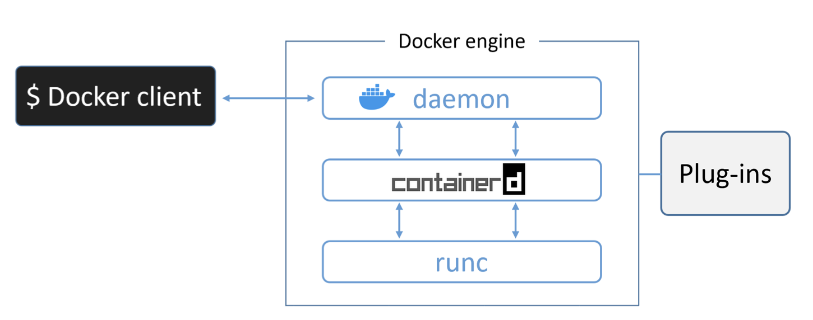
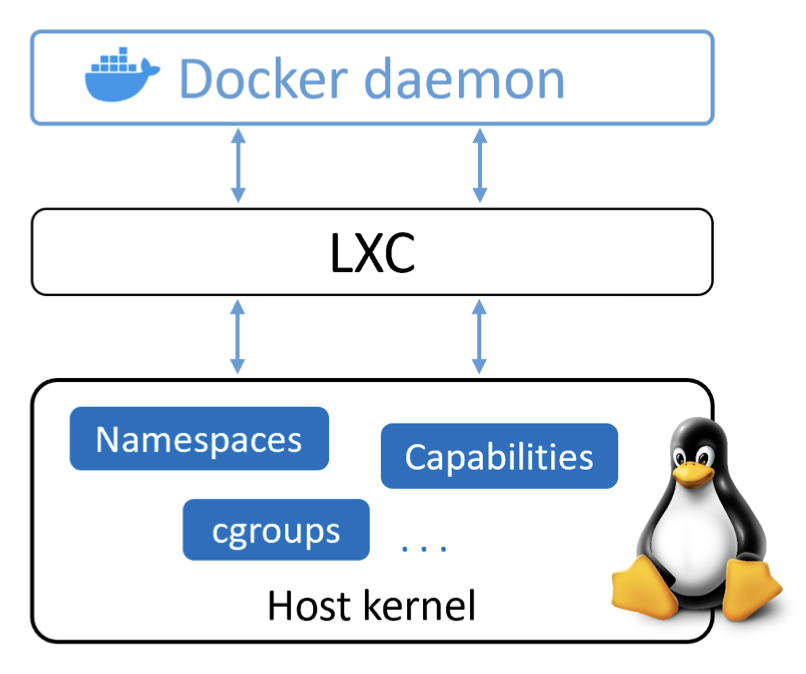
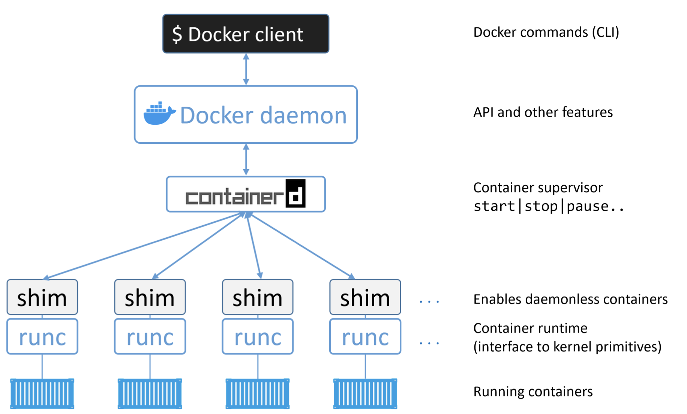
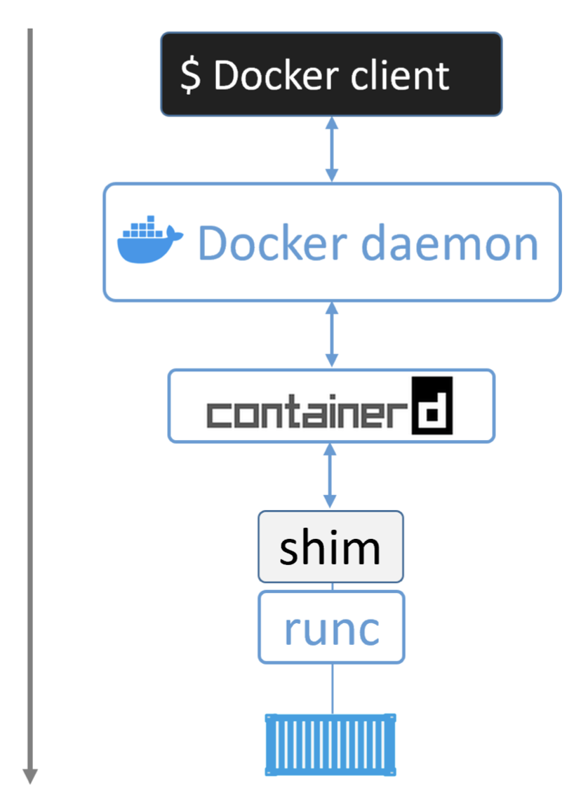

---
authors:
- jwher
description: 도커 딥 다이브
slug: the-docker-engine
tags:
- docker
- linux
title: 도커 엔진
---

[](/posts/the-docker-engine)  
*The Docker Engine*  
*이 글은 [Nigel Poulton](https://www.docker.com/captains/nigel-poulton/)의 Docker Deep Dive를 읽고 작성되었습니다*  

<!--truncate-->

이 글에선 도커 엔진 밑에서 작동하는것들에 대해 빠르게 살펴볼 것입니다.

이 챕터에서 다루고 있는 것들을 몰라도 도커를 사용할 수 있습니다.
하지만 도커를 마스터하고 싶다면, 밑에서 일어나고 있는 일을 이해해야 합니다.

이 글은 이론에 대해 다루므로, 실습은 없습니다.

<br/>
<br/>
<br/>
<br/>
<br/>
<br/>

## The TLDR
*커피 한잔 하면서 읽을 수 있는 요약*  

*도커 엔진*은 컨테이너를 실행하고 관리하는 핵심 소프트웨어입니다.
우리는 자주 간단하게 *도커*라고 부릅니다. VMware에 대해 좀 알고 있다면, ESXi처럼 생각하는게 유용할 것입니다.

도커는 많은 작은 특별한 도구로 만들어진 모듈러 디자인입니다.
이는 Open Container Initiative(OCI)에서 관리중인 공개 표준으로 가능합니다.

많은 면에서 도커 엔진은 자동차 엔진과 비슷합니다. 둘다 모듈단위에 매우 작은 부분의 연결로 만들어진다는 것입니다.
* 자동차 엔진은 많은 특별한 부분들이 함께 작동해 차가 움직이게합니다. - 흡기구, 스로틀바디, 실린더, 점화 플러그, 배기구 등
* 도커 엔진은 많은 특별한 도구가 함께 작동해 컨테이너를 생성하고 실행합니다. - APIs, execution driver, runtimes, shims 등

현재 도커의 주요 요소는 다음과 같습니다. Docker daemon, containerd, runc 그리고 다양한 스토리지간 네트워킹하는 플러그인이 있습니다.

runc와 containerd는 소문자로 표기합니다.

  
*그림1 High level view*  

<br/>
<br/>
<br/>
<br/>
<br/>
<br/>

## The Deep Dive
*자세한 설명*  

도커가 처음 릴리즈 되었을때, 도커 엔진은 두개의 주요 컴포넌트였습니다.
* Docker daemon
* LXC

도커 데몬은 단일(monolithic) 바이너리였습니다.
이는 도커 클라이언트, 도커 API, 컨테이너 런타임, 이미지 빌드와 더 많은 것에 대한 코드를 포함하고 있었습니다.

LXC는 데몬에 리눅스 커널에 존재하는 컨테이너의 기본 빌딩 블럭에 접근하는 방법을 제공합니다.
이것들은 *namespaces*와 *control groups*(cgroups) 같은 것들입니다.

  
*그림2 Original Docker architecture*  

<br/>
<br/>
<br/>

### LXC 제거하기
*Getting rid of LXC*

LXC에 대한 의존성으로 시작해봅시다.

처음으로, LXC는 리눅스 한정적입니다. 이는 멀티 플랫폼이 되려는 열망을 가진 (도커)프로젝트에 큰 문제입니다.

둘째로, 프로젝트에 굉장히 핵심적인 부분을 외부 도구에 의존하는것은 개발에 방해가 될 수 있는 큰 위험입니다.

결과적으로, 도커 Inc에서는 LXC의 대체로 *libcontainer*라 불리는 자체 도구를 만들었습니다.
*libcontainer*의 목적은 플랫폼에 상관없는 도구로, 커널 호스트에 존재하는 근본적인 컨테이너 빌딩 블록 접근을 도커에 제공하는 것입니다.

Libcontainer는 도커 0.9에서 기본 *execution dirver*로 LXC를 대체했습니다.

<br/>
<br/>
<br/>

### 단일 도커 데몬 제거하기
*Getting rid of the monolithic Docker daemon*

시간이 지나며, 도커 데몬의 단일 환경(monolithic nature)은 더더욱 문제가 생겼습니다.

1. 혁신이 어렵습니다.
2. 점점 느려집니다.
3. 생태(ecosystem)가 원하는게 아니였습니다.

도커 Inc는 이런 문제를 인지하고 단일 데몬을 부분으로 나누고 모듈화하는데 큰 기여를 했습니다.
작업의 목표는 데몬을 가능한 작게 기능적으로 쪼개고 작은 특화된 도구로 다시 구현하는 것입니다.
특화된 도구는 교체할 수 있을 뿐만 아니라, 서드파티에서 다른 도구를 만들기 위해 재사용할 수 있습니다.
이 계획은 작은 특화된 도구를 같이 모아 큰 도구를 만들 수 있다는 시도해왔고 검증된 [유닉스 철학](/posts/welcome-to-kubernetes#unix-철학)을 따릅니다.

도커 엔진을 나누고 리팩토링하는 작업은 모든 컨테이너 실행과 컨테이너 런타임 코드를 데몬으로부터 완전히 제거하였고 작고 특화된 도구로 바꾸었습니다.


*그림3 High level view of the current Docker engine*

<br/>
<br/>
<br/>

### OCI의 영향
*The influence of the Open Container Initiative*

도커 Inc가 데몬을 나누고 코드 리팩토링을 할때, [OCI](#opencontainers)는 두가지 컨테이너 관련 명세를 정의하고 있었습니다. (a.k.a. 표준)

1. [이미지 명세](#image-spec)
2. [컨테이너 런타임 명세](#runtime-spec)

두 명세는 2017 7월 버전 1.0에 공개되었고, 안정성이 가장 중요시되었기 때문에 너무 많은것을 바꿀 수 없었습니다.
최신 이미지 명세는 v1.0.1로 2017년 11월에 공개되었습니다.
최신 런티암 명세는 v1.0.2로 2020년 3월에 공개되었습니다.

도커 Inc는 이 표준에 강하게 관련되었고, 많은 코드를 기여했습니다.

도커 1.11 (2016 전반기)에 도커 엔진은 OCI 명세에 최대한 비슷하게 구현되었습니다.
예를들어 도커 대몬은 더이상 어떤 컨테이너 런타임 코드를 포함하지 않습니다 - 모든 컨테이너 런타임 코드는 분리된 OCI-conpliant 레이어에서 구현되었습니다.
기본적으로 도커는 *runc*를 이를 위해 사용합니다. runc는 OCI container-runtime 명세에 *reference implementation*입니다.
그림3에서 runc 컨테이너 런타임 레이어를 볼 수 있습니다.

마찬가지로, 도커 엔진의 *containerd* 컴포넌트는 도커 이미지가 *runc*에서 유효한 OCI 번들로 표현될 수 있게 합니다.

<br/>
<br/>
<br/>

### runc

이전에 언급했듯, *runc*는 OCI 컨테이너 런타임 명세의 reference implementation입니다.
도커 Inc는 runc의 명세를 정의하고 개발하는데 많이 관여했습니다.

만약 다른 모든것을 제거한다면, runc는 libcontainer의 작고 경량화된 CLI wrapper입니다.
(libcontainer가 초기 도커 아키텍처에서 호스트 OS와 인터페이스 역할을 하고 있던 LXC를 대체한것을 기억하세요)

runc는 컨테이너 생성이라는 하나의 목적을 가집니다. runc는 일을 매우 잘하고, 빠릅니다!
그러나 CLI wrapper로써, 이는 효과적인 독립된 컨테이너 런타임 도구입니다.
이 뜻은 다운로드해 바이너리를 빌드하면, runc (OCI) 컨테이너를 빌드하고 사용하는데 모든 것을 갖춘 것입니다.
그러나 뼈와 같고(bare bone) 매우 저수준 동작(low-level)은, 발달한 도커 엔진의 다채로운 기능을 얻을 수 없음을 뜻합니다.

우리는 runc가 동작하는 레이어를 "OCI layer"라고 부르기도 합니다.
그림3에서 확인할 수 있습니다.

runc 릴리즈 정보를 다음에서 확인할 수 있습니다.
* https://github.com/opencontainers/runc/releases

<br/>
<br/>
<br/>

### containerd

도커 데몬 기능을 줄이려는 노력의 일환으로, 모든 컨테이너 실행 로직은 찢어져 containerd(컨테이너 d)라 불리는 새로운 도구로 리팩토링되었습니다.
이는 컨테이너 생명주기를 관리하는 목적만 수행합니다. (start, stop, pause, rm)

containderd는 리눅스와 윈도우 데몬으로 가능하고, 도커는 1.11 릴리즈부터 리눅스에서 사용되고 있습니다.
도커 엔진 스택에서, containerd는 OCI 레이어에서 데몬과 runc 사이에 위치합니다.

전에 기술했듯이, containerd는 작고, 경량화되고 하나의 목적 - 컨테이너의 생명주기 관리를 의도했습니다.
그러나, 시간이 지나며 더 많은 기능으로 가지를 뻗었습니다.
이미지 풀, 볼륨, 네트워크 같은 기능으로요.

더 많은 기능을 추가하게 된 이유중 하나는 다른 프로젝트에서 사용하기 편하게 했기 때문입니다.
예를들어 쿠버네티스와 같은 프로젝트에서, containerd가 추가적인 이미지를 푸쉬하고 풀같은 것을 하는건 유익했습니다.
이런 이유로, containerd는 간단한 컨테이너 생명주기 관리보다 더 많은 것을 수행합니다.
그러나, 모든 추가적인 기능은 원하는것만 선택하고 고를수있도록 모듈이고 부가적입니다.
따라서, 쿠버네티스와 같은 프로젝트에서 containerd를 포함하는것은 가능합니다, 그러나 프로젝트에 필요한 조각만 가져갑니다.

containerd는 도커 Inc에서 개발되었고 CNCF에 기부되었습니다.
이 글을 쓸때, containerd는 완전히 졸업한(fully graduated) CNCF 프로젝트로, 안정적이고 제품에 사용가능하다고 생각할 수 있다는 뜻입니다.
여기에서 최신 릴리즈를 확인할 수 있습니다.
* https://github.com/containerd/containerd/releases

<br/>
<br/>
<br/>

### 새 컨테이너 시작하기
*Starting a new container*

이제 큰 그림을 보았고, 역사의 일부를 보았으니, 새 컨테이너를 생성하는 과정을 살펴봅시다.

컨테이너를 시작하는 가장 일반적인 방법은 도커 CLI를 사용하는 것입니다.
`docker container run` 명령어는 `alpine:latest` 이미지에 기반한 간단한 새 컨테이너를 시작할 것입니다.

```
$ docker container run --name ctrl -it alpine:latest sh
```

이 커맨드를 도커 CLI에 입력했을 때, 도커 클라이언트는 적절한 API payload로 변환해 도커 데몬이 노출한 API endpoint로 POST합니다.
API는 데몬에 구현되어있고, 로컬 소켓과 네트워크로 노출될 수 있습니다.
리눅스에서 소켓은 `/var/run/docker.sock`이고 윈도우에선 `\pipe\docker_engine`입니다.

한번 데몬이 새 컨테이너를 생성하라는 명령을 받으면, containerd를 호출하게 됩니다.
데몬이 더이상 컨테이너를 생성하는 어떤 코드도 없다는걸 기억하세요.

데몬은 containerd와 [gRPC](#grpc)위에 CRUD 스타일 API를 통해 통신합니다.

이름과 달리, containerd는 컨테이너를 실제로 생성하지 못합니다.
containerd는 *runc*를 통해 컨테이너를 생성합니다.
containerd는 요구된 도커 이미지를 OCI 번들로 바꾸고 runc에게 이를 사용해 새 컨테이너를 만들라고 말합니다.

runc는 OS 커널과 인터페이스해 모든 컨테이너 구성에 필요한(namespaces, cgroups 등)것을 합칩니다.
컨테이너 프로세스는 runc의 자식 프로세스로 시작되고, 시작되는대로 runc는 종료됩니다.

자! 이제 컨테이너가 시작되었습니다. 이 프로세스는 그림4에 요약되었습니다.

  
*그림4 Starting a new container*

<br/>
<br/>
<br/>

### 이 모델의 한가지 큰 장점
*One huge benefit of this model*

데몬에서 컨테이너를 시작하고 관리하는 모든 로직과 코드를 제거했다는 뜻은 전체 컨테이너 런티임이 도커 데몬으로부터 분리되었다는 뜻입니다.
"데몬없는(daemonless) 컨테이너"라고 부르기도 하고, 이는 실행중인 컨테이너에 영향을 미치지 않고 도커 데몬을 업그레이드하고 관리하는걸 가능하게 합니다.

과거 모델에서, 컨테이너 런타임 로직은 데몬에 구현되었기 때문에, 데몬을 사작하고 정지하는것은 호스트에서 동작중인 컨테이너를 죽였습니다.
이것은 제품 환경에서 큰 문제입니다 - 특히 얼마나 자주 새 버전의 도커가 릴리즈 되는지 고려해야 한다면요!
모든 데몬을 업그레이드 할때 호스트의 모든 컨테이너를 죽일 것입니다 - 좋지 않습니다!

다행히, 이제 문제가 아닙니다.

<br/>
<br/>
<br/>

### Shim이 무엇인가요?
*What's this shim all about*

이 챕터의 일부 다이어그램은 shim 컴포넌트를 보여주고 있습니다.
Shim은 데몬없는 컨테이너 구현에 필수적입니다(실행중인 컨테이너를 데몬 업그레이드와 같은것을 위해 데몬과 분리하는 것을 직전에 언급했습니다).

더 전에 *containerd*는 runc를 사용해 새 컨테이너를 생성한다고 언급했습니다.
사실은, 모든 컨테이너가 생성될때 새 runc 인스턴스를 포크합니다.
그러나, 한번 각 컨테이너가 생성되면, 부모 runc 프로세스는 종료됩니다.
이는 수백개의 runc 인스턴스 없이 수백개의 컨테이너를 실행할 수 있다는 뜻입니다.

한번 컨테이너의 부모 runc 프로세스가 종료되면, 연관된 containerd-shim 프로세스가 컨테이너의 부모가 됩니다.
컨테이너의 부모로 shim이 수행하는 책임 일부는 다음을 포합합니다:
* 열린 STDIN과 STDOUT 스트림을 유지해 데몬이 재시작되어도, 파이프가 닫히는 등에 따라 컨테이너가 종료되지 않게 합니다.
* 데몬에 컨테이너의 종료 상태를 보고합니다.

<br/>
<br/>
<br/>

### 리눅스에서 어떻게 구현됬나요?
*How it's implemented on Linux*

리눅스 시스템에서, 논의한 컴포넌트는 다음과 같이 별도의 바이너리로 구현됩니다:
* dockerd (도커 데몬)
* docker-containerd(containerd)
* docker-containerd-shim(shim)
* docker-runc(runc)

도커 호스트에서 `ps` 명령어를 실행해 리눅스 시스템에서 모두 확인할 수 있습니다.
당연하게도, 몇몇은 실행중인 컨테이너가 있어야 보일 것입니다.

<br/>
<br/>
<br/>

### 데몬의 요점은 무엇인가요?
*What's the point of the daemon*

모든 실행과 런타임 코드가 데몬으로부터 제거되었으면 이런 질문을 할 수 있습니다: "데몬엔 뭐가 남아있나요?"

당연하게도, 대답은 시간이 갈수록 점점 기능이 제거되고 모듈화되며 바뀔 것입니다.
그러나, 현재는 몇가지 중요한 기능이 데몬에 포함되어 있습니다; 이미지 관리, 이미지 빌드, REST API, 인증, 보안, 코어 네트워킹 그리고 오케스트레이션.

<br/>
<br/>
<br/>
<br/>
<br/>
<br/>

## 챕터 요약

도커 엔진은 모듈러 디자인이고 OCI의 공개 표준에 기반하고 있습니다.

도커 데몬은 풍부하고 버전관리된 HTTP API인 도커 API를 구현해 나머지 도커 프로젝트와 나란히 개발되었습니다.

컨테이너 실행은 도커 Inc에서 작성되고 CNCF에 기여된 *containerd*에 의해 관리됩니다.
containerd를 컨테이너 생명주기 관리를 다루는 감독자로 생각할 수 있습니다.
이는 작고 경량화되고 다른 프로젝트와 서드 파티 도구에 사용될 수 있습니다.
예를 들어, 쿠버네티스에 가장 흔한 컨테이너 런타임이 되고 있습니다.

containerd는 실제로 컨테이너를 생성하기 위해 OCI-compliant 컨테이너 런타임에 말해야 합니다.
기본적으로 도커는 *runc*를 기본 컨테이너 런타임으로 사용합니다.
runc는 OCI 런타임 명세의 de facto 구현이고 OCI-compliant 번들로부터 컨테이너를 시작하도록 기대됩니다.
containerd는 runc에게 말하고 도커 이미지가 OCI-compliant 번들로 runc에 보이도록 보장합니다.

runc는 독립적인 CLI 도구로 컨테이너를 만드는데 사용할 수 있습니다.
runc는 libcontainer에 기반하고, 마찬가지로 다른 프로젝트와 서드 파티 도구에 사용될 수 있습니다.

아직 많은 기능이 도커 데몬에 구현되어 있습니다.
더 많은 것이 시간이 지나며 쪼개질 것입니다.
현재 도커 데몬 내부 기능으로 포함되어 있지만, 이에 국한되지 않습니다; 도커 API, 이미지 관리, 인증, 보안 기능과 코어 네트워킹.

<br/>
<br/>
<br/>
<br/>
<br/>
<br/>

## References

### [opencontainers](https://www.opencontainers.org/)
### [image-spec](https://github.com/opencontainers/image-spec)
### [runtime-spec](https://github.com/opencontainers/runtime-spec)
### [gRPC](https://grpc.io/)

<br/>
<br/>
<br/>
<br/>
<br/>
<br/>
