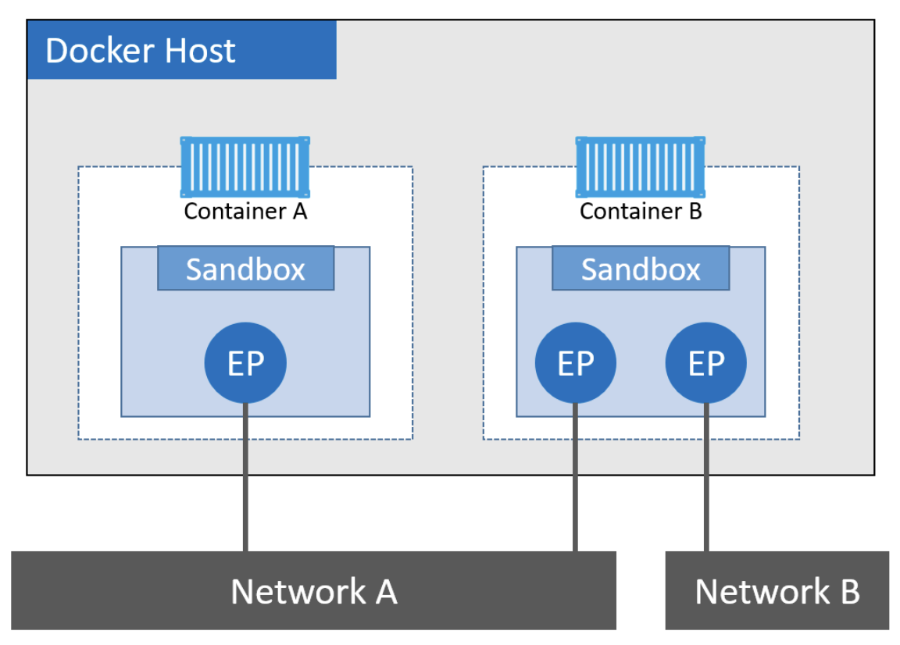
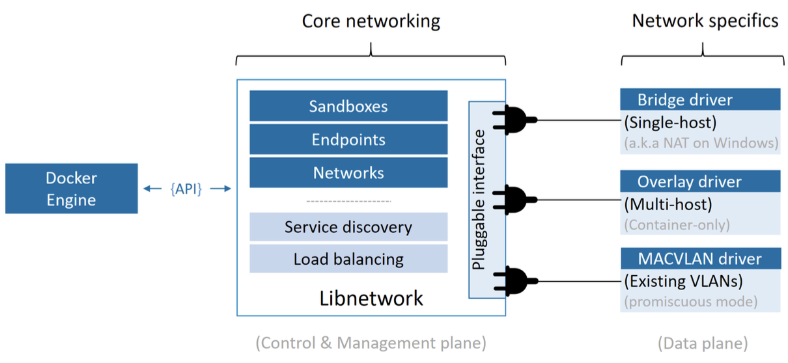
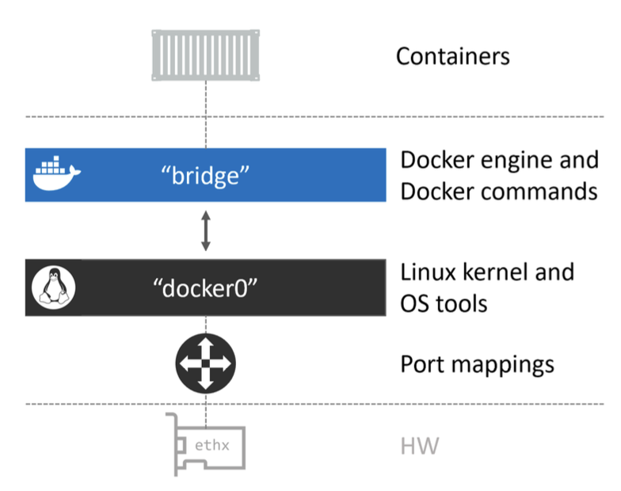
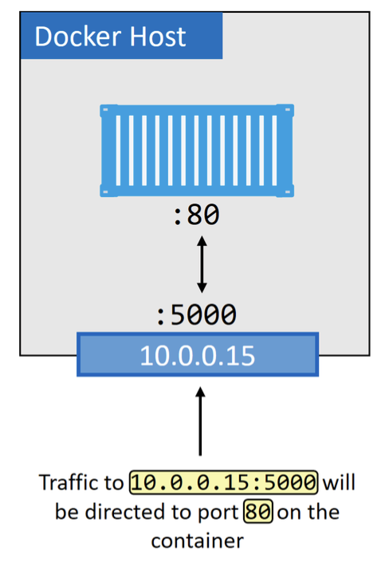
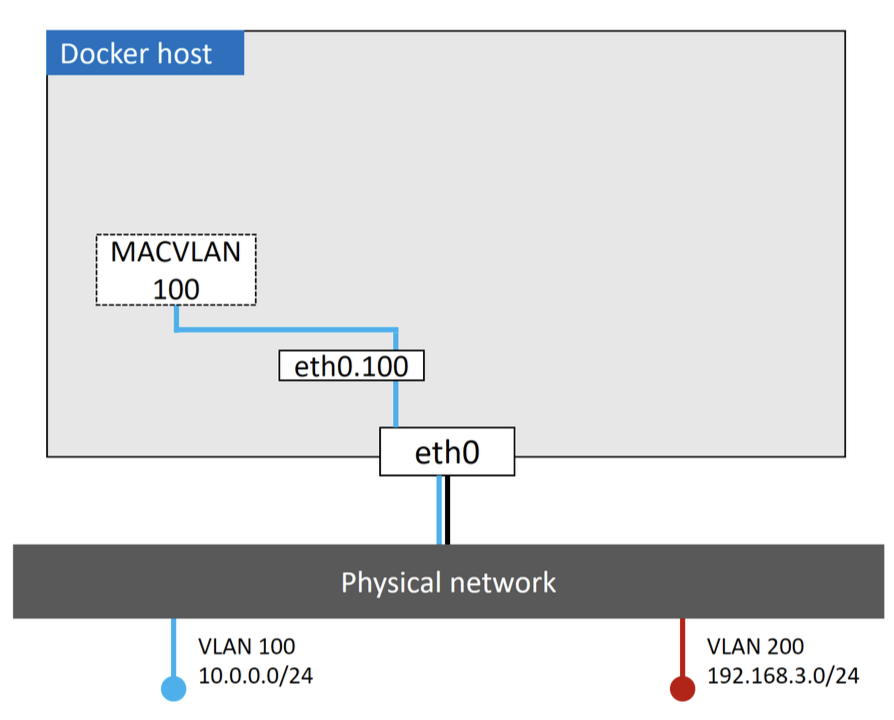
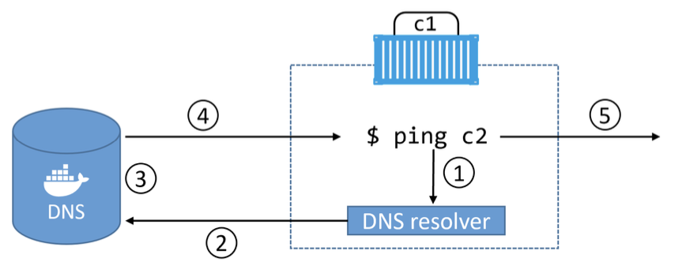

---
authors:
- jwher
description: 도커 딥 다이브
slug: docker-networking
tags:
- docker
- linux
title: 도커 네트워킹
---

[](/posts/docker-networking)  
*Docker Networking*  
*이 글은 [Nigel Poulton](https://www.docker.com/captains/nigel-poulton/)의 Docker Deep Dive를 읽고 작성되었습니다*  

Docker 네트워킹의 기본을 살펴봅니다. 예를 들어 Container Network Model(CNM)이나 libnetwork와 같은 개념들이 있습니다.

<!--truncate-->

Docker는 애플리케이션을 컨테이너 안에서 실행하며, 애플리케이션은 다양한 네트워크를 통해 통신해야 합니다. 따라서 Docker는 강력한 네트워킹 기능이 필요합니다.

다행히 Docker는 컨테이너 간 네트워크뿐만 아니라 기존 네트워크 및 VLAN과의 연결을 위한 솔루션도 제공합니다. 후자는 컨테이너화된 애플리케이션이 가상머신(VM)이나 물리 서버와 같은 외부 시스템과 상호작용해야 할 때 중요합니다.

Docker 네트워킹은 **Container Network Model(CNM)**이라 불리는 오픈 소스 플러그형 아키텍처에 기반하고 있습니다. `libnetwork`는 CNM의 실제 구현이며, Docker의 핵심 네트워크 기능을 모두 제공합니다. 다양한 네트워크 토폴로지를 구현하기 위해 드라이버가 `libnetwork`에 플러그인 형태로 연결됩니다.

Docker는 사용자에게 원활한 기본 환경을 제공하기 위해, 가장 일반적인 네트워크 요구사항을 처리할 수 있는 기본 드라이버들을 함께 제공합니다. 여기에는 [단일 호스트 브리지 네트워크](#single-host-bridge-networks), [다중 호스트 오버레이](#multi-host-overlay-networks), [기존 네트워크 연결](#connecting-to-existing-networks) 옵션 등이 포함됩니다.

마지막으로, `libnetwork`는 기본적인 서비스 디스커버리와 컨테이너 로드밸런싱 기능도 제공합니다.

## Deep Dive

여기에서 다음 내용을 설명합니다.
- [이론](#the-theory)
- [단일 호스트 브리지 네트워크](#single-host-bridge-networks)
- [다중 호스트 오버레이](#multi-host-overlay-networks)
- [기존 네트워크 연결](#connecting-to-existing-networks)
- [서비스 디스커버리](#service-discovery)
- [인그레스 로드밸런싱](#ingress-load-balancing)

### The Theory
*이론*

Docker 네트워킹은 다음 세 가지 주요 구성 요소로 이루어집니다:

- Container Network Model (CNM): 설계 명세
- libnetwork: 실제 구현체
- Drivers: 다양한 네트워크 토폴로지를 실현하는 플러그인

CNM은 설계 명세서로, Docker 네트워크의 기본 구성 요소를 정의합니다.
libnetwork는 CNM을 실제로 구현한 것으로, Docker에서 사용됩니다. Go 언어로 작성되었으며, CNM에서 정의된 핵심 요소들을 구현합니다.
드라이버는 VXLAN 오버레이 네트워크와 같은 특정 네트워크 토폴로지를 구현하여 모델을 확장합니다.

#### Container Network Model (CNM)
*모든 것은 설계에서 시작됩니다.*

CNM은 Docker 네트워킹의 설계 가이드로, 다음 세 가지 핵심 구성 요소를 정의합니다:

- **Sandbox**: 격리된 네트워크 스택 (인터페이스, 포트, 라우팅 테이블, DNS 등 포함)
- **Endpoint**: Sandbox와 네트워크를 연결하는 가상 네트워크 인터페이스
- **Network**: Endpoint들을 연결하고 그룹화하는 가상 스위치

  
*컨테이너 A와 B는 같은 호스트에서 동작하지만, 네트워크 스택은 샌드박스를 통해 OS-level에서 완전히 분리됩니다.*

샌드박스는 격리된 네트워크 스택으로, 이더넷 인터페이스, 포트, 라우팅 테이블, DNS 설정 등을 포함합니다.
엔드포인트는 가상 네트워크 인터페이스(veth 등)로, 샌드박스를 네트워크에 연결하는 역할을 합니다.
네트워크는 소프트웨어적으로 구현된 스위치(802.1d 브리지)로, 서로 통신해야 하는 엔드포인트들을 그룹으로 묶고 격리하는 기능을 합니다.

컨테이너는 Docker의 기본 스케줄링 단위이며, CNM의 핵심 목적은 이 컨테이너에 네트워크를 제공하는 것입니다. 컨테이너 내부에 샌드박스를 배치하여 네트워크 연결성을 제공합니다.
컨테이너는 **하나 이상**의 Endpoint를 통해 네트워크에 연결됩니다. Endpoint는 하나의 네트워크에만 연결될 수 있기 때문에, **다중 네트워크 연결이 필요하면 여러 Endpoint가 필요**합니다.

### libnetwork
*[libnetwork github](https://github.com/moby/libnetwork)*

`libnetwork`는 CNM을 구현한 라이브러리이며, Docker의 핵심 네트워크 로직이 이 안에 포함되어 있습니다. Go 언어로 작성되었고, 플랫폼 독립적(Linux/Windows)입니다.
Docker에서 기본적으로 사용되고 있습니다.

Docker 초창기에는 네트워크 코드가 데몬 내부에 포함되어 있었습니다. 이는 유지보수 및 확장성 측면에서 매우 비효율적이었고, [유닉스 철학](/posts/welcome-to-kubernetes#unix-%EC%B2%A0%ED%95%99)인 모듈화 원칙에도 어긋났습니다. 이후 이러한 코드들은 모두 외부 라이브러리로 분리되어 CNM 기반의 `libnetwork`로 재구성되었습니다.

libnetwork는 CNM의 세 가지 구성 요소를 모두 구현하며, 기본적인 서비스 디스커버리, 인그레스 기반 로드밸런싱, 네트워크 제어/관리 기능도 제공합니다.

### Drivers

`libnetwork`가 제어 및 관리 평면(control/management plane)을 구현한다면, 드라이버는 데이터 평면(data plane)을 구현합니다. 즉, 실제 네트워크 연결과 격리, 네트워크 생성 등은 드라이버가 처리합니다.

  
*도커 네트워크 평면간 관계*

드라이버는 실제 네트워크 생성 및 데이터 전송 경로를 담당합니다. 예를 들어, Linux에서는 `bridge`, `overlay`, `macvlan` 드라이버가 포함되며, Windows에서는 `nat`, `overlay`, `transparent`, `l2bridge` 등이 포함됩니다.

서드파티 업체도 remote driver 또는 plugin 형태로 Docker 네트워크 드라이버를 작성할 수 있습니다. Weave Net이 대표적인 예시입니다.

각 드라이버는 자신이 담당하는 네트워크의 리소스를 생성, 관리, 삭제하는 책임을 집니다. 예를 들어 "prod-fe-cuda"라는 overlay 네트워크는 overlay 드라이버가 관리합니다.

복잡하고 동적인 환경의 요구를 충족하기 위해 `libnetwork`는 여러 드라이버가 동시에 활성화될 수 있도록 지원합니다. 이를 통해 Docker는 다양한 이질적인 네트워크 구성을 동시에 운영할 수 있습니다.

### Single-host bridge networks
*단일 호스트 브리지 네트워크*

가장 단순한 Docker 네트워크 유형은 단일 호스트 브리지 네트워크입니다.
이름에서 알 수 있듯이 두 가지 의미를 담고 있습니다:

- **단일 호스트(single-host)**: 하나의 Docker 호스트에서만 존재하며, 동일한 호스트 내의 컨테이너 간 연결만 지원합니다.
- **브리지(bridge)**: 802.1d 브리지(L2 스위치)를 소프트웨어적으로 구현한 것입니다.

단일 호스트 브리지 네트워크는 한 Docker 호스트 내에서만 작동하며, 같은 호스트 내 컨테이너 간의 통신에 사용됩니다.
예를 들어, 두 개의 Docker 호스트에 동일한 이름의 “mynet” 브리지 네트워크가 있다고 하더라도, 각각은 독립적인 네트워크이므로 서로 통신할 수 없습니다.

리눅스에서 Docker는 내장된 `bridge` 드라이버를 사용해 단일 호스트 브리지 네트워크를 생성하며, 윈도우에서는 `nat` 드라이버를 사용합니다. 기능은 본질적으로 동일합니다.
호스트마다 기본 브리지 네트워크(`bridge` 또는 `nat`)가 자동 생성되며 이는 해당 플랫폼에서 기본 드라이버와 이름이 동일하지만, 필수 조건은 아닙니다.
기본적으로 새 컨테이너는 이 네트워크에 연결되며, `--network` 플래그를 통해 변경할 수 있습니다.

```bash
//Linux
$ docker network ls
NETWORK ID        NAME        DRIVER    SCOPE
333e184cd343      bridge      bridge    local

//Windows
> docker network ls
NETWORK ID        NAME        DRIVER    SCOPE
095d4090fa32      nat         nat       local
```

`docker network inspect` 명령어는 네트워크의 상세 정보를 제공하므로 꼭 활용해보는 것이 좋습니다. 예를 들어, 리눅스의 기본 "bridge" 네트워크는 리눅스 커널의 `docker0`라는 브리지 인터페이스에 매핑됩니다.

```bash {22}
$ docker network inspect bridge
[
    {
        "Name": "bridge",
        "Id": "cc9c16c9cb0a56058a539e02add352674ddc61693b96cf03be739520d55a7265",
        "Created": "2025-01-11T02:32:32.706835777+09:00",
        "Scope": "local",
        "Driver": "bridge",
        "EnableIPv6": false,
        "IPAM": {
            "Driver": "default",
            "Options": null,
            "Config": [
                {
                    "Subnet": "172.17.0.0/16",
                    "Gateway": "172.17.0.1"
                }
            ]
        },
        "Options": {
            "com.docker.network.bridge.default_bridge": "true",
            "com.docker.network.bridge.name": "docker0",
        },
        "Labels": {}
    }
]
```

브리지 드라이버로 생성된 네트워크는 리눅스 커널의 검증된 `linux bridge` 기술을 기반으로 하므로, 성능이 우수하고 안정적입니다. `ip link show docker0` 또는 `brctl show` 명령어로 시스템 내 브리지를 확인할 수 있습니다.


*"bridge" 네트워크는 호스트 커널의 docker0 Linux 브리지에 매핑되고, docker0 브리지는 포트 매핑으로 호스트의 Ethernet interface에 매핑된다*

새로운 브리지 네트워크를 만들려면 다음과 같이 명령어를 사용합니다:

```bash
docker network create -d bridge localnet  # Linux
docker network create -d nat localnet     # Windows
```

리눅스 `brctl` 도구를 사용해 현재 시스템의 리눅스 브리지를 살펴봅시다.

```bash
$ brctl show
bridge name	bridge id		STP enabled	interfaces
docker0		8000.02426ad7215c	no		veth263aaf9
```

컨테이너를 특정 브리지 네트워크에 연결하여 실행하면, 그 컨테이너는 해당 네트워크 내에서 DNS 이름으로 다른 컨테이너를 찾을 수 있습니다. 단, **기본 "bridge" 네트워크에서는 Docker DNS 이름 해석이 동작하지 않으며**, 사용자 정의 브리지(e.g. 위에서 만든 localnet) 네트워크에서만 작동합니다.

  
*포트 매핑을 사용하면 컨테이너를 Doker 호스트의 포트에 매핑할 수 있습니다. 구성된 포트에서 Doker 호스트에 대한 모든 트래픽은 컨테이너로 전달됩니다.*

컨테이너 외부 통신은 포트 매핑을 통해 이루어집니다. 예를 들어, 컨테이너의 80번 포트를 호스트의 5000번 포트에 매핑할 수 있습니다.
`--publish` 또는 `-p` 플래그를 통해 호스트 포트를 컨테이너 포트로 매핑합니다. 그러나 이 방식은 확장성이 부족하여 개발 및 소규모 환경에 적합합니다.

### Multi-host overlay networks
*다중 호스트 오버레이 네트워크*

오버레이 네트워크는 여러 Docker 호스트에 걸쳐 하나의 네트워크를 생성합니다. 이를 통해 서로 다른 호스트에 있는 컨테이너들도 마치 같은 네트워크에 있는 것처럼 통신할 수 있습니다. Docker는 `overlay` 드라이버를 제공하며, `docker network create -d overlay` 명령으로 생성할 수 있습니다.

다중 호스트 오버레이 네트워크는 다른 글에서 더 자세히 다루겠습니다!

### Connecting to existing networks
*기존 네트워크 연결*

기존 물리 네트워크 및 VLAN에 컨테이너를 직접 연결하기 위해 `MACVLAN` 드라이버가 사용됩니다.
윈도우에서는 transparent 드라이버가 이에 해당합니다.
MACVLAN 드라이버는 각 컨테이너에 고유한 MAC 주소 및 IP 주소를 부여하여, 네트워크상에서 컨테이너가 물리 장비처럼 동작하게 합니다.
성능이 뛰어나지만, **호스트 NIC가 promiscuous 모드**에 있어야 하며, 이는 공용 클라우드 환경에서는 제한될 수 있습니다. 따라서 주로 사내 데이터센터 환경에서 사용됩니다.



`MACVLAN` 네트워크를 생성할 때는 다음과 같은 정보를 지정해야 합니다:

- 서브넷
- 게이트웨이
- IP 할당 범위
- 사용할 호스트 인터페이스 또는 서브 인터페이스 (예: eth0.100)

예시 명령어:

```bash
docker network create -d macvlan \
  --subnet=10.0.0.0/24 \
  --ip-range=10.0.0.0/25 \
  --gateway=10.0.0.1 \
  -o parent=eth0.100 \
  macvlan100
```

위와 같이 설정한 후 컨테이너를 실행하면, 해당 VLAN(예: VLAN 100) 내의 다른 장비들과 직접 통신할 수 있습니다.

### 컨테이너 및 서비스 로그를 활용한 문제 해결

컨테이너 간 통신에 문제가 있다고 판단되면, Docker 데몬 로그 및 컨테이너 로그를 확인하는 것이 좋습니다.

- **리눅스**: systemd 기반이면 `journalctl -u docker.service`, 기타 배포판은 `/var/log` 하위 경로
- **윈도우**: `%AppData%\Local\Docker`, 또는 이벤트 뷰어에서 확인 가능

- Ubuntu systems: /var/log/upstart/docker.log
- RHEL-based systems: /var/log/messages
- Debian: /var/log/daemon.log

`daemon.json` 설정 파일에서 `"debug": true`, `"log-level": "debug"` 등을 설정하여 로그 수준을 높일 수 있습니다. 변경 후에는 Docker를 재시작해야 합니다.

컨테이너 로그는 `docker container logs` 명령어로 확인하며, Swarm 서비스는 `docker service logs` 명령어를 사용합니다. 기본 로깅 드라이버는 `json-file`이며, `--log-driver` 플래그로 개별 설정도 가능합니다.

### Service discovery
*서비스 디스커버리*

libnetwork는 기본적인 네트워크 서비스로서 **서비스 디스커버리** 기능도 제공합니다. 같은 네트워크에 있는 컨테이너나 Swarm 서비스는 서로의 이름으로 통신할 수 있습니다.

이 기능은 Docker 내장 DNS 서버와 각 컨테이너의 로컬 DNS 리졸버를 통해 동작하며, `--name` 또는 `--net-alias`로 이름이 등록된 컨테이너는 자동으로 DNS에 등록됩니다.

또한 `--dns`, `--dns-search` 옵션을 통해 컨테이너의 DNS 설정을 세부 조정할 수 있으며, 리눅스 컨테이너 내의 `/etc/resolv.conf`에 반영됩니다.



### Ingress load balancing

Docker Swarm은 두 가지 서비스 공개 방식(publish mode)을 지원합니다:

- **인그레스 모드 (기본값)**: 클러스터 내 모든 노드에서 접근 가능
- **호스트 모드**: 서비스 복제본이 실행 중인 노드에서만 접근 가능

Ingress 모드는 내부적으로 Layer 4 Routing Mesh를 사용하여 클러스터 전역에 서비스 접근을 제공합니다.

호스트 모드 예시:

```bash
docker service create -d --name svc1 \
  --publish published=5000,target=80,mode=host \
  nginx
```

인그레스 모드는 L4 기반 라우팅 메쉬(Service Mesh)를 활용하며, 외부 요청은 클러스터 내 어디로 들어오든 적절한 서비스 복제본으로 전달됩니다. 복제본이 여러 개일 경우 요청이 균등하게 분산됩니다.

## The Commands
*명령어*

Docker 네트워크 관리는 `docker network` 하위 명령어를 사용합니다:

- `docker network ls`: 모든 네트워크 목록 출력
- `docker network create`: 새로운 네트워크 생성 (`-d`로 드라이버 지정)
- `docker network inspect`: 네트워크 상세 정보 확인
- `docker network prune`: 사용되지 않는 네트워크 일괄 삭제
- `docker network rm`: 특정 네트워크 삭제

## Summary

- **CNM**은 Docker 네트워크의 설계 문서로, 샌드박스, 엔드포인트, 네트워크의 세 가지 핵심 구성 요소를 정의합니다.
- **libnetwork**는 Go로 작성된 오픈소스 라이브러리로, CNM을 구현하며 Docker의 네트워크 제어/관리 평면을 담당합니다.
- **드라이버**는 bridge, overlay, macvlan 등 다양한 네트워크 유형을 구현하며, 내장 또는 서드파티 형태로 제공됩니다.
- **단일 호스트 브리지 네트워크**는 로컬 개발이나 소규모 서비스에 적합하지만 확장성이 제한됩니다.
- **오버레이 네트워크**는 멀티 호스트 간 컨테이너 통신을 지원하며, 대규모 서비스에 적합합니다.
- **MACVLAN**은 컨테이너를 기존 물리 네트워크에 직접 연결할 수 있도록 하지만, 퍼블릭 클라우드 환경에서는 제한이 있을 수 있습니다.
- **Ingress 트래픽**은 libnetwork 구현을 사용해 기본적인 서비스 디스커버리와 로드밸런싱을 제공합니다.

Docker 네트워킹은 유연하고 확장 가능한 인프라를 구성하는 데 있어 핵심적인 역할을 합니다.
