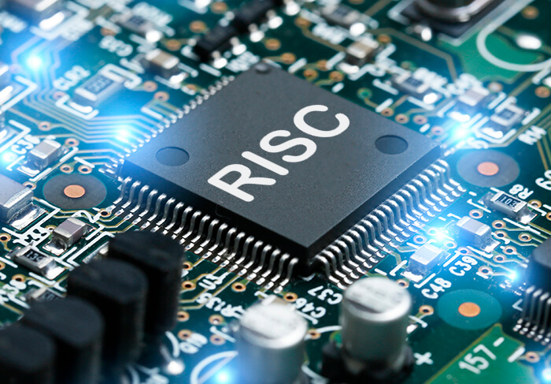

---
authors:
- jwher
description: "The Case for the Reduced Instruction Set Computer"
slug: the-case-for-the-reduced-instruction-set-computer
tags:
- cs
- paper
title: RISC 컴퓨터를 위한 사례
---

  
*이 글은 Patterson과 Ditzel의 [The case for the Reduced Instruction Set Computer](https://inst.eecs.berkeley.edu/~n252/paper/RISC-patterson.pdf)를 읽고 작성했습니다.*  
*최대한 번역된 단어를 통일하였으나 원문을 보는것을 권장합니다.*  

<!--truncate-->

## 개요
*Introduction*  

컴퓨터 아키텍트의 최우선 목표 중 하나는 그들의 계승자보다 ***비용-효율적(cost-effective)***인 컴퓨터를 디자인 하는 것입니다.
*비용 효율적*은  
1. 기기를 제조하는데 필요한 **하드웨어의 가격**
2. 아키텍처와 관련해 발생하는 하드웨어와 후속 프로그램의 **디버깅 비용**
을 포함합니다.

컴퓨터 제품군의 역사를 살펴보면, 가장 흔한 아키텍처 변화는 점점 더 **복잡한 기기**를 만드는 방향임을 찾을 수 있습니다.
추측하건데 이 추가적인 복잡성은 새로운 모델의 *비용-효율적*임을 고려한 긍정적인 거래입니다.

이 글에서는 이 방향이 언제나 *비용-효율적*이지 않고, 좋은것보다 **해를 끼치는** 쪽에 가까울 수 있음을 제안합니다.
우리는 **Reduced Instruction Set Computer(RISC)**가 **Complex Instruction Set Computer(CISC)**보다 더 *비용-효율적*일 수 있음을 검증합니다.
이 글은 다음 세대의 VLSI 컴퓨터가 **CISC보다 RISC로 구현되는게 더 효과적**일 수 있음을 논증합니다.

복잡성의 증가 예시로, IBM **System/3**에서 **System/38** [[Utley78]](#utley78)과 DEC **PDP-11** 에서 **VAX11**로 변화를 고려했습니다.
복잡성은 컨트롤 스토어의 크기로 양을 의미합니다; DEC은 **PDP 11/40**의 256x56에서 **VAX 11/780**의 5120x96으로 커졌습니다.

## 복잡성 증가의 이유
*Reasons for Increased Complexity*  

왜 컴퓨터는 점점 복잡해질까요? 몇가지 이유를 생각해 볼 수 있습니다.

### 1. 메모리의 속도 vs CPU의 속도
*Speed of Memory vs. Speed of CPU*  

John Cocke에 따르면 복잡성은 **701**에서 **709**로 전환할 때 시작되었습니다. [[Cocke80]](#cocke80)
**701 CPU**는 핵심 메인 메모리보다 10배 빨랐습니다;
이는 *서브루틴으로 구현된 어떤 기본요소*도 *명령어 기본 요소*보다 많이 느리게 만들었습니다.
따라서 부동소수점 서브루틴은 **709** 아키텍처에서 극적인 이득인 부분이 되었습니다.
**709**를 더 복잡하게 만든 결과 **701**보다 비용-효율적으로 발전했습니다.

그때부터 많은 "고수준의" 명령어가 성능을 향상시키기 위한 목적으로 기기에 추가되었습니다.
이 방향은 **속도의 불균형**에서 비롯되었음을 기억하세요;
아키텍트들이 이 불균형이 그들의 디자인을 막고 있는지 스스로 질문했는지는 불분명합니다.

### 2. 마이크로코드와 LSI 기술
*Microcode and LSI Technology*

마이크로프로그래밍 제어는 하드웨어 제어 [[Husson70]](#husson70)보다 더 비용-효율적으로 복잡한 아키텍처를 구현할 수 있게 해줍니다.
60년대 후반과 70년대 초반에 만들어진 집적 회로 메모리의 발전으로 인해 마이크로프로그래밍 제어가 거의 모든 경우에 더 비용-효율적인 접근 방식이 되었습니다.

일단 마이크로프로그램 제어를 사용하기로 결정되면, **명령어 세트를 확장하는 데 드는 비용은 매우 적습니다**;
컨트롤 스토어의 몇 단어만 더하면 됩니다.

제어 메모리의 크기는 종종 2의 제곱이기 때문에,
때로는 제어 메모리를 완전히 채우기 위해 마이크로 프로그램을 확장하여 추가 하드웨어 비용 없이 명령어 세트를 더 복잡하게 만들 수 있습니다.

따라서 구현 기술의 발전은 본질적으로 전통적인 **서브루틴을 아키텍처로 이동**시킨 아키텍처의 비용-효율적인 구현으로 이어졌습니다.
그러한 명령의 예로는 문자열 편집, 정수에서 부동소수점으로 변환, 다항식 평가와 같은 수학적 연산이 있습니다.

### 3. 코드 밀도
*Code Density*

초기 컴퓨터의 경우, 메모리는 매우 비쌌습니다.
따라서 매우 **컴팩트한 프로그램**을 갖는 것은 비용-효율적이었습니다.

복잡한 명령어 세트는 종종 "제안된" 코드 압축에서 예고됩니다.
그러나 명령어 세트의 복잡성을 증가시켜 코드 밀도를 얻으려는 시도는 종종 **양날의 검**입니다,
더 많은 명령과 주소 지정 모드는 이를 나타내기 위해 **더 많은 비트가 필요**하기 때문입니다.

코드 압축이 원래 명령어 세트를 정리하는 것만으로도 쉽게 달성될 수 있음을 시사합니다.
코드 압축이 중요하지만, 10% 더 많은 메모리 비용은 종종 아키텍처 "혁신"에 의해 CPU에서 10%를 짜내는 비용보다 **훨씬 저렴**합니다.
대규모 CPU의 비용은 추가 회로 패키지에 필요한 반면,
단일 칩 CPU의 비용은 더 큰 (따라서 느린) 제어 Programmable Logic Array(PLA)로 인해 성능이 느려질 가능성이 더 큽니다.

### 4. 마케팅 전략
*Marketing Strategy*  

불행하게도, 컴퓨터 회사의 주요 목표는 가장 비용-효율적인 컴퓨터를 설계하는 것이 아닙니다;
컴퓨터 회사의 주요 목표는 컴퓨터를 판매함으로써 **가장 많은 돈을 버는 것**입이다.

컴퓨터를 판매하기 위해 제조업체는 고객에게 그들의 디자인이 경쟁사보다 우수하다는 것을 확신시켜야 합니다.
복잡한 명령 세트는 확실히 더 나은 컴퓨터의 주요 "마케팅" 증거입니다.

그들의 직업을 유지하기 위해, 아키텍트는 내부 경영진에게 새롭고 더 나은 디자인을 계속 판매해야 합니다.
명령어의 수와 "힘"은 복잡한 명령어 세트의 실제 사용이나 **비용-효율성에 관계없이** 아키텍처를 홍보하는 데 종종 사용됩니다.

어떤 의미에서 컴퓨터 구매자가 복잡성과 비용 효율성의 문제에 의문을 제기하지 않는 한 제조업체와 디자이너는 이에 대해 비난받을 수 없습니다.
실리콘 하우스의 경우, 고급 마이크로프로세서는 종종 드로우 카드로 사용되는데,
실제 이익은 고객이 상대적으로 저렴한 CPU와 함께 많은 양의 메모리를 구매하도록 유인하는 것에서 비롯되기 때문입니다.

### 5. 상위 호환성
*Upward Compatibility*

마케팅 전략과 일치하는 것은 **상위 호환성에 대한 인식된 필요성**입니다.

상위 호환성은 디자인을 개선하는 주된 방법은 새롭고 일반적으로 더 복잡한 기능을 추가하는 것임을 의미합니다.
명령이나 주소 지정 모드가 아키텍처에서 제거되는 경우는 거의 없으며,
이로 인해 일련의 컴퓨터에 대한 명령어의 수와 **복잡성이 점진적으로 증가**합니다.

새로운 아키텍처는 성공적인 경쟁자의 기기에서 발견되는 모든 명령어를 포함하는 경향이 있습니다.
아마도 아키텍트와 고객이 "좋은" 명령어 세트를 정의하는 것에 대한 실질적인 이해가 없기 때문일 것입니다.

### 6. 고급 언어 지원
*Support for High Level Languages*

고급 언어의 사용이 점점 더 인기를 끌면서,
제조업체들은 이를 지원하기 위해 **더 강력한 명령어를 지원**하길 열망했습니다.
불행히도 더 복잡한 명령어 세트가 실제로 그러한 지원을 제공했다는 것을 시사하는 증거는 거의 없습니다.

반대로, 우리는 많은 경우에 복잡한 명령어 세트가 유용한 것보다 더 해롭다고 주장합니다.
고급 언어를 지원하려는 노력은 칭찬할 만하지만, 우리는 종종 잘못된 문제에 초점을 맞추고 있다고 느낍니다.

### 7. 멀티프로그래밍 사용
*Use of Multiprogramming*

시분할의 증가는 컴퓨터가 실행 프로세스를 중단하고 나중에 다시 시작할 수 있는 능력으로 **인터럽트에 대응**할 수 있도록 요구했습니다.

메모리 관리와 페이징은 또한 완료되기 전에 명령을 중지하고 나중에 다시 시작할 수 있어야 합니다.
이들 중 어느 것도 명령어 세트 자체의 설계에 큰 영향을 미치지 않았지만, 구현에 직접적인 영향을 미쳤습니다.

복잡한 명령어와 주소 지정 모드는 중단 시 **저장해야 하는 상태를 증가**시킵니다.
상태를 저장하는 것은 종종 섀도우 레지스터의 사용과 마이크로코드의 복잡성의 큰 증가를 포함합니다.
이 복잡성은 복잡한 명령어나 부작용(side effects)이 있는 주소 모드 없는 기기에서 사라집니다.

## CISC는 어떻게 사용되어 왔는가?
*How Have CISC's Been Used?*

소프트웨어 비용 상승의 흥미로운 결과는 고급 언어에 대한 의존도가 증가하고 있다는 것입니다.
한 가지 결과는 컴파일러 작성자가 기기가 어떤 명령을 실행할지 결정하는 어셈블리 언어 프로그램을 대체하고 있다는 것입니다.

컴파일러는 종종 **복잡한 명령어를 활용할 수 없으며**, 어셈블리 언어 프로그래머가 기뻐하는 교활한 트릭을 사용하지도 않습니다.
컴파일러와 어셈블리 언어 프로그래머는 또한 주어진 시간-공간 절충안에서 **유용하지 않은 명령어 세트**의 일부를 정당하게 무시합니다
그 결과는 종종 아키텍처의 상당히 작은 부분만 사용되고 있다는 것입니다.
예를 들어, 특정 IBM **360** 컴파일러의 측정에 따르면 **10개의 명령이 실행된 모든 명령의 80%**를 차지하며,
16개는 90%, 21개는 95%, 30개는 99%를 차지합니다 [[Alexander75]](#alexander75).

다양한 컴파일러와 어셈블리 언어 프로그램에 대한 또 다른 연구는 "**CDC-3600**의 명령어 세트가 현재 사용 가능한 명령어의 1/2 또는 1⁄4로 줄어들면 작은 유연성만 잃을 것"이라고 결론지었습니다 [[Foster71]](#foster71).
Shustek은 IBM **370**에 대해 "여러 번 관찰된 바와 같이, 프로그램 실행의 대부분을 차지하는 opcode는 매우 적습니다. 예를 들어, 코볼 프로그램은 사용 가능한 183개의 명령 중 84개를 실행하지만, 48개가 실행된 모든 명령의 99.08%를 나타내고, 26개는 90.28 %를 나타냅니다."고 지적합니다 [[Shustek78]](#shustek78).
주소 지정 모드를 사용할 때에도 비슷한 통계가 발견됩니다.

## CISC 구현의 결과
*Consequences of CISC Implementations*  

기술의 급격한 변화와 CISC 구현의 어려움은 몇 가지 흥미로운 효과를 가져왔습니다.

### 1. 빨라진 메모리
*Faster Memory*

반도체 메모리의 발전은 CPU와 메인 메모리 사이의 상대적인 속도 차이에 대한 가정에 몇 가지 변화를 가져왔습니다.
**반도체 메모리는 빠르고 상대적으로 저렴**합니다.
최근 많은 시스템에서 캐시 메모리를 사용하면서 CPU와 메모리 속도의 차이가 더욱 줄어들었습니다.

### 2. 불합리한 구현
*Irrational Implementations*

아마도 복잡한 아키텍처 구현의 가장 특이한 면은 "합리적인" 구현의 어려움입니다.
이것으로 우리는 **특별한 명령어가 항상 일련의 간단한 명령어들보다 빠른 것은 아니**라는 것을 의미합니다.

한 가지 예는 IBM **370** [[Peuto,Shustek77]](#peutoshustek77)에서 Peuto와 Shustek에 의해 발견되었습니다;
그들은 일련의 로드 명령이 4개 미만의 레지스터에 대한 로드 다중 명령보다 빠르다는 것을 발견했습니다.
이 사례는 일반적인 프로그램에서 여러 명령의 40%를 다룹니다.

다른 하나는 **VAX-11/780**에서 나옵니다.
INDEX 명령은 인덱스가 배열 경계에 맞는지 확인하는 동시에 배열 요소의 주소를 계산하는 데 사용됩니다.
이것은 분명히 고급 언어의 오류를 정확하게 감지하는 중요한 기능입니다.
우리는 VAX-11/780에서 하나의 "고급" 명령어를 몇몇의 작은 명령어로(COMPARE, JUMMP, LESS, UNSIGNED, ADD, MULTIPLY)로 교체했을 때 같은 기능을 45% 빠른것을 발견했습니다.

게다가, 컴파일러가 하한이 0인 경우를 이용했다면, 간단한 일련의 명령어가 60% 더 빨랐습니다.
분명히 더 작은 코드가 항상 더 빠른 코드를 암시하는 것은 아니며, "고급" 명령어도 더 빠른 코드를 암시하지도 않습니다.

### 3. 연장된 디자인 시간
*Lengthend Design Time*

때때로 무시되는 비용 중 하나는 새로운 아키텍처를 개발하는 시간입니다.
CISC의 복제 비용이 낮을 수 있지만, 설계 시간은 크게 확장되었습니다.

DEC는 **PDP-1**을 설계하고 납품을 시작하는 데 6개월 밖에 걸리지 않았지만,
이제 **VAX**와 같은 기기에 대해 동일한 주기를 거치는 데 최소 3년이 걸립니다. -1)

> 1) 어떤것은 다른 설명을 제공합니다.
> 이제 모든 것이 더 오래 걸리는데(소프트웨어, 우편, 원자력 발전소), 왜 컴퓨터는 안 되나요?
> 또한 젊고 배고픈 회사는 아마도 기존 회사보다 시간이 덜 걸릴 것이라고 언급합니다.
> 이러한 관찰이 DEC의 경험을 부분적으로 설명할 수 있지만, 우리는 상황에 관계없이 아키텍처의 복잡성이 설계 주기에 영향을 미친다고 믿습니다.

이 **긴 설계 시간은 결과 구현의 품질에 큰 영향**을 미칠 수 있습니다.
기기는 3년 전 기술로 발표되거나 설계자는 좋은 구현 기술을 예측하고 기기를 구축하는 동안 그 기술을 개척하려고 시도해야 합니다.
설계 시간을 줄이는 것이 결과 기기에 매우 긍정적인 이점임이 분명합니다.

### 4. 디자인 에러의 증가
*Increased Design Errors*

복잡한 명령어 세트의 주요 문제 중 하나는 설계를 **디버깅**하는 것입니다;
이것은 일반적으로 마이크로 프로그램 제어에서 오류 제거를 의미합니다.

문서화하기는 어렵지만 거의 모든 IBM **360** 제품군에서 이러한 수정이 주요 문제였을 가능성이 높은데, 읽기 전용 컨트롤 스토어를 사용했기 때문입니다.
**370** 라인은 하드웨어 비용 감소로 인해 변경 가능한 컨트롤 스토어를 독점적으로 사용하지만, **360**의 오류에 대한 나쁜 경험으로 인해 더 가능성이 높습니다.

컨트롤 스토어는 플로피 디스크에서 로드되어 마이크로코드를 운영 체제와 유사하게 유지할 수 있습니다;
버그가 복구되고 업데이트된 버전의 마이크로코드가 있는 새로운 플로피가 필드에 출시되었습니다.

**VAX 11/780** 설계팀은 마이크로코드 오류의 가능성을 깨달았습니다.
그들의 해결책은 Field Programmable Logic Array와 1024단어의 Writable Control Store(WCS)를 사용하여 마이크로코드 오류를 패치하는 것이었습니다.
다행히 DEC는 그들의 경험에 대해 더 개방적이어서 우리는 50개 이상의 패치가 만들어졌다는 것을 알고 있습니다.
마지막 오류가 발견되었다고 믿는 사람은 거의 없습니다. -2)

> 2) 각 패치는 여러 마이크로 명령어를 WCS에 넣어야 한다는 것을 의미하므로,
> 50개의 패치에는 252개의 마이크로 명령어가 필요합니다.
> 복잡한 VAX 명령어에는 오류가 있을 수 있기 때문에,
> 일부는 WCS에서만 구현되어 패치와 기존 명령어는 1024단어의 상당 부분을 사용합니다.

## RISC와 VLSI
*RISC and VLSI*

단일 칩 VLSI 컴퓨터의 설계는 CISC의 문제를 멀티 칩 SSI(Small Scale Integration) 구현보다 훨씬 더 치명적으로 만듭니다.
몇 가지 요인은 합리적인 설계 대안으로 RISC 컴퓨터를 나타냅니다.

### 1. 구현 타당성
*Implementation Feasibility*

많은 것이 전체 CPU 디자인을 단일 칩에 맞출 수 있는 것에 달려 있습니다. 복잡한 아키텍처는 덜 복잡한 아키텍처보다 주어진 기술에서 실현될 가능성이 적습니다. 좋은 예는 DEC의 **VAX** 컴퓨터 시리즈입니다. 하이엔드 모델은 인상적으로 보일 수 있지만, 아키텍처의 복잡성은 현재 설계 규칙으로 단일 칩에 대한 구현을 완전히 불가능하지는 않더라도 매우 어렵게 만듭니다. VLSI 기술의 개선은 결국 단일 칩 버전을 실현 가능하게 만들 것이지만, 덜 복잡하지만 똑같은 기능을 하는 32비트 아키텍처가 실현된 후에만 가능합니다. 따라서 RISC 컴퓨터는 **더 일찍 실현**될 수 있는 이점이 있습니다.

### 2. 디자인 시간
*Design Time*

설계 어려움은 VLSI 컴퓨터의 성공에 중요한 요소입니다. VLSI 기술이 약 2년마다 칩 밀도를 두 배로 늘린다면, 설계하고 디버깅하는 데 **2년 밖에 걸리지 않는 설계는 잠재적으로 훨씬 우수**한 기술을 사용할 수 있으므로 설계하고 디버깅하는 데 4년이 걸리는 설계보다 더 효과적일 수 있습니다. 새로운 마스크(*전자회로가 그려진 유리판*)의 처리 시간은 일반적으로 몇 달 단위로 측정되기 때문에, 각 오류 배치는 제품 배송을 다른 분기로 지연시킵니다; 일반적인 예가 **Z8000**과 **MC68000**의 1-2년 지연입니다.

### 3. 속도
*Speed*

비용 효율성에 대한 궁극적인 테스트는 구현이 주어진 알고리즘을 실행하는 속도입니다. 디버깅 시간 단축을 통한 칩 영역의 더 나은 사용과 최신 기술의 가용성은 칩의 속도에 기여합니다. RISC는 더 단순한 디자인만으로 잠재적으로 속도를 얻을 수 있습니다. 단일 주소 모드나 명령은 덜 복잡한 제어 구조로 이어질 수 있습니다. 이것은 차례로 더 작은 제어 PLA, 더 작은 마이크로코드 메모리, 기기의 중요한 (*회로*)경로에서 더 적은 게이트로 이어질 수 있습니다; 이 모든 것은 **작은 사이클 시간**으로 이어질 수 있습니다. 명령이나 주소 모드가 기기의 마이너 사이클의 속도를 10% 높이는 것을 제외하고, 비용 효율적이려면 기기의 속도를 10% 이상 높여야합니다. 지금까지, 우리는 복잡한 명령어 세트가 이러한 방식으로 비용 효율적이라는 확실한 증거를 거의 보지 못했습니다. -3)

> 3) 사실, 그 모순에 대한 증거가 있습니다. TIASC의 수석 아키텍트인 HarveyCragon은 이 기기가 루프 내부에서 색인 참조의 성능을 개선하기 위해 복잡한 메커니즘을 구현했다고 말합니다. 비록 그들이 이 연산을 더 빨리 만드는 데 성공했지만, 그들은 다른 상황에서 ASC를 더 느리게 만들었습다. 이 영향은 Cray [[Cragon80]](#cragon80)가 설계한 더 단순한 컴퓨터보다 ASC를 느리게 만들었습니다.

### 4. 칩 영역의 더 나은 사용
*Better Use of Chip Area*

만약 공간이 있다면, CISC를 구현하지 않을 이유는 무엇일까요? 주어진 칩 영역에는 실현될 수 있는 것에 대한 많은 절충안이 있습니다. 우리는 CISC 아키텍처가 아닌 RISC 아키텍처를 설계함으로써 얻은 공간이 CISC보다 RISC를 훨씬 더 매력적으로 만드는 데 사용될 수 있다고 생각합니다. 예를 들어, 우리는 실리콘 영역이 온칩 캐시[[Patterson,Srquin80]](#pattersonsrquin80), 더 크고 빠른 트랜지스터 또는 파이프라이닝에 사용된다면 전체 시스템 성능이 더 향상될 수 있다고 생각합니다. VLSI 기술이 향상됨에 따라, RISC 아키텍처는 항상 유사한 CISC보다 한 발 앞서 있을 수 있습니다. CISC가 단일 칩에서 실현 가능해질 때, RISC는 파이프라이닝 기술을 사용할 수 있는 실리콘 영역을 갖게 될 것입니다; CISC가 파이프라이닝을 할 때 RISC는 온칩 캐시 등을 갖게 될 것입다. **CISC는 또한 본질적인 복잡성이 종종 고급 기술을 구현하기 어렵게 만든다**는 사실에 시달리고 있습니다.

## 고급 언어 컴퓨터 시스템 지원
*Supporting a High-Level Language Computer System*

어떤 사람들은 아키텍처를 단순화하는 것이 고급 언어를 지원하는것의 후퇴라고 주장할 것입니다. 최근 논문 [[Ditzel,Patterson80]](#ditzelpatterson80)은 "고급" 아키텍처가 반드시 고급 언어 컴퓨터 시스템을 달성하는 데 가장 중요한 측면은 아니라고 지적합니다. 고급 언어 컴퓨터 시스템은 다음과 같은 특성을 가진 것으로 정의되었습다:

1. 모든 프로그래밍, 디버깅, 다른 사용자/시스템 상호작용에 고급 언어 지원
2. 고급 언어 소스 프로그램에서 구문 에러와 실행 시간 에러를 발견하고 제보
3. 사용자 프로그래밍 언어와 내부 언어 사이에서 어떠한 드러나는 변환 없음

따라서 유일한 중요한 특징은 하드웨어와 소프트웨어의 조합이 **프로그래머가 항상 컴퓨터와 고급 언어로 상호 작용한다는 것을 보장**한다는 것입니다. 프로그래머가 프로그램의 작성이나 디버깅에서 더 낮은 수준을 알 필요가 없습니다. 이 요구 사항이 충족되는 한, 목표는 달성됩니다. 따라서 HLLCS(High-Level Language Computer System)에서 언어의 토큰이 CISC와 1대1 매칭이 되도록 구현되는지,
매우 빠르지만 간단한 기기에서 제공되는 함수를 사용하는지 간에 어떠한 차이도 없습니다.

컴파일러로 부터 얻은 경험은 **명령어 세트가 간단하고 균일할 때 컴파일러 작성자의 부담이 완화**된다는 것을 시사합니다. 고급 기능을 지원하는 것으로 추정되는 복잡한 명령은 종종 컴파일러에서 생성하는 것이 불가능합니다.-4) 복잡한 명령은 명령의 수준이 증가함에 따라 "잘못된" 기능을 구현하는 경향이 있습니다. 이것은 기능이 너무 전문화되어 다른 작업에 쓸모 없게 되기 때문입니다.-5) 복잡한 명령은 일반적으로 소수의 낮은 수준의 명령으로 대체될 수 있으며, 종종 성능 손실이 없습니다. -6) 복잡한 명령어를 위한 코드를 생성할 때 버그가 발생할 가능성이 더 높기 때문에 CISC용 컴파일러를 만드는 시간은 더 증가합니다. -7)

> 4) 찬성과 반대의 증거는 **DEC**에서 나옵니다. 복잡한 MARK 명령은 서브루틴 호출의 성능을 향상시키기 위해 **PDP-11**에 추가되었습니다. 이 명령은 프로그래머들이 원하는 것을 정확히 하지 않았기 때문에 거의 사용되지 않았기 때문입니다. 파괴적인 증거는 **VAX**에서 나옵니다; VMS FORTRAN 컴파일러가 분명히 잠재적인 **VAX** 명령어에서 매우 큰 부분을 생산한다는 소문이 있습니다 (.8?).

> 5) FORTRAN과 BLISS가 **VAX**에서 이러한 유형의 명령의 여러 발생에 대한 모델로 사용되었다면 우리는 놀라지 않을 것입니다. 브랜치가 lower bit 설정되었을 때와 브랜치가 lower bit가 초기화 되었을 명령을 고려해보세요, BLISS에 대한 조건부 분기를 정확하게 구현하지만, 다른 많은 언어에서 찾을 수 있는 0이고 0이 아닌 더 일반적인 분기에는 필요없습니다. 이 일반적인 발생은 두 가지 명령어가 필요합니다. FORTRAN에 어필하는 유사한 명령과 주소 지정 모드가 존재합니다.

> 6) Peuto와 Shustek은 IBM과 Amdahl 컴퓨터의 복잡한 소수점 및 문자 명령어가 일반적으로 하이엔드 모델에서 상대적으로 낮은 성능을 초래한다는 것을 관찰했습니다. 그들은 더 간단한 명령어가 성능 향상으로 이어질 수 있다고 제안합니다 [[Peuto,Shustek77]](#peutoshustek77). 그들은 또한 한 쌍의 명령어의 동적인 발생을 측정했습니다; 자주 등장하는 결과는 CISC 철학을 뒷받침할 것입니다. 그들의 결론은 다음과 같습니다: "자주 등장하는 연산 짝에 실험은 추가적인 명령어를 만들어 대체하길 제안할 정도로 자주 발생하지 못해 실패했습니다."

> 7) C 컴파일러를 VAX로 이식할 때, 버그의 절반 이상과 복잡성의 약 3분의 1은 복잡한 INDEXED MODE로 인해 발생했습니다.

컴파일러가 사용하기 쉽도록 설계된 **더 복잡한 명령어가 종종 목표를 달성하지 못한다**는 상당한 증거가 있습니다. 이에는 몇 가지 이유가 있습니다. 첫째, 많은 명령어로 인해 주어진 기본 연산을 수행하는 여러 방법이 존재하는데, 이는 컴파일러와 컴파일러 작성자 모두에게 혼란을 줄 수 있습니다. 둘째, 많은 컴파일러 작가들은 합리적인 구현을 다루고 있다고 가정하는데 사실은 아닙니다. 종종 "적절한" 명령어가 잘못된 선택으로 판명됩니다. 예를 들어, 스택의 레지스터를 푸시하는 **PUSHL R0**은 **VAX 11/780**의 이동 명령 **MOVL R0,-(SP)**로 푸시하는 것보다 느립니다. 거의 대부분의 복잡한 기기에 대해 비슷한 문제가 발생합니다. 몇개는 명령어가 "거기에 있기 때문에" 사용하지 않도록 특별한 주의가 필요합니다. 이러한 문제는 상대적인 명령어 타이밍의 변화로 인해 최적의 코드 생성을 위해서 새로운 코드 생성기가 필요한 경우가 있어 프로그램 이식성이나 우수한 컴파일러 작성자의 명성을 해치지 않고는 동일한 아키텍처의 다른 모델에 의해 "수정"되기 어렵습니다.

고급 언어를 지원하려는 욕망은 HLLCS의 성과와 컴파일러의 복잡성 감소를 모두 포함합니다. 우리는 RISC가 CISC보다 실질적으로 더 나쁜 경우를 거의 볼 수 없으며, 적절하게 설계된 **RISC가 고급 언어를 지원하기 위한 합리적인 아키텍처**로 보인다는 결론을 내립니다.

## RISC 아키텍처에서 작업
*Work on RISC Architecture*

### 버클리
*At Berkely*

RISC 아키텍처에 대한 연구는 D.A. Patterson과 C.H. Sequin의 감독하에 몇 달 동안 진행되었습니다. 적절한 명령어 세트를 현명하게 선택하고 해당 아키텍처를 설계하는것은, 매우 간단한 명령어 세트로 빠른 성능을 발휘할 수 있어야 한다고 생각했습니다. 이는 전반적인 프로그램 실행 속도에서 상당한 이익으로 이어질 수 있습니다. 이는 간소화된 명령 세트 컴퓨터(RISC)의 개념입니다. **RISC의 구현은 거의 확실히 CISC의 구현보다 더 적은 비용**이 들 것으로 예상됩니다. 간단한 아키텍처가 **VAX**나 IBM **System/38**과 같은 CISC만큼 고급 언어 프로그래머에게 효과적임을 입증할 수 있다면, 우리는 효과적인 디자인을 만들었다고 주장할 수 있습니다.

### 벨 연구소
*At Bell Labs*

C 프로그래밍 언어의 측면을 기반으로 한 컴퓨터 설계 프로젝트는 몇 년 동안 벨 연구소 컴퓨터 과학 연구 센터 소수 연구원들에 의해 조사되었습니다. 프로토타입 16비트 장치는 A.G. Fraser가 설계하고 제작했습니다. 32비트 아키텍처는 S.R. Bourne, D.R. Ditzel 그리고 S.C. Johnson에 의해 조사되었습니다. Johnson은 기기를 제안하고 컴파일러를 작성하며 결과를 측정하는 반복적인 기술을 사용하여 더 나은 기기를 제안했습니다. 초기 목표는 특별히 간단한 디자인을 개발하는 것이 아니었지만, 결과적으로 **PDP-11**과 **VAX**[[Johnson79]](#johnson79)와 같이 코드가 컴팩트한 RISC와 같은 32비트 아키텍처가 나왔습니다.

### IBM
*At IBM*

의심의 여지 없이 RISC의 가장 우수한 예는 뉴욕 요크타운 하이츠에 위치한 IBM 리서치에서 개발한 **801 미니컴퓨터**입니다. [[Electronics76]](#electronics76) [[Datamation79]](#datamation79). 이 프로젝트는 몇 년 전부터 매우 진보된 컴파일러 기술과 함께 RISC 아키텍처의 사용을 탐구하는 대규모 디자인 팀이 참여했습니다. 많은 세부 정보가 부족하지만 초기 결과는 상당히 인상적으로 보입니다. 그들은 IBM **S/370 모델 168**에서 PL/I의 하위 집합을 실행하는 약 5배의 성능을 보여주는 프로그램을 벤치마킹했습니다.

## 결론

특정 "독특한" 명령어가 프로그램의 속도를 크게 향상시킬 수 있는 많은 사례가 있습니다. 그러나 이러한 혜택이 시스템 전체에 적용되는 경우는 거의 없습니다. 다양한 컴퓨팅 환경에서 **명령어 세트의 신중한 정리**가 비용 효율적인 구현으로 이어지는 경험을 토대로 느낍니다. 컴퓨터 설계자들은 새로운 명령어 세트를 설계할 때 다음과 같은 질문을 해야 합니다. 이 연산이 드물게 발생하는 경우, 예를 들어, 관리자 호출 명령어와 같이 필요하고 합성할 수 없다는 이유로 정당화될 수 있을까요? 명령이 드물게 발생하고 합성할 수 있다면, 시간이 많이 걸리는 작업인 부동 소수점 연산과 같은 작업으로 정당화될 수 있을까요? 명령이 기본 명령에서 합성될 수 있다면, 명령이 제외되었을 때 프로그램 크기와 속도에 미치는 전반적인 영향은 무엇일까요? 예를 들어, 사용하지 않는 제어 저장소를 사용하거나 ALU에서 이미 수행한 작업을 사용하여 명령어를 무료로 얻을 수 있을까요? "무료"로 얻을 수 있다면, 디버깅, 문서화 및 향후 구현의 비용은 얼마일까요? 컴파일러가 이러한 명령을 쉽게 생성할 수 있을까요?

우리는 고급 언어 컴퓨터 시스템의 정의를 충족하면서 "복잡성"(아마도 설계 시간과 게이트에서 측정)을 최소화하고 "성능"(아마도 게이트 지연으로 표현된 평균 실행 시간을 기술 독립적인 시간 단위로 사용)을 극대화하는 것이 가치가 있다고 가정했습니다. 특히, 우리는 VLSI 컴퓨터가 RISC로부터 많은 혜택을 받을 것으로 기대합니다. 너무 자주 VLSI에서 급격한 발전은 아키텍처의 복잡성을 증가시키는 것을 만병통치약처럼 사용되어 이루어졌습니다. 우리는 각 트랜지스터가 적어도 향후 10년 동안 중요하다는 것을 알 수 있습니다. 아키텍처 복잡성에 대한 추세는 개선된 컴퓨터를 향한 하나의 경로일 수 있지만, 이 논문은 **줄어든 명령어 세트 컴퓨터(Reduced Instruction Set Computer)**라는 또 다른 접근 방식을 제안합니다.

## References

### [Alexander75] W.C. Alexander and D.B. Wortman, "Static and Dynamic characteristics of XPL Programs," {#alexander75}
### [Cocke80] J. Cocke "private communication" {#cocke80}
### [Cragon80] H.A. Cragon, in his talk presenting the paper "The Case Against High-Level Language Computers," {#cragon80}
### [Datamation79] Datamation, "IBM Mini a Radical Depalrture," {#datamation79}
### [Ditzel,Patterson80] Ditzel and Patterson, "Retrospective on High-Level Language Computer Architecture," {#ditzelpatterson80}
### [Electronics76] Electronics Magazine, "Altering Computer Architecture is Way to Raise Throughput, Suggests IBM Researchers," {#electronics76}
### [Foster71] C.C. Foster, R.H. Gonter and E.M. Riseman, "Measures of Op-Code Utili- zation," {#foster71}
### [Husson70] S.S. Husson, "Microprogramming: Principles and Practices, Prentice-Hall," {#husson70}
### [Johnson79] S.C. Johnson, "A 32-bit Processor Design," {#johnson79}
### [Patterson,Srquin80] D.A. Patterson and C.H. Srquin, "Design Considerations for Single-Chip Computers of the Future," {#pattersonsrquin80}
### [Peuto,Shustek77] B.L. Peuto and L.J. Shustek, "An Instruction Timing Model of CPU Perfor- mance," {#peutoshustek77}
### [Shustek78] L.J. Shustek, "Analysis and Performance of Computer Instruction Sets," {#shustek78}
### [Utley78] B.G. Utley et al, "IBM System/38 Technical Developments," {#utley78}
