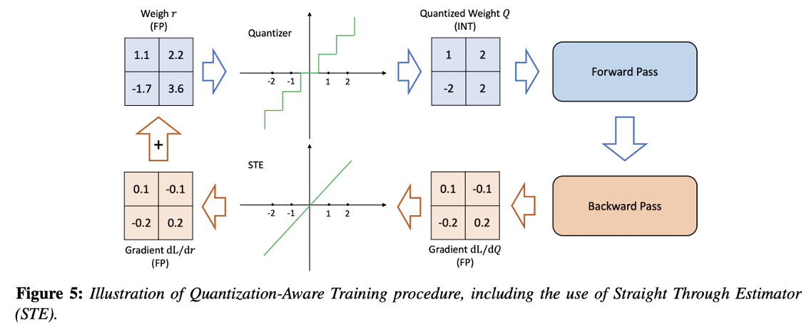

---
authors:
- jwher
description: 양자화를 통한 딥러닝 모델 경량화
slug: quantization
tags:
- ml
title: 정확한 추론을 위한 양자화 기법
---

## 신경망 경량화 기법
지난 10년간, 다양한 문제들에 대해 **신경망(Neural Network, NN)**의 정확도가 상당히 향상되었습니다. 이러한 정확도 향상은 대부분 매우 과대매개변수화된(over-parameterized) 모델에 의해 이루어졌습니다. 하지만 이러한 대규모 모델은 리소스가 제한된 환경에서는 배포가 어려운 문제를 일으킵니다. 이로 인해 실시간 추론, 낮은 에너지 소비, 높은 정확도를 요구하는 리소스 제약 환경에서 딥러닝의 보편적 적용에는 한계가 존재합니다.

> 효율적인 실시간 NN을 달성하려면, NN의 설계, 학습, 배포 방식을 다시 생각해야 합니다.

이를 해결하기 위한 다양한 연구가 진행되어 왔으며, 지연(latency), 메모리 사용량, 에너지 소비 측면에서 NN 모델을 더욱 효율적으로 만들면서도 최적의 정확도/일반화 균형을 유지하고자 했습니다.

- 효율적인 NN 아키텍처 설게
- NN 아키텍처와 하드웨어의 공동 설계
- 프루닝
- Knowledge Distillation
- **양자화**

### 효율적인 NN 아키텍처 설계
- 마이크로 아키텍처 (커널 종류 예: Depthwise convolution, low-rank factorization)
- 매크로 아키텍처 (모듈 종류 예: Residual, Inception)

초기에는 수작업으로 모듈을 찾았지만 이는 확장성이 떨어집니다.
최근(21년)에는 AutoML 및 **NAS (Neural Architecture Search)**를 통해 자동화된 NN 구조 탐색 노력이 이뤄졌습니다.

### NN 아키텍처와 하드웨어의 공동 설계
*Co-design*
NN 연산의 오버헤드는 하드웨어에 따라 다르므로 특정 하드웨어 플랫폼에 적합한 NN 구조를 공동 설계하는 방법이 있습니다.

예: 캐시 계층이 있는 하드웨어는 bandwidth-bound 연산에 유리

### 프루닝
*Pruning*
중요도가 낮은 레이어를 제거하여 희소한 그래프 생성합니다.

- 비구조적(unstructured) 프루닝: 텐서 단위 제거 → 가속이 어려움
- 구조적(structured) 프루닝: 필터 단위 제거 → 밀집 연산 유지 가능하지만 정확도 저하 우려

여전히 고수준 프루닝에서 정확도를 유지하는 것은 미해결 과제입니다.

### Knowledge Distillation
큰 모델(teacher)의 soft 확률 출력을 이용해 작은 모델(student)을 훈련합니다.
하지만 KD만으로는 높은 압축률 달성이 어렵습니다.

### 양자화
*Quantization*

양자화는 훈련 및 추론 모두에서 일관된 성공을 보이는 접근 방식입니다.
과거부터 존재하던 수치 표현 문제와 양자화가, NN의 도입으로 새로운 방법으로 주목받고 있습니다.

이 글에서는 추론 시 양자화를 이야기 하지만, LLM같은 큰 모델이 등장하며 훈련 시 양자화도 중요하게 되었습니다.
특히 반정밀도(FP16)/혼합정밀도 훈련의 성공으로 AI 가속기의 처리량이 획기적으로 증가했습니다.
하지만 반정밀도 아래로 가는 것은 아직 어렵고 많은 튜닝이 필요합니다.

## 양자화의 이점
*Benefits of Lower Precision Data Types*

실시간 추론과 에너지 효율이 필수적인 응용 환경에서는 정확도를 유지하면서도 모델의 경량화 및 최적화가 중요해졌습니다. 이러한 흐름 속에서 양자화(Quantization)는 정확도-성능-메모리 사용량 간 균형을 맞출 수 있는 실용적 기법으로 주목받고 있습니다.

대표적으로 추론에 사용되는 데이터 타입은 다음과 같습니다.
- **Precision Types**: FP32, FP16, BF16, INT8

*IEEE 754: Standard for floating-point arithmetic*

NVIDIA Turing GPU의 실험에 따르면:

| Input Data Type | Math Throughput | Bandwidth Reduction |
|------------------|-------------------|-----------------------|
| FP32             | 1x               | 1x                   |
| INT8             | 16x              | 4x                   |

INT8 연산은 FP32에 비해 메모리 대역폭도 4배 절약되며(32->8bit), exponent align이 필요한 실수 연산은 최대 16배 빠른 처리량을 제공합니다.

메모리 대역폭 향상은 Memory bound 작업인 LLM에,
실수 연산 처리량은 arithmetic intensive한 행렬곱(GEMM)과 컨볼루션 연산에 큰 영향을 미칩니다.

이처럼 양자화는 추론 속도 향상, 모델 경량화, 메모리 절감의 장점을 가집니다.

## Quantization Fundamentals

실수값을 정수 표현으로 변환하기 위해 다음과 같은 선형 변환 방식이 사용됩니다.

$$
s = \frac{2^b - 1}{\alpha - \beta}
$$

$$
z = -\text{round}(\beta \cdot s) - 2^{b-1}
$$

여기서 $s$는 **스케일(scale)**, $z$는 **제로포인트(zero-point)**, $b$는 **정수 표현의 비트 수**를 의미합니다.

예를 들어, 32비트 부동소수점(FP32)을 8비트 정수(INT8)로 변환할 경우:

$$
s = \frac{255}{\alpha - \beta}, \quad
z = -\text{round}(\beta \cdot s - 128)
$$

이와 같이 계산합니다.

정의역 $[\beta, \alpha]$는 실수값을 정수로 변환할 때 기준이 되는 **클리핑 범위(Clipping Range)**입니다. 이 범위 내의 실수는 정수로 매핑되며, 범위를 벗어난 값은 $\beta$ 또는 $\alpha$로 **절단(clipping)**됩니다.

양자화 방식은 다음과 같이 구분됩니다:

- **Asymmetric Quantization (비대칭 양자화)**: $\alpha \neq -\beta$일 때  
- **Symmetric Quantization (대칭 양자화)**: $\alpha = -\beta$로 설정하여 범위를 0을 중심으로 대칭화한 경우

양자화의 정밀도는 이 클리핑 범위 [$\beta$, $\alpha$]의 선택에 크게 의존합니다.  
범위가 지나치게 좁으면 **중요한 정보가 클리핑되어 정확도가 급격히 하락**할 수 있고,  
반대로 범위가 너무 넓으면 **양자화 해상도(precision)가 떨어져 미세한 차이를 표현하지 못하게 됩니다.**

따라서 적절한 범위를 선택하는 것이 **정확한 추론을 위한 양자화의 핵심 요소**입니다.

## Quantization Granularity

양자화는 정적 요소인 **모델의 가중치(Weights)**와 실행 시 동적으로 주어지는 **입력 활성화값(Activations)**에 적용됩니다.

특히 **가중치에 대한 양자화 파라미터**(예: $\alpha$, $\beta$, scale, zero-point 등)는 다음과 같은 수준에서 공유될 수 있습니다:

- **Layerwise Quantization**: 하나의 레이어 전체에 대해 동일한 파라미터를 적용합니다.  
- **Channelwise Quantization**: 각 채널(예: convolution filter)마다 독립적인 파라미터를 사용합니다.  
- **Sub-channelwise Quantization**: 채널 내에서도 여러 파라미터 그룹을 정의하여 더욱 세밀하게 범위를 조정합니다.

특히 CNN에서는 **channelwise quantization이 정확도와 계산 효율 간의 균형** 측면에서 가장 널리 사용되고 있으며, 실험적으로도 안정적인 성능을 보입니다.

한편, **Activation에 대한 양자화** 역시 다양한 수준에서 설정할 수 있으나, 다음과 같은 이유로 일반적으로 **per-tensor granularity**가 사용됩니다:

- Activation은 **실행 시간 중 입력에 따라 변화**하므로, 레이어 단위나 채널 단위로 동적으로 양자화 범위를 조정하는 데 비용이 큽니다.  
- 특히 배치 간 shape이 달라지거나 순서를 고려해야 하는 경우, per-channel 방식은 실시간 추론에서 부적절할 수 있습니다.  

따라서 대부분의 양자화 프레임워크에서는 activation에 대해 **단일 scale과 zero-point를 공유하는 per-tensor quantization**을 적용하여 **속도와 단순성**을 확보합니다.

## Quantization Challenges

일부 모델은 **activation의 outlier**나 **극단적인 weight 분포**로 인해 양자화에 매우 민감하게 반응합니다. 이러한 경우, 양자화 적용 시 **정확도 저하**가 발생하기 쉽습니다.

대표적인 대응 기법으로 다음이 있습니다.

- **SmoothQuant**  
  실행 시 등장하는 outlier activation을 대응하기 위해, 해당 값을 weight에 정렬시키는 방식입니다. 이를 통해 activation의 분포를 정규화하여 양자화 오차를 줄이고, clipping에 의한 정보 손실을 감소시킬 수 있습니다.

- **BF16 (BFloat16)**  
  FP16보다 더 넓은 **동적 범위(dynamic range)**를 제공함으로써 outlier에 보다 강인하게 작동합니다. 다만 일부 연산에서 정확도 손실이 발생할 수 있으며, 일반적으로는 acceptable한 수준으로 평가됩니다.

- **FP16 표현 범위**: 약 $5.96 \times 10^{-8}$ ~ $65504$  
- **BF16 표현 범위**: 약 $1 \times 10^{-34}$ ~ $3.39 \times 10^{38}$

BF16은 **정밀도는 낮지만 표현 범위가 넓기 때문에**, 큰 값 혹은 작은 값을 포함하는 모델에서도 양자화 오차를 완화하는 데 유리합니다. 특히 대규모 언어 모델(LLM)이나 transformer 계열 구조에서는 BF16이 널리 활용되고 있습니다.

## Quantization Methodologies

양자화는 적용 시점과 방식에 따라 크게 두 가지 접근으로 나뉩니다:

- **Post-Training Quantization (PTQ)**  
  사전 학습이 완료된 모델에 대해 추가 학습 없이 양자화를 적용하는 방식입니다.  
  대표적인 입력 데이터를 활용해 **activation의 분포를 보정(calibration)**하지만, **가중치는 변경되지 않습니다.**  
  간단하고 빠르며, 소량의 데이터로도 적용할 수 있습니다.

- **Quantization-Aware Training (QAT)**  
  학습 과정에서 양자화 효과를 **시뮬레이션(faked quantization)**하여, 모델이 양자화 오차를 학습 중에 보정할 수 있도록 하는 방식입니다.  
  **가중치와 활성화 모두 정수 표현을 모방하며 학습되기 때문에**, PTQ보다 일반적으로 **더 높은 정확도 유지**가 가능합니다.  
  다만 전체 또는 일부 학습을 다시 수행해야 하므로 **비용이 더 크고, 레이블된 데이터가 필요**하다는 단점이 있습니다.

두 방법은 정확도와 효율성 측면에서 상호 보완적으로 활용될 수 있습니다.

### Post-Training Quantization (PTQ)

**Post-Training Quantization**은 추가 학습 없이, 이미 학습된 모델에 양자화를 적용하는 방식입니다.  
가중치는 그대로 유지되며, 대표적인 입력 데이터를 활용하여 **activation의 분포를 기반으로 스케일(scale)과 제로포인트(zero-point)를 추정**합니다.

#### Calibration 알고리즘

양자화에서 **클리핑 범위 [$\alpha$, $\beta$]**를 결정하기 위한 대표적인 알고리즘은 다음과 같습니다:

- **Max**: 활성화의 최대 절댓값을 기준으로 범위를 설정 (단순하지만 outlier에 민감)  
- **Entropy**: 양자화 전후의 분포 간 **KL divergence**를 최소화하여 정보 손실을 줄이는 방식  
- **Percentile**: 분포의 상위 백분위(예: 99.9%)를 기준으로 하여 **outlier의 영향 최소화**

#### Quantization and Activation Functions

양자화 정확도는 **활성화 함수의 출력 분포**에도 크게 영향을 받습니다.  
특히 **Swish**, **GELU**와 같은 smooth activation function은 **작고 제한된 음수 영역**을 갖고 있으며, 다음과 같은 특성을 가집니다:

- **Swish** 출력 범위: [−0.2785, ∞]  
- **GELU** 출력 범위: [−0.1700, ∞]

이러한 범위는 대칭 양자화(symmetric quantization)에서 **작은 음수와 큰 양수를 동시에 표현해야 하므로 정밀도 손실이 발생**합니다.  
예를 들어, GELU 출력을 [−50, 50]으로 양자화할 경우, 대부분의 음수 출력은 0으로 반올림되며 손실됩니다.  
하지만 이를 [−10, 10]으로 제한하면 **두 개 이상의 음수 구간을 표현할 수 있어 정확도가 향상**됩니다.

이러한 현상은 BERT Large 모델에서 실험적으로 확인되었습니다.

| Calibration 방식 | 정확도 (F1) |
|------------------|------------|
| FP32 (baseline)  | 91.01      |
| Max              | 85.92      |
| Entropy          | 37.40      |
| 99.9%            | 26.18      |
| 99.99%           | 89.59      |
| 99.999%          | 90.20      |
| 99.9999%         | 90.10      |
| **Max + GELU10** | **90.66**  |

> ※ "GELU10"은 GELU activation의 출력을 $[-10, 10]$으로 제한한 경우입니다.

이 결과는 다음을 시사합니다:

- 복잡한 entropy 기반 보정보다 **단순한 Max calibration과 적절한 출력 클리핑**이 더 나은 결과를 낼 수 있습니다.
- **GELU10 + Max calibration은 QAT에서 얻은 최고 성능(90.67)에 거의 근접**합니다.
- 즉, **activation 출력의 클리핑 범위를 정제하는 것만으로도 PTQ의 성능을 크게 개선**할 수 있습니다.

### Quantization-Aware Training (QAT)

**Quantization-Aware Training(QAT)**은 학습 중에 양자화 효과를 시뮬레이션하여, 모델이 양자화 오차를 **내재적으로 학습하도록 만드는 방식**입니다.  
즉, 학습 과정에서 실수 표현을 유지하되, 순전파 시 양자화된 값을 사용하는 **"Fake Quantization" 연산자**를 삽입하여 양자화가 모델 성능에 미치는 영향을 반영합니다.

이로 인해 모델은 정수 연산의 부정확성을 보정하는 방향으로 파라미터를 조정하게 되며, **추론 시 양자화된 연산으로도 높은 정확도를 유지할 수 있습니다.**

양자화 연산은 **불연속적이고 미분 불가능**하기 때문에, 일반적인 역전파에서는 gradient 계산이 불가능합니다.  
이를 해결하기 위해 **Straight-Through Estimator(STE)** 기법이 사용됩니다:

- 순전파: `round()` 또는 `clamp()`와 같은 양자화 연산을 적용하여 **양자화 효과를 시뮬레이션**  
- 역전파: `identity` 함수로 간주하여 **양자화 연산의 gradient를 무시하고 실수값의 gradient를 그대로 전달**

이 방식은 실제 TensorFlow Lite 및 PyTorch QAT 구현에서도 동일한 방식으로 작동합니다.

### Comparison Between PTQ and QAT

양자화는 적용 시점과 방식에 따라 크게 두 가지 접근 방식으로 구분됩니다: **Post-Training Quantization(PTQ)**과 **Quantization-Aware Training(QAT)**. 이 두 방식은 정확도, 구현 복잡도, 데이터 요구량 측면에서 명확한 차이를 가집니다.

| 항목              | PTQ                                 | QAT                                 |
|------------------|-------------------------------------|-------------------------------------|
| 재학습 여부       | 필요 없음                            | 필요함                              |
| 정밀도 유지       | 일부 모델에서 큰 정확도 저하 발생 가능 | 대부분의 경우 높은 정확도 유지        |
| 구현 난이도       | 간단, 빠름                            | 복잡, 학습 파이프라인 수정 필요        |
| 데이터 요구       | 소량의 unlabeled 데이터로 가능         | 레이블된 학습 데이터 필요             |
| 적용 시점         | 모델 학습 후 적용                     | 모델 학습 중 적용                    |

#### PTQ의 장점과 한계

- **장점**:  
  - 이미 학습된 모델에 대해 **빠르고 간단하게 적용** 가능  
  - 소량의 대표 입력 데이터만 있으면 적용 가능 (레이블 불필요)  
  - 하드웨어 테스트 및 배포 전에 빠른 프로토타이핑 가능  

- **한계**:  
  - 일부 구조 (예: BERT, EfficientNet, GeLU/Switch activation 포함 모델 등)에서는 **정확도 손실이 크며**,  
    이는 activation 분포가 양자화에 적합하지 않거나 weight range가 불균형할 때 발생함

#### QAT의 장점과 한계

- **장점**:  
  - 학습 중 양자화 효과를 시뮬레이션하여, 모델이 이를 **내재적으로 보정**할 수 있음  
  - 대부분의 모델에서 **FP32에 가까운 정확도**를 유지할 수 있음  
  - 최근 연구들에서는 QAT가 **fine-tuning 5~10 epoch만으로도 PTQ보다 우수한 결과**를 달성함 [[30]]

- **한계**:  
  - 기존 학습 파이프라인에 fake quantization 연산자 삽입 등 **추가 구현 필요**  
  - **레이블된 데이터가 필요**하고, 적어도 일부 학습을 다시 수행해야 함  
  - Hyperparameter tuning 없이 그대로 QAT를 적용하면 **오히려 정확도가 하락**할 수도 있음

## Recommended Quantization Workflow

양자화 기법은 **정확도**, **추론 속도**, **개발 비용** 간의 균형을 고려해야 하는 실무 환경에서, 다음과 같은 단계적 전략으로 적용하는 것이 효과적입니다.

- **PTQ**는 효율적이며 대부분의 모델에 빠르게 적용 가능합니다.  
- 반면, **QAT**는 정확도에 민감한 모델에서 성능을 보장하기 위해 활용됩니다.

일반적으로 다음과 같은 **단계적 양자화 워크플로우**를 따릅니다:
> **PTQ로 baseline 구성 → 민감 레이어 분석 및 부분 양자화 → 성능 부족 시 QAT 적용**

이러한 방식은 정확도를 유지하면서도 양자화의 효율을 최대한 활용할 수 있는 실용적인 전략입니다.

### 단계별 양자화 절차

1. **Post-Training Quantization (PTQ)**  
   - 연산량이 큰 레이어 전체에 양자화를 적용하여 baseline 모델 구성  
   - Calibration은 다양한 방법(Max, Entropy, 99.99%, 99.999% percentile 등)을 시도하여 최적값 탐색  
   - 실험적으로 **activation 분포 clipping 범위**에 따라 성능 차이가 크므로, 다양한 분포 기반 범위 조정이 중요

2. **Partial Quantization**  
   - 민감도 분석(sensitivity analysis)을 통해 **정확도에 큰 영향을 미치는 레이어**를 식별  
   - 해당 레이어는 FP32 혹은 FP16으로 유지하고, 나머지는 INT8로 양자화하여 성능과 정확도의 절충점을 확보

3. **Quantization-Aware Training (QAT)**  
   - QAT는 전체 재학습이 아닌 **일부 미세조정(fine-tuning)**으로도 효과를 볼 수 있습니다.  
   - 일반적으로 기존 학습 스케줄의 **10% 이내 범위**에서 fine-tuning을 수행하며,  
   - 학습률은 초기의 **1% 수준에서 시작**하여 **annealing 방식**으로 점차 감소시키는 것이 권장

이러한 단계적 접근은 빠른 프로토타이핑, 정밀한 튜닝, 정확도 보존을 모두 충족시킬 수 있어, **대부분의 모델에 안정적이고 효과적인 양자화 전략**으로 자리잡고 있습니다.

## Conclusion

- 양자화의 효과는 **네트워크 아키텍처의 구조와 특성**에 따라 크게 달라집니다.  
- **PTQ와 QAT는 각각의 정확도 요구 수준과 시스템 제약 조건**에 따라 적절히 선택해야 합니다.  
- 특히 실무 환경에서는, 모델과 하드웨어에 따라 다양한 조합이 존재하므로,  
  **실험 기반의 튜닝 과정이 정확도 손실 없는 양자화 추론을 달성하는 데 핵심적인 역할**을 합니다.

## References

- A Survey of Quantization Methods for Efficient Neural Network Inference  
- Quantization and Training of Neural Networks for Efficient Integer-Arithmetic-Only Inference  
- Integer Quantization for Deep Learning Inference: Principles and Empirical Evaluation
